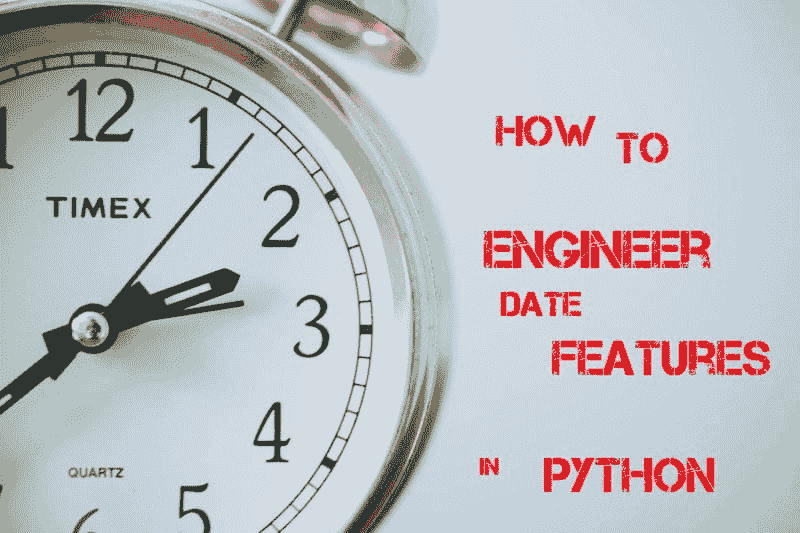

# 如何在 Python 中工程化日期特征

> 原文：[`www.kdnuggets.com/2021/08/engineer-date-features-python.html`](https://www.kdnuggets.com/2021/08/engineer-date-features-python.html)



原图由 [Sonja Langford](https://unsplash.com/@sonjalangford?utm_source=unsplash&utm_medium=referral&utm_content=creditCopyText) 提供，来自 [Unsplash](https://unsplash.com/s/photos/time?utm_source=unsplash&utm_medium=referral&utm_content=creditCopyText)

也许像我一样，你在用 Python 处理数据时经常处理日期。也许，像我一样，你对处理日期感到沮丧，并发现自己为了反复做同样的事情而频繁查阅文档。

像任何编写代码并发现自己重复做同样事情的人一样，我希望通过自动化一些常见的日期处理任务以及一些简单且频繁的特征工程来简化我的工作，这样我就可以通过一次函数调用完成对给定日期的常见日期解析和处理任务。之后，我可以选择感兴趣的特征进行提取。

这个日期处理是通过使用一个 Python 函数来实现的，该函数只接受一个格式为 '`YYYY-MM-DD`' 的日期字符串（因为这是日期的格式），并返回一个包含（目前）18 个键值对的字典。这些键中的一些非常直接（例如解析的四位日期年），而其他一些是工程化的（例如该日期是否为公共假期）。如果你发现这段代码有用，你应该能够了解如何修改或扩展它以满足你的需求。有关你可能希望编码生成的附加日期/时间相关特征的一些想法，[请查看这篇文章](https://www.kdnuggets.com/2021/04/feature-engineering-datetime-variables-data-science-machine-learning.html)。

大部分功能是通过 Python [`datetime`](https://docs.python.org/3/library/datetime.html) 模块实现的，该模块依赖于 [`strftime()`](https://docs.python.org/3/library/datetime.html#strftime-strptime-behavior) 方法。然而，真正的好处在于有一种标准化、自动化的方法来处理相同的重复查询。

唯一使用的非标准库是 [`holidays`](https://pypi.org/project/holidays/)，这是一个“快速、高效的 Python 库，用于动态生成国家、省和州特定的节假日集合。”虽然该库可以处理大量的国家和次国家节假日，但在这个示例中我使用了美国的国定假日。通过快速浏览项目文档和下面的代码，你将很容易确定如何在需要时更改此设置。

那么，首先让我们看看 `process_date()` 函数。注释应能提供有关其功能的深入了解，如有需要。

```py
import datetime, re, sys, holidays

def process_date(input_str: str) -> {}:
    """Processes and engineers simple features for date strings

    Parameters:
      input_str (str): Date string of format '2021-07-14'

    Returns:
      dict: Dictionary of processed date features
    """

    # Validate date string input
    regex = re.compile(r'\d{4}-\d{2}-\d{2}')
    if not re.match(regex, input_str):
        print("Invalid date format")
        sys.exit(1)

    # Process date features
    my_date = datetime.datetime.strptime(input_str, '%Y-%m-%d').date()
    now = datetime.datetime.now().date()
    date_feats = {}

    date_feats['date'] = input_str
    date_feats['year'] = my_date.strftime('%Y')
    date_feats['year_s'] = my_date.strftime('%y')
    date_feats['month_num'] = my_date.strftime('%m')
    date_feats['month_text_l'] = my_date.strftime('%B')
    date_feats['month_text_s'] = my_date.strftime('%b')
    date_feats['dom'] = my_date.strftime('%d')
    date_feats['doy'] = my_date.strftime('%j')
    date_feats['woy'] = my_date.strftime('%W')

    # Fixing day of week to start on Mon (1), end on Sun (7)
    dow = my_date.strftime('%w')
    if dow == '0': dow = 7
    date_feats['dow_num'] = dow

    if dow == '1':
        date_feats['dow_text_l'] = 'Monday'
        date_feats['dow_text_s'] = 'Mon'
    if dow == '2':
        date_feats['dow_text_l'] = 'Tuesday'
        date_feats['dow_text_s'] = 'Tue'
    if dow == '3':
        date_feats['dow_text_l'] = 'Wednesday'
        date_feats['dow_text_s'] = 'Wed'
    if dow == '4':
        date_feats['dow_text_l'] = 'Thursday'
        date_feats['dow_text_s'] = 'Thu'
    if dow == '5':
        date_feats['dow_text_l'] = 'Friday'
        date_feats['dow_text_s'] = 'Fri'
    if dow == '6':
        date_feats['dow_text_l'] = 'Saturday'
        date_feats['dow_text_s'] = 'Sat'
    if dow == '7':
        date_feats['dow_text_l'] = 'Sunday'
        date_feats['dow_text_s'] = 'Sun'

    if int(dow) > 5:
        date_feats['is_weekday'] = False
        date_feats['is_weekend'] = True
    else:
        date_feats['is_weekday'] = True
        date_feats['is_weekend'] = False

    # Check date in relation to holidays
    us_holidays = holidays.UnitedStates()
    date_feats['is_holiday'] = input_str in us_holidays
    date_feats['is_day_before_holiday'] = my_date + datetime.timedelta(days=1) in us_holidays
    date_feats['is_day_after_holiday'] = my_date - datetime.timedelta(days=1) in us_holidays

    # Days from today
    date_feats['days_from_today'] = (my_date - now).days

    return date_feats
```

几点需要注意：

+   `_l` 和 `_s` 后缀分别指“长版本”和“短版本”

+   默认情况下，Python 将一周的天数视为从星期日（0）开始，到星期六（6）结束；对我来说，我的处理一周从星期一开始，到星期日结束——而且我不需要第 0 天（与从第 1 天开始的一周相对）——所以这需要改变

+   工作日/周末特征很容易创建

+   假日相关特征使用`holidays`库并进行简单的日期加减法很容易工程化；再次，替代其他国家或次国家假日（或添加到现有的假日）将很容易做到

+   一个`days_from_today`功能是通过另一两行简单的日期数学创建的；负数是指给定日期*之前*的天数，而正数是指给定日期*到今天*的天数

我个人不需要，例如，一个`is_end_of_month`功能，但你应该能够看到如何在此时相对轻松地将其添加到上述代码中。自己尝试一些自定义吧。

现在让我们测试一下。我们将处理一个日期并打印出返回的内容，即特征键值对的完整字典。

```py
import pprint
my_date = process_date('2021-07-20')
pprint.pprint(my_date)
```

```py
{'date': '2021-07-20',
 'days_from_today': 6,
 'dom': '20',
 'dow_num': '2',
 'dow_text_l': 'Tuesday',
 'dow_text_s': 'Tue',
 'doy': '201',
 'is_day_after_holiday': False,
 'is_day_before_holiday': False,
 'is_holiday': False,
 'is_weekday': True,
 'is_weekend': False,
 'month_num': '07',
 'month_text_l': 'July',
 'month_text_s': 'Jul',
 'woy': '29',
 'year': '2021',
 'year_s': '21'}
```

这里你可以看到完整的特征键列表及其对应值。现在，在正常情况下，我不需要打印出整个字典，而是获取特定键或一组键的值。

我们可以通过下面的代码演示它如何在实际中工作。我们将创建一个日期列表，然后逐个处理这些日期，最终创建一个 Pandas 数据框，包含处理过的日期特征的选择，并打印到屏幕上。

```py
import pandas as pd

dates = ['2021-01-01', '2020-04-04', '1993-05-11', '2002-07-19', '2024-11-03', '2050-12-25']
df = pd.DataFrame()

for d in dates:
    my_date = process_date(d)
    features = [my_date['date'],
                my_date['year'],
                my_date['month_num'],
                my_date['month_text_s'],
                my_date['dom'],
                my_date['doy'],
                my_date['woy'],
                my_date['is_weekend'],
                my_date['is_holiday'],
                my_date['days_from_today']]
    ds = pd.Series(features)
    df = df.append(ds, ignore_index=True)

df.rename(columns={0: 'date',
                   1: 'year',
                   2: 'month_num',
                   3: 'month',
                   4: 'day_of_month',
                   5: 'day_of_year',
                   6: 'week_of_year',
                   7: 'is_weekend',
                   8: 'is_holiday',
                   9: 'days_from_today'}, inplace=True)

df.set_index('date', inplace=True)
print(df)
```

```py
            year month_num month day_of_month day_of_year week_of_year is_weekend  is_holiday  days_from_today
date                                                                                                          
2021-01-01  2021        01   Jan           01         001          00         0.0         1.0           -194.0
2020-04-04  2020        04   Apr           04         095          13         1.0         0.0           -466.0
1993-05-11  1993        05   May           11         131          19         0.0         0.0         -10291.0
2002-07-19  2002        07   Jul           19         200          28         0.0         0.0          -6935.0
2024-11-03  2024        11   Nov           03         308          44         1.0         0.0           1208.0
2050-12-25  2050        12   Dec           25         359          51         1.0         1.0          10756.0

```

希望这个数据框能让你更好地理解这个功能在实践中的有用性。

祝好运，数据处理愉快。

**[Matthew Mayo](https://www.linkedin.com/in/mattmayo13/)** ([**@mattmayo13**](https://twitter.com/mattmayo13)) 是数据科学家和 KDnuggets 的主编，这是一个开创性的在线数据科学和机器学习资源。他的兴趣在于自然语言处理、算法设计和优化、无监督学习、神经网络以及机器学习的自动化方法。Matthew 拥有计算机科学硕士学位和数据挖掘研究生文凭。他可以通过 editor1 at kdnuggets[dot]com 联系。

* * *

## 我们的前三名课程推荐

 1\. [Google 网络安全证书](https://www.kdnuggets.com/google-cybersecurity) - 快速进入网络安全职业生涯。

 2\. [Google 数据分析专业证书](https://www.kdnuggets.com/google-data-analytics) - 提升你的数据分析技能

 3\. [Google IT 支持专业证书](https://www.kdnuggets.com/google-itsupport) - 支持你的组织进行 IT 事务

* * *

### 更多相关话题

+   [滴答：使用 Pendulum 轻松管理 Python 中的日期和时间](https://www.kdnuggets.com/tick-tock-using-pendulum-for-easy-date-and-time-management-in-python)

+   [作为数据科学家保持更新的 5 个项目创意](https://www.kdnuggets.com/2022/07/5-project-ideas-stay-uptodate-data-scientist.html)

+   [使用 NumPy 进行日期和时间计算](https://www.kdnuggets.com/using-numpy-to-perform-date-and-time-calculations)

+   [从工程师到机器学习工程师：声明式机器学习的转变](https://www.kdnuggets.com/2023/05/predibase-go-engineer-ml-engineer-declarative-ml.html)

+   [在机器学习模型中处理稀疏特征](https://www.kdnuggets.com/2021/01/sparse-features-machine-learning-models.html)

+   [创建机器学习特征的挑战](https://www.kdnuggets.com/2022/02/challenges-creating-features-machine-learning.html)
