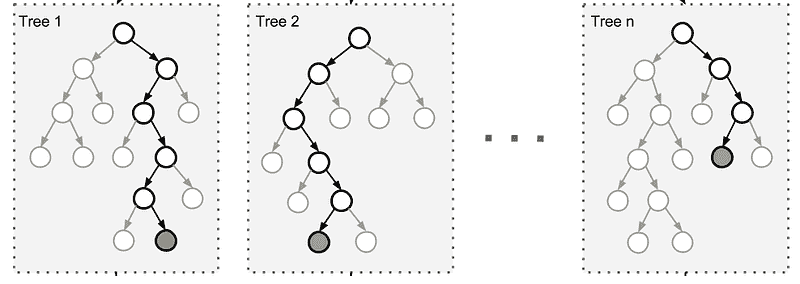
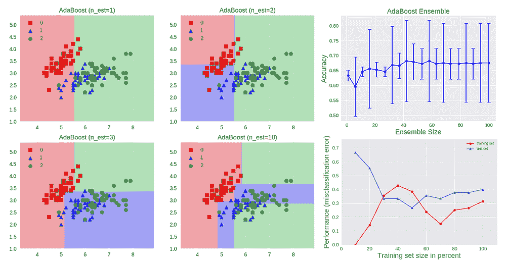

# 集成学习以改善机器学习结果

> 原文：[`www.kdnuggets.com/2017/09/ensemble-learning-improve-machine-learning-results.html`](https://www.kdnuggets.com/2017/09/ensemble-learning-improve-machine-learning-results.html)

**作者 Vadim Smolyakov，[Statsbot](https://statsbot.co/)。**

*集成学习通过结合多个模型来帮助提高机器学习结果。这种方法允许比单个模型产生更好的预测性能。这就是为什么集成方法在许多著名的机器学习竞赛中名列前茅，如 Netflix 竞赛、KDD 2009 和 Kaggle。*

*[*Statsbot*](http://statsbot.co/?utm_source=kdnuggets)*团队希望给你这种方法的优势，并请数据科学家 Vadim Smolyakov 深入研究三种基本的集成学习技术。*

集成方法是将几种机器学习技术结合成一个预测模型的元算法，以**减少** **方差**（bagging）、**偏差**（boosting）或**改进预测**（stacking）。

集成方法可以分为两类：

+   *序列*集成方法，其中基础学习者是顺序生成的（例如 AdaBoost）。

    序列方法的基本动机是**利用基础学习者之间的依赖关系**。通过对先前错误标记的示例赋予更高的权重，可以提高整体性能。

+   *并行*集成方法，其中基础学习者是并行生成的（例如随机森林）。

    并行方法的基本动机是**利用基础学习者之间的独立性**，因为通过平均化可以显著减少误差。

大多数集成方法使用单一的基础学习算法来产生同质基础学习者，即相同类型的学习者，形成*同质集成*。

还有一些方法使用异质学习者，即不同类型的学习者，形成*异质集成*。为了使集成方法比其任何单独成员更准确，基础学习者必须尽可能准确并且尽可能多样化。

### Bagging

Bagging 代表自助聚合。减少估计方差的一种方法是将多个估计值进行平均。例如，我们可以在数据的不同子集上训练 M 棵不同的树（通过随机抽样替换选择），然后计算集成：

Bagging 使用自助抽样来获得用于训练基础学习者的数据子集。对于基础学习者的输出聚合，bagging 使用*分类投票*和*回归平均*。

我们可以在 Iris 数据集上的分类背景下研究 bagging。我们可以选择两个基础估计器：决策树和 k-NN 分类器。图 1 显示了基础估计器的学习决策边界以及它们应用于 Iris 数据集的 bagging 集成。

准确率：0.63 (+/- 0.02) [决策树]

准确率：0.70 (+/- 0.02) [K-NN]

准确率：0.64 (+/- 0.01) [袋装树]

准确率：0.59 (+/- 0.07) [袋装 K-NN]

决策树展示了轴的平行边界，而 k=1 最近邻则紧密地拟合数据点。袋装集成方法使用了 10 个基础估计器，并对训练数据和特征进行了 0.8 的子采样。

与 k-NN 袋装集成相比，决策树袋装集成达到了更高的准确率。K-NN 对训练样本的扰动不太敏感，因此它们被称为稳定学习者。

> *将稳定学习者进行组合的优势较小，因为集成不会帮助改善泛化性能。*

图形还显示了随着集成规模的增加，测试准确率的提升。根据交叉验证结果，我们可以看到准确率直到约 10 个基础估计器时才会增加，然后会趋于平稳。因此，添加超过 10 个基础估计器只会增加计算复杂性，而不会提高 Iris 数据集的准确率。

我们还可以看到袋装树集成的学习曲线。注意到训练数据的平均错误为 0.3，以及测试数据的 U 形错误曲线。训练和测试误差之间的最小差距发生在训练集大小约为 80%时。

> *一种常用的集成算法是随机树森林。*

在**随机森林**中，集成中的每棵树都是从训练集的有放回抽样（即自助采样）中构建的。此外，随机选择特征的子集进一步增加了树的随机性，而不是使用所有特征。

结果是，森林的偏差略微增加，但由于较少相关树的平均化，其方差减少，导致整体模型更好。

在**极端随机树**算法中，随机性更进一步：分裂阈值是随机的。不是寻找最具区分性的阈值，而是为每个候选特征随机抽取阈值，并选择这些随机生成阈值中的最佳作为分裂规则。这通常可以进一步减少模型的方差，但以略微增加偏差为代价。

### **提升（Boosting）**

提升（Boosting）指的是一类能够将弱学习者转化为强学习者的算法。提升的主要原理是将一系列弱学习者——那些仅稍微优于随机猜测的模型，如小决策树——拟合到数据的加权版本上。更多的权重给予那些被早期轮次错误分类的示例。

然后通过加权多数投票（分类）或加权和（回归）来组合预测结果，以产生最终预测。提升方法与像 bagging 这样的委员会方法的主要区别在于，基本学习器是在数据的加权版本上按顺序训练的。

以下算法描述了最广泛使用的提升算法形式，称为 **AdaBoost**，即自适应提升。

我们看到第一个基本分类器 y1(x) 是使用所有相等的加权系数进行训练的。在随后的提升轮次中，对于被误分类的数据点，加权系数增加，对于正确分类的数据点，加权系数减少。

数量 epsilon 代表每个基本分类器的加权错误率。因此，加权系数 alpha 给予更准确的分类器更大的权重。

AdaBoost 算法在上图中进行了说明。每个基本学习器由一个深度为 1 的决策树组成，从而根据一个特征阈值对数据进行分类，该阈值将空间划分为两个由与一个轴平行的线性决策面分隔的区域。图中还显示了随着集成大小的增加测试准确度的提高，以及训练和测试数据的学习曲线。

**梯度树提升** 是提升到任意可微损失函数的推广。它可以用于回归和分类问题。梯度提升以顺序方式构建模型。

在每个阶段，选择决策树 hm(x) 以最小化当前模型 Fm-1(x) 的损失函数 L：

回归和分类算法在使用的损失函数类型上有所不同。

* * *

## 我们的前三个课程推荐

 1\. [谷歌网络安全证书](https://www.kdnuggets.com/google-cybersecurity) - 快速进入网络安全职业。

 2\. [谷歌数据分析专业证书](https://www.kdnuggets.com/google-data-analytics) - 提升你的数据分析技能

 3\. [谷歌 IT 支持专业证书](https://www.kdnuggets.com/google-itsupport) - 支持你的组织 IT

* * *

### 更多关于此主题的信息

+   [带例子的集成学习](https://www.kdnuggets.com/2022/10/ensemble-learning-examples.html)

+   [集成学习技术：使用 Python 中的随机森林进行的详细说明](https://www.kdnuggets.com/ensemble-learning-techniques-a-walkthrough-with-random-forests-in-python)

+   [何时选择集成技术是明智的？](https://www.kdnuggets.com/2022/07/would-ensemble-techniques-good-choice.html)

+   [掌握季节性和提升业务成果的终极指南](https://www.kdnuggets.com/2023/08/media-mix-modeling-ultimate-guide-mastering-seasonality-boosting-business-results.html)

+   [提升你的机器学习模型的 7 种方法](https://www.kdnuggets.com/7-ways-to-improve-your-machine-learning-models)

+   [为什么谦逊会提升你的数据科学技能](https://www.kdnuggets.com/2022/01/humbling-improve-data-science-skills.html)
