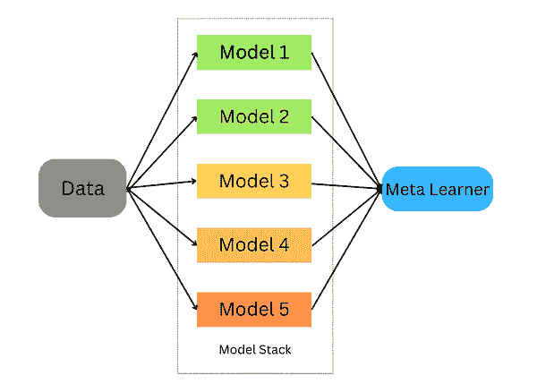
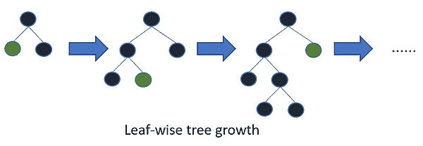

# 集成学习技术：在 Python 中使用随机森林的详细讲解

> 原文：[`www.kdnuggets.com/ensemble-learning-techniques-a-walkthrough-with-random-forests-in-python`](https://www.kdnuggets.com/ensemble-learning-techniques-a-walkthrough-with-random-forests-in-python)

机器学习模型已成为多个行业决策中的重要组成部分，但在处理嘈杂或多样化的数据集时，往往会遇到困难。这就是集成学习发挥作用的地方。

本文将揭秘集成学习，并介绍其强大的随机森林算法。无论你是希望提升工具箱的数据科学家，还是寻求构建稳健机器学习模型的实践见解的开发者，这篇文章都适合你！

* * *

## 我们的三大推荐课程

 1\. [谷歌网络安全证书](https://www.kdnuggets.com/google-cybersecurity) - 快速进入网络安全职业轨道

 2\. [谷歌数据分析专业证书](https://www.kdnuggets.com/google-data-analytics) - 提升你的数据分析技能

 3\. [谷歌 IT 支持专业证书](https://www.kdnuggets.com/google-itsupport) - 支持你所在组织的 IT 需求

* * *

在本文结束时，你将全面了解集成学习及其在 Python 中的随机森林如何工作。因此，无论你是经验丰富的数据科学家，还是只是想扩展机器学习能力的好奇者，都欢迎加入我们的冒险，提升你的机器学习专业知识！

# 1\. 什么是集成学习？

集成学习是一种机器学习方法，其中多个弱模型的预测结果相互结合，以获得更强的预测。集成学习的概念是通过利用每个模型的预测能力来减少单个模型的偏差和错误。

为了更好地举例，假设你看到了一种动物，但不知道这只动物属于什么物种。那么，与其询问一个专家，不如询问十个专家，然后根据大多数人的意见来决定。这被称为**硬投票**。

**硬投票**是指我们考虑每个分类器的类别预测，然后根据对特定类别的最大投票数来对输入进行分类。另一方面，**软投票**是指我们考虑每个分类器对每个类别的概率预测，然后根据该类别的平均概率（分类器的概率平均值）将输入分类到概率最大类别。

# 2\. 何时使用集成学习

集成学习通常用于提高模型性能，包括提高分类准确性和减少回归模型的平均绝对误差。此外，集成学习者通常能够提供更稳定的模型。当模型之间没有相关性时，集成学习者效果最佳，因为每个模型可以学习到独特的内容，并提高整体性能。

# 3\. 集成学习策略

尽管集成学习可以通过多种方式应用，但在实践中，三种策略因其易于实现和使用而获得了很大的流行。这三种策略是：

1.  **Bagging：** Bagging，即自助聚合，是一种集成学习策略，其中模型使用数据集的随机样本进行训练。

1.  **Stacking：** Stacking，即堆叠泛化，是一种集成学习策略，其中我们训练一个模型以结合多个在我们的数据上训练的模型。

1.  **Boosting：** Boosting 是一种集成学习技术，专注于选择错误分类的数据以训练模型。

让我们深入探讨这些策略，并看看如何使用 Python 在我们的数据集上训练这些模型。

# 4\. Bagging 集成学习

Bagging 采用数据的随机样本，使用学习算法和均值来找到 Bagging 概率；也称为自助聚合；它汇总多个模型的结果以得到一个广泛的结果。

该方法包括：

1.  将原始数据集拆分成多个有放回的子集。

1.  为这些子集中的每一个开发基础模型。

1.  在进行所有预测之前并行运行所有模型以获得最终预测。

[**Scikit-learn**](https://scikit-learn.org/stable/) 为我们提供了实现 [**BaggingClassifier**](https://scikit-learn.org/stable/modules/generated/sklearn.ensemble.BaggingClassifier.html) 和 [**BaggingRegressor**](https://scikit-learn.org/stable/modules/generated/sklearn.ensemble.BaggingRegressor.html) 的能力。 BaggingMetaEstimator 确定原始数据集的随机子集以拟合每个基础模型，然后通过投票或平均将每个基础模型的预测汇总成最终预测。这种方法通过随机化其构建过程来减少方差。

让我们举一个使用 scikit-learn 进行包装估计器的例子：

```py
from sklearn.ensemble import BaggingClassifier
from sklearn.tree import DecisionTreeClassifier
bagging = BaggingClassifier(base_estimator=DecisionTreeClassifier(),n_estimators=10, max_samples=0.5, max_features=0.5)
```

Bagging 分类器考虑多个参数：

+   **base_estimator：** 在包装方法中使用的基础模型。这里我们使用决策树分类器。

+   **n_estimators：** 我们将在包装方法中使用的估计器数量。

+   **max_samples：** 从训练集中为每个基础估计器提取的样本数量。

+   **max_features：** 用于训练每个基本估计器的特征数量。

现在我们将在训练集上训练这个分类器并进行评分。

```py
bagging.fit(X_train, y_train)
bagging.score(X_test,y_test)
```

对于回归任务，我们也可以做相同的处理，唯一的区别是我们将使用回归估计器。

```py
from sklearn.ensemble import BaggingRegressor
bagging = BaggingRegressor(DecisionTreeRegressor())
bagging.fit(X_train, y_train)
model.score(X_test,y_test)
```

# 5\. 堆叠集成学习

堆叠是一种结合多个估计器的技术，以最小化它们的偏差并产生准确的预测。每个估计器的预测结果被结合在一起，然后输入到一个通过交叉验证训练的最终预测元模型中；堆叠可以应用于分类问题和回归问题。



堆叠集成学习

堆叠的过程如下：

1.  将数据分为训练集和验证集

1.  将训练集分为 K 折

1.  在 k-1 个折叠上训练一个基本模型，并在第 k 个折叠上进行预测

1.  反复进行，直到你对每一个折叠都有一个预测结果

1.  在整个训练集上拟合基本模型

1.  使用模型对测试集进行预测

1.  对其他基本模型重复步骤 3–6

1.  使用测试集的预测结果作为新模型（元模型）的特征

1.  使用元模型对测试集进行最终预测

在下面的示例中，我们首先创建两个基本分类器（RandomForestClassifier 和 GradientBoostingClassifier）和一个元分类器（LogisticRegression），并使用 K 折交叉验证将这些分类器在训练数据（鸢尾花数据集）上的预测作为元分类器（LogisticRegression）的输入特征。

在使用 K 折交叉验证从基本分类器生成的预测作为元分类器的输入特征后，对测试集进行预测，并将结果与其堆叠集成模型进行准确性评估。

```py
# Load the dataset
data = load_iris()
X, y = data.data, data.target

# Split the data into training and testing sets
X_train, X_test, y_train, y_test = train_test_split(X, y, test_size=0.2, random_state=42)

# Define base classifiers
base_classifiers = [
   RandomForestClassifier(n_estimators=100, random_state=42),
   GradientBoostingClassifier(n_estimators=100, random_state=42)
]

# Define a meta-classifier
meta_classifier = LogisticRegression()

# Create an array to hold the predictions from base classifiers
base_classifier_predictions = np.zeros((len(X_train), len(base_classifiers)))

# Perform stacking using K-fold cross-validation
kf = KFold(n_splits=5, shuffle=True, random_state=42)
for train_index, val_index in kf.split(X_train):
   train_fold, val_fold = X_train[train_index], X_train[val_index]
   train_target, val_target = y_train[train_index], y_train[val_index]

   for i, clf in enumerate(base_classifiers):
       cloned_clf = clone(clf)
       cloned_clf.fit(train_fold, train_target)
       base_classifier_predictions[val_index, i] = cloned_clf.predict(val_fold)

# Train the meta-classifier on base classifier predictions
meta_classifier.fit(base_classifier_predictions, y_train)

# Make predictions using the stacked ensemble
stacked_predictions = np.zeros((len(X_test), len(base_classifiers)))
for i, clf in enumerate(base_classifiers):
   stacked_predictions[:, i] = clf.predict(X_test)

# Make final predictions using the meta-classifier
final_predictions = meta_classifier.predict(stacked_predictions)

# Evaluate the stacked ensemble's performance
accuracy = accuracy_score(y_test, final_predictions)
print(f"Stacked Ensemble Accuracy: {accuracy:.2f}")
```

# 6\. 提升集成学习

提升是一种机器学习集成技术，它通过将弱学习器转变为强学习器来减少偏差和方差。这些弱学习器按顺序应用于数据集；首先创建一个初始模型并将其拟合到训练集。一旦识别出第一个模型的错误，就设计另一个模型来纠正这些错误。

有一些流行的算法和实现用于提升集成学习技术。让我们探索其中最著名的一些。

## 6.1\. AdaBoost

AdaBoost 是一种有效的集成学习技术，它顺序地使用弱学习器进行训练。每次迭代时，优先考虑错误预测，同时减少对正确预测实例的权重；这种对挑战性观测的战略性关注促使 AdaBoost 随着时间的推移变得越来越准确，其最终预测是通过汇总多数投票或加权求和的方式来决定的。

AdaBoost 是一种适用于回归和分类任务的多用途算法，但在这里我们重点关注其在使用 Scikit-learn 进行分类问题的应用。让我们看看如何在下面的示例中使用它进行分类任务：

```py
from sklearn.ensemble import AdaBoostClassifier
model = AdaBoostClassifier(n_estimators=100)
model.fit(X_train, y_train)
model.score(X_test,y_test)
```

在这个示例中，我们使用了 scikit-learn 中的 AdaBoostClassifier，并将 n_estimators 设置为 100。默认学习器是决策树，你可以进行更改。除此之外，决策树的参数可以进行调整。

## 2\. 极端梯度提升 (XGBoost)

极端梯度提升，也更广为人知为 XGBoost，是提升集成学习者的最佳实现之一，因为其并行计算使其在单台计算机上运行非常优化。XGBoost 可以通过由机器学习社区开发的 xgboost 包进行使用。

```py
import xgboost as xgb
params = {"objective":"binary:logistic",'colsample_bytree': 0.3,'learning_rate': 0.1,
               'max_depth': 5, 'alpha': 10}
model = xgb.XGBClassifier(**params)
model.fit(X_train, y_train)
model.fit(X_train, y_train)
model.score(X_test,y_test)
```

## 3\. LightGBM

LightGBM 是另一种基于树学习的梯度提升算法。然而，与其他基于树的算法不同，它使用叶子-wise 树增长，使其收敛更快。



叶子-wise 树增长 / 图片来源于 [LightGBM](https://lightgbm.readthedocs.io/en/latest/Features.html#other-features)

在下面的示例中，我们将应用 LightGBM 于二分类问题：

```py
import lightgbm as lgb
lgb_train = lgb.Dataset(X_train, y_train)
lgb_eval = lgb.Dataset(X_test, y_test, reference=lgb_train)
params = {'boosting_type': 'gbdt',
             'objective': 'binary',
             'num_leaves': 40,
             'learning_rate': 0.1,
             'feature_fraction': 0.9
             }
gbm = lgb.train(params,
   lgb_train,
   num_boost_round=200,
   valid_sets=[lgb_train, lgb_eval],
   valid_names=['train','valid'],
  )
```

集成学习和随机森林是强大的机器学习模型，总是被机器学习从业者和数据科学家使用。在本文中，我们探讨了它们的基本直觉、何时使用它们，最后，我们介绍了最受欢迎的算法以及如何在 Python 中使用它们。

# 参考文献

+   [集成学习算法的温和介绍](https://machinelearningmastery.com/tour-of-ensemble-learning-algorithms/)

+   [集成学习的全面指南：你到底需要了解什么](https://neptune.ai/blog/ensemble-learning-guide)

+   [集成学习的全面指南（附 Python 代码）](https://www.analyticsvidhya.com/blog/2018/06/comprehensive-guide-for-ensemble-models/)

**[Youssef Rafaat](https://www.linkedin.com/in/youssef-hosni-b2960b135)** 是一位计算机视觉研究员和数据科学家。他的研究专注于为医疗保健应用开发实时计算机视觉算法。他还在市场营销、金融和医疗保健领域担任数据科学家超过 3 年。

### 更多相关主题

+   [决策树与随机森林，解析](https://www.kdnuggets.com/2022/08/decision-trees-random-forests-explained.html)

+   [何时使用集成技术是一个好选择？](https://www.kdnuggets.com/2022/07/would-ensemble-techniques-good-choice.html)

+   [分类指标演示：逻辑回归与…](https://www.kdnuggets.com/2022/10/classification-metrics-walkthrough-logistic-regression-accuracy-precision-recall-roc.html)

+   [集成学习实例](https://www.kdnuggets.com/2022/10/ensemble-learning-examples.html)

+   [使用网格搜索和随机搜索进行超参数调优（Python）](https://www.kdnuggets.com/2022/10/hyperparameter-tuning-grid-search-random-search-python.html)

+   [随机森林与决策树：主要区别](https://www.kdnuggets.com/2022/02/random-forest-decision-tree-key-differences.html)
