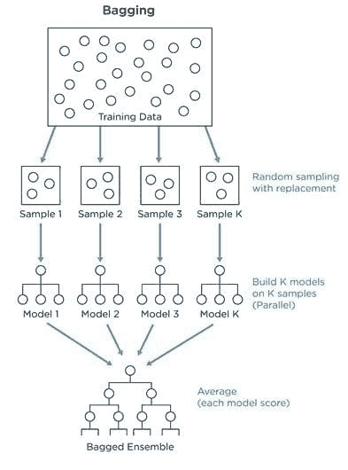
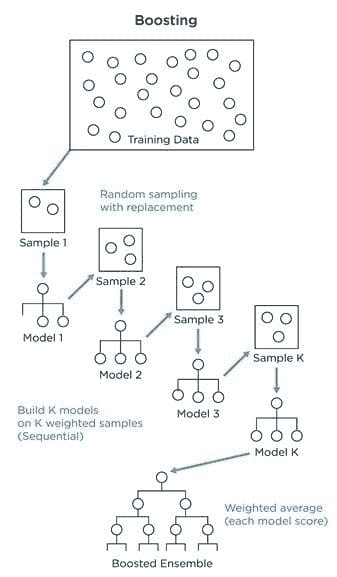
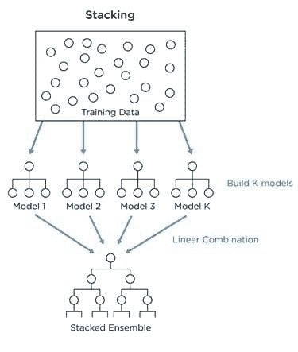
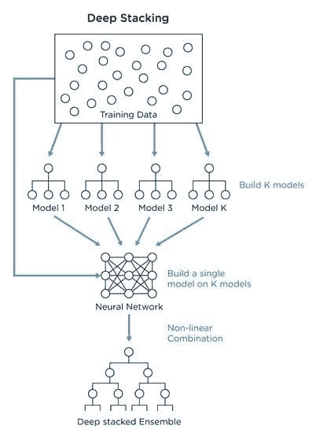

# 多人智慧胜过单人：集成学习的案例

> 原文：[`www.kdnuggets.com/2019/09/ensemble-learning.html`](https://www.kdnuggets.com/2019/09/ensemble-learning.html)

评论

**作者：[Jay Budzik](https://www.linkedin.com/in/jaybudzik/)，ZestFinance**。

> “真理的利益需要多样的意见。” —J. S. Mill

* * *

## 我们的三大课程推荐

 1\. [谷歌网络安全证书](https://www.kdnuggets.com/google-cybersecurity) - 快速开启网络安全职业生涯。

 2\. [谷歌数据分析专业证书](https://www.kdnuggets.com/google-data-analytics) - 提升你的数据分析技能

 3\. [谷歌 IT 支持专业证书](https://www.kdnuggets.com/google-itsupport) - 支持你的组织进行 IT 管理

* * *

银行和贷款机构越来越多地转向 AI 和机器学习，以自动化其核心功能，并在信贷承保和欺诈检测中做出更准确的预测。ML 从业者可以利用越来越多的建模算法，例如简单决策树、随机森林、梯度提升机、深度神经网络和支持向量机。每种方法都有其优缺点，这也是为什么将 ML 算法结合起来往往能提供比任何单一 ML 方法更出色的预测性能。（这是我们在 ZestFinance 每个项目中的标准做法。）这种结合算法的方法被称为集成。

集成方法在许多场景下提高了泛化性能，包括分类、回归和类别概率估计。集成方法在具有挑战性的数据集上创造了众多世界纪录。一个集成模型赢得了[Netflix 奖](https://www.netflixprize.com/assets/GrandPrize2009_BPC_BellKor.pdf)和[国际数据科学竞赛](https://mlwave.com/kaggle-ensembling-guide/)，几乎涵盖了所有领域，包括[信用风险预测](https://nycdatascience.com/blog/student-works/kaggle-predict-consumer-credit-default/)和[视频分类](https://www.kaggle.com/c/youtube8m-2018/discussion/62781)。虽然集成方法通常被认为比单一模型的预测功能表现更好，但它们 notoriously 难以设置、操作和解释。随着更好的建模、可解释性和监控工具的发明，这些挑战正在减少，我们将在这篇文章的最后讨论这些工具。

### 集成模型如何实现更好的性能

就像自然界中的多样性有助于更强健的生物系统一样，机器学习模型的集成通过结合多个子模型的优势（并弥补其不足）产生更强的结果。神经网络需要在建模之前显式处理缺失值，而梯度提升树则自动处理这些缺失值。建模者在处理神经网络的缺失数据时，可能会引入偏差和错误。梯度提升树的方法选择也可能引入错误和偏差。通过结合不同的方法（例如，通过平均或混合分数），可以改善预测。更具体地说，集成通过结合具有不同错误模式的不同估计器来减少偏差和方差，从而降低单一错误来源的影响。

应用集成技术的方法有无数种。子模型可以处理不同的原始输入数据，你甚至可以使用子模型生成特征供另一个模型使用。例如，你可以对数据的每个段（如不同收入水平）训练一个模型，然后将结果结合起来。

### 集成方法的类型及其工作原理

集成学习有四种主要类型：

+   在**装袋（bagging）**中，我们使用[自助采样](https://en.wikipedia.org/wiki/Bootstrapping_(statistics))来获取用于训练一组基础模型的数据子集。自助采样是使用逐渐增大的随机样本，直到预测准确性达到递减回报。每个样本用于训练一个单独的决策树，并对每个模型的结果进行聚合。对于分类任务，每个模型对结果进行投票。在回归任务中，模型结果取平均。具有低偏差但高方差的基础模型非常适合用于装袋。[随机森林](https://www.stat.berkeley.edu/~breiman/randomforest2001.pdf)，即装袋的决策树组合，是这一方法的经典例子。

+   在**提升（boosting）**中，我们通过将建模努力集中于导致更多错误的数据（即关注困难的数据）来提高性能。我们训练一系列模型，对早期迭代中被错误分类的示例给予更多权重。与装袋（bagging）一样，分类任务通过加权多数投票来解决，回归任务则通过加权求和来得出最终预测。具有低方差但高偏差的基础模型非常适合用于提升。[梯度提升](https://www.kdd.org/kdd2016/papers/files/rfp0697-chenAemb.pdf)是这一方法的一个著名例子。

+   在**堆叠**中，我们创建一个集成函数，将多个基础模型的输出组合成一个单一的分数。基础级模型基于完整的数据集进行训练，然后其输出作为输入特征来训练集成函数。通常，集成函数是基础模型分数的简单线性组合。

+   在 ZestFinance，我们更喜欢一种更强大的方法，称为**深度堆叠**，它使用堆叠集成与非线性集成函数，这些函数同时将模型分数和输入数据作为输入。这些方法有助于揭示子模型之间更深层次的关系，并通过根据每个子模型的优势来学习何时应用每个子模型，从而比简单的线性堆叠集成具有更高的准确性。深度堆叠允许模型根据特定的输入变量（如产品细分、收入带或营销渠道）选择正确的子模型权重，以进一步提高性能。

### 真实世界信用风险模型的结果

为了展示集成学习的卓越表现，我们建立了一系列二元分类模型，以预测从过去三年内发放的汽车贷款数据库中的违约情况。贷款数据包括超过 100,000 名借款人和超过 1,100 个特征。

竞争是在六个基础机器学习模型之间进行的：四个 XGBoost 模型和两个神经网络模型，这些模型使用来自不同信用局数据集的特征构建，并结合一个集成模型，该模型使用神经网络堆叠这六个基础模型。

为了评估模型的准确性，我们测量了它们在验证数据上的[AUC](https://en.wikipedia.org/wiki/Receiver_operating_characteristic#Area_under_the_curve)和[KS](https://en.wikipedia.org/wiki/Kolmogorov%E2%80%93Smirnov_test)分数。AUC（接收器工作特征曲线下面积）用于衡量模型的假阳性和假阴性率，而 KS（Kolmogorov–Smirnov 检验的简称）用于比较数据分布。较高的数值与更好的业务结果相关。

以下是每个模型在预测准确性和通过减少损失节省的美元方面的表现，与[逻辑回归基准模型](https://www.celent.com/system/media_documents/documents/794/651/760/original/557191332.pdf)相比。

| **Model Type** | **AUC** | **KS** | **Est. Dollars Saved** |
| --- | --- | --- | --- |
| **Ensemble** | 0.803 | 0.446 | $21M |
| **XGB 1** | 0.791 (2%) | 0.420 (6%) | $18M (14%) |
| **XGB 2** | 0.791 (2%) | 0.428 (4%) | $18M (12%) |
| **XGB 3** | 0.781 (3%) | 0.411 (9%) | $17M (16%) |
| **XGB 4** | 0.782 (3%) | 0.413 (8%) | $17M (16%) |
| **ANN 1** | 0.750 (7%) | 0.376 (19%) | $16M (19%) |
| **ANN 2** | 0.786 (2%) | 0.430 (4%) | $18M (13%) |

我们的集成模型产生了最高的 AUC（0.803），这意味着 80%的情况下，我们的集成模型将随机的优质申请人排在随机的劣质申请人之上。集成模型的 AUC 比最佳的 XGBoost 和神经网络模型高出 2%，这听起来可能不多，但 AUC 是对数刻度的，所以即使是小幅度的增加也比它们看起来的影响要大（类似于地震的里氏震中）。这个 5 亿美元的贷款业务通过使用集成模型相比于单一的 XGBoost 或神经网络模型每年将节省 300 万美元。

集成方法的优势不仅限于预测准确性。它们还通过随着时间的推移提高稳定性来惠及业务。为了验证这一点，我们使用验证集计算了集成模型和子模型在六个月期间的每日 AUC 分数。集成模型在这段时间内的 AUC 方差比表现最佳的神经网络模型低 3%，比表现最佳的 XGBoost 模型低 21%。更好的稳定性导致业务结果的可预测性更高。

### 集成方法的挑战

我们在上面看到，集成方法在实际的信用风险建模问题中提供了更好的经济效益和更好的稳定性。然而，在生产中使用复杂的集成模型可能会很棘手。

***工程复杂性***

我们上面提到的那个？[即使是 Netflix 也无法投入生产。](https://www.wired.com/2012/04/netflix-prize-costs/) 技术依赖、运行时性能和模型验证都是在生产中使用这些模型的实际挑战。我们从头开始设计了 ZAML 软件工具来管理这些工程复杂性，我们很自豪地拥有许多世界级的集成模型在生产中运行。

为集成模型结果提供准确解释尤其具有挑战性。许多可解释性方法依赖于模型，并且不[做出有问题的假设。](https://www.zestfinance.com/blog/part-deux-why-not-just-use-shap) 深度堆叠的集成模型使情况更加复杂，因为每个模型可能是连续的或离散的，这两种不同类型的函数的组合对于即使是最先进的分析技术也是一个挑战。

在之前的帖子中，我们展示了像 [LOCO, PI 和 LIME 生成不准确解释](https://www.zestfinance.com/snake-oil-explainability) 等常用技术，即使对于简单的玩具模型也是如此。它们在简单模型上不准确且运行缓慢，随着模型复杂性的增加，情况变得更糟。[集成梯度（IG）](https://arxiv.org/abs/1703.01365)，一种基于 [奥曼-沙普利值](https://en.wikipedia.org/wiki/Shapley_value#Aumann%E2%80%93Shapley_value) 的解释技术，适用于神经网络和其他连续函数。但是，你不能将神经网络与基于树的模型如 [XGBoost](https://xgboost.readthedocs.io/en/latest/) 结合。如果这样做，IG 就会失效。

[SHAP](https://github.com/slundberg/shap) TreeExplainer 仅对决策树有效，不适用于神经网络。尽管一些机器学习工程师已开始使用 [SHAP](https://github.com/slundberg/shap) KernelExplainer，它声称适用于任何模型，但它对变量独立性和是否可以用平均值替代缺失值做了一些有问题的假设。

更重要的是，你通常不仅仅是试图理解模型得分的驱动因素。相反，你试图理解基于模型的决策。理解基于模型的决策意味着考虑模型得分的应用方式。在基于模型做出决策之前，模型的得分通常会经过一些转换，例如将其放在 0-1 范围内，并使得高于 90% 的得分对应于模型得分的最低十分位。这些转换在生成解释时必须仔细考虑。不幸的是，这也是许多开源工具，甚至最聪明的数据科学家，可能会遇到挑战的地方。

ZAML 客户可以从一种不受这些限制的可解释性方法中受益。它可以为几乎任何可能的机器学习函数集提供准确的解释。ZAML 使这种更好的模型使用起来更安全。

***合规性***

与电影推荐系统不同，信用风险模型必须经过严格分析和审查，以遵守消费者贷款法律和规定。使用数千个变量的集成信用承保模型增加了验证模型在各种条件下是否按预期表现的复杂性。拥有正确的可解释性数学仅仅是解决方案的一部分。记录模型构建和分析也很重要，以便其他从业者能够复制工作，提供为什么申请人被拒绝的清晰理由（不利行动），执行公平贷款分析，寻找较少偏见的模型，并提供足够的监控以了解模型何时需要更新。当你有多个子模型时，每个子模型使用不同的特征空间和模型目标，所有这些任务会变得更加复杂。幸运的是，ZAML 工具可以自动化大量这一过程。

### 结论

我们已经看到，集成学习如何产生更准确和稳定的预测，从而转化为更有利可图的商业结果。这些好处带来了额外的复杂性，但寻求最佳预测准确性和稳定性的贷款机构现在有像 ZAML 这样的工具来帮助管理任务。使用 ZAML 驱动的集成模型已经帮助美国贷款机构多年战胜竞争对手。多样性是进化和政治辩论中的强大工具 —— 同样，它也能带来更好的承保结果。

**简介：** [Jay Budzik](https://www.linkedin.com/in/jaybudzik/) 是 ZestFinance 的首席技术官，拥有通过应用 AI 和 ML 来推动收入增长的成功记录。他在西北大学获得计算机科学博士学位，背景涉及 AI、ML、大数据和 NLP，Jay 曾是一名发明家和企业家，拥有金融和网络规模媒体及广告的经验：通过开发和部署成功的产品以及建设和培养优秀团队来取得成果。

**相关：**

+   [集成学习：5 种主要方法](https://www.kdnuggets.com/2019/01/ensemble-learning-5-main-approaches.html)

+   [直观的集成学习指南与梯度提升](https://www.kdnuggets.com/2018/07/intuitive-ensemble-learning-guide-gradient-boosting.html)

+   [Bagging 和 Boosting 有什么区别？](https://www.kdnuggets.com/2017/11/difference-bagging-boosting.html)

### 更多相关话题

+   [为什么你需要学习多于一种编程语言！](https://www.kdnuggets.com/2022/06/need-learn-one-programming-language.html)

+   [IMPACT：数据可观察性峰会将于 11 月 8 日回归](https://www.kdnuggets.com/2023/10/monte-carlo-impact-the-data-observability-summit-is-back)

+   [集成学习实例](https://www.kdnuggets.com/2022/10/ensemble-learning-examples.html)

+   [集成学习技术：使用 Python 中的随机森林的详细介绍](https://www.kdnuggets.com/ensemble-learning-techniques-a-walkthrough-with-random-forests-in-python)

+   [什么时候集成技术是一个好的选择？](https://www.kdnuggets.com/2022/07/would-ensemble-techniques-good-choice.html)

+   [使用 Python 的自动化机器学习：一个案例研究](https://www.kdnuggets.com/2023/04/automated-machine-learning-python-case-study.html)
