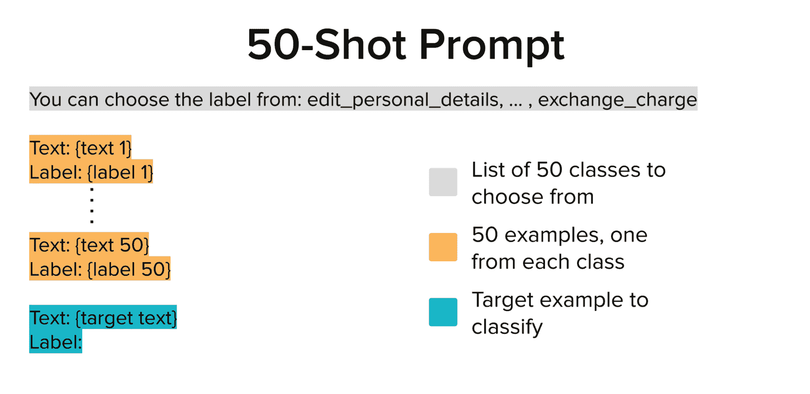
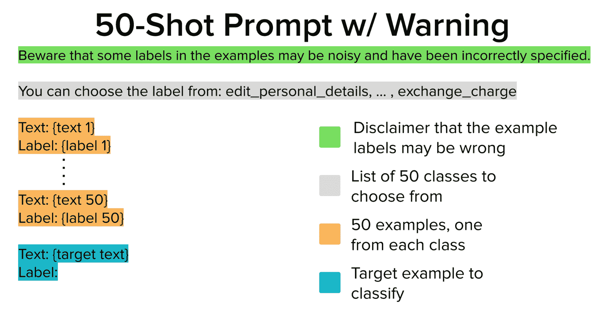
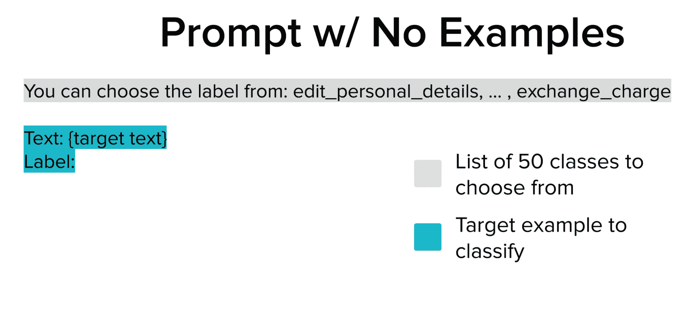

# 确保 LLM 的可靠少样本提示选择

> 原文：[`www.kdnuggets.com/2023/07/ensuring-reliable-fewshot-prompt-selection-llms.html`](https://www.kdnuggets.com/2023/07/ensuring-reliable-fewshot-prompt-selection-llms.html)

***作者：** 克里斯·毛克，乔纳斯·穆勒*

在这篇文章中，我们使用来自 [OpenAI](https://platform.openai.com/docs/models/overview)（支持 GPT-3/ChatGPT 的模型）的 Davinci 大型语言模型，通过 [少样本](https://www.promptingguide.ai/techniques/fewshot) 提示来分类一家大型银行的客户服务请求意图。按照通常的做法，我们从一个已有的人工标注请求示例数据集中获取少样本示例，包含在提示模板中。然而，结果显示 LLM 预测*不可靠*——仔细检查表明，这是因为现实世界的数据杂乱且易出错。手动修改提示模板以缓解潜在的噪音数据只能稍微提高 LLM 在客户服务意图分类任务中的表现。如果我们改用像 [**Confident Learning**](https://arxiv.org/abs/1911.00068) 这样的数据驱动 AI 算法来确保*仅选择高质量*的少样本示例纳入提示模板，LLM 预测会显著更准确。

* * *

## 我们的三大课程推荐

 1\. [谷歌网络安全证书](https://www.kdnuggets.com/google-cybersecurity) - 快速入门网络安全职业

 2\. [谷歌数据分析专业证书](https://www.kdnuggets.com/google-data-analytics) - 提升你的数据分析技能

 3\. [谷歌 IT 支持专业证书](https://www.kdnuggets.com/google-itsupport) - 支持你所在的组织的 IT 工作

* * *


让我们探讨如何策划高质量的少样本示例，以促使 LLM 提供最可靠的预测。确保少样本提示中的高质量示例的必要性可能显而易见，但许多工程师不知道有算法/软件可以更系统地帮助你做到这一点（实际上，这是一个完整的科学学科——*数据驱动的 AI*）。这种算法数据策划具有许多优势，它是：完全自动化、系统化，并广泛适用于超越意图分类的一般 LLM 应用。

## 银行业意图数据集

本文研究了 [Banking-77 数据集](https://arxiv.org/abs/2003.04807) 的 50 类变体，该数据集包含带有对应意图的在线银行查询（下面显示的 **标签**）。我们评估了使用固定测试数据集（包含 ~500 个短语）的模型，这些模型预测该标签，并拥有 ~1000 个标记短语的池，我们认为这些短语可以作为我们少样本示例的候选。


你可以从 [这里](https://s.cleanlab.ai/banking-intent-50/examples-pool.csv) 和 [这里](https://s.cleanlab.ai/banking-intent-50/test.csv) 下载少样本示例候选池和测试集。你可以运行 [这个 notebook](https://colab.research.google.com/github/cleanlab/cleanlab-tools/blob/master/few_shot_prompt_selection/few_shot_prompt_selection.ipynb) 来重现本文中显示的结果。

## 少样本提示

少样本提示（也称为 *上下文学习*）是一种 NLP 技术，使预训练的基础模型能够执行复杂任务，而无需任何明确的训练（即对模型参数的更新）。在少样本提示中，我们向模型提供有限数量的输入-输出对，作为提示模板的一部分，该模板包含在用于指导模型如何处理特定输入的提示中。提示模板提供的额外上下文帮助模型更好地推断所需的输出类型。例如，给定输入：“*旧金山在加州吗？*”，如果这个提示增加了一个固定模板，使新的提示看起来像这样，LLM 将更好地知道所需的输出类型：

文本：波士顿在马萨诸塞州吗？

标签：是

文本：丹佛在加州吗？

标签：否

文本：旧金山在加州吗？

标签：

少样本提示在文本分类场景中尤其有用，其中你的类别是 *特定领域的*（通常在不同业务的客户服务应用中就是这样）。



在我们的案例中，我们有一个包含 50 个可能类别（意图）的数据集，以便为 OpenAI 预训练的 LLM 提供上下文，使其能够学习类别之间的差异。使用 [LangChain](https://github.com/hwchase17/langchain)，我们从每个 50 个类别中随机选择一个示例（从我们的标记候选示例池中），并构建一个 50-shot 提示模板。我们还在少样本示例之前附加了一个列出所有可能类别的字符串，以确保 LLM 输出是一个有效的类别（即意图类别）。

上述 50-shot 提示用作 LLM 的输入，以使其对测试集中每个示例进行分类（**target text** 是这输入中在不同测试示例之间唯一改变的部分）。这些预测与实际标签进行比较，以评估使用选定的少量提示模板产生的 LLM 准确性。

## 基线模型表现

```py
# This method handles:
# - collecting each of the test examples
# - formatting the prompt
# - querying the LLM API
# - parsing the output
def eval_prompt(examples_pool, test, prefix="", use_examples=True):
    texts = test.text.values
    responses = []
    examples = get_examples(examples_pool, seed) if use_examples else []
    for i in range(len(texts)):
        text = texts[i]
        prompt = get_prompt(examples_pool, text, examples, prefix)
        resp = get_response(prompt)
        responses.append(resp)
    return responses
```

```py
# Evaluate the 50-shot prompt shown above.
preds = eval_prompt(examples_pool, test)
evaluate_preds(preds, test)
>>> Model Accuracy: 59.6%
```

通过上述 50-shot 提示将每个测试示例输入 LLM，我们达到了 59.6%的准确率，对于一个 50 类别的问题来说还不错。但这对于我们银行的客户服务应用来说还不够令人满意，因此我们需要更仔细地查看候选示例的数据集（即池）。当机器学习表现不佳时，数据往往是罪魁祸首！

## 我们数据中的问题

通过仔细检查我们从中提取少量示例的候选池，我们发现数据中潜藏着标记错误的短语和异常值。这里是一些明显标注错误的示例。


以前的[研究](https://labelerrors.com/)观察到许多流行数据集包含标记错误的示例，因为数据标注团队并不完美。

客户服务数据集中也常常包含不相关的示例，这些示例被意外包含在内。这里我们看到了一些看起来奇怪的示例，它们与有效的银行客户服务请求不符。


## 为什么这些问题很重要？

随着 LLM 的上下文大小不断增长，提示中包含许多示例变得越来越普遍。因此，可能无法手动验证少量提示中的所有示例，特别是在类别数量较多（或缺乏相关领域知识）时。如果这些少量示例的数据源存在上述问题（许多真实世界的数据集确实如此），则错误示例可能会出现在你的提示中。本文其余部分将探讨此问题的影响以及我们如何减轻它。

## 我们可以提醒 LLM 这些示例可能存在噪声吗？

如果我们在提示中仅加入一个“免责声明”警告，告知 LLM 提供的少量示例中的一些标签可能不正确，会怎样？这里我们考虑对提示模板进行如下修改，仍然包括之前相同的 50 个少量示例。



```py
prefix = 'Beware that some labels in the examples may be noisy and have been incorrectly specified.'
preds = eval_prompt(examples_pool, test, prefix=prefix)
evaluate_preds(preds, test)
>>> Model Accuracy: 62.0%
```

使用上述提示，我们达到了 62%的准确率。稍有改善，但仍不足以在我们银行的客户服务系统中使用 LLM 进行意图分类！

## 我们可以完全删除这些噪声示例吗？

既然我们不能信任少样本示例池中的标签，那如果我们完全从提示中移除它们，只依赖强大的 LLM 呢？与少样本提示不同，我们在进行零样本提示，其中提示中唯一的示例是 LLM 应该分类的那个。零样本提示完全依赖 LLM 的预训练知识来获得正确的输出。



```py
preds = eval_prompt(examples_pool, test, use_examples=False)
evaluate_preds(preds, test)
>>> Model Accuracy: 67.4%
```

在完全移除低质量少样本示例后，我们达到了 67.4% 的准确率，这是我们迄今为止的最佳表现！

**似乎嘈杂的少样本示例实际上可能** ***损害*** **模型性能，而不是像预期那样提升性能。**

## 我们能否识别并纠正嘈杂的示例？

与其修改提示或完全移除示例，更聪明（但更复杂）的方法是手动查找并修复标签问题。这同时移除了一个对模型有害的嘈杂数据点，并增加了一个准确的数据点，应该通过少样本提示来提升性能，但手动进行这样的修正是繁琐的。我们在这里使用 [Cleanlab Studio](https://cleanlab.ai/studio/) 轻松地纠正数据，该平台实现了 [Confident Learning](https://l7.curtisnorthcutt.com/confident-learning) 算法，以自动找到并修复标签问题。


在通过 Confident Learning 用估计更合适的标签替换估计不良标签后，我们将原始的 50-shot 提示重新通过 LLM 运行，每个测试示例都是这样，除了这次我们使用**自动修正的标签**，这确保了我们在少样本提示中提供了 50 个高质量示例。

```py
# Source examples with the corrected labels.
clean_pool = pd.read_csv("studio_examples_pool.csv")
clean_examples = get_examples(clean_pool)

# Evaluate the original 50-shot prompt using high-quality examples.
preds = eval_prompt(clean_examples, test)
evaluate_preds(preds, test)
>>> Model Accuracy: 72.0%
```

在这样做之后，我们达到了 72% 的准确率，这对于 50 类问题来说是**相当令人印象深刻**的。

**我们现在已经展示了嘈杂的少样本示例可以显著降低 LLM 性能，仅仅手动更改提示（通过添加警告或移除示例）是次优的。要实现最高性能，您还应尝试使用数据中心 AI 技术如 Confident Learning 来纠正示例。**

# 数据中心 AI 的重要性

本文强调了确保语言模型中可靠的少量示例提示选择的重要性，特别是关注银行领域的客户服务意图分类。通过对一家大型银行的客户服务请求数据集的探索以及使用 Davinci LLM 进行的少量示例提示技术的应用，我们遇到了来自嘈杂和错误示例的挑战。我们展示了仅修改提示或删除示例无法保证模型的最佳性能。相反，像 Confident Learning 这样的数据驱动 AI 算法在 Cleanlab Studio 等工具中的应用被证明在识别和纠正标签问题方面更为有效，从而显著提高了准确性。本研究强调了算法数据策展在获取可靠少量示例提示中的作用，并突出了这些技术在提升语言模型在各个领域性能方面的实用性。

**[克里斯·莫克](https://www.linkedin.com/in/chris-mauck/)** 是 Cleanlab 的数据科学家。

### 更多相关话题

+   [通过验证链解锁可靠生成：一个…](https://www.kdnuggets.com/unlocking-reliable-generations-through-chain-of-verification)

+   [使用 Eurybia 检测数据漂移以确保生产 ML 模型质量](https://www.kdnuggets.com/2022/07/detecting-data-drift-ensuring-production-ml-model-quality-eurybia.html)

+   [数据掩码：确保 GDPR 及其他法规合规的核心](https://www.kdnuggets.com/2023/05/data-masking-core-ensuring-gdpr-regulatory-compliance-strategies.html)

+   [设计有效且可靠的机器学习系统！](https://www.kdnuggets.com/2023/05/manning-design-effective-reliable-machine-learning-systems.html)

+   [特征选择：科学与艺术的交汇点](https://www.kdnuggets.com/2021/12/feature-selection-science-meets-art.html)

+   [机器学习中的替代特征选择方法](https://www.kdnuggets.com/2021/12/alternative-feature-selection-methods-machine-learning.html)
