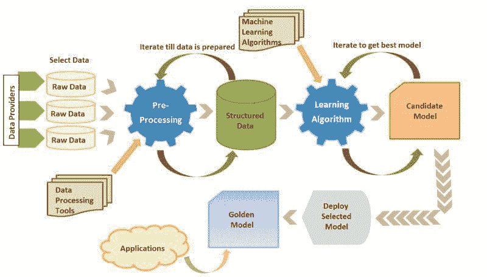

# 机器学习的本质

> 原文：[`www.kdnuggets.com/2018/12/essence-machine-learning.html`](https://www.kdnuggets.com/2018/12/essence-machine-learning.html)

 评论

我想以一篇不那么严肃的文章来结束这一年，讨论机器学习的本质。过去，你无疑已经探索了各种深入和半深入的机器学习定义，并探讨了它与许多其他主题的关系。讨论如此复杂的概念时，从一些初始的共同参考点开始总是一个好主意；问题是，对于像机器学习这样的主题，存在无数的初始共同参考点。

所以我想，*为什么不探讨一下这些参考点呢？*

来源：[Imarticus](https://imarticus.org/what-is-machine-learning-and-does-it-matter/)

现在，事不宜迟，作为对可能看似语义学的练习，让我们探讨一下关于机器学习的 30,000 英尺的定义。

**汤姆·米切尔**

第一个定义，我个人最喜欢的，来自著名计算机科学家、机器学习研究员以及卡内基梅隆大学教授**汤姆·米切尔**。

> 如果一个计算机程序在经历了经验*E*之后，在某些任务* T *的表现得到提升，且该表现是通过* P *来衡量的，那么就可以说这个程序从经验中学习了。¹

米切尔的名言在机器学习界广为人知并经得起时间的考验，首次出现在他 1997 年的书中。这句话对我个人有很大的影响，因为我多年来多次引用了它，并在我的硕士论文中提到了它。该名言在 Goodfellow、Bengio & Courville 的《深度学习》第五章中也占据了重要位置，作为该书对学习算法解释的起点。请参见下面的图 1，了解所谓的米切尔范式的解释。

**图 1**。米切尔范式的可视化（来源）

**伊恩·古德费洛、约书亚·本吉奥 & 亚伦·库维尔**

说到 Goodfellow、Bengio & Courville 和《深度学习》，下面是那本书中对机器学习的定义。

> 机器学习本质上是一种应用统计学的形式，增加了对使用计算机来统计估计复杂函数的重视，而减少了对这些函数置信区间证明的重视[.]²

米切尔对机器学习的定义被移除应用，它专注于通常与机器学习相关的优化过程的具体组件，但没有规定如何在实践中进行。上述“深度学习”中的定义在本质上更具规范性，指出了计算能力的利用（实际上被强调了），而传统统计概念的置信区间则被淡化。

**Ian Witten, Eibe Frank & Mark Hall**

对我来说，另一本特别值得注意的机器学习来源是由 Witten、Frank 和 Hall 合著的《数据挖掘：实用机器学习工具与技术》一书，这本书是我全面阅读的第一本相关书籍。《数据挖掘》数学内容较少，但充满了直觉和解释，且具有实际倾向，它曾长时间是我对新入领域的机器学习者的首选（可能有偏见）建议。

他们对机器学习定义的初步追求有些零散，并试图在机器学习和数据挖掘的背景下将学习、表现和知识的概念结合起来。虽然有些话题偏离了，但下面展示了一些选定的引述。

> [我们]感兴趣的是性能的改进，或者至少是新情况中的性能潜力。
> 
> 事物在改变其行为以使其在未来表现更好时，会学习。
> 
> 学习意味着思考和目的。某物要学习必须是有意为之。
> 
> 经验表明，在许多机器学习应用于数据挖掘的情况下，所获得的显性知识结构，即结构性描述，至少与在新示例上表现良好的能力一样重要。人们经常使用数据挖掘来获取知识，而不仅仅是预测。³

并不一定引人注目的是，术语*数据挖掘*被用作机器学习的补充术语。这段引用的来源的第三版于 2011 年出版，当时*数据挖掘*的影响力比现在大得多；即便去掉对数据挖掘的引用，也应当能得到一个机器学习本身仍然适用的情境。

不过，尽管他们在长篇大论前表明了希望远离哲学的愿望，Witten、Frank 和 Hall 实际上做得相当不错地涉及了一些哲学内容。这些摘录其实很有帮助，因为它提供了机器学习定义的不同角度：虽然 Mitchell 关注于优化过程的具体组件，而 Goodfellow、Bengio 和 Courville 倾向于一个更具规范性的定义，强调计算能力的相对重要性，但这种定义尝试着关注“学习”在机器学习过程中类似且重要的方面。这些选段还提供了一个重要的观点，这一点实际上既实用又具有哲学性，即在最后一段中提到，无论是*获得的*知识还是*使用*这些知识的能力都是机器学习的重要方面（见*训练*和*推理*）。

**Christopher Bishop**

让我们转向最后一篇文本，研究员 Christopher M. Bishop 的《模式识别与机器学习》。值得注意的是，Bishop 并没有明确定义这个术语，但做得相当不错地隐含地提供了一个以算法为中心的机器学习定义（注意到这是在讨论数字分类任务时提到的）。

> 运行机器学习算法的结果可以表示为一个函数**y(x)**，该函数以新的数字图像**x**作为输入，并生成一个输出向量**y**，其编码方式与目标向量相同。函数**y(x)** 的确切形式是在*训练*阶段，即*学习*阶段，根据训练数据确定的。一旦模型训练完成，它可以确定新的数字图像的身份，这些图像被称为*测试集*。正确分类与训练不同的新例子的能力被称为*泛化*。在实际应用中，输入向量的变化性将使得训练数据只能占所有可能输入向量的极小部分，因此泛化是模式识别中的核心目标。

首先，不要对“模式识别”的引用做更多解释，仅仅理解我们在讨论的是监督式机器学习，而不是无监督学习或强化学习（或其他形式的机器学习）。其次，更重要的是，这是唯一提供机器学习逐步处理定义的文本，无论这些步骤在此案例中可能多么简短。还值得关注的是，Bishop 书中的接下来的一页半概述并整合了许多额外的机器学习概念，并将它们很好地结合起来，提供了一个易读的介绍，而没有陷入数学细节（书的其余部分处理了这些内容）。

所以我们有四种定义机器学习的方法：一种是抽象地与优化过程相关；另一种更具指示性，指出计算在机器学习中的重要性；第三种关注“学习”的哪些方面在机器学习过程中是类似的和重要的；最后一种从算法的角度概述机器学习。这些定义都没有错误，但也都不完整。这不仅仅是语义上的问题；探讨先驱和受尊敬的研究者对“机器学习”的看法将扩展我们对它的定义。

**参考文献：**

1.  [机器学习](http://www.cs.cmu.edu/afs/cs.cmu.edu/user/mitchell/ftp/mlbook.html)，Tom Mitchell，McGraw Hill，1997。

1.  [深度学习](https://www.deeplearningbook.org/)，Ian Goodfellow、Yoshua Bengio 和 Aaron Courville，MIT Press，2016。

1.  [数据挖掘：实用机器学习工具与技术（第 3 版）](https://www.cs.waikato.ac.nz/ml/weka/book.html)，Ian Witten、Eibe Frank 和 Mark Hall，Morgan Kaufmann，2011。

1.  [模式识别与机器学习](https://www.springer.com/gp/book/9780387310732)，Christopher M. Bishop，Springer，2006。

**相关**：

+   使用 Mitchell 范式的学习算法简明解释

+   数据科学难题，解读

+   数据科学难题，再探讨

* * *

## 我们的三大课程推荐

 1\. [谷歌网络安全证书](https://www.kdnuggets.com/google-cybersecurity) - 快速进入网络安全职业生涯。

 2\. [谷歌数据分析专业证书](https://www.kdnuggets.com/google-data-analytics) - 提升你的数据分析水平

 3\. [谷歌 IT 支持专业证书](https://www.kdnuggets.com/google-itsupport) - 支持你组织的 IT

* * *

### 更多相关内容

+   [成为优秀数据科学家的 5 个关键技能](https://www.kdnuggets.com/2021/12/5-key-skills-needed-become-great-data-scientist.html)

+   [每个初学者数据科学家应掌握的 6 个预测模型](https://www.kdnuggets.com/2021/12/6-predictive-models-every-beginner-data-scientist-master.html)

+   [2021 年最佳 ETL 工具](https://www.kdnuggets.com/2021/12/mozart-best-etl-tools-2021.html)

+   [停止学习数据科学以寻找目标，并寻找目标去…](https://www.kdnuggets.com/2021/12/stop-learning-data-science-find-purpose.html)

+   [数据科学统计学习的最佳资源](https://www.kdnuggets.com/2021/12/springboard-top-resources-learn-data-science-statistics.html)

+   [成功数据科学家的 5 个特征](https://www.kdnuggets.com/2021/12/5-characteristics-successful-data-scientist.html)
