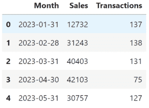

# 数据处理的必备 Python 库

> 原文：[`www.kdnuggets.com/essential-python-libraries-for-data-manipulation`](https://www.kdnuggets.com/essential-python-libraries-for-data-manipulation)


图像由 Midjourney 生成

作为数据专业人士，理解如何处理数据至关重要。在现代时代，这意味着使用编程语言快速处理我们的数据集，以实现我们预期的结果。

* * *

## 我们的前三个课程推荐

 1\. [Google 网络安全证书](https://www.kdnuggets.com/google-cybersecurity) - 快速进入网络安全领域的职业生涯。

 2\. [Google 数据分析专业证书](https://www.kdnuggets.com/google-data-analytics) - 提升你的数据分析水平

 3\. [Google IT 支持专业证书](https://www.kdnuggets.com/google-itsupport) - 支持你的组织的 IT 工作

* * *

Python 是数据专业人士使用的最流行的编程语言，许多库对于数据处理都非常有用。从简单的向量到并行计算，每个用例都有一个可以帮助的库。

那么，哪些 Python 库对数据处理至关重要呢？让我们深入了解一下。

## 1.NumPy

我们将讨论的第一个库是 [NumPy](https://numpy.org/)。NumPy 是一个用于科学计算的开源库。它于 2005 年开发，并已在许多数据科学案例中使用。

NumPy 是一个流行的库，提供了许多在科学计算活动中有价值的功能，如数组对象、向量运算和数学函数。此外，许多数据科学用例依赖于复杂的表格和矩阵计算，因此 NumPy 允许用户简化计算过程。

让我们在 Python 中尝试 NumPy。许多数据科学平台，如 Anaconda，默认情况下已安装 NumPy。但你也可以通过 Pip 安装它们。

```py
pip install numpy
```

安装完成后，我们将创建一个简单的数组并执行数组操作。

```py
import numpy as np

a = np.array([1, 2, 3])
b = np.array([4, 5, 6])
c = a + b
print(c)
```

输出：`[5 7 9]`

我们还可以使用 NumPy 进行基本的统计计算。

```py
data = np.array([1, 2, 3, 4, 5, 6, 7])
mean = np.mean(data)
median = np.median(data)
std_dev = np.std(data)

print(f"The data mean:{mean}, median:{median} and standard deviation: {std_dev}")
```

数据均值：4.0，中位数：4.0，标准差：2.0

还可以进行线性代数运算，如矩阵计算。

```py
x = np.array([[1, 2], [3, 4]])
y = np.array([[5, 6], [7, 8]])
dot_product = np.dot(x, y)

print(dot_product)
```

输出：

`[[19 22] [43 50]]`

使用 NumPy 你可以获得很多好处。从数据处理到复杂的计算，难怪许多库都以 NumPy 为基础。

## 2\. Pandas

[Pandas](https://pandas.pydata.org/) 是数据专业人士最流行的数据处理 Python 库。我相信许多数据科学学习课程会将 Pandas 作为后续处理的基础。

Pandas 因其直观的 API 和多功能性而闻名，因此许多数据操作问题可以轻松通过 Pandas 库解决。Pandas 允许用户执行数据操作，并分析来自各种输入格式的数据，如 CSV、Excel、SQL 数据库或 JSON。

Pandas 构建在 NumPy 之上，因此 NumPy 对象的属性仍适用于任何 Pandas 对象。

让我们尝试使用该库。像 NumPy 一样，如果你使用像 Anaconda 这样的数据科学平台，它通常会默认提供。然而，如果你不确定，可以参考 [Pandas 安装指南](https://pandas.pydata.org/getting_started.html)。

你可以尝试从 NumPy 对象初始化数据集，并使用以下代码获取一个显示前五行数据的 DataFrame 对象（类似表格）。

```py
import numpy as np
import pandas as pd

np.random.seed(0)
months = pd.date_range(start='2023-01-01', periods=12, freq='M')
sales = np.random.randint(10000, 50000, size=12)
transactions = np.random.randint(50, 200, size=12)

data = {
'Month': months,
'Sales': sales,
'Transactions': transactions
}
df = pd.DataFrame(data)
df.head()
```



然后你可以尝试进行几种数据操作活动，如数据选择。

```py
df[df['Transactions'] <100]
```

可以进行数据计算。

```py
total_sales = df['Sales'].sum() 
average_transactions = df['Transactions'].mean() 
```

使用 Pandas 进行数据清理也很容易。

```py
df = df.dropna() 
df = df.fillna(df.mean()) 
```

使用 Pandas 进行数据操作有很多事情要做。查看 [Bala Priya 关于使用 Pandas 进行数据操作的文章](https://www.kdnuggets.com/7-steps-to-mastering-data-wrangling-with-pandas-and-python) 以进一步了解。

## 3\. Polars

[Polars](https://pola.rs/) 是一个相对较新的数据操作 Python 库，旨在快速分析大型数据集。与 Pandas 在几个基准测试中相比，Polars 的性能提升了 30 倍。

Polars 建立在 Apache Arrow 之上，因此它在大数据集的内存管理方面高效，并支持并行处理。它还通过延迟执行来优化数据操作性能，只有在需要时才进行计算。

对于 Polars 的安装，你可以使用以下代码。

```py
pip install polars 
```

像 Pandas 一样，你可以用以下代码初始化 Polars DataFrame。

```py
import numpy as np
import polars as pl

np.random.seed(0) 
employee_ids = np.arange(1, 101) 
ages = np.random.randint(20, 60, size=100) 
salaries = np.random.randint(30000, 100000, size=100) 

df = pl.DataFrame({
    'EmployeeID': employee_ids,
    'Age': ages,
    'Salary': salaries
})

df.head()
```


然而，我们使用 Polars 操作数据的方式有所不同。例如，这里是如何使用 Polars 选择数据的。

```py
df.filter(pl.col('Age') > 40)
```

API 比 Pandas 复杂得多，但如果你需要快速处理大型数据集，这将非常有用。另一方面，如果数据量较小，你将不会获得这个好处。

要了解详细信息，可以参考 [Josep Ferrer 关于 Polars 与 Pandas 的比较分析的文章](https://www.kdnuggets.com/pandas-vs-polars-a-comparative-analysis-of-python-dataframe-libraries)。

## 4\. Vaex

[Vaex](https://vaex.io/) 类似于 Polars，因为该库专门用于大规模数据集的数据操作。然而，它们处理数据集的方式存在差异。例如，Vaex 使用内存映射技术，而 Polars 侧重于多线程处理方法。

Vaex 非常适合比 Polars 所设计的更大的数据集。虽然 Polars 也用于大规模数据集处理，但该库理想的应用于仍能适配内存大小的数据集。同时，Vaex 非常适合用于超出内存的数据集。

对于 Vaex 的安装，最好参考他们的[文档](https://vaex.io/docs/installing.html)，因为如果安装不正确，可能会破坏你的系统。

## 5\. CuPy

[CuPy](https://github.com/cupy/cupy)是一个开源库，可以在 Python 中实现 GPU 加速计算。CuPy 是为 NumPy 和 SciPy 设计的替代品，适用于在 NVIDIA CUDA 或 AMD ROCm 平台上运行计算。

这使得 CuPy 非常适合需要强大数值计算并需要使用 GPU 加速的应用。CuPy 可以利用 GPU 的并行架构，对于大规模计算非常有益。

要安装 CuPy，请参考他们的 GitHub 仓库，因为许多可用版本可能适用于或不适用于你使用的平台。例如，下面的是针对 CUDA 平台的。

```py
pip install cupy-cuda11x
```

这些 API 与 NumPy 类似，因此如果你已经熟悉 NumPy，可以立即使用 CuPy。例如，下面是 CuPy 计算的代码示例。

```py
import cupy as cp
x = cp.arange(10)
y = cp.array([2] * 10)

z = x * y

print(cp.asnumpy(z))
```

如果你持续处理高规模计算数据，CuPy 是一个不可或缺的 Python 库。

## 结论

我们探索过的所有 Python 库在特定用例中都是必不可少的。NumPy 和 Pandas 可能是基础，但像 Polars、Vaex 和 CuPy 这样的库在特定环境下会非常有用。

如果你认为还有其他必不可少的库，请在评论中分享！

**[](https://www.linkedin.com/in/cornellius-yudha-wijaya/)**[Cornellius Yudha Wijaya](https://www.linkedin.com/in/cornellius-yudha-wijaya/)**** 是数据科学助理经理和数据撰写者。在全职工作于 Allianz Indonesia 的同时，他喜欢通过社交媒体和写作分享 Python 和数据技巧。Cornellius 涉及各种 AI 和机器学习话题。

### 更多相关主题

+   [8 款最佳 Python 图像处理工具](https://www.kdnuggets.com/2022/11/8-best-python-image-manipulation-tools.html)

+   [10 个 Pandas 一行代码示例：数据访问、处理和管理](https://www.kdnuggets.com/2023/01/pandas-one-liners-data-access-manipulation-management.html)

+   [数据科学、数据可视化及更多领域的 38 个顶级 Python 库](https://www.kdnuggets.com/2020/11/top-python-libraries-data-science-data-visualization-machine-learning.html)

+   [2022 年数据科学家应了解的 Python 库](https://www.kdnuggets.com/2022/04/python-libraries-data-scientists-know-2022.html)

+   [Python 数据清洗库简介](https://www.kdnuggets.com/2023/03/introduction-python-libraries-data-cleaning.html)

+   [50 级数据科学家：需要了解的 Python 库](https://www.kdnuggets.com/level-50-data-scientist-python-libraries-to-know)
