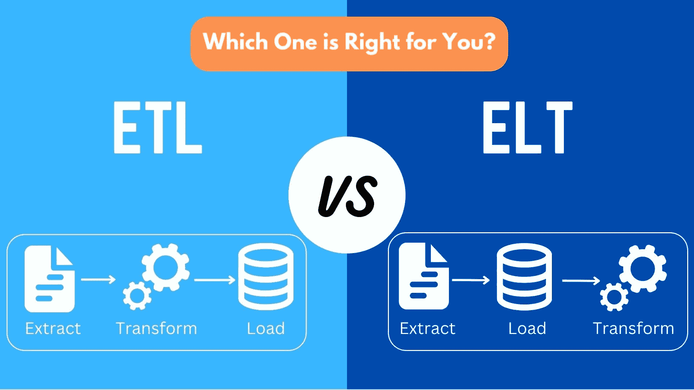
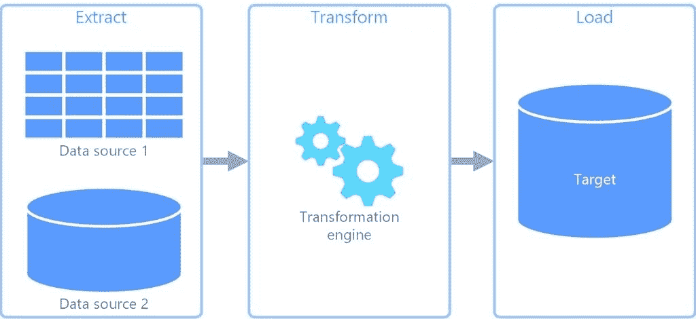
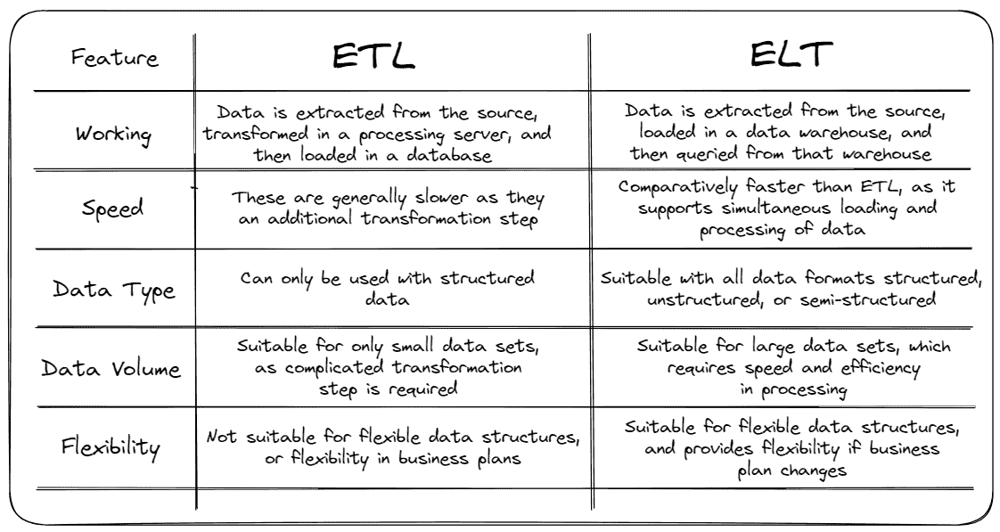

# ETL 与 ELT：哪一种适合您的数据管道？

> 原文：[`www.kdnuggets.com/2023/03/etl-elt-one-right-data-pipeline.html`](https://www.kdnuggets.com/2023/03/etl-elt-one-right-data-pipeline.html)

作者提供的图片

ETL 和 ELT 是将数据从多个来源传输到一个集中源并对其进行一些转换和处理步骤的数据集成管道。这两者的区别在于 ETL 在加载之前进行数据转换，而 ELT 在加载之后进行数据转换。

* * *

## 我们的前三名课程推荐

 1\. [Google 网络安全证书](https://www.kdnuggets.com/google-cybersecurity) - 快速开启网络安全职业生涯。

 2\. [Google 数据分析专业证书](https://www.kdnuggets.com/google-data-analytics) - 提升您的数据分析技能

 3\. [Google IT 支持专业证书](https://www.kdnuggets.com/google-itsupport) - 支持您的组织进行 IT

* * *

但在深入了解之前，让我们首先了解 E、L 和 T 的含义。

**E** 代表 **提取** - 从一个或多个来源提取数据。

**T** 代表 **转换** - 转换数据是一个清理和修改数据的过程，以便将其以适合业务分析的格式使用。

**L** 代表 **加载** - 这涉及将数据加载到目标系统中，可能是数据仓库或数据库。

# ETL（提取、转换、加载）

ETL 是 1970 年代随着磁盘存储的发展而出现的首个标准化数据集成方法。顾名思义，它首先从源头提取原始数据，然后对其进行转换，再加载到目标数据库中，即（提取 ? 转换 ? 加载）

在 ETL 中，数据摄取过程较慢，因为我们需要先在单独的服务器上转换数据，然后再将其加载到目标数据库中。

ETL 用于在有限存储中存储少量数据。它适用于本地、结构化和关系型数据集。

图 1 ETL 系统架构 | 图片由 [estuary.dev](https://www.estuary.dev/what-is-an-etl-pipeline/) 提供

现在，让我们了解一下它的一些主要优缺点。

## 优点

1.  **数据质量：** ETL 通过处理来自各种来源的原始数据，并将其组合成结构化格式，从而提高数据质量。

1.  **减少磁盘驱动器负担：** ETL 的关键特性在于数据在内存中进行转换，这使我们能够创建那些磁盘带宽受限的数据管道。

1.  **一致性：** 将处理后的数据存储在数据库中，确保数据一致、相关和准确，这满足了所有业务需求，并有助于做出更好的决策。

## 缺点

1.  **灵活性：** ETL 具有僵化的管道。不允许在数据库中进行修改。如果业务计划发生变化，商业智能团队将无法回到原始原始数据并重新查询。

1.  **延迟：** 数据摄取与数据分析之间的延迟不适合实时应用。

1.  **数据丢失：** 如果数据处理不当或转换步骤出现错误，ETL 管道可能导致数据丢失。

# ELT（提取、加载、转换）

在 2000 年代初，云计算变得更加普及，数据湖和数据仓库的发展引发了数据存储的革命。现在，企业可以访问便宜且无限的云存储来加载数据。

这导致了新数据集成管道的开发，即 ELT（提取、加载、转换）。原始数据可以存储在数据仓库中并直接从中查询。

简而言之，在 ELT 中，原始数据从源中提取并直接存储在数据仓库中，而没有进行任何转换。与 ETL 不同，转换步骤是在加载之前在单独的服务器上执行，这会在系统中造成额外的延迟和僵化。

图 2 ELT 系统架构 | 图片来自 [sqlofthenorth](https://sqlofthenorth.blog/2021/03/29/elt-etl-design-patterns-with-azure-data-services/)

现在，让我们深入了解一些主要的优缺点。

## 优势

1.  **灵活性：** ELT 管道更具灵活性，因为如果业务计划发生变化，它们允许从原始数据中重新查询相关数据。

1.  **延迟：** 由于数据加载和转换可以同时进行，因此适用于实时决策。

1.  **成本效益：** ELT 管道更具成本效益，因为所需的软件大多依赖于现成的开源软件。

## 缺点

1.  **数据质量：** ELT 管道中的数据质量可能与 ETL 不同。转换在数据存储到目标数据库之后进行。

1.  **非结构化数据：** 如果非结构化数据没有得到适当管理，编写查询将非常困难。而且，由于数据结构的不一致，查询结果可能不够准确。

1.  **安全性：** 由于所有原始数据都存储在数据库中，因此可能存在敏感数据被暴露或被滥用的风险。

1.  **数据存储：** 由于原始数据直接存储而没有任何处理，这需要更多的存储空间。

# ETL 与 ELT 的区别

ETL 和 ELT 的区别在于两个方面。在 ETL 中，数据在加载之前进行转换，而在 ELT 中，数据在加载之后进行转换。

ETL 有一个固定的管道，因为它仅支持传统数据库架构，而 ELT 灵活，支持数据重新查询。

ETL 比 ELT 相对较慢，涉及在加载之前的额外数据转换步骤。但在 ELT 中，这种转换可以与加载同时进行。

ETL 仅适用于本地或结构化数据。但 ELT 可以用于任何结构化、非结构化或半结构化的数据。

以下是 ETL 和 ELT 数据管道的并排比较表。

图 3 ETL 和 ELT 管道的并排比较 | 图片由作者提供

# 何时使用什么？

要在今天的商业环境中充分利用数据，我们需要高效且强大的数据管道，这些管道能够从多个来源提取、加载和转换数据到一个集中存储中，以便进行分析。此时 ETL 和 ELT 数据管道发挥作用。但选择 ETL 还是 ELT 完全取决于业务需求。

通常，当我们对加载数据之前有严格的一致性和数据质量要求时，ETL 管道可以使用。或者当我们需要执行复杂的数据集成和转换步骤时，也可以使用。

ELT 可以在我们想要存储大量数据并需要更快、更高效处理时使用。ELT 还根据不断变化的业务需求提供数据库的灵活性。

希望你喜欢阅读这篇文章。你也可以通过 [Linkedin](https://www.linkedin.com/in/aryan-garg-1bbb791a3/) 联系我。

**[Aryan Garg](https://www.linkedin.com/in/aryan-garg-1bbb791a3/)** 是一名电气工程专业的 B.Tech. 学生，目前处于本科最后一年。他对网页开发和机器学习领域感兴趣，并在这方面追求自己的兴趣，渴望在这些方向上工作。

### 更多相关内容

+   [ETL 与 ELT：数据集成对决](https://www.kdnuggets.com/2022/08/etl-elt-data-integration-showdown.html)

+   [SQL 和数据集成：ETL 和 ELT](https://www.kdnuggets.com/2023/01/sql-data-integration-etl-elt.html)

+   [使用 Bash 构建你的第一个 ETL 管道](https://www.kdnuggets.com/building-your-first-etl-pipeline-with-bash)

+   [2021 年最佳 ETL 工具](https://www.kdnuggets.com/2021/12/mozart-best-etl-tools-2021.html)

+   [RAG 与微调：哪个是提升你的 LLM 应用的最佳工具？](https://www.kdnuggets.com/rag-vs-finetuning-which-is-the-best-tool-to-boost-your-llm-application)

+   [构建供应链管道所需的 6 种数据科学技术](https://www.kdnuggets.com/2022/01/6-data-science-technologies-need-build-supply-chain-pipeline.html)
