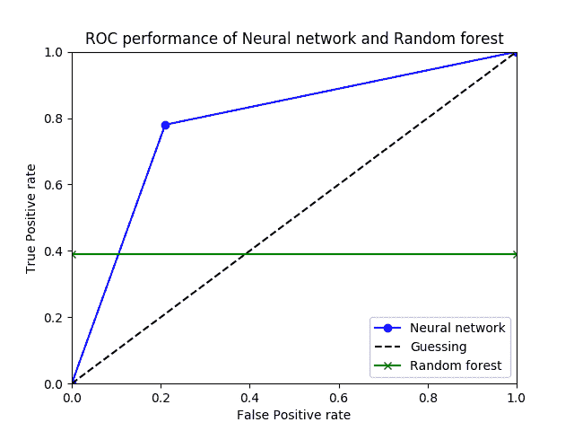

# 评估数据科学项目：案例研究批评

> 原文：[`www.kdnuggets.com/2017/09/evaluating-data-science-projects-case-study-critique.html`](https://www.kdnuggets.com/2017/09/evaluating-data-science-projects-case-study-critique.html)

**作者：Tom Fawcett，[硅谷数据科学](https://svds.com/)。**

* * *

## 我们的前三个课程推荐

 1\. [Google 网络安全证书](https://www.kdnuggets.com/google-cybersecurity) - 快速进入网络安全职业生涯。

 2\. [Google 数据分析专业证书](https://www.kdnuggets.com/google-data-analytics) - 提升你的数据分析技能

 3\. [Google IT 支持专业证书](https://www.kdnuggets.com/google-itsupport) - 支持你的组织的 IT 需求

* * *

我写了 [两篇](https://www.svds.com/the-basics-of-classifier-evaluation-part-1/) [博客文章](https://www.svds.com/classifiers2/) 讨论评估——机器学习中的“西兰花”。实际上，评估下有两个密切相关的关注点：

+   *模型评估* 通常教授给数据科学家，涉及模型的技术质量：模型表现如何？我们能相信这些数字吗？它们在统计上是否显著？

+   *项目评估* 包括模型评估，但也要考虑应用背景的问题：是否解决了正确的问题？性能指标是否适合任务？数据是如何提供的，模型结果是如何使用的？成本是否可以接受？

这两种类型不仅对数据科学家很重要，对管理者和高管也同样重要，他们必须评估项目提案和结果。我会对管理者说：不必了解机器学习项目的内部工作原理，但你应该理解是否测量了正确的东西，结果是否适合业务问题。你需要知道是否要相信数据科学家告诉你的内容。

为此，我将在这里评估一个机器学习项目报告。我发现这项工作被描述为在一个 [流行的机器学习博客](https://cloud.google.com/blog/big-data/2017/03/using-machine-learning-for-insurance-pricing-optimization)上的客户成功故事。这个写作发表于 2017 年初，同时发布了一个展示结果的相关视频。有些方面令人困惑，如你所见，但我没有向作者寻求澄清，因为我希望像报告中那样进行批评。这使得这个案例研究具有现实性：你经常需要评估缺少或令人困惑的细节的项目。

正如你将看到的，我们将揭示一些即使是专业数据科学家也可能犯的常见应用错误。

### 问题

问题的呈现方式如下：一家大型保险公司希望预测特别大的保险索赔。具体而言，他们将其人群划分为报告事故的驾驶员（7-10%）、没有事故的驾驶员（90-93%）和所谓的*大损失*驾驶员，这些驾驶员报告涉及 1 万美元或更多损害的事故（约占其人群的 1%）。他们只希望检测最后一组涉及大额索赔的群体。他们面临的是一个两类问题，这些类别被称为**大损失**和**非大损失**。

熟悉我[之前](https://www.svds.com/the-basics-of-classifier-evaluation-part-1/) [文章](https://www.svds.com/classifiers2/)的读者可能会记得我谈到过现实世界中的机器学习问题中常见的不平衡类别。确实，在这里我们看到一个 99:1 的偏斜，其中正类（大损失）实例的数量比不感兴趣的负类实例少了两个数量级。（顺便说一下，这在机器学习研究标准下会被认为是非常偏斜的，但在现实世界标准下则属于轻微偏斜。）由于这种偏斜，我们在评估时必须小心。

### 方法

他们的方法相当直接。他们有一个关于之前驾驶员记录的历史数据样本用于训练和测试。他们使用 70 个特征来表示每个驾驶员的记录，这些特征涵盖了分类特征和数值特征，尽管这里只展示了一部分。

他们表示，他们的客户之前使用了随机森林来解决这个问题。随机森林是一种广泛使用且受欢迎的技术，它通过构建一组决策树来对实例进行分类。他们希望通过使用深度学习神经网络取得更好的效果。他们的网络设计如下：

该模型是一个具有三层隐藏层的全连接神经网络，使用[ReLU](https://en.wikipedia.org/wiki/Rectifier_(neural_networks))作为激活函数。他们表示使用了来自 Google Compute Engine 的数据来训练模型（使用 TensorFlow 实现），并使用了 Cloud Machine Learning Engine 的 HyperTune 功能来调整超参数。

我没有理由怀疑他们的表示选择或网络设计，但有一点看起来很奇怪。他们的输出是两个 ReLU（整流）单元，每个单元发出该类别的网络准确率（技术上：召回率）。我会选择一个代表大损失驾驶员概率的[Softmax](https://en.wikipedia.org/wiki/Softmax_function)单元，从中我可以得到一个[ROC](https://en.wikipedia.org/wiki/Receiver_operating_characteristic)或[精确度-召回率](https://en.wikipedia.org/wiki/Precision_and_recall)曲线。然后我可以对输出进行阈值处理，以获得曲线上任何可实现的性能。（我在[这篇文章](https://www.svds.com/classifiers2/)中解释了评分优于硬分类的优势。）

但我不是神经网络专家，这里目的不是批评他们的网络设计，只是他们的一般方法。我假设他们进行了实验，并报告了他们找到的最佳性能。

### 结果

他们呈现测试结果的方法令人困惑。一开始，他们报告了 78%的准确率——这很奇怪，因为[准确率是这个偏斜领域的一个无信息量的指标](https://www.svds.com/the-basics-of-classifier-evaluation-part-1/)，并且因为仅仅总是说**非大损失**应该会产生 99%的准确率。这两点并不无关。

但是进一步下方他们展示了这个作为最终结果：

图表缺少*x*和*y*标记，所以很难从曲线中获得很多信息。唯一的信息在顶部。他们报告了*两个*准确率，一个针对每个类别。这改变了情况——他们不是使用综合分类准确率（“准确率”的常见含义），而是每个类别的召回率。我们可以计算一些信息来评估他们的系统。这够吗？

**大损失**准确率（识别率）是 0.78。根据惯例，稀有类别通常为正类，所以这意味着真正正例（TP）率是 0.78，假阴性率（1 – 真正正例率）是 0.22。**非大损失**识别率是 0.79，所以真正负例率是 0.79，假阳性（FP）率是 0.21。

他们之前报告的随机森林准确率是 0.39。现在我们意识到，这个值实际上是**大损失**类别的单类识别率，因此它是随机森林的真正正例率。他们没有报告假阳性率（或真正负例率，我们可以从中计算）。这有问题。

这就是他们报告的全部。

### 评价

第一个批评是相当明显的。他们仅报告了一个训练和测试的*单个*运行结果，因此无论其他问题如何，我们确实只有一个结果可用于工作。我们应该使用交叉验证或自助法进行多次运行，以提供变异的指示。如此一来，我们无法确信这些数字是否具有代表性。大多数机器学习课程都介绍了基本的模型评估，并强调需要多次评估来建立置信区间。

那么他们的解决方案有多好？

底线是：我们不知道。他们没有给出足够的信息。可能没有他们认为的那么好。

这里是一个[ROC 曲线](https://en.wikipedia.org/wiki/Receiver_operating_characteristic)说明分类器的图表。这样的图表允许我们看到在灵敏度和特异性之间（等效地，在假阳性和真阳性之间）的性能折衷。

如果这些研究人员同时提供了 TP 率和 FP 率的值，我们可以在 ROC 空间中绘制一个漂亮的曲线，但是他们只给了我们足够绘制神经网络的单个点，显示为蓝色。

再次，我们对于随机森林只有一个真阳性率值（0.39），但没有伴随的假阳性率。这不够用；仅仅将*所有*东西分类为**大损失**，我们可以得到 1.00 的大损失准确率。我们需要另一个坐标点。

在 ROC 图上，我用绿线显示了随机森林在*y*=0.39 处的性能。随机森林的性能是该线上的某一点。如果其假阳性率小于约 0.10，随机森林实际上比神经网络更好。因此，我们甚至不能回答哪个模型更好。

让我们再问一个问题：*他们的深度学习解决方案可用吗？*

底线是：不，这些结果可能不够好，不能满足保险公司的要求。

这里是推理。为了评估神经网络的表现，我们真正需要知道错误的成本。他们没有提供这些。这并不罕见：这些数字必须由客户（保险公司）提供，并且根据我的经验，大多数客户无法精确地为这些错误分配成本。因此，我们需要其他方法来理解性能。有几种方法可以做到这一点。

一种方法是回答这个问题：*为了获得一个真阳性，我必须处理多少个假阳性？*为了计算这个，回想一下他们的司机人群具有 99:1 的**非大损失**到**大损失**的偏斜比例。因此，他们在假阳性到真阳性的性能比是 0.22/0.78。我们可以通过将这些值相乘来回答最初的问题：

`99/1 x 0.22/0.78 ~= 28`

这个结果意味着，使用他们的神经网络，他们必须处理每个**大损失**客户的 28 个无趣的**非大损失**客户（误报）。而且他们可能只能找到 78%的**大损失**客户。

另一种理解他们表现的方式是将其转换为精度。给定 29 个警报，其中只有 1 个会是正警报，所以精度是 1/28，大约为 4%。

这对保险公司来说可以接受吗？我不是专家，但我猜不行。4%的精度很低，每个真实警报需要 28 个误报的成本很高。除非公司投入了大量的劳动力来处理这个任务，否则他们可能承担不起。

这些研究人员能做得更好吗？我认为可以。由于结果没有考虑类别不平衡，我假设损失函数和训练方案也不适合这个问题。[不平衡数据学习](https://www.svds.com/learning-imbalanced-classes/)并不是一项简单的工作，但朝这个方向的任何努力都可能会取得更好的结果。

### 作为一个项目评估解决方案

从技术细节中退一步，我们可以将其视为一种解决业务问题的方案。他们在这里给出的“案例”并没有真正说明他们试图解决什么业务问题。我们无法判断解决方案是否适合解决这个问题。报告中仅仅指出，“*调整员需要了解哪些客户在这些情况下风险更高，以便优化其保单的定价*”。

忽略他们模型的表现不佳，这种方法是否有效？“理解”通常包括理解预测因素，而不仅仅是高评分司机的名字和账户号码。没有说明这种理解是如何实现的。尽管神经网络现在非常流行，但深度学习神经网络以其不可理解性而臭名昭著。它们可能并不是解决这个问题的理想选择。

最后，关于解决方案如何影响定价，甚至关于优化定价所需的模型方面的重要内容，什么也没有提到。

解决应用程序问题时，一个重要的部分是理解模型将在应用程序的上下文中如何使用（即更大的过程）。这个项目只是展示了一个业务问题快速转换为二分类问题的过程，然后展示了模型的技术细节和获得的结果。由于保险问题的初步分析很肤浅，我们甚至不知道什么样的性能是可接受的。

### 结论

我在批评这个项目时相当无情，因为它展示了数据科学家在处理业务问题时犯的很多错误。换句话说，这很方便，尽管几乎不具唯一性。如果你认为只有业余爱好者或初学者才会犯这些错误，[这里是来源](https://cloud.google.com/blog/big-data/2017/03/using-machine-learning-for-insurance-pricing-optimization)的案例研究。请注意，这是 Google 在推广 Google Cloud Platform 时展示的“客户成功故事”之一。

根据我的观察，机器学习或数据科学课程很少涵盖我在这里提到的应用问题。大多数课程集中在教学算法，因此往往简化了在实际应用中出现的数据和评估复杂性。我要花费多年经验才能理解这些细微差别，并知道哪些问题需要预见。

你呢？从学术项目到实际应用中，最大的惊喜是什么？你会有什么不同的做法？你希望在学校里学到什么？请在下面评论以开始讨论。

**简介：[汤姆·福塞特](https://www.linkedin.com/in/tom-fawcett/)** 是《数据科学与商业》一书的合著者，拥有超过 20 年的机器学习和数据挖掘实践经验。他曾在 Verizon 和 HP Labs 等公司工作，并且是*机器学习期刊*的编辑。

[原始来源](https://www.svds.com/evaluating-data-science-projects/)。经许可转载。

**相关：**

+   机器学习与统计学：数据科学的德克萨斯决斗

+   探索性数据分析的价值

+   理解 AI 工具包指南

### 更多相关主题

+   [Python 的自动化机器学习：案例研究](https://www.kdnuggets.com/2023/04/automated-machine-learning-python-case-study.html)

+   [超越准确性：使用 NLP 测试库评估与改进模型](https://www.kdnuggets.com/2023/04/john-snow-beyond-accuracy-nlp-test-library.html)

+   [评估文档相似性计算方法](https://www.kdnuggets.com/evaluating-methods-for-calculating-document-similarity)

+   [KDnuggets 新闻，8 月 31 日：完整的数据科学学习路线图…](https://www.kdnuggets.com/2022/n35.html)

+   [完整的数据科学学习路线图](https://www.kdnuggets.com/2022/08/complete-data-science-study-roadmap.html)

+   [超级学习指南：免费的算法和数据结构电子书](https://www.kdnuggets.com/2022/06/super-study-guide-free-algorithms-data-structures-ebook.html)
