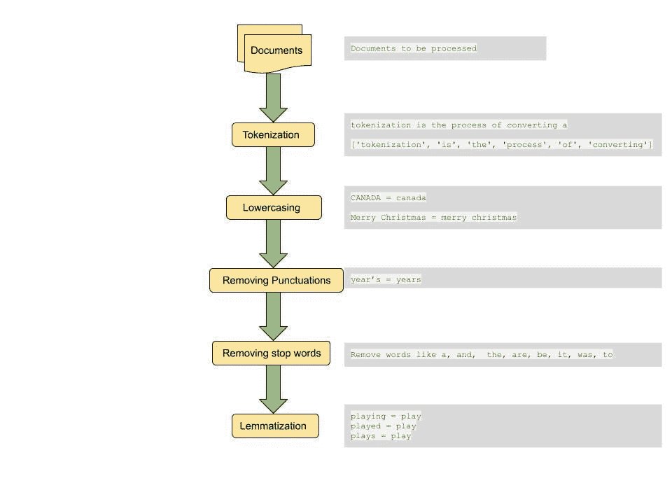
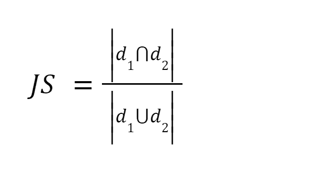
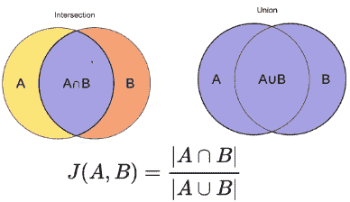
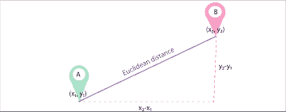
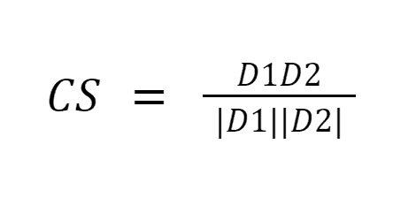

# 评估文档相似性计算方法

> 原文：[`www.kdnuggets.com/evaluating-methods-for-calculating-document-similarity`](https://www.kdnuggets.com/evaluating-methods-for-calculating-document-similarity)

图片来源：编辑

# 引言

* * *

## 我们的前三个课程推荐

 1\. [谷歌网络安全证书](https://www.kdnuggets.com/google-cybersecurity) - 快速进入网络安全职业生涯。

 2\. [谷歌数据分析专业证书](https://www.kdnuggets.com/google-data-analytics) - 提升你的数据分析技能

 3\. [谷歌 IT 支持专业证书](https://www.kdnuggets.com/google-itsupport) - 支持你的组织 IT 工作

* * *

数据科学是一个在过去一百年中由于计算机科学领域的进步而迅猛发展的领域。随着计算机和云存储成本的降低，我们现在可以以比几年前更低的成本存储大量数据。计算能力的增加使我们能够在大规模数据集上运行机器学习算法并提取洞察。网络技术的进步使我们可以以闪电般的速度生成和传输数据。由于这一切，我们生活在一个每秒都在生成大量数据的时代。我们有来自电子邮件、金融交易、社交媒体内容、互联网网页、企业客户数据、患者医疗记录、智能手表的健身数据、YouTube 上的视频内容、智能设备的遥测数据等各种形式的数据。这种结构化和非结构化数据的丰富使我们进入了一个叫做数据挖掘的领域。

**数据挖掘**是从大数据集中发现模式、异常和关联以预测结果的过程。虽然数据挖掘技术可以应用于任何形式的数据，但**文本挖掘**是数据挖掘的一个分支，它指的是从非结构化文本数据中寻找有意义的信息。在本文中，我将专注于文本挖掘中的一个常见任务——寻找文档相似性。

**文档相似性**有助于高效的信息检索。文档相似性的应用包括：检测抄袭、有效回答网络搜索查询、按主题聚类研究论文、查找类似的新闻文章、在问答网站如 Quora、StackOverflow、Reddit 中聚类类似问题，以及根据描述在亚马逊上对产品进行分组等。**文档相似性**也被 Dropbox 和 Google Drive 等公司用来避免存储相同文档的重复副本，从而节省处理时间和存储成本。

# 背景摘要

计算文档相似度有几个步骤。第一步是将文档表示为向量格式。然后可以在这些向量上使用成对相似度函数。相似度函数是计算一对向量之间相似度程度的函数。有多种成对相似度函数，如欧几里得距离、余弦相似度、Jaccard 相似度、Pearson 相关性、Spearman 相关性、Kendall's Tau 等[2]。成对相似度函数可以应用于两个文档、两个搜索查询，或一个文档和一个搜索查询之间。虽然成对相似度函数适用于比较较少数量的文档，但还有其他更先进的技术，如基于深度学习的 Doc2Vec 和 BERT，它们被像 Google 这样的搜索引擎用于高效的信息检索。在这篇论文中，我将重点讨论 Jaccard 相似度、欧几里得距离、余弦相似度、TF-IDF 加权的余弦相似度、Doc2Vec 和 BERT。

## 预处理

计算文档之间距离或相似度的常见步骤是对文档进行一些预处理。预处理步骤包括将所有文本转换为小写，标记化文本，移除停用词，移除标点符号和词形还原[4]。

**标记化：** 这一步涉及将句子拆分成更小的单元进行处理。一个标记是句子可以拆分成的最小词汇原子。可以使用空格作为分隔符将句子拆分成标记。这是一种标记化的方法。例如，一个句子“tokenization is a really cool step”被拆分为标记 ['tokenization', 'is', 'a', 'really', 'cool', 'step']。这些标记构成了文本挖掘的基础，并且是建模文本数据的第一步。

**转换为小写：** 虽然在某些特殊情况下可能需要保留大小写，但在大多数情况下我们希望将不同大小写的单词视为相同。这一步对于从大型数据集中获得一致的结果非常重要。例如，如果用户搜索“india”这个词，我们希望检索到包含不同大小写的相关文档，如“India”、“INDIA”和“india”，只要它们与搜索查询相关。

**移除标点符号：** 移除标点符号和空白有助于将搜索集中在重要的单词和标记上。

**移除停用词：** 停用词是一组在英语中常用的词，移除这些词可以帮助检索到更符合查询上下文的重要单词的文档。这也有助于减少特征向量的大小，从而有助于处理时间的缩短。

**词形还原**：词形还原通过将词映射到其根词来帮助减少稀疏性。例如，‘Plays’，‘Played’ 和 ‘Playing’ 都映射到 play。通过这样做，我们还减少了特征集的大小，并在不同文档之间匹配所有词汇变体，以提取最相关的文档。

# (A) Jaccard 相似度

这种方法是最简单的方法之一。它对单词进行分词，并计算共享术语的计数总和与两个文档中总术语数量之和的比值。如果两个文档相似，分数为 1；如果两个文档不同，分数为 0 [3]。

图片来源：O'Reilly

**总结**：该方法存在一些缺点。随着文档大小的增加，即使两个文档在语义上不同，共同词汇的数量也会增加。

# (B) 欧几里得距离

在对文档进行预处理之后，我们将文档转换为向量。向量的权重可以是术语频率，即我们计算术语在文档中出现的次数，也可以是相对术语频率，即我们计算术语的出现次数与文档中总术语数量的比率 [3]。

设 d1 和 d2 为两个表示为 n 个术语（表示 n 维）的文档向量；然后我们可以使用毕达哥拉斯定理计算两个文档之间的最短距离，从而找到两个向量之间的直线。距离越大，相似度越低；距离越小，相似度越高。

图片来源：Medium.com

**总结**：这种方法的主要缺点是，当文档大小不同的时候，即使两个文档在性质上相似，欧几里得距离也会给出较低的分数。较小的文档将导致向量的大小较小，而较大的文档将导致向量的大小较大，因为向量的大小与文档中的单词数量成正比，从而使整体距离变大。

# (C) 余弦相似度

余弦相似度通过测量两个向量之间的夹角余弦值来评估文档之间的相似性。余弦相似度的结果可以在 0 和 1 之间取值。如果向量指向相同的方向，相似度为 1；如果向量指向相反的方向，相似度为 0。[6]。

图片来源：Medium.com

**总结**：余弦相似度的优点在于它计算向量之间的方向而不是幅度。因此，即使文档大小不同，它也能捕捉到相似的文档之间的相似性。

上述三种方法的基本缺陷是测量未能通过语义查找相似文档。此外，这些技术只能逐对进行，从而需要更多的比较。

# (D) 使用 TF-IDF 的余弦相似度

这种文档相似性查找的方法在 ElasticSearch 的默认搜索实现中使用，并且自 1972 年以来一直存在[4]。tf-idf 代表词频-逆文档频率。我们首先使用以下公式计算词频：

最后，我们通过将 TF*IDF 相乘来计算 tf-idf。然后我们在向量上使用余弦相似度，以 tf-idf 作为向量的权重。

**总结**：将词频与逆文档频率相乘有助于抵消一些在文档中普遍出现的词，并专注于文档之间不同的词。这种技术通过将搜索集中在重要的关键词上，帮助找到匹配搜索查询的文档。

# (E) Doc2Vec

尽管从文档中提取单独的词（BOW - 词袋模型）转换为向量可能更容易实现，但它不会考虑句子中词语的顺序。Doc2Vec 是建立在 Word2Vec 之上的。Word2Vec 表示词的意义，而 Doc2Vec 表示文档或段落的意义[5]。

这种方法用于将文档转换为其向量表示，同时保留文档的语义意义。这种方法将变长文本（如句子、段落或文档）转换为向量[5]。然后训练 doc2vec 模型。模型的训练类似于训练其他机器学习模型，通过选择训练集和测试集文档并调整调优参数以实现更好的结果。

**总结**：这种向量化形式的文档保留了文档的语义意义，因为具有相似上下文或意义的段落在转换为向量时会更接近。

# (F) BERT

BERT 是 Google 开发的用于 NLP 任务的基于变换器的机器学习模型。

随着 BERT（双向编码器表示来自 Transformer）的出现，NLP 模型使用大量未标记的文本语料库进行训练，这些模型既从左到右也从右到左查看文本。BERT 使用一种称为“注意力”的技术来提高结果。谷歌的搜索排名在使用 BERT 后显著提高了[4]。BERT 的一些独特特性包括

+   预训练于 104 种语言的维基百科文章。

+   从左到右和从右到左查看文本

+   帮助理解上下文

**总结**：因此，BERT 可以针对许多应用进行微调，如问答系统、句子改写、垃圾邮件分类器、构建语言检测器，而无需对任务特定架构进行大量修改。

# 下一步或应用的想法

了解相似性函数在寻找文档相似度中的应用非常有意义。目前，开发者需要选择最适合场景的相似性函数。例如，tf-idf 目前是文档匹配的最先进技术，而 BERT 在查询搜索中是最先进的技术。建立一个自动检测最适合场景的相似性函数的工具将非常有用，从而选择优化了内存和处理时间的相似性函数。这在自动匹配简历与职位描述、按类别聚类文档、根据患者病历分类患者等场景中将大有裨益。

# 结论

在本文中，我介绍了一些计算文档相似度的显著算法。这并不是一个详尽无遗的列表。还有其他几种方法可以找到文档相似度，选择合适的方法取决于具体的场景和应用。像 tf-idf、Jaccard、欧几里得、余弦相似度等简单统计方法非常适合简单的用例。可以利用现有的 Python、R 库来计算相似度分数，而无需强大的机器或处理能力。更先进的算法如 BERT 依赖于预训练的神经网络，这可能需要数小时，但对于需要理解文档上下文的分析能产生有效的结果。

## 参考文献

[1] Heidarian, A., & Dinneen, M. J. (2016). 一种用于测量文档相似度和文档聚类的混合几何方法。*2016 IEEE 第二届国际大数据计算服务与应用会议（BigDataService）*，1–5\. [`doi.org/10.1109/bigdataservice.2016.14`](https://doi.org/10.1109/bigdataservice.2016.14)

[2] Kavitha Karun A, Philip, M., & Lubna, K. (2013). 文档聚类中相似性度量的比较分析。*2013 年国际绿色计算、通信与能源保护会议（ICGCE）*，1–4\. [`doi.org/10.1109/icgce.2013.6823554`](https://doi.org/10.1109/icgce.2013.6823554)

[3] Lin, Y.-S., Jiang, J.-Y., & Lee, S.-J. (2014). 一种用于文本分类和聚类的相似性度量. *IEEE 知识与数据工程汇刊*, *26*(7), 1575–1590\. [`doi.org/10.1109/tkde.2013.19`](https://doi.org/10.1109/tkde.2013.19)

[4] Nishimura, M. (2020 年 9 月 9 日). *2020 年最佳文档相似性算法：初学者指南 - Towards Data Science*. Medium. [`towardsdatascience.com/the-best-document-similarity-algorithm-in-2020-a-beginners-guide-a01b9ef8cf05`](https://towardsdatascience.com/the-best-document-similarity-algorithm-in-2020-a-beginners-guide-a01b9ef8cf05)

[5] Sharaki, O. (2020 年 7 月 10 日). *使用 Doc2vec 检测文档相似性 - Towards Data Science*. Medium. [`towardsdatascience.com/detecting-document-similarity-with-doc2vec-f8289a9a7db7`](https://towardsdatascience.com/detecting-document-similarity-with-doc2vec-f8289a9a7db7)

[6] Lüthe, M. (2019 年 11 月 18 日). *计算相似性 — 相关度指标概述 - Towards Data Science*. Medium. [`towardsdatascience.com/calculate-similarity-the-most-relevant-metrics-in-a-nutshell-9a43564f533e`](https://towardsdatascience.com/calculate-similarity-the-most-relevant-metrics-in-a-nutshell-9a43564f533e)

[7] S. (2019 年 10 月 27 日). *相似性度量 — 评分文本文章 - Towards Data Science*. Medium. [`towardsdatascience.com/similarity-measures-e3dbd4e58660`](https://towardsdatascience.com/similarity-measures-e3dbd4e58660)

****[普尔尼玛·穆图库马尔](https://www.linkedin.com/in/poornimamuthukumar/)**** 是微软的高级技术产品经理，拥有超过 10 年的经验，致力于为云计算、人工智能、分布式和大数据系统等多个领域开发和交付创新解决方案。我拥有华盛顿大学的数据科学硕士学位。在微软，我拥有四项专利，专注于 AI/ML 和大数据系统，并在 2016 年获得了全球黑客马拉松人工智能类别的奖项。今年 2023 年，我很荣幸成为 Grace Hopper 会议软件工程类别的审查小组成员。阅读和评估这些领域中有才华的女性的提交材料，对我来说是一次有价值的经历，这不仅推动了女性在科技领域的发展，也让我从她们的研究和见解中获益匪浅。我还是微软机器学习 AI 和数据科学（MLADS）2023 年 6 月会议的委员会成员。我同时也是全球女性数据科学社区和女性编码数据科学社区的大使。

### 更多相关话题

+   [超越准确性：使用 NLP 测试库评估和改进模型](https://www.kdnuggets.com/2023/04/john-snow-beyond-accuracy-nlp-test-library.html)

+   [机器学习的甜蜜点：NLP 和文档分析中的纯方法](https://www.kdnuggets.com/2022/05/machine-learning-sweet-spot-pure-approaches-nlp-document-analysis.html)

+   [让智能文档处理更智能：第一部分](https://www.kdnuggets.com/2023/02/making-intelligent-document-processing-smarter-part-1.html)

+   [k-means 聚类的质心初始化方法](https://www.kdnuggets.com/2020/06/centroid-initialization-k-means-clustering.html)

+   [机器学习中的替代特征选择方法](https://www.kdnuggets.com/2021/12/alternative-feature-selection-methods-machine-learning.html)

+   [Python 字符串方法](https://www.kdnuggets.com/2022/12/python-string-methods.html)
