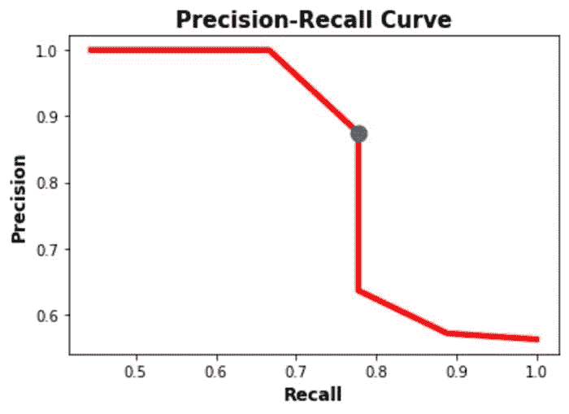
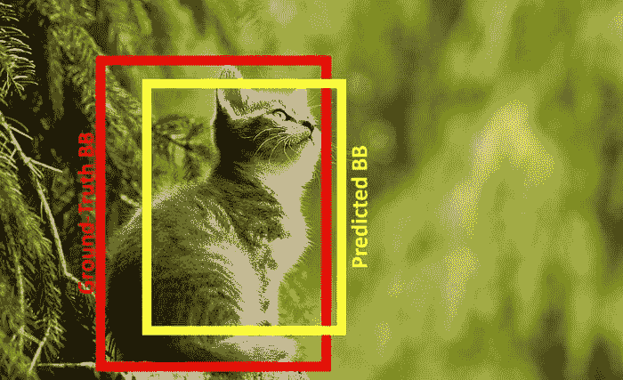
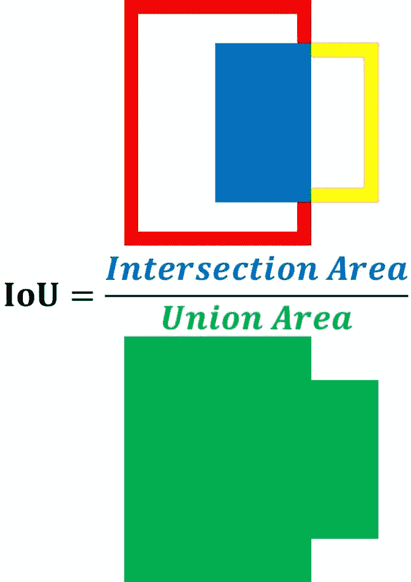
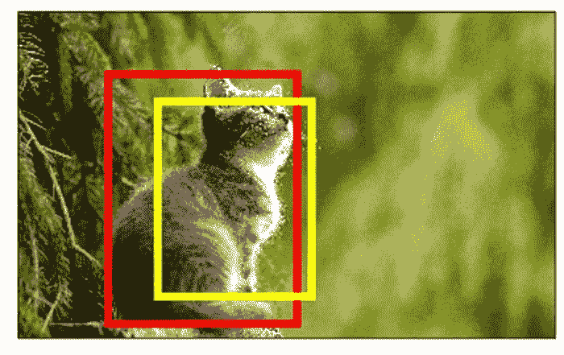
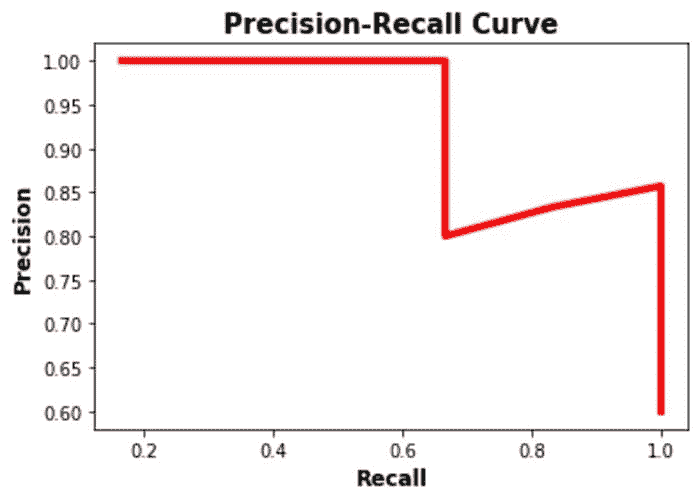
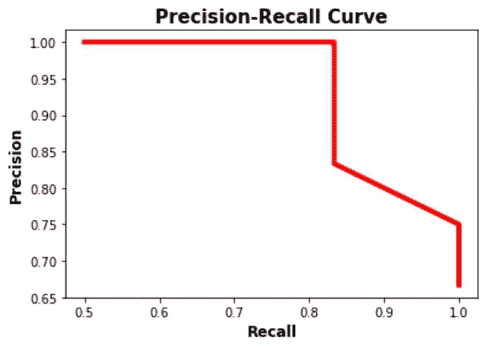
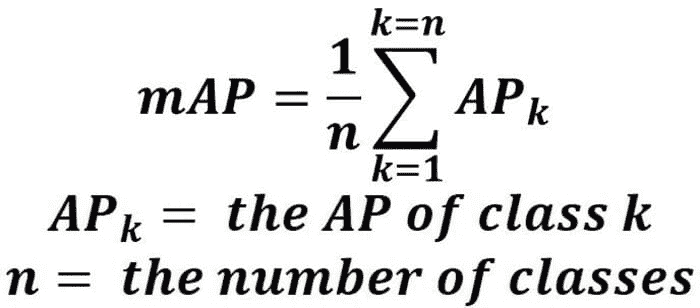

# 使用平均精度均值评估对象检测模型

> 原文：[`www.kdnuggets.com/2021/03/evaluating-object-detection-models-using-mean-average-precision.html`](https://www.kdnuggets.com/2021/03/evaluating-object-detection-models-using-mean-average-precision.html)

评论

为了评估像 R-CNN 和[YOLO](https://blog.paperspace.com/how-to-implement-a-yolo-object-detector-in-pytorch/)这样的对象检测模型，使用**平均精度均值（mAP）**。mAP 比较真实边界框和检测到的边界框，并返回一个分数。分数越高，模型的检测越准确。

在上一篇文章中，我们详细讨论了[混淆矩阵、模型准确性、精确度和召回率](https://blog.paperspace.com/deep-learning-metrics-precision-recall-accuracy)。我们还使用了 Scikit-learn 库来计算这些指标。现在我们将扩展讨论，看看精确度和召回率如何用于计算 mAP。

* * *

## 我们的前三大课程推荐

 1\. [谷歌网络安全证书](https://www.kdnuggets.com/google-cybersecurity) - 快速通道进入网络安全职业

 2\. [谷歌数据分析专业证书](https://www.kdnuggets.com/google-data-analytics) - 提升你的数据分析技能

 3\. [谷歌 IT 支持专业证书](https://www.kdnuggets.com/google-itsupport) - 支持你的组织 IT 工作

* * *

本教程涵盖的部分如下：

+   从预测分数到类别标签

+   精确度-召回率曲线

+   平均精度（AP）

+   交并比（IoU）

+   对象检测的平均精度均值（mAP）

让我们开始吧。

### **从预测分数到类别标签**

在本节中，我们将快速回顾如何从预测分数中推导出类别标签。

给定有两个类别，*正类* 和 *负类*，以下是 10 个样本的真实标签。

```py
y_true = ["positive", "negative", "negative", "positive", "positive", "positive", "negative", "positive", "negative", "positive"]
```

当这些样本输入模型时，它返回以下预测分数。根据这些分数，我们如何对样本进行分类（即为每个样本分配一个类别标签）？

```py
pred_scores = [0.7, 0.3, 0.5, 0.6, 0.55, 0.9, 0.4, 0.2, 0.4, 0.3]
```

为了将分数转换为类别标签，**使用一个阈值**。当分数等于或高于阈值时，样本被分类为一个类别。否则，它被分类为另一个类别。我们约定，如果样本的分数高于或等于阈值，则样本为*正类*。否则，为*负类*。下一个代码块将分数转换为类别标签，阈值为**0.5**。

```py
import numpy

pred_scores = [0.7, 0.3, 0.5, 0.6, 0.55, 0.9, 0.4, 0.2, 0.4, 0.3]
y_true = ["positive", "negative", "negative", "positive", "positive", "positive", "negative", "positive", "negative", "positive"]

threshold = 0.5
y_pred = ["positive" if score >= threshold else "negative" for score in pred_scores]
print(y_pred)
```

```py
['positive', 'negative', 'positive', 'positive', 'positive', 'positive', 'negative', 'negative', 'negative', 'negative']
```

现在真实标签和预测标签都可以在`y_true`和`y_pred`变量中找到。根据这些标签，可以计算[混淆矩阵、精确度和召回率](https://blog.paperspace.com/deep-learning-metrics-precision-recall-accuracy/)。

```py
r = numpy.flip(sklearn.metrics.confusion_matrix(y_true, y_pred))
print(r)

precision = sklearn.metrics.precision_score(y_true=y_true, y_pred=y_pred, pos_label="positive")
print(precision)

recall = sklearn.metrics.recall_score(y_true=y_true, y_pred=y_pred, pos_label="positive")
print(recall)
```

```py
# Confusion Matrix (From Left to Right & Top to Bottom: True Positive, False Negative, False Positive, True Negative)
[[4 2]
 [1 3]]

# Precision = 4/(4+1)
0.8

# Recall = 4/(4+2)
0.6666666666666666
```

在快速回顾了计算精度和召回后，在下一节我们将讨论如何创建精度-召回曲线。

### **精度-召回曲线**

从[第一部分](https://blog.paperspace.com/deep-learning-metrics-precision-recall-accuracy/)中给出的精度和召回的定义中记住，精度越高，模型在将样本分类为*正样本*时越自信。召回率越高，模型正确分类的正样本数量越多。

> 当模型具有高召回率但低精度时，模型可以正确分类大多数正样本，但也有许多假阳性（即将许多*负样本*分类为*正样本*）。当模型具有高精度但低召回率时，模型在将样本分类为*正样本*时准确，但可能仅分类了一部分正样本。

由于精度和召回率的重要性，有一个**精度-召回曲线**，显示了不同阈值下精度和召回值之间的权衡。此曲线有助于选择最佳阈值，以最大化这两个指标。

创建精度-召回曲线需要一些输入：

1.  真实标签。

1.  样本的预测分数。

1.  将预测分数转换为类别标签的阈值。

下一块代码创建了`y_true`列表以保存真实标签，`pred_scores`列表用于预测分数，最后`thresholds`列表用于不同的阈值。

```py
import numpy

y_true = ["positive", "negative", "negative", "positive", "positive", "positive", "negative", "positive", "negative", "positive", "positive", "positive", "positive", "negative", "negative", "negative"]

pred_scores = [0.7, 0.3, 0.5, 0.6, 0.55, 0.9, 0.4, 0.2, 0.4, 0.3, 0.7, 0.5, 0.8, 0.2, 0.3, 0.35]

thresholds = numpy.arange(start=0.2, stop=0.7, step=0.05)
```

这里是保存在`thresholds`列表中的阈值。由于有 10 个阈值，因此将创建 10 个精度和召回值。

```py
[0.2, 
 0.25, 
 0.3, 
 0.35, 
 0.4, 
 0.45, 
 0.5, 
 0.55, 
 0.6, 
 0.65]
```

下一步函数`precision_recall_curve()`接受真实标签、预测分数和阈值。它返回两个相等长度的列表，表示精度和召回值。

```py
import sklearn.metrics

def precision_recall_curve(y_true, pred_scores, thresholds):
    precisions = []
    recalls = []

    for threshold in thresholds:
        y_pred = ["positive" if score >= threshold else "negative" for score in pred_scores]

        precision = sklearn.metrics.precision_score(y_true=y_true, y_pred=y_pred, pos_label="positive")
        recall = sklearn.metrics.recall_score(y_true=y_true, y_pred=y_pred, pos_label="positive")

        precisions.append(precision)
        recalls.append(recall)

    return precisions, recalls
```

下一个代码在传递了三个之前准备好的列表后调用`precision_recall_curve()`函数。它返回`precisions`和`recalls`列表，分别保存了所有精度和召回值。

```py
precisions, recalls = precision_recall_curve(y_true=y_true, 
                                             pred_scores=pred_scores,
                                             thresholds=thresholds)
```

这里是`precisions`列表中返回的值。

```py
[0.5625,
 0.5714285714285714,
 0.5714285714285714,
 0.6363636363636364,
 0.7,
 0.875,
 0.875,
 1.0,
 1.0,
 1.0]
```

这里是`recalls`列表中的值列表。

```py
[1.0,
 0.8888888888888888,
 0.8888888888888888,
 0.7777777777777778,
 0.7777777777777778,
 0.7777777777777778,
 0.7777777777777778,
 0.6666666666666666,
 0.5555555555555556,
 0.4444444444444444]
```

给定两个相等长度的列表，可以在下图所示的二维图中绘制它们的值。

```py
matplotlib.pyplot.plot(recalls, precisions, linewidth=4, color="red")
matplotlib.pyplot.xlabel("Recall", fontsize=12, fontweight='bold')
matplotlib.pyplot.ylabel("Precision", fontsize=12, fontweight='bold')
matplotlib.pyplot.title("Precision-Recall Curve", fontsize=15, fontweight="bold")
matplotlib.pyplot.show()
```

精度-召回曲线在下图中显示。请注意，随着召回率的增加，精度会下降。原因是，当正样本数量增加（高召回率）时，每个样本正确分类的准确性下降（低精度）。这是可以预期的，因为当样本数量较多时，模型更容易出现失败。


精度-召回曲线使决定精度和召回率都高的点变得容易。根据之前的图表，最佳点是`(recall, precision)=(0.778, 0.875)`。

在之前的图中，图形化决定精准率和召回率的最佳值可能是有效的，因为曲线不复杂。更好的方法是使用一种称为`f1`的指标，该指标根据下列公式计算。


`f1`指标衡量精准率和召回率之间的平衡。当`f1`值较高时，意味着精准率和召回率都较高。较低的`f1`分数表示精准率和召回率之间的不平衡较大。

根据前面的示例，`f1`的计算方法如下代码所示。根据`f1`列表中的值，最高分数是`0.82352941`。它是列表中的第 6 个元素（即索引 5）。`recalls`和`precisions`列表中的第 6 个元素分别是`0.778`和`0.875`。相应的阈值是`0.45`。

```py
f1 = 2 * ((numpy.array(precisions) * numpy.array(recalls)) / (numpy.array(precisions) + numpy.array(recalls)))
```

```py
[0.72, 
 0.69565217, 
 0.69565217, 
 0.7,
 0.73684211,
 0.82352941, 
 0.82352941, 
 0.8, 
 0.71428571, 0
 .61538462]
```

下一图中以蓝色显示了最佳平衡点的位置，该点对应于召回率和精准率之间的最佳平衡。总之，平衡精准率和召回率的最佳阈值是`0.45`，在此阈值下，精准率为`0.875`，召回率为`0.778`。

```py
matplotlib.pyplot.plot(recalls, precisions, linewidth=4, color="red", zorder=0)
matplotlib.pyplot.scatter(recalls[5], precisions[5], zorder=1, linewidth=6)

matplotlib.pyplot.xlabel("Recall", fontsize=12, fontweight='bold')
matplotlib.pyplot.ylabel("Precision", fontsize=12, fontweight='bold')
matplotlib.pyplot.title("Precision-Recall Curve", fontsize=15, fontweight="bold")
matplotlib.pyplot.show()
```



讨论了精准率-召回率曲线后，下一部分讨论如何计算**平均精准率**。

### **平均精准率 (AP)**

**平均精准率 (AP)**是一种将精准率-召回率曲线汇总为一个值的方式，该值表示所有精准率的平均值。AP 根据下列公式计算。通过循环遍历所有的精准率/召回率，计算当前和下一召回率之间的差异，然后乘以当前的精准率。换句话说，AP 是每个阈值下精准率的加权总和，其中权重是召回率的增加。


重要的是将`recalls`和`precisions`列表分别用 0 和 1 进行扩展。例如，如果`recalls`列表为 0.8,0.60.8,0.6，则应添加 0，使其变为 0.8,0.6,0.00.8,0.6,0.0。`precisions`列表也要这样做，但应添加 1 而不是 0（例如 0.8,0.2,1.00.8,0.2,1.0）。

由于`recalls`和`precisions`都是 NumPy 数组，前面的公式可以通过以下 Python 代码建模。

```py
AP = numpy.sum((recalls[:-1] - recalls[1:]) * precisions[:-1])
```

这是计算 AP 的完整代码。

```py
import numpy
import sklearn.metrics

def precision_recall_curve(y_true, pred_scores, thresholds):
    precisions = []
    recalls = []

    for threshold in thresholds:
        y_pred = ["positive" if score >= threshold else "negative" for score in pred_scores]

        precision = sklearn.metrics.precision_score(y_true=y_true, y_pred=y_pred, pos_label="positive")
        recall = sklearn.metrics.recall_score(y_true=y_true, y_pred=y_pred, pos_label="positive")

        precisions.append(precision)
        recalls.append(recall)

    return precisions, recalls

y_true = ["positive", "negative", "negative", "positive", "positive", "positive", "negative", "positive", "negative", "positive", "positive", "positive", "positive", "negative", "negative", "negative"]
pred_scores = [0.7, 0.3, 0.5, 0.6, 0.55, 0.9, 0.4, 0.2, 0.4, 0.3, 0.7, 0.5, 0.8, 0.2, 0.3, 0.35]
thresholds=numpy.arange(start=0.2, stop=0.7, step=0.05)

precisions, recalls = precision_recall_curve(y_true=y_true, 
                                             pred_scores=pred_scores, 
                                             thresholds=thresholds)

precisions.append(1)
recalls.append(0)

precisions = numpy.array(precisions)
recalls = numpy.array(recalls)

AP = numpy.sum((recalls[:-1] - recalls[1:]) * precisions[:-1])
print(AP)
```

这就是关于平均精准率的所有内容。以下是计算 AP 的步骤总结：

1.  使用模型生成**预测分数**。

1.  将**预测分数**转换为**类别标签**。

1.  计算**混淆矩阵**。

1.  计算**精准率**和**召回率**指标。

1.  创建**精准率-召回率曲线**。

1.  测量**平均精准率**。

下一部分讨论**交并比 (IoU)**，这是对象检测如何生成预测分数的方式。

### **交并比 (IoU)**

训练对象检测模型通常有两个输入：

1.  一张图片。

1.  图像中每个物体的实际边界框。

模型预测了检测到的物体的边界框。预计预测框不会完全匹配实际框。下图展示了一张猫的图像。物体的实际框为红色，而预测框为黄色。根据这两个框的可视化，模型是否做出了一个高匹配分数的良好预测？

主观评估模型预测是困难的。例如，有人可能认为匹配度为 50%，而其他人则认为匹配度为 60%。



[Image](https://pixabay.com/photos/cat-young-animal-curious-wildcat-2083492) 来自 [Pixabay](https://pixabay.com/photos/cat-young-animal-curious-wildcat-2083492) ，由 [susannp4](https://pixabay.com/users/susannp4-1777190) 提供

更好的替代方法是使用定量度量来评分实际框和预测框的匹配程度。这一度量是**交并比 (IoU)**。IoU 有助于判断一个区域是否包含物体。

IoU 是通过将两个框之间的交集面积除以它们的并集面积来计算的。IoU 越高，预测越好。



下图展示了三个具有不同 IoU 的情况。请注意，每个案例顶部的 IoU 是客观测量的，可能与实际情况略有不同，但还是有意义的。

对于案例 A，黄色预测框与红色实际框相距较远，因此 IoU 分数为**0.2**（即两个框之间只有 20%的重叠）。

对于案例 B，两个框之间的交集面积较大，但两个框仍未对齐，因此 IoU 分数为**0.5**。

对于案例 C，两个框的坐标非常接近，因此它们的 IoU 为**0.9**（即两个框之间有 90%的重叠）。

请注意，当预测框和实际框之间重叠度为 0%时，IoU 为 0.0。当两个框完全重合时，IoU 为**1.0**。


要计算图像的 IoU，这里有一个名为`intersection_over_union()`的函数。它接受以下两个参数：

1.  `gt_box`：实际边界框。

1.  `pred_box`：预测边界框。

它计算了`intersection`和`union`变量中两个框之间的交集和并集。此外，IoU 在`iou`变量中计算。它返回这三个变量。

```py
def intersection_over_union(gt_box, pred_box):
    inter_box_top_left = [max(gt_box[0], pred_box[0]), max(gt_box[1], pred_box[1])]
    inter_box_bottom_right = [min(gt_box[0]+gt_box[2], pred_box[0]+pred_box[2]), min(gt_box[1]+gt_box[3], pred_box[1]+pred_box[3])]

    inter_box_w = inter_box_bottom_right[0] - inter_box_top_left[0]
    inter_box_h = inter_box_bottom_right[1] - inter_box_top_left[1]

    intersection = inter_box_w * inter_box_h
    union = gt_box[2] * gt_box[3] + pred_box[2] * pred_box[3] - intersection

    iou = intersection / union

    return iou, intersection, union
```

传递给函数的边界框是一个包含 4 个元素的列表，其中包括：

1.  左上角的 x 轴。

1.  左上角的 y 轴。

1.  宽度。

1.  高度。

这里是汽车图像的实际和预测边界框。

```py
gt_box = [320, 220, 680, 900]
pred_box = [500, 320, 550, 700]
```

给定图像名为`cat.jpg`，这是绘制边界框的完整代码。

```py
import imageio
import matplotlib.pyplot
import matplotlib.patches

def intersection_over_union(gt_box, pred_box):
    inter_box_top_left = [max(gt_box[0], pred_box[0]), max(gt_box[1], pred_box[1])]
    inter_box_bottom_right = [min(gt_box[0]+gt_box[2], pred_box[0]+pred_box[2]), min(gt_box[1]+gt_box[3], pred_box[1]+pred_box[3])]

    inter_box_w = inter_box_bottom_right[0] - inter_box_top_left[0]
    inter_box_h = inter_box_bottom_right[1] - inter_box_top_left[1]

    intersection = inter_box_w * inter_box_h
    union = gt_box[2] * gt_box[3] + pred_box[2] * pred_box[3] - intersection

    iou = intersection / union

    return iou, intersection, union

im = imageio.imread("cat.jpg")

gt_box = [320, 220, 680, 900]
pred_box = [500, 320, 550, 700]

fig, ax = matplotlib.pyplot.subplots(1)
ax.imshow(im)

gt_rect = matplotlib.patches.Rectangle((gt_box[0], gt_box[1]),
                                       gt_box[2],
                                       gt_box[3],
                                       linewidth=5,
                                       edgecolor='r',
                                       facecolor='none')

pred_rect = matplotlib.patches.Rectangle((pred_box[0], pred_box[1]),
                                         pred_box[2],
                                         pred_box[3],
                                         linewidth=5,
                                         edgecolor=(1, 1, 0),
                                         facecolor='none')
ax.add_patch(gt_rect)
ax.add_patch(pred_rect)

ax.axes.get_xaxis().set_ticks([])
ax.axes.get_yaxis().set_ticks([])
```

下一个图示显示了带有边界框的图像。



要计算 IoU，只需调用`intersection_over_union()`函数。根据边界框，IoU 分数为`0.54`。

```py
iou, intersect, union = intersection_over_union(gt_box, pred_box)
print(iou, intersect, union)
```

```py
0.5409582689335394 350000 647000
```

IoU 分数**0.54**意味着真实框与预测框之间有 54%的重叠。观察这些框，有人可能会直观地觉得模型检测到猫物体已经足够好。也有人可能觉得模型还不够准确，因为预测框与真实框的契合度不高。

为了客观判断模型是否正确预测了框的位置，使用了一个**阈值**。如果模型预测的框的 IoU 分数大于或等于**阈值**，则预测框与真实框之一之间有很高的重叠。这意味着模型能够成功检测到物体。检测到的区域被分类为**Positive**（即包含物体）。

另一方面，当 IoU 分数小于阈值时，模型做出了错误的预测，因为预测框与真实框没有重叠。这意味着检测到的区域被分类为**Negative**（即不包含物体）。


让我们通过一个例子来澄清 IoU 分数如何帮助将区域分类为物体或非物体。假设物体检测模型输入了下一张图像，其中有 2 个目标物体，真实框用红色标出，预测框用黄色标出。

下一段代码读取图像（假设文件名为`pets.jpg`），绘制框，并计算每个物体的 IoU。左侧物体的 IoU 为**0.76**，而另一个物体的 IoU 分数为**0.26**。

```py
import matplotlib.pyplot
import matplotlib.patches
import imageio

def intersection_over_union(gt_box, pred_box):
    inter_box_top_left = [max(gt_box[0], pred_box[0]), max(gt_box[1], pred_box[1])]
    inter_box_bottom_right = [min(gt_box[0]+gt_box[2], pred_box[0]+pred_box[2]), min(gt_box[1]+gt_box[3], pred_box[1]+pred_box[3])]

    inter_box_w = inter_box_bottom_right[0] - inter_box_top_left[0]
    inter_box_h = inter_box_bottom_right[1] - inter_box_top_left[1]

    intersection = inter_box_w * inter_box_h
    union = gt_box[2] * gt_box[3] + pred_box[2] * pred_box[3] - intersection

    iou = intersection / union

    return iou, intersection, union, 

im = imageio.imread("pets.jpg")

gt_box = [10, 130, 370, 350]
pred_box = [30, 100, 370, 350]

iou, intersect, union = intersection_over_union(gt_box, pred_box)
print(iou, intersect, union)

fig, ax = matplotlib.pyplot.subplots(1)
ax.imshow(im)

gt_rect = matplotlib.patches.Rectangle((gt_box[0], gt_box[1]),
                                       gt_box[2],
                                       gt_box[3],
                                       linewidth=5,
                                       edgecolor='r',
                                       facecolor='none')

pred_rect = matplotlib.patches.Rectangle((pred_box[0], pred_box[1]),
                                         pred_box[2],
                                         pred_box[3],
                                         linewidth=5,
                                         edgecolor=(1, 1, 0),
                                         facecolor='none')
ax.add_patch(gt_rect)
ax.add_patch(pred_rect)

gt_box = [645, 130, 310, 320]
pred_box = [500, 60, 310, 320]

iou, intersect, union = intersection_over_union(gt_box, pred_box)
print(iou, intersect, union)

gt_rect = matplotlib.patches.Rectangle((gt_box[0], gt_box[1]),
                                       gt_box[2],
                                       gt_box[3],
                                       linewidth=5,
                                       edgecolor='r',
                                       facecolor='none')

pred_rect = matplotlib.patches.Rectangle((pred_box[0], pred_box[1]),
                                         pred_box[2],
                                         pred_box[3],
                                         linewidth=5,
                                         edgecolor=(1, 1, 0),
                                         facecolor='none')
ax.add_patch(gt_rect)
ax.add_patch(pred_rect)

ax.axes.get_xaxis().set_ticks([])
ax.axes.get_yaxis().set_ticks([])
```

如果 IoU 阈值为 0.6，则只有 IoU 分数大于或等于 0.6 的区域被分类为**Positive**（即有物体）。因此，IoU 分数为 0.76 的框为 Positive，而 IoU 为 0.26 的另一个框为**Negative**。


无标签的图像来自[hindustantimes.com](https://www.hindustantimes.com/rf/image_size_960x540/HT/p2/2019/05/25/Pictures/_b336a8c4-7e7b-11e9-8a88-8b84fe2ad6da.png)

如果阈值改为**0.2**而不是 0.6，则两个预测都是**Positive**。如果阈值为**0.8**，则两个预测都是**Negative**。

总结来说，IoU 分数衡量的是预测框与真实框的接近程度。它的范围从 0.0 到 1.0，其中 1.0 是最佳结果。当 IoU 大于阈值时，框被分类为**Positive**，因为它包围了一个物体。否则，分类为**Negative**。

下一节展示了如何利用 IoU 来计算物体检测模型的平均精度均值（mAP）。

### **物体检测的平均精度均值（mAP）**

通常，目标检测模型会使用不同的 IoU 阈值进行评估，其中每个阈值可能会给出不同的预测。假设模型输入了一张包含 10 个物体、分布在 2 个类别中的图像。如何计算 mAP？

要计算 mAP，首先需要计算每个类别的 AP。所有类别的 AP 的均值即为 mAP。

假设使用的数据集只有 2 个类别。对于第一类，以下是`y_true`和`pred_scores`变量中的真实标签和预测分数。

```py
y_true = ["positive", "negative", "positive", "negative", "positive", "positive", "positive", "negative", "positive", "negative"]

pred_scores = [0.7, 0.3, 0.5, 0.6, 0.55, 0.9, 0.75, 0.2, 0.8, 0.3]
```

以下是第二类的`y_true`和`pred_scores`变量。

```py
y_true = ["negative", "positive", "positive", "negative", "negative", "positive", "positive", "positive", "negative", "positive"]

pred_scores = [0.32, 0.9, 0.5, 0.1, 0.25, 0.9, 0.55, 0.3, 0.35, 0.85]
```

IoU 阈值列表从 0.2 到 0.9，步长为 0.25。

```py
thresholds = numpy.arange(start=0.2, stop=0.9, step=0.05)
```

要计算一个类别的 AP，只需将其`y_true`和`pred_scores`变量输入到下列代码中。

```py
precisions, recalls = precision_recall_curve(y_true=y_true, 
                                             pred_scores=pred_scores, 
                                             thresholds=thresholds)

matplotlib.pyplot.plot(recalls, precisions, linewidth=4, color="red", zorder=0)

matplotlib.pyplot.xlabel("Recall", fontsize=12, fontweight='bold')
matplotlib.pyplot.ylabel("Precision", fontsize=12, fontweight='bold')
matplotlib.pyplot.title("Precision-Recall Curve", fontsize=15, fontweight="bold")
matplotlib.pyplot.show()

precisions.append(1)
recalls.append(0)

precisions = numpy.array(precisions)
recalls = numpy.array(recalls)

AP = numpy.sum((recalls[:-1] - recalls[1:]) * precisions[:-1])
print(AP)
```

对于第一类，这里是其精确率-召回率曲线。根据这条曲线，AP 为`0.949`。



第二类的精确率-召回率曲线如下所示。它的 AP 为`0.958`。



根据这两个类别的 AP（0.949 和 0.958），目标检测模型的 mAP 按照下列公式计算。



根据这个公式，mAP 为`0.9535`。

```py
mAP = (0.949 + 0.958)/2 = 0.9535
```

### **结论**

本教程讨论了如何为目标检测模型计算均值平均精度（mAP）。我们首先讨论了如何将预测分数转换为类别标签。通过使用不同的阈值，创建了一个精确率-召回率曲线。从这条曲线中，测量出平均精度（AP）。

对于目标检测模型，阈值是检测物体的交并比（IoU）。一旦计算出数据集中每个类别的 AP，即可计算 mAP。

**个人简介：[Ahmed Gad](https://www.linkedin.com/in/ahmedfgad/)** 于 2015 年 7 月获得埃及梅努非亚大学计算机与信息学院（FCI）信息技术学士学位，并荣获优秀学位。因在学院排名第一，他于 2015 年被推荐到埃及的一个学院担任教学助理，随后在 2016 年转为学院的教学助理及研究员。他目前的研究兴趣包括深度学习、机器学习、人工智能、数字信号处理和计算机视觉。

[原文](https://blog.paperspace.com/mean-average-precision/)。经授权转载。

**相关内容：**

+   评估深度学习模型：混淆矩阵、准确率、精确率和召回率

+   在 Keras 中使用 Lambda 层

+   如何在深度学习中创建自定义实时图

### 更多相关内容

+   [《傻瓜指南：精确率、召回率与混淆矩阵》](https://www.kdnuggets.com/2020/01/guide-precision-recall-confusion-matrix.html)

+   [分类指标讲解：逻辑回归与…](https://www.kdnuggets.com/2022/10/classification-metrics-walkthrough-logistic-regression-accuracy-precision-recall-roc.html)

+   [混淆矩阵、精确率和召回率解释](https://www.kdnuggets.com/2022/11/confusion-matrix-precision-recall-explained.html)

+   [KDnuggets 新闻，11 月 16 日：LinkedIn 如何使用机器学习 •…](https://www.kdnuggets.com/2022/n45.html)

+   [KDnuggets™新闻 22:n09，3 月 2 日：讲述一个精彩的数据故事：A…](https://www.kdnuggets.com/2022/n09.html)

+   [SQL 与对象关系映射（ORM）的区别是什么？](https://www.kdnuggets.com/2022/02/difference-sql-object-relational-mapping-orm.html)
