# 你想知道的所有机器学习知识

> 原文：[`www.kdnuggets.com/2022/09/everything-youve-ever-wanted-to-know-about-machine-learning.html`](https://www.kdnuggets.com/2022/09/everything-youve-ever-wanted-to-know-about-machine-learning.html)

## 在基础知识中增加趣味！一系列短视频，旨在让初学者和专家都能享受

* * *

## 我们的三大课程推荐

 1. [Google 网络安全证书](https://www.kdnuggets.com/google-cybersecurity) - 快速进入网络安全职业生涯。

 2. [Google 数据分析专业证书](https://www.kdnuggets.com/google-data-analytics) - 提升你的数据分析技能

 3. [Google IT 支持专业证书](https://www.kdnuggets.com/google-itsupport) - 支持你的组织的 IT

* * *

寻找一门有趣且幽默的 AI 入门课程？看看《与机器学习交朋友》（MFML），这是一个受人喜爱的免费 YouTube 课程，旨在满足每个人的需求。是的，[***每个人***](http://bit.ly/quaesita_smfml1)。如果你在读这篇文章，这门课程就是为你准备的！

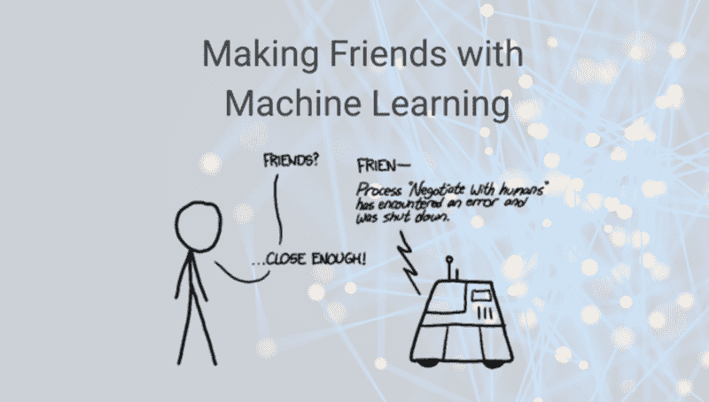

图片由 Randall Munroe 提供，[xkcd.com](https://what-if.xkcd.com/5/) [CC](https://xkcd.com/license.html)。

# 课程预告

**短视频：** 下面的大多数视频长度为 1–5 分钟，这意味着你可以在小块、好，味道鲜美的知识中升级自己的知识！从一开始就深入学习，或者滚动找到你想了解的主题。

**长视频：** 对于那些喜欢在 1–2 小时的长时间学习中学习的人，课程也以 4 个较长的部分提供[这里](https://bit.ly/mfml_long)。

# 基本概念

+   基础知识：[MFML 000 — 欢迎](http://bit.ly/mfml_000)

+   基础知识：[MFML 001 — 什么是机器学习？](http://bit.ly/mfml_001)

+   基础知识：[MFML 002 — 为什么使用机器学习？](http://bit.ly/mfml_002)

+   基础知识：[MFML 003 — 机器学习是如何工作的？](http://bit.ly/mfml_003)

+   基础知识：[MFML 004 — 如何测试机器学习](http://bit.ly/mfml_004)

+   基础知识：[MFML 005 — 黑箱中有什么？](http://bit.ly/mfml_005)

+   基础知识：[MFML 006 — 简单线性回归](http://bit.ly/mfml_006)

+   基础知识：[MFML 007 — 多元线性回归](http://bit.ly/mfml_007)

+   基础知识：[MFML 008 — 特征工程](http://bit.ly/mfml_008)

+   基础知识：[MFML 009 — 什么是 AI？](http://bit.ly/mfml_009)

+   基础知识：[MFML 010 — 为什么我们等了这么久才有 AI？](http://bit.ly/mfml_010)

+   基础知识：[MFML 011 — 算法、数据和计算](http://bit.ly/mfml_011)

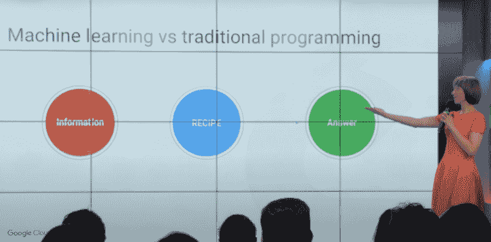

# 实践中

+   实践中：[MFML 012 — 实际应用](http://bit.ly/mfml_012)

+   实践中：[ MFML 013 — 如何找到好的 AI 用例](http://bit.ly/mfml_013)

+   实践中：[ MFML 014 — AI 中的人类创造力](http://bit.ly/mfml_014)

+   实践中：[ MFML 015 — GANs 如何工作？](http://bit.ly/mfml_015)

+   实践中：[ MFML 016 — 为什么信任 AI？](http://bit.ly/mfml_016)

+   实践中：[ MFML 017 — 可解释性与 AI](http://bit.ly/mfml_017)

+   实践中：[ MFML 018 — 训练、验证和测试简介](http://bit.ly/mfml_018)

+   实践中：[ MFML 019 — 如何避免机器学习陷阱](http://bit.ly/mfml_019)

+   实践中：[ MFML 020 — 决策智能](http://bit.ly/mfml_020)

+   实践中：[ MFML 021 — 为什么企业在机器学习中失败？](http://bit.ly/mfml_021)

+   实践中：[ MFML 022 — 熟练的决策者](http://bit.ly/mfml_022)

+   实践中：[ MFML 023 — 可靠还是不可靠？](http://bit.ly/mfml_023)

+   实践中：[ MFML 024 — 可预防的灾难](http://bit.ly/mfml_024)

+   实践中：[ MFML 025 — 负责任地许愿](http://bit.ly/mfml_025)

+   实践中：[ MFML 026 — AI 是一项团队运动！](http://bit.ly/mfml_026)

+   实践中：[ MFML 027 — 我们的 AI 未来](http://bit.ly/mfml_027)

# AI 的 12 个步骤

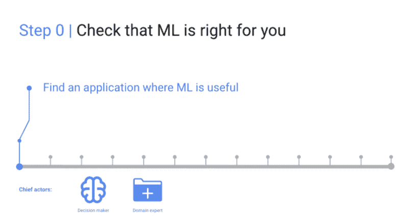

+   第 0 步：[ MFML 028 — AI 的 12 个步骤](http://bit.ly/mfml_028)

+   第 0 步：[ MFML 029 — 从哪里开始应用 AI？](http://bit.ly/mfml_029)

+   第 0 步：[ MFML 030 — 分类与回归](http://bit.ly/mfml_030)

+   第 0 步：[ MFML 031 — 实例、特征和目标](http://bit.ly/mfml_031)

+   第 0 步：[ MFML 032 — 监督学习](http://bit.ly/mfml_032)

+   第 0 步：[ MFML 033 — 无监督学习](http://bit.ly/mfml_033)

+   第 0 步：[ MFML 034 — 半监督学习](http://bit.ly/mfml_034)

+   第 0 步：[ MFML 035 — 强化学习](http://bit.ly/mfml_035)

+   第 0 步：[ MFML 036 — 数据科学究竟是什么？](http://bit.ly/mfml_036)

+   第 0 步：[ MFML 037 — 数据科学流程图](http://bit.ly/mfml_037)

+   第 0 步：[ MFML 038 — 不要忘记数据！](http://bit.ly/mfml_038)

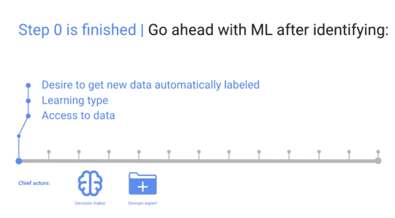

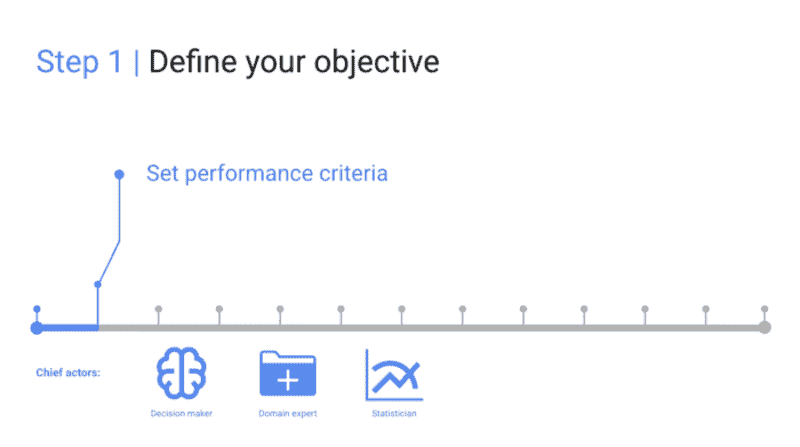

+   第 1 步：[ MFML 039 — AI 的“良好行为”是什么？](http://bit.ly/mfml_039)

+   第 1 步：[ MFML 040 — 假阳性和真阴性](http://bit.ly/mfml_040)

+   第 1 步：[ MFML 041 — 混淆矩阵](http://bit.ly/mfml_041)

+   第 1 步：[ MFML 042 — 性能指标](http://bit.ly/mfml_042)

+   第 1 步：[ MFML 043 — 真实情况](http://bit.ly/mfml_043)

+   第 1 步：[ MFML 044 — 精确度与召回率](http://bit.ly/mfml_044)

+   第 1 步：[ MFML 045 — 什么是优化？](http://bit.ly/mfml_045)

+   第 1 步：[ MFML 046 — 损失函数](http://bit.ly/mfml_046)

+   第 1 步：[ MFML 047 — 设置启动标准](http://bit.ly/mfml_047)

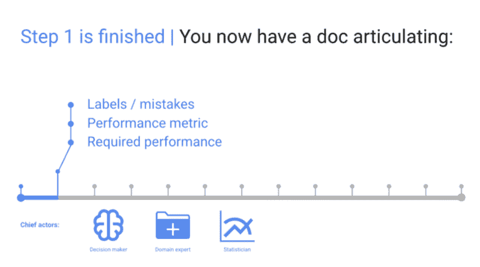

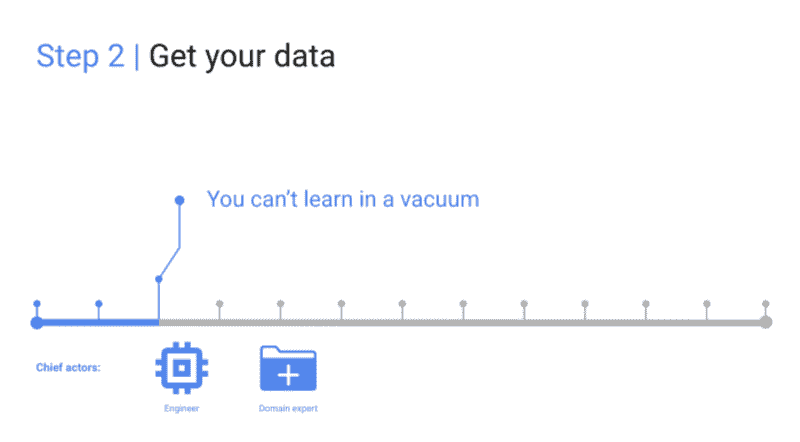

+   第 2 步：[ MFML 048 — 数据工程](http://bit.ly/mfml_048)

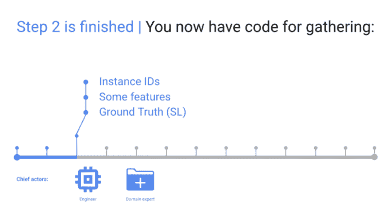

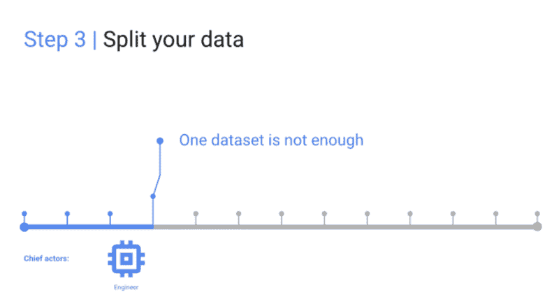

+   第 3 步：[ MFML 049 — 过拟合的危险](http://bit.ly/mfml_049)

+   第 3 步：[ MFML 050 — 你需要关注欠拟合吗？](http://bit.ly/mfml_050)

+   第 3 步：[ MFML 051 — 数据拆分的重要性](http://bit.ly/mfml_051)

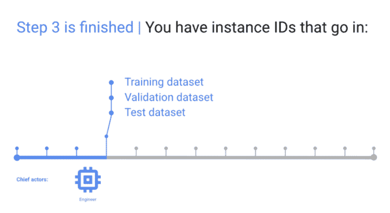

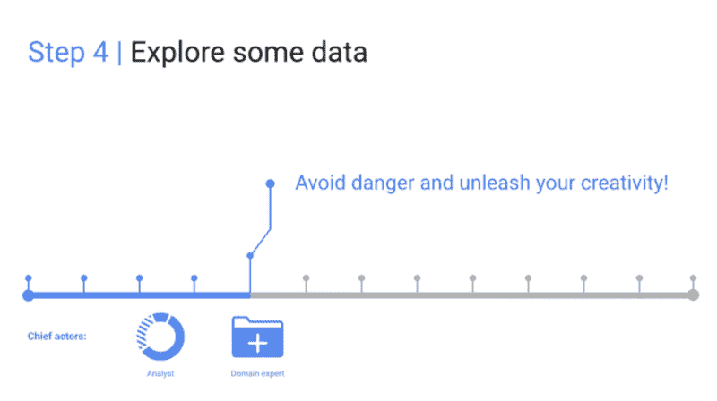

+   第 4 步：[ MFML 052 — 探索性数据分析 (EDA)](http://bit.ly/mfml_052)

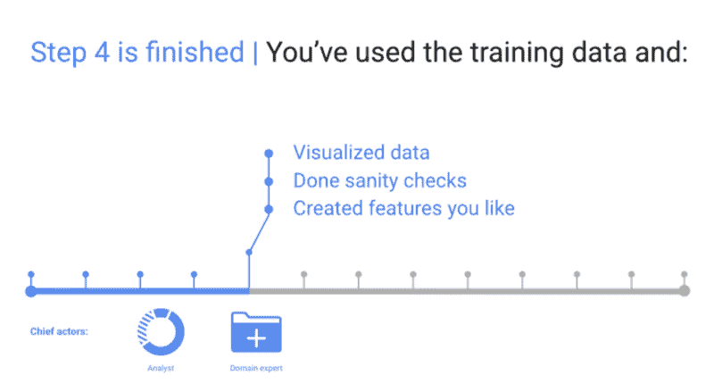

+   第 5 步：[ MFML 053 — 如何选择 AI 算法](http://bit.ly/mfml_053)

+   第 5 步：[ MFML 第四部分 — AI 算法指南](http://bit.ly/mfml_part4)（不适合快速阅读！快速阅读版在本页的最后部分。）

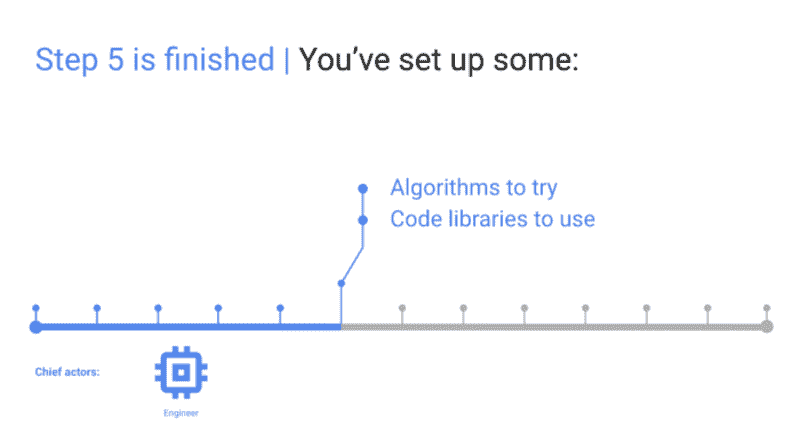

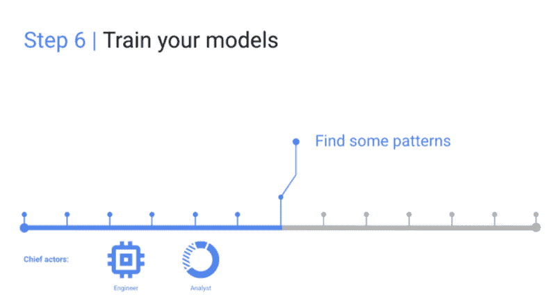

+   第 6 步：[ MFML 054 — 训练 AI 系统容易吗？](http://bit.ly/mfml_054)

+   第 6 步：[ MFML 055 — 数据集的理想形状](http://bit.ly/mfml_055)

+   第 6 步：[ MFML 056 — 如何加速你的 ML/AI 训练阶段](http://bit.ly/mfml_056)

+   第 6 步：[ MFML 057 — 统计学与“统计学”](http://bit.ly/mfml_057)

+   第 6 步：[ MFML 058 — 当你的机器学习项目耗时极长](http://bit.ly/mfml_058)

+   第 6 步：[ MFML 059 — 正则化](http://bit.ly/mfml_059)

+   第 6 步：[ MFML 060 — 你绝对不应该在 AI 中使用的特征](http://bit.ly/mfml_060)

+   第 6 步：[ MFML 061 — 你可以跳过 AI 训练阶段吗？](http://bit.ly/mfml_061)

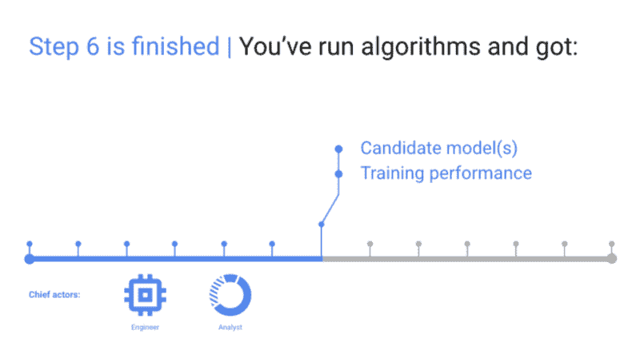

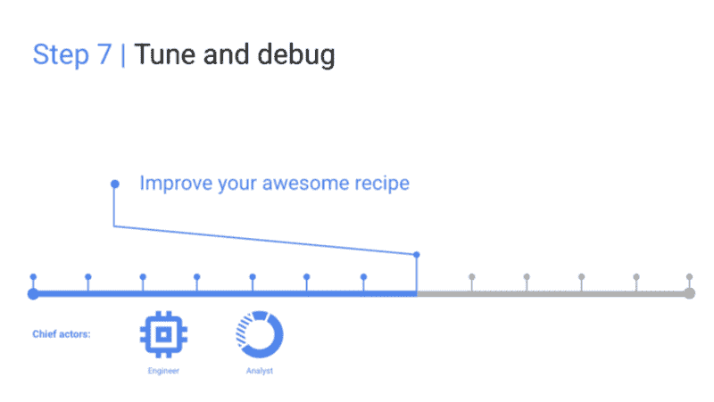

+   第 7 步：[ MFML 062 — 调试你的机器学习模型](http://bit.ly/mfml_062)

+   第 7 步：[ MFML 063 — 超参数调优](http://bit.ly/mfml_063)

+   第 7 步：[ MFML 064 — 什么是保留集，你如何使用它？](http://bit.ly/mfml_064)

+   第 7 步：[ MFML 065 — 理解 k 折交叉验证](http://bit.ly/mfml_065)

+   第 7 步：[ MFML 066 — 高级 AI 调试](http://bit.ly/mfml_066)

+   第 7 步：[ MFML 067 — 如果跳过调试会怎样？](http://bit.ly/mfml_067)

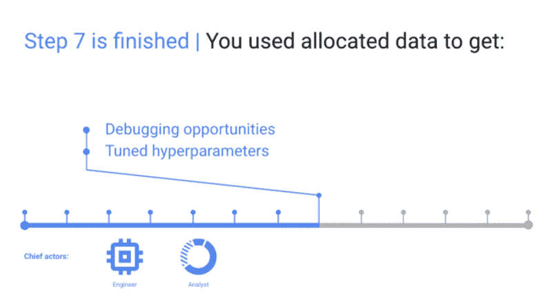

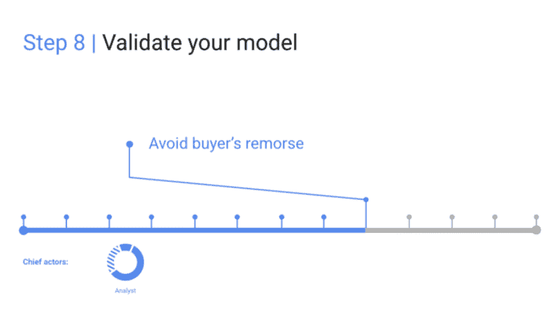

+   第 8 步：[MFML 068 — 模型验证失败时该怎么办](http://bit.ly/mfml_068)

+   第 8 步：[MFML 069 — 正确的模型验证](http://bit.ly/mfml_069)

+   第 8 步：[MFML 070 — 验证轮盘](http://bit.ly/mfml_070)

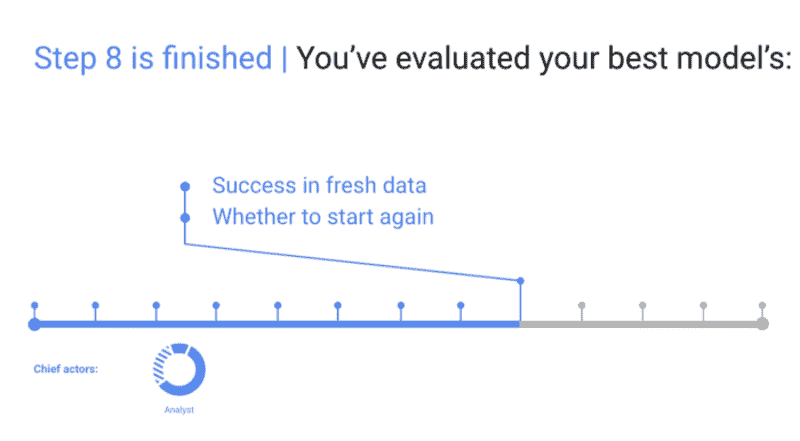

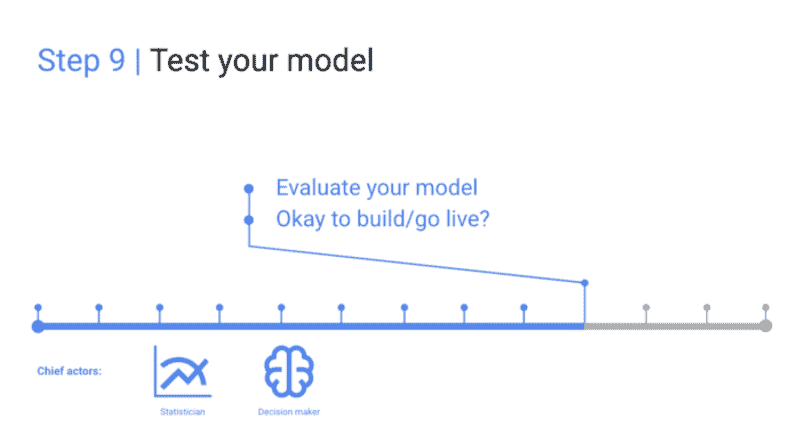

+   第 9 步：[MFML 071 — 测试和验证的区别](http://bit.ly/mfml_071)

+   第 9 步：[MFML 072 — 统计学的 12 个步骤](http://bit.ly/mfml_072)

+   第 9 步：[MFML 073 — 解读 AI 测试输出](http://bit.ly/mfml_073)

+   第 9 步：[MFML 074 — 理解 p 值](http://bit.ly/mfml_074)

+   第 9 步：[MFML 075 — 统计显著性](http://bit.ly/mfml_075)

+   第 9 步：[MFML 076 — 如果测试失败该怎么办](http://bit.ly/mfml_076)

+   第 9 步：[MFML 077 — 测试的重要性](http://bit.ly/mfml_077)

+   第 10 步：[MFML 078 — 生产化](http://bit.ly/mfml_078)

+   第 10 步：[MFML 079 — 安全地重新利用数据](http://bit.ly/mfml_079)

+   第 10 步：[MFML 080 — 解决 AI 延迟问题](http://bit.ly/mfml_080)

+   第 10 步：[MFML 081 — 你应该多久重新训练一次 AI 系统？](http://bit.ly/mfml_081)

+   第 10 步：[MFML 082 — 训练-服务偏差](http://bit.ly/mfml_082)

+   第 10 步：[MFML 083 — 注意链式模型](http://bit.ly/mfml_083)

+   第 10 步：[MFML 084 — 对 AI 代码进行微小改动](http://bit.ly/mfml_084)

+   第 10 步：[MFML 085 — 当你的 AI 模型失败时的重测](http://bit.ly/mfml_085)

+   第 10 步：[MFML 086 — AI 中的长尾风险](http://bit.ly/mfml_086)

+   第 10 步：[MFML 087 — 如何捕捉异常值和 AI 失败](http://bit.ly/mfml_087)

+   第 10 步：[MFML 088 — AI 安全和政策层](http://bit.ly/mfml_088)

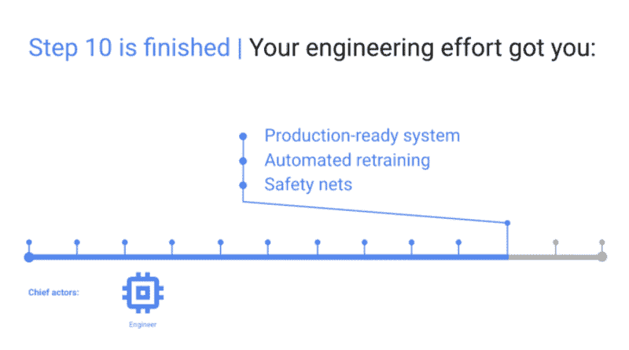

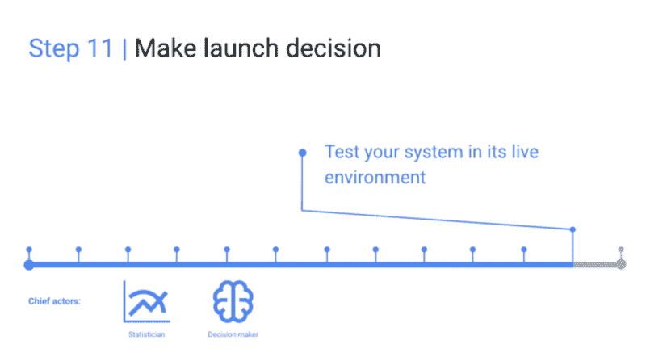

+   第 11 步：[MFML 089 — 实时交通实验](http://bit.ly/mfml_089)

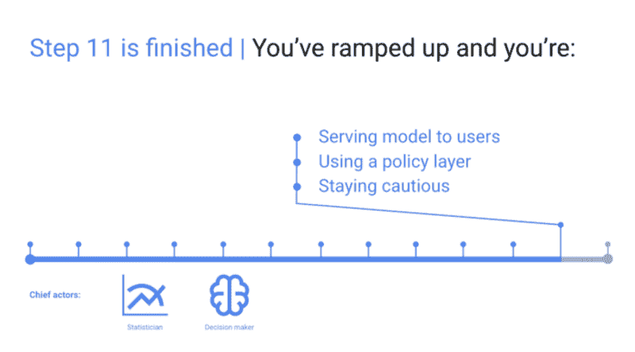

+   第 12 步：[MFML 090 — 监控你的 AI 系统](http://bit.ly/mfml_090)

+   第 12 步：[MFML 091 — AI 系统维护](http://bit.ly/mfml_091)

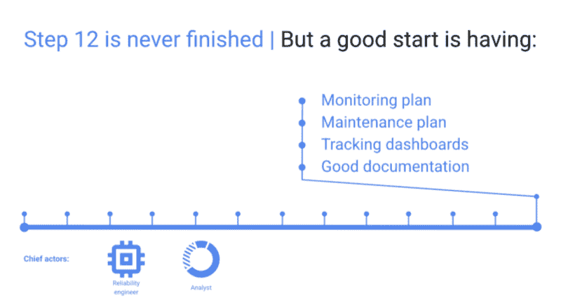

# 算法导论

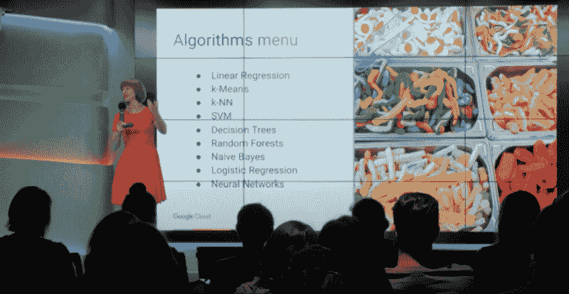

## 菜单

+   [MFML 092 — 揭开黑箱](http://bit.ly/mfml_092)

## 无监督学习

+   [MFML 093 — 聚类与 k 均值](http://bit.ly/mfml_093)

## 懒惰学习

+   [MFML 094 — 懒惰学习与 k-NN](http://bit.ly/mfml_094)

+   [MFML 095 — 维度诅咒](http://bit.ly/mfml_095)

## 线性分类器

+   [MFML 096 — 什么是感知机？](http://bit.ly/mfml_096)

+   [MFML 097 — 最大边际分类器](http://bit.ly/mfml_097)

+   [MFML 098 — 什么是支持向量？](http://bit.ly/mfml_098)

+   [MFML 099 — 支持向量机与核技巧](http://bit.ly/mfml_099)

## 决策树与随机森林

+   [MFML 100 — 什么是决策树？](http://bit.ly/mfml_100)

+   [MFML 101 — XAI 与可解释性辩论](http://bit.ly/mfml_101)

+   [MFML 102 — 决策树与支持向量机比较](http://bit.ly/mfml_102)

+   [MFML 103 — 提升聚合（又名 Bagging）](http://bit.ly/mfml_103)

+   [MFML 104 — 什么是随机森林？](http://bit.ly/mfml_104)

## 集成方法

+   [MFML 105 — 集成模型](http://bit.ly/mfml_105)

## 朴素贝叶斯

+   [MFML 106 — 贝叶斯规则导论](http://bit.ly/mfml_106)

+   [MFML 107 — 朴素贝叶斯到底有什么“朴素”？](http://bit.ly/mfml_107)

## 回归模型

+   [MFML 006 — 简单线性回归](http://bit.ly/mfml_006)

+   [MFML 007 — 多重线性回归](http://bit.ly/mfml_007)

+   [MFML 008 — 特征工程](http://bit.ly/mfml_008)

+   [MFML 108 — 所有回归模型有什么共同之处？](http://bit.ly/mfml_108)

+   [MFML 109 — 什么时候使用线性回归？](http://bit.ly/mfml_109)

+   [MFML 110 — 逻辑回归](http://bit.ly/mfml_110)

+   [MFML 111 — 那些 sigmoid 函数是干什么的？](http://bit.ly/mfml_111)

+   [MFML 112 — 如何进行大规模排序](http://bit.ly/mfml_112)

## 深度学习

+   [MFML 113 — 深度学习导论](http://bit.ly/mfml_113)

+   [MFML 114 — 神经网络内部是什么？](http://bit.ly/mfml_114)

+   [MFML 115 — 使用人工智能进行自动特征提取](http://bit.ly/mfml_115)

+   [MFML 116 — 理解神经网络的组成部分](http://bit.ly/mfml_116)

+   [MFML 117 — 反向传播](http://bit.ly/mfml_117)

+   [MFML 118 — 深度学习的陷阱、优点和缺点](http://bit.ly/mfml_118)

+   [MFML 119 — 神经网络架构](http://bit.ly/mfml_119)

+   [MFML 120 — 什么时候使用神经网络](http://bit.ly/mfml_120)

# 课程介绍

***与机器学习交朋友*** 是谷歌内部专为启发初学者和取悦专家创建的课程。* 今天，它向所有人开放！

该课程旨在为你提供在解决商业问题和在日益以人工智能驱动的世界中成为合格公民所需的有效参与工具。MFML 适合所有人；它专注于概念理解（而非数学和编程细节），并引导你了解成功机器学习方法的基础理念。它适合每一个人！

**完成本课程后，你将能够：**

+   获得对核心机器学习概念的直观和正确理解。

+   理解几种流行机器学习方法的特点。

+   避免机器学习中的常见错误。

+   了解机器学习如何帮助你的工作。

+   了解从构思到发布及其后的机器学习项目涉及的步骤。

+   提升你与机器学习专家和非专家沟通的能力。

# *这个课程适合你吗？看看人们对它的评价*

> *“她的演讲质量让我完全惊叹。这是一个 6 小时的杰作；在每一分钟里，Cassie 都表现得清晰、幽默、充满活力、平易近人、富有洞察力和信息量十足。”* — [Hal Ableson](https://en.wikipedia.org/wiki/Hal_Abelson)，麻省理工学院计算机科学教授
> 
> *“我无法过分强调本课程面向普通观众的价值。”* — 人力资源专家
> 
> *“精彩的课程，而且非常有趣！”* — 软件工程师
> 
> *“我现在对我对机器学习的理解更有信心了……非常喜欢。”* — 公共关系经理
> 
> *“比我在大学里学过的所有相关课程都更有用。”* — 可靠性工程师
> 
> *“我喜欢她如何组织课程，了解内容，并在一天的课程中保持我们的兴趣不让我们感到无聊。因此我在这节课中学到了两件事：1）机器学习，2）演讲技巧。”* — 高管
> 
> *“非常棒的课程：我会推荐它。”* — 机器学习研究科学家
> 
> *“…始终有趣并且保持我的注意力。”* — 高级领导，工程部门
> 
> *“…结构良好，内容清晰，针对像我这样的人的水平恰到好处，并且充满了有用的视觉效果和故事，帮助我理解和记忆。我学到了很多。”* — 高级领导，销售部门
> 
> *“MFML 课程非常出色。它为理解最佳实践奠定了基础，并提升了我尝试应用机器学习的信心。”* — 产品技术经理
> 
> *“我终于感觉到自己理解了 90%以上的内容。通常我总是迷失，觉得自己非常愚蠢，想要哭泣。”* — 项目经理
> 
> *“比其他课程高层次得多，但也更通用、更全面。提供了该主题的全面视角……填补了我所存在的许多“空白”。它确实解开了许多谜团。”* — 软件工程师
> 
> *“虽然我在过去（大约 8 年前）学习和使用过机器学习，但感到厌倦，因此对最近的趋势不太感兴趣…经过这次刷新，我觉得我可以重建这种关系，再次与机器学习成为朋友。”* — 产品经理
> 
> *“否则难以理解的材料由于 Cassie 的深厚专业知识、机智和幽默变得易于理解和愉快。”* — 用户体验设计师

# 如果你喜欢它，那么你应该分享一下…

现在有很多垃圾信息，如果你认为这门课程比大多数替代方案要好，请帮助它脱颖而出，通过与你的社区分享来实现。为了让课程作者微笑，只需选择一个让你开心的视频并发布到任何地方。

*P.S. 你是否曾经尝试过在 Medium 上多次点击鼓掌按钮，看看会发生什么？* ????

**[Cassie Kozyrkov](https://kozyrkov.medium.com/)** 是 Google 的数据科学家和领导者，她的使命是普及决策智能和安全可靠的人工智能。

[原文](https://kozyrkov.medium.com/everything-youve-ever-wanted-to-know-about-machine-learning-b396b0abee8c)。经许可转载。

### 更多相关话题

+   [KDnuggets 新闻，9 月 14 日：免费数据科学 Python 课程 •…](https://www.kdnuggets.com/2022/n36.html)

+   [KDnuggets 新闻，4 月 13 日：数据科学家应该知道的 Python 库…](https://www.kdnuggets.com/2022/n15.html)

+   [StarCoder：你一直想要的编程助手](https://www.kdnuggets.com/2023/05/starcoder-coding-assistant-always-wanted.html)

+   [关于张量的所有你需要知道的](https://www.kdnuggets.com/2022/05/everything-need-know-tensors.html)

+   [关于数据湖仓的所有你需要知道的](https://www.kdnuggets.com/2022/09/everything-need-know-data-lakehouses.html)

+   [关于 MLOps 的所有你需要知道的：KDnuggets 技术简报](https://www.kdnuggets.com/tech-brief-everything-you-need-to-know-about-mlops)
