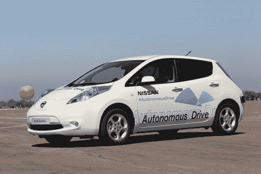
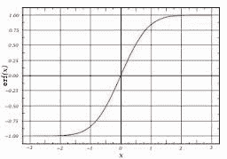

# KDnuggets 独家：采访扬·勒昆的第二部分

> 原文：[`www.kdnuggets.com/2014/02/exclusive-yann-lecun-deep-learning-facebook-ai-lab-part2.html`](https://www.kdnuggets.com/2014/02/exclusive-yann-lecun-deep-learning-facebook-ai-lab-part2.html)

**格雷戈里·皮亚特斯基，2014 年 2 月 20 日。**

这里是采访第一部分

 是[深度学习](http://deeplearning.net/)的领先专家之一——这一突破性进展在机器学习领域取得了惊人的成功，纽约大学数据科学中心的创始主任，并最近被任命为 Facebook 人工智能研究实验室主任。

**格雷戈里·皮亚特斯基：5. 从长期来看，人工智能将走多远？我们会达到雷·库兹韦尔描述的奇点吗？**

**扬·勒昆**：我们将拥有智能机器。这显然只是时间问题。我们将有一些机器，虽然它们并不是非常智能，但能做一些有用的事情，比如自主驾驶我们的汽车。

这需要多长时间？AI 研究人员在低估构建智能机器的难度方面有很长的历史。我将用一个类比来说明：在研究中取得进展就像开车去一个目的地。当我们找到一个新的范式或一套新技术时，感觉就像我们在高速公路上开车，直到到达目的地，没有什么能阻止我们。 

但现实是，我们实际上在浓雾中行驶，没意识到我们的高速公路实际上是一处停车场，远端有一堵砖墙。许多聪明的人犯过这个错误，每一次 AI 的新浪潮后，都会跟随一段过度乐观、非理性炒作和反弹期。这种情况发生在“感知机”、“基于规则的系统”、“神经网络”、“图模型”、“支持向量机”等领域，也可能发生在“深度学习”上，直到我们找到其他东西。但这些范式从未完全失败。它们都留下了新的工具、新的概念和新的算法。

虽然我确实相信我们最终会建立起与人类智能相媲美的机器，但我不太相信奇点。我们感觉自己正处在一个指数增长的进步曲线上。但我们也可能正处在一个 S 型曲线上。S 型曲线在开始时非常像指数曲线。此外，奇点假设的不仅仅是指数增长，它还假设一个渐近线。动态演化的差异，如线性、二次、指数、渐近或 S 型形状，是阻尼或摩擦因素。未来学家似乎假设不存在这样的阻尼或摩擦项。未来学家有动机做出大胆预测，特别是当他们真的希望这些预测成真时，也许希望它们能自我实现。

**GP: 6\. 你曾（或现在）还是纽约大学数据科学中心的主任。你打算如何将你在 Facebook 和纽约大学的工作结合起来？**

**Yann LeCun**：我已经辞去了 的（创始）主任职务。

现任临时主任是 [S. R. Srinivasa "Raghu" Varadhan](https://en.wikipedia.org/wiki/S._R._Srinivasa_Varadhan)，他可能是世界上最著名的概率论学家。纽约大学已经开始寻找新的常任主任。我在 CDS 的创建上投入了大量精力。我们现在有了数据科学的硕士项目，并且很快将有博士项目。我们有 9 个开放的教职位置，我们从 Moore 和 Sloan 基金会获得了一个为期五年的大型资助，与伯克利和华盛顿大学合作，我们与 Facebook 和其他公司建立了合作伙伴关系，我们将很快有一栋新楼。下一任主任将会享受所有的乐趣！

**GP: 7\. “数据科学”这一术语最近出现，被描述为统计学、黑客技术和领域/商业知识的交集。数据科学与以前的术语如“数据挖掘”和“预测分析”有什么不同？如果它是一门新科学，它的关键方程/原则是什么？**

**Yann LeCun**：数据科学涉及从数据中自动或半自动提取知识。这个概念渗透到许多学科中，每个学科都有不同的名称，包括统计估计、数据挖掘、预测分析、系统识别、机器学习、人工智能等。

在方法论方面，统计学、机器学习以及某些应用数学分支都可以声称“拥有”数据科学领域。但实际上，数据科学对于统计学、机器学习和应用数学的意义，就像计算机科学对于 1960 年代的电气工程、物理学和数学的意义一样。计算机科学如何成为一门独立的学科，而不是数学或工程的一个子领域，这是因为它对社会的重要性。

随着数字世界中生成的数据呈指数增长，从数据中自动提取知识的问题也在迅速增长。这导致了数据科学作为一个学科的出现。它正在重新划定统计学、机器学习和应用数学之间的界限。同时，它也创造了科学、商业、医学和政府中“方法”人员与“领域”人员之间紧密互动的需求。

我的预测是，10 年后，许多顶级大学将设立数据科学系。

**GP: 8\. 对于“ Big Data”作为一种趋势和流行词，你有什么看法？有多少是炒作，多少是现实？**

**扬·勒昆**：我喜欢在社交网络上流传的那个笑话，它将大数据比作青春期性行为：每个人都在谈论它，但没有人真正知道怎么做，每个人都认为其他人都在做，所以每个人都声称自己在做。 *[GP: 这个笑话来源于[丹·阿里耶利的 Facebook 帖子](https://www.facebook.com/dan.ariely/posts/904383595868)]*

我见过有人坚持使用 Hadoop 来处理那些可以轻松放进闪存驱动器并且可以在笔记本电脑上轻松处理的数据集。

确实存在炒作。但如何收集、存储和分析大量数据的问题非常真实。我总是对像“大数据”这样的名称感到怀疑，因为今天的“大数据”可能是明天的“小数据”。此外，也有许多重要问题是由于数据过少而产生的。基因组学和医学数据通常就是这种情况。数据永远不够。

**GP: 9. 数据科学家被称为“21 世纪最性感的职业”。你会给想进入这个领域的人什么建议？**

**扬·勒昆**：如果你是本科生，尽可能多地修读数学、统计学和物理学课程，并学习编程（修 3 到 4 门计算机科学课程）。

如果你有本科学位，可以申请[NYU 数据科学硕士](http://cds.nyu.edu/academics/ms-in-data-science/curriculum/)。

**GP: 10. 你最近读过并喜欢的书是什么？当你远离计算机/智能手机时，你喜欢做什么？**

我设计和制作微型飞行器，玩弄 3D 打印机，破解基于微控制器的小工具，并希望在音乐制作上有所提高（我似乎收集了很多电子风琴）。我主要阅读非小说类书籍，听很多爵士乐（以及其他各种类型的音乐）。

### 更多相关主题

+   [数据科学面试指南 - 第二部分：面试资源](https://www.kdnuggets.com/2022/04/data-science-interview-guide-part-2-interview-resources.html)

+   [数据科学面试指南 - 第一部分：结构](https://www.kdnuggets.com/2022/04/data-science-interview-guide-part-1-structure.html)

+   [庆祝 Devart 26 岁生日，独家 20%折扣…](https://www.kdnuggets.com/2023/08/devart-celebrating-26th-birthday-exclusive-discount-data-connectivity-tools.html)

+   [Interview Kickstart 数据科学面试课程——它有什么不同…](https://www.kdnuggets.com/2022/10/interview-kickstart-data-science-interview-course-makes-different.html)

+   [KDnuggets 新闻，4 月 6 日：8 门免费 MIT 课程学习数据科学…](https://www.kdnuggets.com/2022/n14.html)

+   [KDnuggets 创始人格雷戈里·皮亚特斯基-沙皮罗的 30 周年采访](https://www.kdnuggets.com/30th-anniversary-interview-with-founder-gregory-piatetsky-shapiro)
