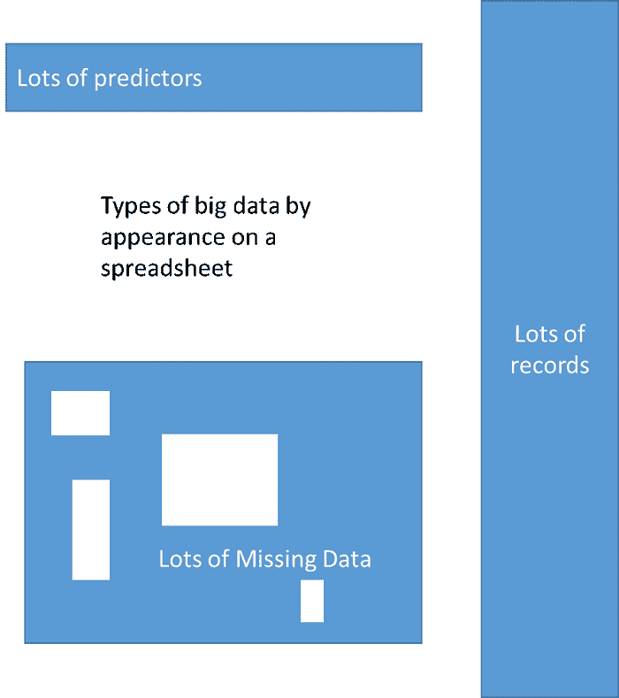

# 《数据科学与机器学习高管指南》

> 原文：[`www.kdnuggets.com/2018/05/executive-guide-data-science-machine-learning.html`](https://www.kdnuggets.com/2018/05/executive-guide-data-science-machine-learning.html)

 评论

大数据。深度学习。预测分析。如今，数据科学部门和主要商业新闻网站上充斥着大量行话，各行各业都在争相招聘，以开发先进的分析工具来辅助决策。但作为一名高管，了解哪些信息是重要的呢？

尽管数据科学和数据经济是快速出现和发展的领域，但与这些领域相关的许多工作和新发展都遵循一些普遍的原则和概念。本指南旨在提供对当前数据科学中常用的关键数据相关主题和术语的简要概述，并举例说明它们在数据科学中的应用。

* * *

## 我们的前三课程推荐

 1\. [谷歌网络安全证书](https://www.kdnuggets.com/google-cybersecurity) - 快速进入网络安全职业轨道

 2\. [谷歌数据分析专业证书](https://www.kdnuggets.com/google-data-analytics) - 提升你的数据分析技能

 3\. [谷歌 IT 支持专业证书](https://www.kdnuggets.com/google-itsupport) - 支持你的组织在 IT 领域

* * *

**大数据**是一个涵盖所有数据的术语，这些数据足够大，以至于在存储和分析中会遇到问题，特点包括高容量（大量记录）、高度多样性（文本数据、视频数据和数值数据的结合）、速度（流数据）和真实性（数据质量）。许多时候，这指的是记录的数量，这些记录可能达到数十亿或数万亿，例如零售交易数据或大型营销活动中的潜在客户数据。这类数据在存储上成为问题。然而，大数据也可以指关于某一记录的信息量很大的数据，例如关于患者的基因组数据或某个学生的学术记录，这种数据在通过统计方法分析时可能非常棘手，因为它违反了许多分析工具的假设。数据可能很大，但存在质量控制问题，如数据缺失、记录损坏或捕获策略不正确；这也是分析项目失败的最常见原因之一，也是数据捕获策略如此重要的关键原因之一。**数据工程师**负责捕获和优化存储数据，以便将来在分析或报告中使用。

**Hadoop**和**SQL**是两种常见的数据存储数据库（数据在等待分析时的“栖息地”）。SQL 在成熟的企业和数据量不大的企业中很常见；Hadoop 在处理非常大的数据集时更为优选。还有其他数据库存在，但通常是特定行业独有的。**MapReduce**是一个相关的框架，通过将数据拆分和存储或分析这些部分，帮助管理和分析大量数据。通过这种方式，一组计算机可以在分析或存储类似数据时无需在任何一台计算机上占用大量存储空间。跨计算机存储的数据和结果可以根据需要汇总为最终结果。这在 Hadoop 和专门的大数据数据库/分析工具中很常见。

**人工智能**（AI）是计算机科学的一个广泛领域，包括设计软件系统和算法，帮助计算机理解语音、表示知识、训练机器人导航、解决问题和理解图像或视频。通常，存在一个目标和数据用于训练或优化软件。**算法**是一组指导计算机学习过程或决策的指令，通常基于数据，并根据这些数据优化指令。

**统计建模**和**机器学习**通过其与数学和统计学的交集与 AI 和算法相关。模型通过统计测试感兴趣结果（如客户流失、营销活动中的潜在客户或每周销售）与一组预测变量（如客户人口统计、购买模式、点击行为或已知的可能与给定结果相关的其他特征）之间的关系。很多时候，这些模型还可以用来预测未来行为，前提是模型找到的重要预测变量。机器学习扩展了许多常见的统计模型以适应大数据，它还包括探索数据的工具，除了预测之外，这些工具可以用于细分客户群或分组销售趋势。实现这些模型的常用软件语言有**R**和**Python**，使用这些高级工具来研究业务问题的专业人士通常被称为**数据科学家**，**数据科学**指的是他们为理解业务问题、创建预测模型或测试新的操作程序/营销活动而进行的工作。

**监督学习算法**包括学习结果和预测因子之间关系的机器学习模型，目标是理解给定结果的驱动因素或仅仅预测在一组预测因子下的未来结果。监督学习的一个缺点是必须观察结果，并且必须有足够的数据来训练模型。**分类**模型是用来理解群体之间如何不同的监督学习算法；例如，创建一个模型来理解买家广告点击行为和非买家广告点击行为的差异。**回归**模型（在监督学习中）处理连续或计数结果，例如建模购买数量或在给定月份的服务使用情况的驱动因素。**无监督学习算法**探索数据以理解预测因子或结果如何分组，类似于市场细分或数据趋势的可视化探索。

**深度学习**是一种类似于大脑中简单电路的人工神经网络，是一种常用于预测建模的监督学习算法，尤其适合处理大量记录的数据。与其他在几千条训练记录中性能稳定的模型不同，深度学习模型在提供越来越多的训练数据时会不断改进。然而，要实现良好的性能，深度学习需要大量的数据，而 5,000 或 10,000 条记录的训练样本可能不足以训练这种类型的监督学习算法。深度学习通常需要大量的专业知识来定制或从零开始构建，如果问题或数据复杂或数据量小，雇佣深度学习专家会很有帮助。

**随机森林**是一种当前在实践中非常常见的监督学习算法。该算法在分类和回归模型中表现良好，并且通过 map reduce 框架非常适合大数据。在其核心，这种方法包括一组基于数据样本建立的模型，这些模型被汇聚成一个最终模型。这有助于减少错误和在单个模型集合中的错误学习关系。

**拓扑数据分析**是一套相对较新的工具，主要用于无监督学习，在处理小数据样本、大量预测因子、缺失数据和数据捕捉错误方面具有良好特性。这些工具还提供了有助于简化结果和允许数据团队进一步探索发现的可视化方法（如下所示，用于突出显示不符合其他记录的记录）。这使它们成为无监督学习的理想选择，广泛应用于生物技术、医疗保健和教育等行业。

无论使用什么技术，对于与训练模型相关的数据的任何分析都有一些注意事项。**抽样**和**偏倚**是选择用于统计建模或机器学习的数据时两个重要的考虑因素。如果只选择来自新英格兰的客户数据进行分析，那么模型的结果可能无法推广到乔治亚州或德克萨斯州的客户；这是分析中的一种偏倚示例。抽样方法对于减少可能的偏倚以及解决可能导致不良结果的几个统计问题非常重要。**过度分析**，即使用过多的数据来测试组间差异或寻找数据中的关系，可能会暗示不存在的关系，因为模型在给定预测因子内寻找微小波动，而不是一个真实的关系。这在 A/B 测试营销活动中尤为重要。

几本优秀的书籍比这本指南更为详细，读者希望深入了解高管数据科学的内容，可以从这些精选资源中获取更多信息：

《执行数据科学》（作者：罗杰·彭）

《大数据的工作：揭开神话，发现机遇》（作者：托马斯·达文波特）

《跟上量化分析的步伐：理解和使用分析的指南》（作者：托马斯·达文波特和金志浩）

**相关内容：**

+   [商业智能和数据分析如何驱动商业价值？](https://www.kdnuggets.com/2018/03/ntu-bi-data-analytics-online-mba.html)

+   [数据交换和市场，正在形成的新商业模式](https://www.kdnuggets.com/2018/04/data-exchange-marketplace-business-model.html)

+   [在组织内部扩展数据科学的最佳实践](https://www.kdnuggets.com/2018/05/anaconda-best-practices-scaling-data-science-across-organization.html)

### 更多相关话题

+   [AI 和机器学习的数据结构入门指南](https://www.kdnuggets.com/guide-data-structures-ai-and-machine-learning)

+   [AI 和机器学习职业的初学者指南](https://www.kdnuggets.com/beginners-guide-to-careers-in-ai-and-machine-learning)

+   [机器学习可视化简易指南](https://www.kdnuggets.com/2022/04/simple-guide-machine-learning-visualisations.html)

+   [选择正确的机器学习算法的简易指南](https://www.kdnuggets.com/2020/05/guide-choose-right-machine-learning-algorithm.html)

+   [必备机器学习算法：初学者指南](https://www.kdnuggets.com/2021/05/essential-machine-learning-algorithms-beginners.html)

+   [如何像老板一样进行 MLOps：无泪的机器学习指南](https://www.kdnuggets.com/2023/06/mlops-like-boss-guide-machine-learning-without-tears.html)
