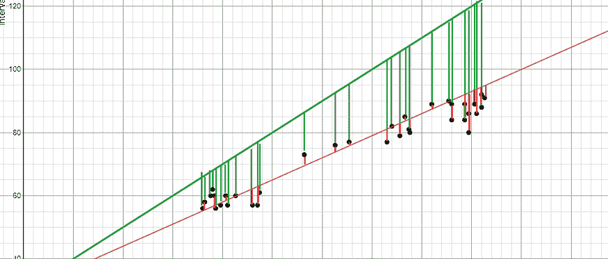
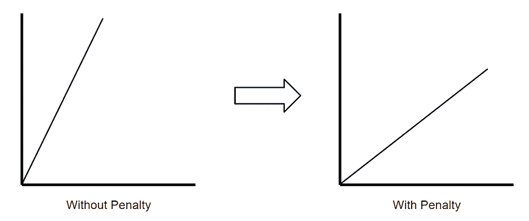
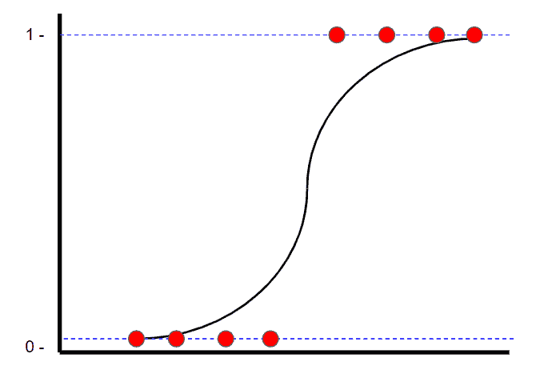
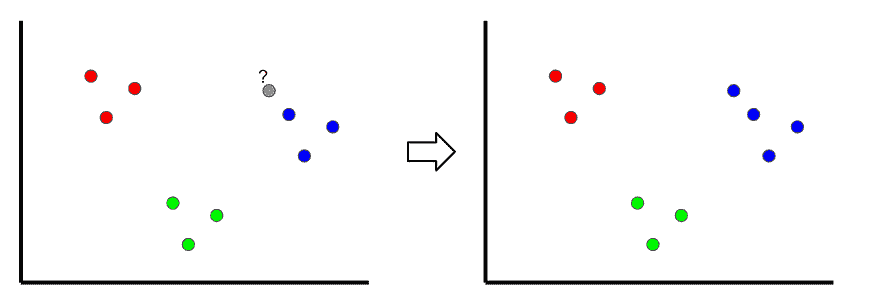
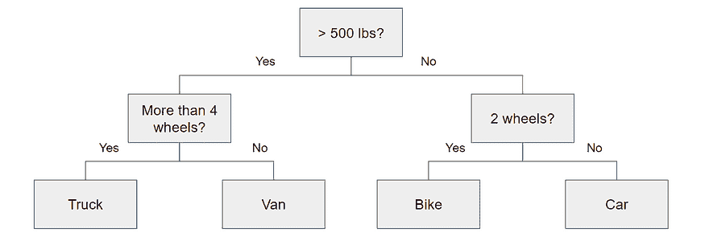

# 如何在面试中解释关键机器学习算法

> 原文：[`www.kdnuggets.com/2020/10/explain-machine-learning-algorithms-interview.html`](https://www.kdnuggets.com/2020/10/explain-machine-learning-algorithms-interview.html)

评论

*由[katemangostar](https://www.freepik.com)创建。*

### 线性回归

线性回归涉及找到一个“最佳拟合线”，该线使用最小二乘法来表示数据集。最小二乘法涉及找到一个线性方程，以最小化平方残差的总和。残差等于实际值减去预测值。

举个例子，红线是比绿线更好的最佳拟合线，因为它更接近数据点，因此残差更小。

*图像由作者创建。*

### 岭回归

岭回归，也称为 L2 正则化，是一种回归技术，通过引入少量的偏差来减少过拟合。它通过最小化平方残差的总和**加上**一个惩罚来实现，其中惩罚等于λ乘以斜率的平方。λ指的是惩罚的严重程度。

*图像由作者创建。*

如果没有惩罚，最佳拟合线的斜率较陡，这意味着它对 X 的微小变化更敏感。通过引入惩罚，最佳拟合线对 X 的微小变化变得不那么敏感。这就是岭回归的核心思想。

### Lasso 回归

Lasso 回归，也称为 L1 正则化，与岭回归类似。唯一的区别是惩罚是通过斜率的绝对值来计算的。

### 逻辑回归

逻辑回归是一种分类技术，也找到一个“最佳拟合线”。然而，与使用最小二乘法找到最佳拟合线的线性回归不同，逻辑回归使用最大似然法找到最佳拟合线（逻辑曲线）。这是因为*y*值只能是 1 或 0。[*查看 StatQuest 的视频，了解如何计算最大似然*](https://www.youtube.com/watch?v=BfKanl1aSG0)。

*图像由作者创建。*

### K-最近邻

K-最近邻是一种分类技术，其中通过查看最近的已分类点来对新样本进行分类，因此称为“K-最近”。在下面的示例中，如果*k=1*，则未分类点将被分类为蓝色点。

*图像由作者创建。*

如果*k*的值太低，则可能受到异常值的影响。然而，如果值太高，则可能忽略只有少量样本的类别。

### 朴素贝叶斯

朴素贝叶斯分类器是一种受贝叶斯定理启发的分类技术，该定理表示以下方程：

由于存在天真的假设（因此得名）认为在给定类别的情况下变量是独立的，我们可以将 P(X|y) 重写如下：

此外，由于我们正在求解 *y*，*P(X)* 是一个常数，这意味着我们可以将其从方程中移除并引入一个比例关系。

因此，*y* 的每个值的概率被计算为 *x[n]* 在给定 *y* 时的条件概率的乘积。

### 支持向量机

支持向量机是一种分类技术，它找到一个最佳边界，称为超平面，用于分隔不同类别。通过最大化类别之间的边际来找到超平面。

*由作者创建的图像。*

### 决策树

决策树本质上是一系列条件语句，用于确定样本走的路径，直到到达底部。它们直观且易于构建，但通常不够准确。

### 随机森林

随机森林是一种集成技术，意味着它将多个模型组合成一个，以提高其预测能力。具体来说，它使用自助数据集和变量的随机子集（也称为自助法）构建成千上万的较小决策树。通过成千上万的较小决策树，随机森林使用“多数决定”模型来确定目标变量的值。

例如，如果我们创建了一个决策树，即第三棵，它将预测 0。然而，如果我们依赖所有 4 棵决策树的众数，那么预测值将是 1。这就是随机森林的强大之处。

### AdaBoost

AdaBoost 是一种提升算法，与随机森林类似，但有几个显著的不同点：

1.  与其说 AdaBoost 构建一片树的森林，不如说它通常构建一片桩的森林（桩是只有一个节点和两个叶子的树）。

1.  每个桩的决策在最终决策中的权重是不等的。总错误较少（高准确性）的桩将具有更高的权重。

1.  桩的创建顺序很重要，因为每个后续的桩都强调了在前一个桩中被错误分类的样本的重要性。

### 梯度提升

梯度提升与 AdaBoost 相似，因为它构建多个树，每棵树都基于之前的树构建。与 AdaBoost 构建桩（stump）不同，梯度提升构建通常具有 8 到 32 片叶子的树。

更重要的是，梯度提升与 AdaBoost 的主要区别在于决策树的构建方式。梯度提升从一个初始预测开始，通常是平均值。然后，根据样本的残差构建一棵决策树。通过将初始预测值加上学习率乘以残差树的结果来做出新预测，并重复这一过程。

### XGBoost

XGBoost 本质上与梯度提升（Gradient Boost）相同，但主要区别在于残差树的构建方式。使用 XGBoost 时，残差树通过计算叶子与前面节点之间的相似性分数来确定哪些变量用作根节点和节点。

[原文](https://towardsdatascience.com/how-to-explain-each-machine-learning-model-at-an-interview-499d82f91470)。已获转载许可。

**相关内容：**

+   [数据科学实习面试问题](https://www.kdnuggets.com/2020/08/data-science-internship-interview-questions.html)

+   [如何在虚拟数据面试中脱颖而出](https://www.kdnuggets.com/2020/05/pragmatic-rock-virtual-data-interview.html)

+   [数据科学面试学习指南](https://www.kdnuggets.com/2020/01/data-science-interview-study-guide.html)

* * *

## 我们的前三推荐课程

 1\. [谷歌网络安全证书](https://www.kdnuggets.com/google-cybersecurity) - 快速进入网络安全职业生涯。

 2\. [谷歌数据分析专业证书](https://www.kdnuggets.com/google-data-analytics) - 提升你的数据分析技能

 3\. [谷歌 IT 支持专业证书](https://www.kdnuggets.com/google-itsupport) - 支持你的组织进行 IT 管理

* * *

### 更多相关主题

+   [成为优秀数据科学家所需的 5 项关键技能](https://www.kdnuggets.com/2021/12/5-key-skills-needed-become-great-data-scientist.html)

+   [每个初学者数据科学家应该掌握的 6 种预测模型](https://www.kdnuggets.com/2021/12/6-predictive-models-every-beginner-data-scientist-master.html)

+   [2021 年最佳 ETL 工具](https://www.kdnuggets.com/2021/12/mozart-best-etl-tools-2021.html)

+   [停止学习数据科学以寻找目标，并通过寻找目标……](https://www.kdnuggets.com/2021/12/stop-learning-data-science-find-purpose.html)

+   [数据科学学习统计学的顶级资源](https://www.kdnuggets.com/2021/12/springboard-top-resources-learn-data-science-statistics.html)

+   [成功数据科学家的 5 个特征](https://www.kdnuggets.com/2021/12/5-characteristics-successful-data-scientist.html)
