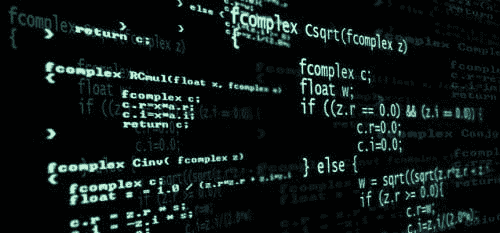
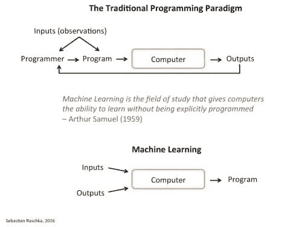

# 如何向软件工程师解释机器学习

> 原文：[`www.kdnuggets.com/2016/05/explain-machine-learning-software-engineer.html`](https://www.kdnuggets.com/2016/05/explain-machine-learning-software-engineer.html)

 评论

软件工程是开发程序或工具以自动化任务。我们不是“手动做事”，而是编写程序；程序基本上是可以由计算机执行的机器可读指令集。让我们考虑一个经典示例：电子邮件垃圾邮件过滤。假设我们可以访问电子邮件客户端的源代码并知道如何处理它，我们可以制定一套直观的规则，可能有助于解决垃圾邮件问题。

例如：如果不是“发件人在联系人中”：如果“主题包含 BUY!: 电子邮件垃圾邮件文件夹：”否则如果...

说制定这些规则是一项相当繁琐的任务是很直观的。不用说，我们必须在现实数据上测试我们的垃圾邮件过滤器，不断评估和改进它，修改和更新规则，等等。同样，我们的目标是自动化：我们希望编写一组指令，自动过滤掉垃圾邮件，以便我们不必“手动”从电子邮件收件箱中删除它们。

现在，**机器学习就是关于自动化自动化**！我们不再亲自制定自动化任务（如电子邮件垃圾邮件过滤）的规则，而是**将数据输入机器学习算法，由算法自己找出这些规则**。在这种情况下，“数据”应代表我们想要解决的问题的样本——例如，一组垃圾邮件和非垃圾邮件，以便机器学习算法可以“从经验中学习”。

在“传统”编程中，我们编写一组规则，将其与数据一起输入计算机，并希望它产生期望的结果。

**传统编程**：

+   一组规则 + 数据 -> 计算机 -> 结果

在机器学习中，我们获取数据（例如，电子邮件），提供有关期望结果的信息（这些电子邮件的垃圾邮件和非垃圾邮件标签），然后将其输入学习算法，该算法由计算机执行。计算机随后学习出一组我们可以用来自动化（解决）问题任务的规则。

**机器学习**：

+   结果 + 数据 -> 机器学习算法 + 计算机 -> 一组规则

换句话说，机器学习是寻找优化指令以自动化任务。机器学习算法是指令，让计算机从数据或经验中自动学习其他指令。因此，**机器学习就是自动化的自动化**。

**简介：[Sebastian Raschka](https://twitter.com/rasbt)** 是一位“数据科学家”和机器学习爱好者，对 Python 和开源充满热情。著有《[Python 机器学习](https://www.packtpub.com/big-data-and-business-intelligence/python-machine-learning)》。密歇根州立大学。

[原始](https://github.com/rasbt/python-machine-learning-book/blob/master/faq/ml-to-a-programmer.md)。经许可转载。

**相关**：

+   深度学习何时优于 SVM 或随机森林？

+   神经网络故障排除：当我的误差增加时出什么问题了？

+   为什么要从头实现机器学习算法？

* * *

## 我们的三大课程推荐

 1\. [Google 网络安全证书](https://www.kdnuggets.com/google-cybersecurity) - 快速进入网络安全职业生涯。

 2\. [Google 数据分析专业证书](https://www.kdnuggets.com/google-data-analytics) - 提升你的数据分析技能

 3\. [Google IT 支持专业证书](https://www.kdnuggets.com/google-itsupport) - 支持你所在组织的 IT 工作

* * *

### 更多相关话题

+   [软件开发人员与软件工程师](https://www.kdnuggets.com/2022/05/software-developer-software-engineer.html)

+   [SHAP：在 Python 中解释任何机器学习模型](https://www.kdnuggets.com/2022/11/shap-explain-machine-learning-model-python.html)

+   [用 LIME 解释 NLP 模型](https://www.kdnuggets.com/2022/01/explain-nlp-models-lime.html)

+   [5 门免费的 Google 课程，助你成为软件工程师](https://www.kdnuggets.com/5-free-google-courses-to-become-a-software-engineer)

+   [从工程师到机器学习工程师：利用声明式机器学习](https://www.kdnuggets.com/2023/05/predibase-go-engineer-ml-engineer-declarative-ml.html)

+   [每位机器学习工程师应该具备的 5 项机器学习技能](https://www.kdnuggets.com/2023/03/5-machine-learning-skills-every-machine-learning-engineer-know-2023.html)
