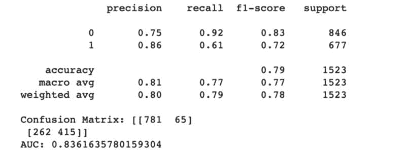
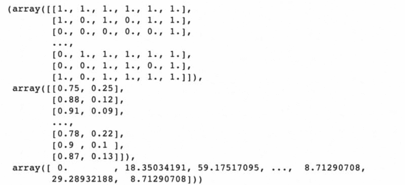

# 使用 LIME 解释 NLP 模型

> 原文：[`www.kdnuggets.com/2022/01/explain-nlp-models-lime.html`](https://www.kdnuggets.com/2022/01/explain-nlp-models-lime.html)

理解 LIME 如何得出最终输出以解释对文本数据的预测是非常重要的。在这篇文章中，我通过阐明 LIME 的组件分享了这一概念。

由 [Ethan Medrano](https://unsplash.com/@itsethan?utm_source=unsplash&utm_medium=referral&utm_content=creditCopyText) 在 [Unsplash](https://unsplash.com/s/photos/magnifying-glass-text?utm_source=unsplash&utm_medium=referral&utm_content=creditCopyText) 拍摄

* * *

## 我们的前三大课程推荐

 1\. [Google 网络安全证书](https://www.kdnuggets.com/google-cybersecurity) - 快速进入网络安全职业道路

 2\. [Google 数据分析专业证书](https://www.kdnuggets.com/google-data-analytics) - 提升你的数据分析能力

 3\. [Google IT 支持专业证书](https://www.kdnuggets.com/google-itsupport) - 支持组织的 IT 需求

* * *

几周前，我写了一篇 [博客](https://towardsdatascience.com/explainable-ai-an-illuminator-in-the-field-of-black-box-machine-learning-62d805d54a7a) 讨论如何使用不同的可解释性工具解释黑箱模型的预测。在那篇文章中，我分享了 LIME、SHAP 和其他可解释性工具背后的数学，但没有详细讲解这些概念在原始数据上的实现。在这篇文章中，我打算逐步分享 LIME 在文本数据上的工作原理。

用于整个分析的数据来源于 [这里](https://www.kaggle.com/c/nlp-getting-started/overview)。这些数据用于预测给定的推文是否关于真实灾难(1)或不是(0)。它包含以下列：

[来源](https://www.kaggle.com/c/nlp-getting-started/data)

由于本博客的主要焦点是解释 [LIME](https://lime-ml.readthedocs.io/en/latest/lime.html#module-lime.lime_text) 及其不同组件，因此我们将迅速构建一个使用随机森林的二分类文本分类模型，并主要关注 LIME 的解释。

首先，我们从导入必要的包开始。然后，我们读取数据并开始预处理，例如去除停用词、转小写、词形还原、去除标点符号、去除空白等。所有清理后的预处理文本都存储在一个新的“cleaned_text”列中，该列将进一步用于分析，并且数据被分为训练集和验证集，比例为 80:20。

然后我们迅速转向使用[TF-IDF](https://en.wikipedia.org/wiki/Tf%E2%80%93idf)向量化器将文本数据转换为向量，并在此基础上拟合一个[随机森林](https://en.wikipedia.org/wiki/Random_forest)分类模型。

图片由作者提供

现在让我们开始本博客的主要内容，即如何解释 LIME 的不同组件。

首先，让我们查看 LIME 解释对于特定数据实例的最终输出。然后，我们将逐步深入探讨 LIME 的不同组件，最终得到所需的结果。

图片由作者提供

这里传递了 labels=(1,)作为参数，意味着我们希望获取类 1 的解释。用橙色突出显示的特征（在这个例子中是单词）是导致类 0（非灾难）预测概率为 0.75 和类 1（灾难）预测概率为 0.25 的顶级特征。

**注意**：char_level 是 LimeTextExplainer 的一个参数，它是一个布尔值，标识我们是否将每个字符视为字符串中的独立出现。默认值为 False，因此我们不会将每个字符独立考虑，使用 IndexedString 函数进行分词和文本实例中的单词索引，否则使用 IndexedCharacters 函数。

*所以，你一定对这些计算方法感兴趣吧？*

让我们看看这个。

LIME 首先在感兴趣的数据点周围创建一些扰动样本。对于文本数据，通过随机删除实例中的一些单词来创建扰动样本，默认使用余弦距离来计算原始样本与扰动样本之间的距离。

这将返回 5000 个扰动样本的数组（每个扰动样本的长度与原始实例相同，1 表示原始实例中该位置的单词在扰动样本中存在），以及它们对应的预测概率和原始样本与扰动样本之间的余弦距离。部分内容如下：

图片由作者提供

现在，在创建了邻域中的扰动样本后，是时候为这些样本分配权重了。距离原始实例较近的样本会获得比距离原始实例较远的样本更高的权重。默认使用宽度为 25 的[指数核](https://www.cs.toronto.edu/~duvenaud/cookbook/)来分配这些权重。

之后，通过从扰动数据中学习一个局部线性稀疏模型来选择重要特征（按 num_features：最大解释特征数）。使用局部线性稀疏模型选择重要特征的方法有很多，如‘auto’（默认）、‘forward_selection’、‘lasso_path’、‘highest_weights’。如果选择‘auto’，当 num_features≤6 时使用‘forward_selection’，否则使用‘highest_weights’。

图片来源于作者

在这里，我们可以看到选择的特征是 [1,5,0,2,3]，这些是原始实例中重要词汇（或特征）的索引。由于这里 num_features=5 且 method=‘auto’，因此使用了‘forward_selection’方法来选择重要特征。

现在让我们看看如果我们选择‘lasso_path’方法会发生什么。

图片来源于作者

一样，对吧？

*但你可能会对深入了解这个选择过程感兴趣。别担心，我会让它变得简单。*

它使用了 [最小角回归](http://www.cse.iitm.ac.in/~vplab/courses/SLT/PDF/LAR_hastie_2018.pdf) 的概念来选择顶级特征。

如果我们选择方法为‘highest_weights’，会发生什么呢？

图片来源于作者

*稍等一下，我们正在深入选择过程。*

现在我们已经通过任何一种方法选择了重要特征。但最终我们必须拟合一个局部线性模型来解释黑箱模型的预测。为此，使用了默认的 [岭回归](https://en.wikipedia.org/wiki/Ridge_regression)。

让我们检查一下最终的输出会是什么样的。

如果我们分别选择方法为 auto、highest_weights 和 lasso_path，输出将如下所示：

图片来源于作者

这些返回一个元组（局部线性模型的截距、重要特征的索引及其系数、局部线性模型的 R² 值、解释模型对原始实例的局部预测）。

如果我们将上述图像与

图片来源于作者

那么我们可以说，最左侧面板中的预测概率是解释模型的局部预测。中间面板中的特征和数值是重要特征及其系数。

**注意**：对于这个特定的数据实例，词数（或特征数）只有 6，我们正在选择最重要的前 5 个特征，因此所有方法都给出了相同的前 5 个重要特征。但对于更长的句子，这种情况可能不会发生。

**如果你喜欢这篇文章，请点击推荐。这将非常棒。**

要获取完整的代码，请访问我的 [GitHub](https://github.com/kunduayan/LIME_text_data) 仓库。请在 [LinkedIn](https://www.linkedin.com/in/ayan-kundu-a86293149/) 和 [Medium](https://medium.com/@ayan.kundu09) 关注我的未来博客。

**结论**

在这篇文章中，我尝试解释了 LIME 在文本数据中的最终结果，以及整个解释过程是如何逐步进行的。类似的解释也可以用于表格数据和图像数据。为此，我强烈推荐查看 [this](https://github.com/marcotcr/lime)。

**参考文献**

1.  LIME 的 GitHub 仓库：[`github.com/marcotcr/lime`](https://github.com/marcotcr/lime)

1.  LARS 的文档：[`www.cse.iitm.ac.in/~vplab/courses/SLT/PDF/LAR_hastie_2018.pdf`](http://www.cse.iitm.ac.in/~vplab/courses/SLT/PDF/LAR_hastie_2018.pdf)

1.  [`towardsdatascience.com/python-libraries-for-interpretable-machine-learning-c476a08ed2c7`](https://towardsdatascience.com/python-libraries-for-interpretable-machine-learning-c476a08ed2c7)

**[Ayan Kundu](https://www.linkedin.com/in/ayan-kundu-a86293149/)** 是一名具有 2 年以上银行和金融领域经验的数据科学家，同时也是一个热情的学习者，致力于尽可能帮助社区。请在 [LinkedIn](https://www.linkedin.com/in/ayan-kundu-a86293149/) 和 [Medium](https://medium.com/@ayan.kundu09) 关注 Ayan。

### 更多相关内容

+   [SHAP：用 Python 解释任何机器学习模型](https://www.kdnuggets.com/2022/11/shap-explain-machine-learning-model-python.html)

+   [oBERT：复合稀疏化实现更快准确的 NLP 模型](https://www.kdnuggets.com/2022/05/obert-compound-sparsification-delivers-faster-accurate-models-nlp.html)

+   [过去 12 个月必须阅读的 NLP 论文](https://www.kdnuggets.com/2023/03/must-read-nlp-papers-last-12-months.html)

+   [终极指南：NLP 中的不同词嵌入技术](https://www.kdnuggets.com/2021/11/guide-word-embedding-techniques-nlp.html)

+   [NLP 应用在现实世界中的范围：一种不同的…](https://www.kdnuggets.com/2022/03/different-solution-problem-range-nlp-applications-real-world.html)

+   [机器学习的甜蜜点：NLP 和文档分析中的纯粹方法](https://www.kdnuggets.com/2022/05/machine-learning-sweet-spot-pure-approaches-nlp-document-analysis.html)
