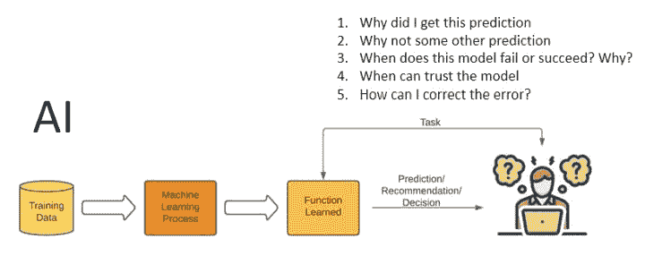
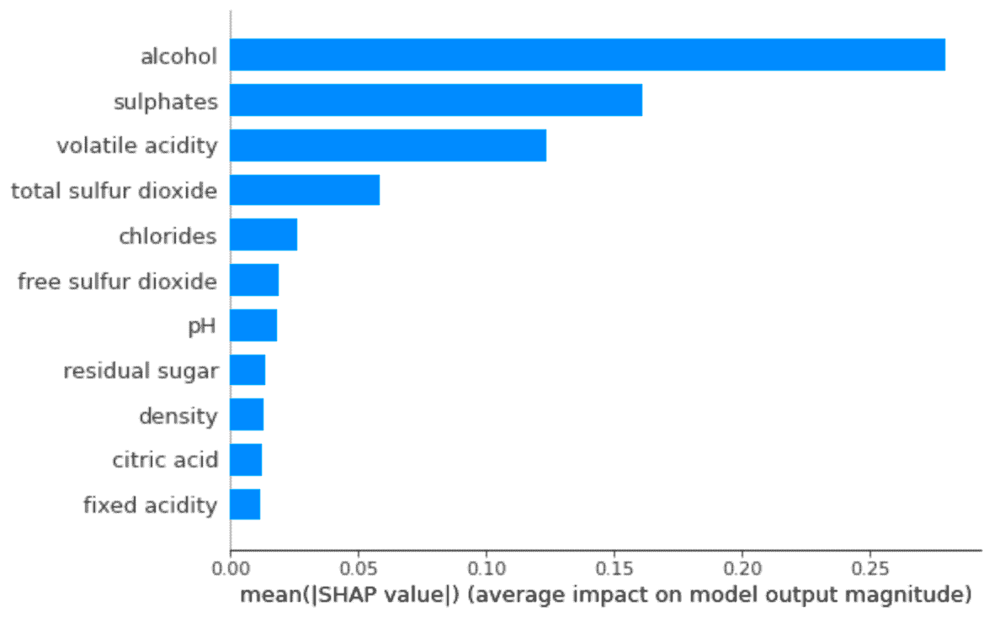
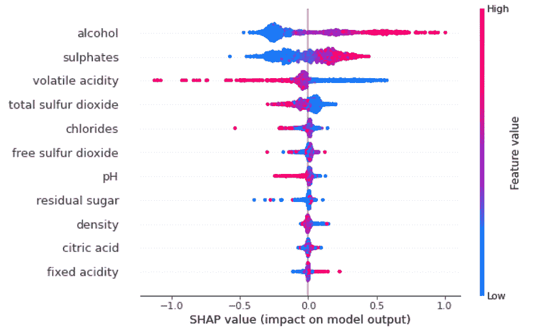
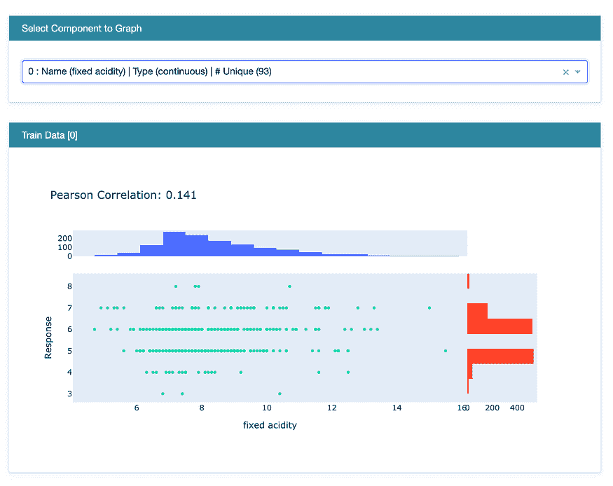
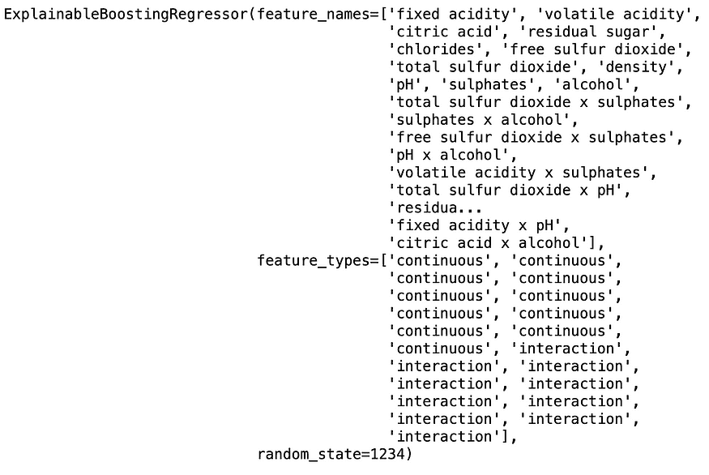
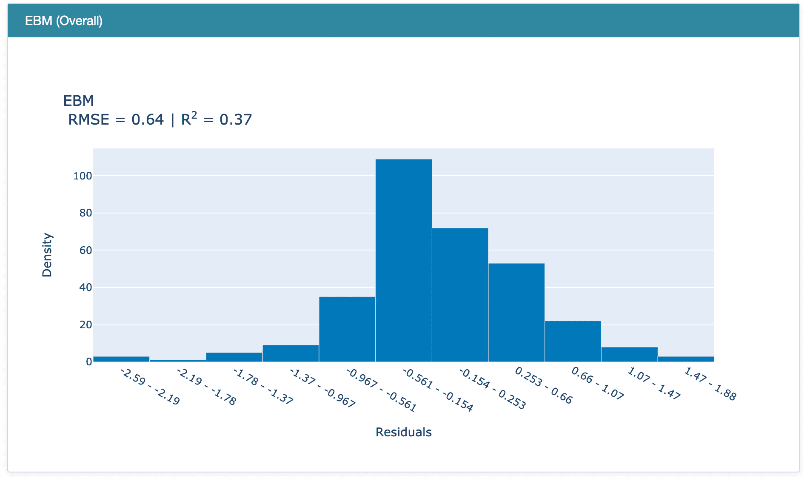
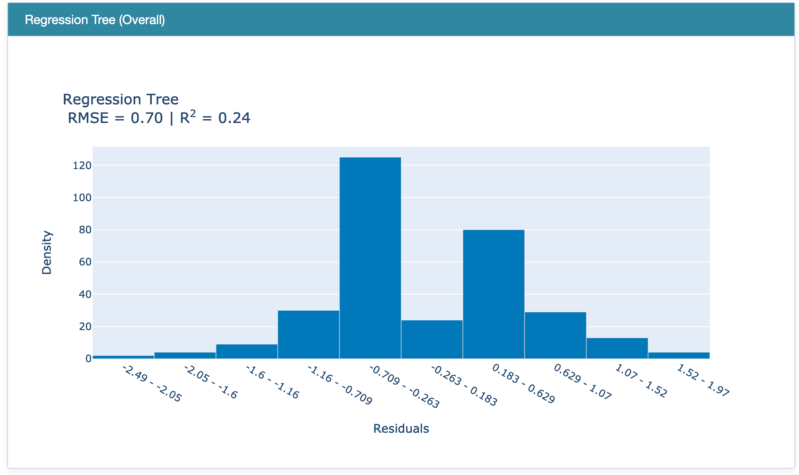

# 可解释人工智能（XAI）和可解释增强机器（EBM）介绍

> 原文：[`www.kdnuggets.com/2021/06/explainable-ai-xai-explainable-boosting-machines-ebm.html`](https://www.kdnuggets.com/2021/06/explainable-ai-xai-explainable-boosting-machines-ebm.html)

评论

**由 [Chaitanya Krishna Kasaraneni](https://chaitanya-kasaraneni.medium.com/)，Predmatic AI 的数据科学实习生**。

*照片由 [Rock’n Roll Monkey](https://unsplash.com/@rocknrollmonkey?utm_source=unsplash&utm_medium=referral&utm_content=creditCopyText) 提供，来源于 [Unsplash](https://unsplash.com/s/photos/artificial-intelligence?utm_source=unsplash&utm_medium=referral&utm_content=creditCopyText)。*

近年来，机器学习已成为许多领域如体育、医学、科学和技术发展的核心。机器（计算机）变得如此智能，甚至 [击败了围棋等游戏中的专业人士](https://deepmind.com/research/case-studies/alphago-the-story-so-far)。这些发展引发了关于机器是否也能成为更好的司机（自动驾驶车辆）甚至更好的医生的问题。

在许多机器学习应用中，用户依赖模型来做出决策。但是，医生显然不能仅仅因为“模型这么说”就对病人进行手术。即使在低风险情况下，例如从流媒体平台选择一部电影，我们也需要一定的信任度，然后才能根据模型的推荐投入几个小时的时间。

尽管许多机器学习模型是黑箱，但理解模型预测背后的理由肯定会帮助用户决定何时信任或不信任其预测。这种“理解理由”的需求引出了一个概念，称为可解释人工智能（XAI）。

### 什么是可解释人工智能（XAI）？

> *可解释人工智能指的是应用人工智能技术（AI）中的方法和技术，使得解决方案的结果可以被人类专家理解。[[维基百科](https://en.wikipedia.org/wiki/Explainable_artificial_intelligence)]*

**可解释人工智能如何不同于人工智能？**

*AI 和 XAI 之间的区别。*

通常，AI 使用机器学习算法得出结果，但 AI 系统的设计者并未完全理解算法是如何得出该结果的。

另一方面，XAI 是一组过程和方法，允许用户理解和信任机器学习模型/算法产生的结果/输出。XAI 用于描述 AI 模型、其预期影响和潜在偏差。它帮助描述模型的准确性、公平性、透明度以及 AI 驱动决策的结果。可解释的 AI 对于组织在将 AI 模型投入生产时建立信任和信心至关重要。AI 解释性还帮助组织采用负责任的 AI 开发方法。

这种解释器的著名例子包括**局部可解释模型无关解释**（[LIME](https://www.oreilly.com/content/introduction-to-local-interpretable-model-agnostic-explanations-lime/)）和**Shapley 加性解释**（[SHAP](https://shap.readthedocs.io/en/latest/)）。

+   LIME 通过在预测周围局部学习一个可解释的模型，以可解释和忠实的方式解释任何分类器的预测。

+   SHAP 是一种博弈论方法，用于解释任何机器学习模型的输出。

### 使用 SHAP 解释预测

SHAP 是由 Scott Lundberg 在微软开发的一种新颖的 XAI 方法，并最终开源。

SHAP 具有强大的数学基础。它将最优的信用分配与使用经典的博弈论 Shapley 值及其相关扩展的局部解释联系起来（详细信息见[papers](https://github.com/slundberg/shap#citations)）。

**Shapley 值**

使用 Shapley 值，每个预测可以被分解为每个特征的单独贡献。

例如，假设你的输入数据有 4 个特征（x1, x2, x3, x4），模型的输出是 75，使用 Shapley 值，你可以说特征 x1 贡献了 30，特征 x2 贡献了 20，特征 x3 贡献了 -15，特征 x4 贡献了 40。这 4 个 Shapley 值的总和是 30+20–15+40=75，即模型的输出。这听起来不错，但遗憾的是，这些值极其难以计算。

对于一般模型，计算 Shapley 值所需的时间是**与特征数量的指数关系**。如果你的数据有 10 个特征，这可能还算可以。但如果数据有更多特征，比如 20 个，根据你的硬件条件，可能已经是不可能的。公平地说，如果你的模型由树结构组成，有更快的近似方法来计算 Shapley 值，但仍然可能会很慢。

### 使用 Python 的 SHAP

在本文中，我们将使用 [红酒质量数据](https://www.kaggle.com/uciml/red-wine-quality-cortez-et-al-2009) 来理解 SHAP。此数据集的目标值为从低到高（0–10）的质量评分。输入变量是每个酒样的成分，包括固定酸度、挥发酸度、柠檬酸、残留糖、氯化物、游离二氧化硫、总二氧化硫、密度、pH 值、硫酸盐和酒精。有 1,599 个酒样。代码可以通过此 [GitHub 链接](https://github.com/chaitanyakasaraneni/SHAP_EBM_Examples)找到。

在本文中，我们将构建一个随机森林回归模型，并使用 SHAP 的 TreeExplainer。SHAP 为任何机器学习算法提供了解释器——无论是基于树的还是非基于树的算法。它被称为 *KernelExplainer*。如果你的模型是基于树的机器学习模型，你应使用已优化的树解释器 *TreeExplainer()*，以便快速渲染结果。如果你的模型是深度学习模型，请使用深度学习解释器 *DeepExplainer()*。对于所有其他类型的算法（如 KNN），使用 *KernelExplainer()*。

SHAP 值适用于连续或二元目标变量的情况。

**变量重要性图 — 全球解释性**

变量重要性图按降序列出最重要的变量。排名靠前的变量对模型的贡献大于排名靠后的变量，因此具有较高的预测能力。有关代码，请参阅此 [笔记本](https://nbviewer.jupyter.org/github/chaitanyakasaraneni/SHAP_EBM_Examples/blob/main/SHAP%20Example.ipynb)。

*使用 SHAP 的变量重要性图。*

**总结图**

尽管 SHAP 没有内置函数，但你可以使用 matplotlib 库输出图表。

SHAP 值图进一步展示了预测变量与目标变量之间的正负关系。

*总结图。*

该图由训练数据中的所有点组成。它展示了以下信息：

+   变量按降序排列。

+   水平位置显示该值的效应是否*与更高或更低的预测相关*。

+   颜色显示该变量在观察值中是高（红色）还是低（蓝色）。

使用 SHAP，我们可以生成部分依赖图。部分依赖图展示了一个或两个特征对机器学习模型预测结果的边际影响（[J. H. Friedman 2001](https://statweb.stanford.edu/~jhf/ftp/trebst.pdf)）。它可以说明目标与特征之间的关系是线性的、单调的还是更复杂的。

黑箱解释远胜于没有解释。然而，正如我们所见，LIME 和 SHAP 都有一些不足。如果模型能同时表现良好*并且*具有可解释性，那就更好了——**解释性提升机器**（EBM）就是这样一种方法的代表。

### 解释性提升机器（EBM）

EBM 是一种玻璃盒模型，旨在具有与先进的机器学习方法（如随机森林和提升树）相当的准确性，同时保持高度的可理解性和可解释性。

EBM 算法是 GA²M 算法的快速实现。反过来，GA²M 算法是 GAM 算法的扩展。因此，让我们从 GAM 算法开始讲起。

**GAM 算法**

GAM 代表广义加法模型。它比逻辑回归更灵活，但仍然具有可解释性。GAM 的假设函数如下所示：

需要注意的关键部分是，特征的线性项 ????ixi 现在被替换为函数 fi(xi)。稍后我们会回到如何在 EBM 中计算这个函数。

GAM 的一个限制是每个特征函数是独立学习的。这阻碍了模型捕捉特征之间的交互，并降低了准确性。

**GA²M 算法**

GA²M 旨在改善这一点。为此，它除了考虑每个特征学习到的函数外，还考虑了一些成对交互项。这不是一个容易解决的问题，因为需要考虑的交互对的数量更多，这会大幅增加计算时间。在 GA²M 中，他们使用 FAST 算法高效地选择有用的交互项。这是 GA²M 的假设函数。注意额外的成对交互项。

通过添加成对交互项，我们得到了一个更强的模型，同时仍然保持可解释性。这是因为可以使用热图清晰地可视化两个特征在二维空间中的影响及其对输出的作用。

**EBM 算法**

最后，让我们讨论一下 EBM 算法。在 EBM 中，我们使用诸如袋装法和梯度提升等方法来学习每个特征函数 fi(xi)。为了使学习过程独立于特征的顺序，作者使用了非常低的学习率，并以循环的方式遍历特征。每个特征的特征函数 fi 代表了每个特征对模型在该问题上的预测贡献程度，因此具有直接的可解释性。可以绘制每个特征的单独函数，以可视化其对预测的影响。成对交互项也可以在之前描述的热图上进行可视化。

这种 EBM 的实现也是可并行化的，这在大规模系统中是非常宝贵的。它还有一个极快的推理时间的额外优势。

**训练 EBM**

EBM 训练部分使用了增强树和袋装的组合。一个好的定义可能是*袋装的增强袋装浅层树*。

浅层树以增强的方式进行训练。这些是微小的树（默认最多有 3 片叶子）。此外，增强过程是特定的：每棵树仅在一个特征上进行训练。在每次增强轮次中，树会逐个对每个特征进行训练。这确保了：

+   模型是可加的。

+   每个形状函数仅使用一个特征。

这是算法的基础，但其他技术进一步提高了性能：

+   在这个基础模型上进行袋装。

+   每个增强步骤的可选袋装。此步骤默认情况下被禁用，因为它会增加训练时间。

+   成对交互作用。

根据任务，第三种技术可以显著提升性能。一旦使用单个特征训练了模型，就会进行第二次训练（使用相同的训练过程），但使用特征对。对的选择使用了一个专门的算法，避免了尝试所有可能的组合（当特征很多时，这将不可行）。

最终，在所有这些步骤之后，我们得到了一个树的集成。这些树通过使用输入特征的所有可能值来进行离散化。这很简单，因为所有特征都被离散化。因此，预测的最大值数量是每个特征的箱数。最后，这些成千上万的树被简化为每个特征的分箱和评分向量。

### 使用 Python 的 EBM

我们将使用相同的[红酒质量数据](https://www.kaggle.com/uciml/red-wine-quality-cortez-et-al-2009)来理解 InterpretML。代码可以通过这个[GitHub 链接](https://github.com/chaitanyakasaraneni/SHAP_EBM_Examples)找到。

**探索数据**

“总结”中的训练数据显示了目标变量的直方图。

*总结显示目标的直方图。*

当选择单个特征（这里是固定酸度）时，图表显示了该特征与目标的皮尔逊相关性。同时，所选特征的直方图以蓝色显示，相对于目标变量的直方图以红色显示。

*单个特征与目标对比。*

**训练解释性提升机（EBM）**

这里使用的是 InterpretML 库中的*ExplainableBoostingRegressor()*模型，采用默认超参数。*RegressionTree()*和*LinearRegression()*也被训练用于对比。

*解释性提升回归模型。*

**解释 EBM 性能**

*RegressionPerf()*用于评估每个模型在测试数据上的表现。EBM 的 R 平方值为 0.37，优于线性回归和回归树模型的 R 平方误差。

*（a）EBM，（b）线性回归，以及（c）回归树的性能。*

每个模型的全局和局部可解释性也可以分别使用*model.explain_global()*和*model.explain_local()*方法生成。

InterpretML 还提供了一个功能，可以将所有内容结合起来并生成一个互动仪表板。请参考[笔记本](https://github.com/chaitanyakasaraneni/SHAP_EBM_Examples/blob/main/InterpretML_Example.ipynb)以查看图表和仪表板。

### 结论

随着对可解释性要求的增加以及现有 XAI 模型的不足，选择准确性和可解释性之间的时代早已过去。EBM 可以像提升树一样高效，同时又像逻辑回归一样容易解释。

[原文](https://chaitanya-kasaraneni.medium.com/understanding-xai-and-ebm-5482da5cb1d0). 经授权转载。

**相关内容：**

+   [机器学习模型解释](https://www.kdnuggets.com/2021/06/machine-learning-model-interpretation.html)

+   [可解释提升机器](https://www.kdnuggets.com/2021/05/explainable-boosting-machine.html)

+   [白盒人工智能简介：可解释性的概念](https://www.kdnuggets.com/2021/03/introduction-white-box-ai-interpretability.html)

* * *

## 我们的三大推荐课程

 1\. [谷歌网络安全证书](https://www.kdnuggets.com/google-cybersecurity) - 快速进入网络安全职业生涯。

 2\. [谷歌数据分析专业证书](https://www.kdnuggets.com/google-data-analytics) - 提升你的数据分析技能

 3\. [谷歌 IT 支持专业证书](https://www.kdnuggets.com/google-itsupport) - 支持你所在组织的 IT 需求

* * *

### 更多相关内容

+   [支持向量机简明介绍](https://www.kdnuggets.com/2023/07/gentle-introduction-support-vector-machines.html)

+   [掌握季节性和提升业务结果的终极指南](https://www.kdnuggets.com/2023/08/media-mix-modeling-ultimate-guide-mastering-seasonality-boosting-business-results.html)

+   [提升机器学习算法：概述](https://www.kdnuggets.com/2022/07/boosting-machine-learning-algorithms-overview.html)

+   [支持向量机：一种直观的方法](https://www.kdnuggets.com/2022/08/support-vector-machines-intuitive-approach.html)

+   [人工智能伦理：引导智能机器的未来](https://www.kdnuggets.com/2023/04/ethics-ai-navigating-future-intelligent-machines.html)

+   [最先进深度学习的可解释预测与现在预测](https://www.kdnuggets.com/2021/12/sota-explainable-forecasting-and-nowcasting.html)
