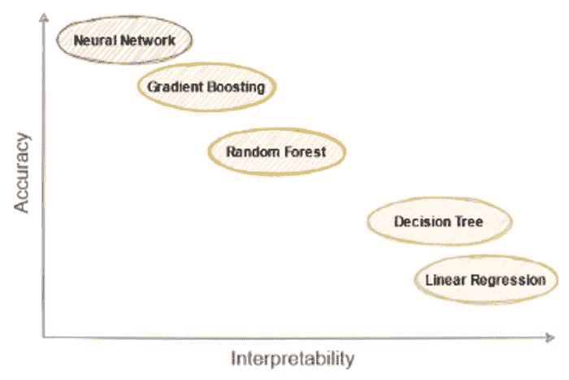
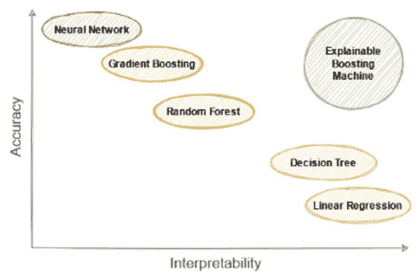
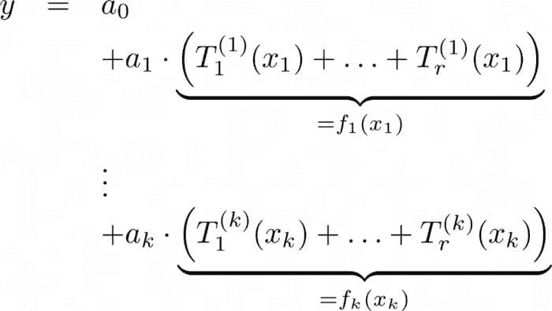
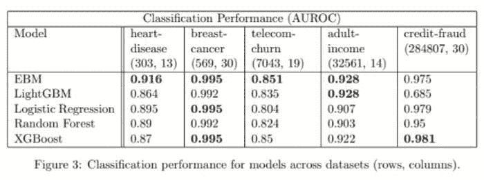
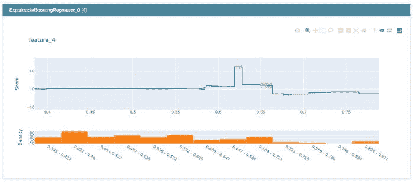

# 可解释的提升机器

> 原文：[`www.kdnuggets.com/2021/05/explainable-boosting-machine.html`](https://www.kdnuggets.com/2021/05/explainable-boosting-machine.html)

评论

**由[Dr. Robert Kübler](https://www.linkedin.com/in/dr-robert-k%C3%BCbler-983859150/)，Publicis Media 的数据科学家**

### 可解释性与准确性的权衡

在机器学习社区，我经常听到和阅读到*可解释性*和*准确性*的概念，以及它们之间的权衡。通常，它被描绘成这样：

* * *

## 我们的前三个课程推荐

 1\. [谷歌网络安全证书](https://www.kdnuggets.com/google-cybersecurity) - 快速进入网络安全职业生涯。

 2\. [谷歌数据分析专业证书](https://www.kdnuggets.com/google-data-analytics) - 提升您的数据分析技能

 3\. [谷歌 IT 支持专业证书](https://www.kdnuggets.com/google-itsupport) - 支持您在 IT 领域的组织

* * *



图片由作者提供。

你可以这样理解：线性回归和决策树是相当简单的模型，通常不太准确。神经网络是*黑箱模型*，即它们难以解释，但通常表现相当不错。像随机森林和梯度提升这样的集成模型也很优秀，但难以解释。

### 可解释性

但是，什么是可解释性呢？对此没有明确的数学定义。一些作者，如在[1]和[2]中定义可解释性为**人类可以理解和/或预测模型的输出**的属性。这有点模糊，但我们仍然可以根据这个标准对机器学习模型进行分类。

为什么线性回归*y=ax+b+ɛ*是可解释的？因为你可以说“将*x*增加一个单位会增加*a*的结果”。模型不会给出意外的输出。*x*越大，*y*越大。*x*越小，*y*越小。没有输入*x*会让*y*以奇怪的方式波动。

为什么神经网络不可解释？嗯，试着在不实际实现它并且不使用纸笔的情况下猜测一个 128 层深的神经网络的输出。确实，输出是根据某个大公式得出的，但即使我告诉你对于*x*=1 输出是*y*=10，而对于*x*=3 输出是*y*=12，你也无法猜测*x*=2 的输出。可能是 11，也可能是-420。

### 准确性

这就是你所熟悉的——原始数据。对于回归，均方误差、平均绝对误差、平均绝对百分比误差，任你选择。对于分类，F1、精确度、召回率，当然，还有老朋友准确性本身。

回到图中。虽然我同意现有的内容，但我想强调以下几点：

> **可解释性与准确性之间没有固有的权衡**。有些模型既可解释又准确。

所以，不要让这张图迷惑你。**可解释的提升机器**将帮助我们突破中间的向下倾斜线，达到我们图表的右上角的终极目标。



图片由作者提供。

*(当然，你也可以创建既不准确又难以解释的模型。这是你可以自己完成的练习。)*

阅读完这篇文章后，你将能够

+   理解为什么可解释性很重要，

+   解释黑箱解释方法如 LIME 和 Shapley 值的缺点，并

+   理解并使用可解释的提升机器学习器

### 解释的重要性

能够解释模型具有多个好处。它可以帮助你改进模型，有时甚至是业务的要求，简单明了。

### 模型改进


图片来源于[alevision.co](https://unsplash.com/@alevisionco?utm_source=medium&utm_medium=referral)在[Unsplash](https://unsplash.com/?utm_source=medium&utm_medium=referral)

假设你想建立一个预测房价的模型。*很有创意，对吧？*其中一个输入特征是**房间数量**。其他特征包括房屋大小、建造年份和一些对邻里质量的测量。在归一化特征后，你决定使用线性回归。测试集上的*r*²很不错，你部署了模型。后来，新房数据出现时，你发现你的模型有点偏差。**出什么问题了？**

由于线性回归高度可解释，你可以直接看到答案：“房间数量”特征的系数是**负的**，尽管作为人类你会期望它是正的。房间越多越好，对吧？但**模型学到了相反的**，原因不明。

这可能有很多原因。也许你的训练集和测试集在某种程度上存在偏差，即如果一栋房子有更多房间，它往往较旧。而且，如果一栋房子较旧，它通常会便宜。

这是因为你能查看模型内部的工作方式而发现的。而且你不仅可以发现它，还可以修复它：你可以将“房间数量”的系数设置为零，或者你也可以重新训练模型并强制“房间数量”的系数为正。这可以通过将`positive=True`关键字设置到 scikit-learn 的`LinearRegression`中来实现。

> 不过请注意，这会将**所有**系数设置为正值。如果你想完全控制系数，你需要自己编写线性回归。你可以查看[这篇文章](https://towardsdatascience.com/build-your-own-custom-scikit-learn-regression-5d0d718f289)来开始。

### 商业或监管要求


照片由[Tingey Injury Law Firm](https://unsplash.com/@tingeyinjurylawfirm?utm_source=medium&utm_medium=referral)提供，来源于[Unsplash](https://unsplash.com/?utm_source=medium&utm_medium=referral)

通常，利益相关者希望对事情的运作至少有一些直观的理解，你必须能够向他们解释。即使是最非技术性的人也可以理解“我将一堆数字加在一起”（线性回归）或“我沿着一条路径走，根据某些简单条件向左或向右”（决策树），但对于神经网络或集成方法来说，解释起来要困难得多。*农夫不知道他就吃不到东西。*这也可以理解，因为这些利益相关者通常需要向其他人汇报，而这些人也希望了解事情的大致运作方式。祝你好运，向你的老板解释梯度提升方法，让他或她能够把知识传达给更高层次而不犯重大错误。

除此之外，可解释性甚至可能是法律要求的。如果你为银行工作并创建一个决定某人是否获得贷款的模型，你可能会被法律要求创建一个可解释的模型，这可能是逻辑回归。

在我们讨论可解释增强机器之前，让我们先看看一些解释黑箱模型的方法。

### 黑箱模型的解释


照片由[Laura Chouette](https://unsplash.com/@laurachouette?utm_source=medium&utm_medium=referral)提供，来源于[Unsplash](https://unsplash.com/?utm_source=medium&utm_medium=referral)

解释黑箱模型的工作原理的方法有很多。这些方法的优点是你可以在已经训练好的模型基础上**再训练一个解释器**。这些解释器使模型更容易理解。

这种解释器的著名例子有局部可解释模型无关解释（*LIME*）[3]和夏普利值[4]。让我们快速了解这两种方法的不足之处。

### LIME 的不足之处

在 LIME 中，你试图逐个解释模型的预测。给定一个样本*x*，为什么标签是*y*？假设你可以用一个可解释的模型来逼近你的复杂黑箱模型，在*x*附近的区域内。这种模型被称为**替代模型**，通常选择线性/逻辑回归或决策树。然而，如果逼近不准确，你可能没有注意到，那么解释会变得具有误导性。

这仍然是一个你应该关注的[sweet library](https://github.com/marcotcr/lime)。

### Shapley 值

利用 Shapley 值，每个预测可以分解为每个特征的个体贡献。例如，如果你的模型输出 50，利用 Shapley 值你可以说特征 1 贡献了 10，特征 2 贡献了 60，特征 3 贡献了-20。这 3 个 Shapley 值的总和是 10+60–20=50，即你的模型的输出。这很棒，但遗憾的是，这些值的计算非常困难。

对于一般的黑箱模型，计算它们的运行时间是**在特征数量上的指数级**。如果你有少量特征，比如 10 个，这可能还可以接受。但是，根据你的硬件，20 个特征可能已经不可能了。公平地说，如果你的黑箱模型由树构成，有更快的近似方法来计算 Shapley 值，但仍然可能很慢。

还有一个出色的[shap library](https://shap.readthedocs.io/en/latest/)可用于 Python，它可以计算 Shapley 值，你一定要查看一下！

别误会我的意思。**黑箱解释比没有解释要好得多**，所以如果你必须使用黑箱模型，请使用它。但是，当然，如果你的模型表现良好*并且*同时是可解释的，那就更好了。现在是时候深入了解这种方法的代表了。

### 可解释增强机器

可解释增强的基本思想其实并不新鲜。它最早由 Jerome H. Friedman 和 Werner Stuetzle 于 1981 年提出的[加性模型](https://en.wikipedia.org/wiki/Additive_model)。这类模型具有以下形式：


作者提供的图片。

其中*y*是预测值，而*x*₁，…，*x*ₖ是输入特征。

### 一个老朋友

我声称你们中的每一个人已经遇到过这样的模型。让我们大声说出来：

> 线性回归！

线性回归不过是一种特殊的加性模型。在这里，所有函数*fᵢ*只是身份，即*f*ᵢ(*xᵢ*)=*xᵢ*。简单，对吧？但你也知道，如果[其假设](https://en.wikipedia.org/wiki/Linear_regression#Assumptions)，尤其是**线性假设**，被违反，线性回归可能不是最好的选择。

我们需要的是更多通用的函数，它们能够捕捉输入和输出变量之间更复杂的关联。微软的一些人展示了如何设计这样的函数的一个有趣的例子[5]。更好的是，他们围绕这个想法为 Python 和 R 构建了一个[舒适的包](https://github.com/interpretml/interpret)。

请注意，下面我将只描述可解释的增强**回归器**。分类也适用，并且没有更复杂。

### 解释

你可能会说：

> 有了这些函数 f，这看起来比线性回归更复杂。这如何更容易解释呢？

为了说明这一点，假设我们训练了一个看起来像这样的加法模型：


图片由作者提供。

你可以将(16, 2)插入模型，得到 5+12–16=1 作为输出。这已经是 1 的分解输出——有一个**基准**值 5，然后特征 1 提供额外的 12，特征 3 提供额外的-16。

所有函数，即使它们很复杂，都是由**简单加法**组成的，这使得这个模型非常容易理解。

现在让我们看看这个模型是如何工作的。

### 这个想法

作者以类似梯度提升的方式使用小树。如果你不知道梯度提升如何工作，请参阅这个很棒的视频。

现在，解释性提升回归的作者提出的建议是，训练每棵小树时只使用**一个特征**。这会生成一个如下所示的模型：



图片由作者提供。

**你可以看到以下内容：**

+   每个*T*都是一棵小深度的树。

+   对于每个*k*特征，训练*r*棵树。因此，你可以在方程中看到*k*r*个不同的树。

+   对于每个特征，其所有树的总和就是前述的*f*。

这意味着函数*f*是由小树的总和组成的。由于树的多功能性，许多复杂的函数可以被相当准确地建模。

另外，请务必查看这个视频，以获得另一种解释：

好了，我们已经看到了它的工作原理，以及如何轻松解释解释性提升机器的输出。但这些模型真的好吗？他们的论文[5]中说了以下内容：



图片摘自[5]。EBM = 可解释提升机。

我觉得不错！当然，我也测试了这个算法，它在我的数据集上也有效。说到测试，让我们看看如何在 Python 中实际使用解释性提升。

### 使用 Python 中的解释性提升

微软的[解释包](https://github.com/interpretml/interpret)使得使用解释性提升变得轻而易举，因为它使用了 scikit-learn API。这里是一个小示例：

```py
from interpret.glassbox import ExplainableBoostingRegressor
from sklearn.datasets import load_bostonX, y = load_boston(return_X_y=True)
ebm = ExplainableBoostingRegressor()
ebm.fit(X, y)
```

这里没有什么令人惊讶的。不过，解释包提供了更多功能。我特别喜欢可视化工具。

```py
from interpret import showshow(ebm.explain_global())
```

除其他外，`show`方法允许你检查函数*f*。这是波士顿房价数据集中特征 4（*NOX; 氮氧化物浓度*）的函数。



图片由作者提供。

在这里，你可以看到 NOX 对房价的影响在大约 0.58 之前没有影响。从 0.58 开始，影响变得稍微积极，NOX 值在 0.62 左右对房价的正面影响最大。然后它再次下降，直到对 NOX 值大于 0.66 的影响变为**负面**。

### 结论

在这篇文章中，我们看到了解释性是一个理想的属性。如果我们的模型默认不可解释，我们仍然可以借助如 LIME 和 Shapley 值等方法来帮助自己。这比什么都不做要好，但这些方法也有其不足之处。

我们随后介绍了可解释增强机器，它的准确性与梯度提升算法如 XGBoost 和 LightGBM 相当，但同样具有可解释性。这表明准确性和解释性并非相互排斥。

使用可解释增强在生产环境中并不困难，感谢 interpret 包。

### 有些许改进空间

这是一个很棒的库，目前唯一的主要缺点是：**它只支持树作为基础学习器**。这在大多数情况下可能足够，但如果你需要*单调*函数，例如，目前你将面临困难。然而，我认为实现这一点应该很简单：开发者只需添加两个功能：

1.  **对通用基础学习器的支持。** 然后我们可以使用[单调回归](https://en.wikipedia.org/wiki/Isotonic_regression)来创建单调函数。

1.  **对不同特征使用不同基础学习器的支持。** 因为对于某些特征，你希望你的函数*f*是单调递增的，对于其他特征则是递减的，而对于某些特征，你不在乎。

你可以在[这里](https://github.com/interpretml/interpret/issues/184)查看讨论。

### 参考文献

[1] Miller, T. (2019). [人工智能中的解释：来自社会科学的见解](https://arxiv.org/abs/1706.07269)。*人工智能*, *267*, 1–38。

[2] Kim, B., Koyejo, O., & Khanna, R. (2016 年 12 月). [示例不够，学会批评！解释性批评](https://papers.nips.cc/paper/2016/hash/5680522b8e2bb01943234bce7bf84534-Abstract.html)。在*NIPS* (第 2280–2288 页)。

[3] Ribeiro, M. T., Singh, S., & Guestrin, C. (2016 年 8 月). [“我为什么要相信你？” 解释任何分类器的预测](https://arxiv.org/abs/1602.04938)。在*第 22 届 ACM SIGKDD 国际知识发现与数据挖掘大会论文集* (第 1135–1144 页)。

[4] Lundberg, S., & Lee, S. I. (2017). [一种统一的模型预测解释方法](https://arxiv.org/abs/1705.07874)。*arXiv 预印本 arXiv:1705.07874*。

[5] Nori, H., Jenkins, S., Koch, P., & Caruana, R. (2019). [Interpretml：一个统一的机器学习解释框架](https://arxiv.org/abs/1909.09223)。*arXiv 预印本 arXiv:1909.09223*。

> 感谢 Patrick Bormann 的有用建议！

我希望我能教你一些有用的东西。

**感谢阅读！**

> *如果你有任何问题，可以在*[*LinkedIn*](https://www.linkedin.com/in/dr-robert-k%C3%BCbler-983859150/)*上给我写信！*

另外，查看一下我在[这里](https://dr-robert-kuebler.medium.com/)的其他文章，了解易于掌握的机器学习主题。

**简介：[罗伯特·库布勒博士](https://www.linkedin.com/in/dr-robert-k%C3%BCbler-983859150/)** 是 Publicis Media 的数据科学家，并在 Towards Data Science 上撰写文章。

[原文](https://towardsdatascience.com/the-explainable-boosting-machine-f24152509ebb)。经授权转载。

**相关：**

+   梯度提升决策树 – 概念解释

+   Shapash：让机器学习模型易于理解

+   可解释的机器学习：免费电子书

### 更多相关主题

+   [提升机器学习算法：概述](https://www.kdnuggets.com/2022/07/boosting-machine-learning-algorithms-overview.html)

+   [终极指南：掌握季节性并提升业务结果](https://www.kdnuggets.com/2023/08/media-mix-modeling-ultimate-guide-mastering-seasonality-boosting-business-results.html)

+   [弥合人类理解与机器学习之间的差距：…](https://www.kdnuggets.com/2023/06/closing-gap-human-understanding-machine-learning-explainable-ai-solution.html)

+   [用最先进的深度学习进行可解释的预测和实时预测…](https://www.kdnuggets.com/2021/12/sota-explainable-forecasting-and-nowcasting.html)

+   [解释对话中的可解释 AI](https://www.kdnuggets.com/2022/10/explaining-explainable-ai-conversations.html)

+   [可解释的人工智能：10 个用于揭示模型决策的 Python 库](https://www.kdnuggets.com/2023/01/explainable-ai-10-python-libraries-demystifying-decisions.html)
