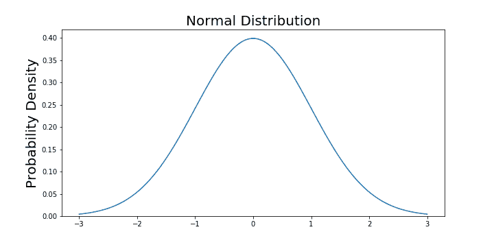

# 解释正态分布的 68-95-99.7 规则

> 原文：[`www.kdnuggets.com/2018/07/explaining-68-95-99-7-rule-normal-distribution.html`](https://www.kdnuggets.com/2018/07/explaining-68-95-99-7-rule-normal-distribution.html)

 评论

**作者 [Michael Galarnyk](https://www.linkedin.com/in/michaelgalarnyk/)，数据科学家**


68% 的数据在一标准差内，95% 的数据在两标准差内，99.7% 的数据在三标准差内

* * *

## 我们的前三个课程推荐

 1\. [Google 网络安全证书](https://www.kdnuggets.com/google-cybersecurity) - 快速进入网络安全职业生涯。

 2\. [Google 数据分析专业证书](https://www.kdnuggets.com/google-data-analytics) - 提升你的数据分析技能

 3\. [Google IT 支持专业证书](https://www.kdnuggets.com/google-itsupport) - 支持你所在组织的 IT

* * *

正态分布通常与`68-95-99.7 规则`相关，如上图所示。68% 的数据在均值（μ）的一标准差（σ）内，95% 的数据在均值（μ）两标准差（σ）内，99.7% 的数据在均值（μ）三标准差（σ）内。

本文解释了这些数字是如何得出的，希望它们能对你未来的工作更具解释性。如常所述，用于推导这些结果（包括图表）的代码可以在我的**[github](https://github.com/mGalarnyk/Python_Tutorials/blob/master/Statistics/normal_Distribution_Area_Under_Curve.ipynb)**上找到。接下来，我们开始吧！

**概率密度函数**

要理解百分比的来源，了解概率密度函数（PDF）是非常重要的。PDF 用于指定**[随机变量](https://en.wikipedia.org/wiki/Random_variable)**落在*特定值范围内*的概率，而不是取某个特定值。这个概率由该变量的 PDF 在该范围内的**[积分](https://en.wikipedia.org/wiki/Integral)**给出——也就是说，它由密度函数下方但在水平轴之上以及范围的最低值和最高值之间的面积给出。这个定义可能不太容易理解，因此让我们通过绘制正态分布的概率密度函数来澄清这一点。下面的方程是正态分布的概率密度函数


正态分布的 PDF

我们通过假设均值（μ）为 0 和标准差（σ）为 1 来简化问题。


正态分布的 PDF

既然函数更简单了，我们来绘制这个范围从-3 到 3 的函数图像。

```py

# Import all libraries for the rest of the blog post
from scipy.integrate import quad
import numpy as np
import matplotlib.pyplot as plt
x = np.linspace(-3, 3, num = 100)
constant = 1.0 / np.sqrt(2*np.pi)
pdf_normal_distribution = constant * np.exp((-x**2) / 2.0)
fig, ax = plt.subplots(figsize=(10, 5));
ax.plot(x, pdf_normal_distribution);
ax.set_ylim(0);
ax.set_title('Normal Distribution', size = 20);
ax.set_ylabel('Probability Density', size = 20);

```



上述图形并未显示事件的*概率*，而是它们的*概率密度*。要获取特定范围内事件的概率，我们需要进行积分。假设我们想找到一个随机数据点落在均值 1 个标准差范围内的概率，我们需要从-1 积分到 1。这可以通过 SciPy 完成。

```py

# Make a PDF for the normal distribution a function
def normalProbabilityDensity(x):
    constant = 1.0 / np.sqrt(2*np.pi)
    return(constant * np.exp((-x**2) / 2.0) )
# Integrate PDF from -1 to 1
result, _ = quad(normalProbabilityDensity, -1, 1, limit = 1000)
print(result)
```


积分正态分布的 PDF 代码（左）和积分的可视化（右）。

68%的数据落在均值（μ）1 个标准差（σ）以内。

如果你想找到一个随机数据点落在均值的 2 个标准差范围内的概率，你需要从-2 积分到 2。


积分正态分布的 PDF 代码（左）和积分的可视化（右）。

95%的数据落在均值（μ）2 个标准差（σ）以内。

如果你想找到一个随机数据点落在均值的 3 个标准差范围内的概率，你需要从-3 积分到 3。


积分正态分布的 PDF 代码（左）和积分的可视化（右）。

99.7%的数据落在均值（μ）3 个标准差（σ）以内。

需要注意的是，对于任何 PDF，曲线下的面积必须为 1（从函数范围内抽取任何数字的概率总是 1）。

**你还会发现，观察值也可能偏离均值 4、5 甚至更多个标准差，但如果你有正态或接近正态分布，这种情况是非常罕见的。**


未来的教程将涵盖如何将这些知识应用于箱型图和置信区间，但这将留到以后。如果你对教程有任何问题或想法，可以在下方评论或通过[Twitter](https://twitter.com/GalarnykMichael)与我联系。

**简历：[Michael Galarnyk](https://www.linkedin.com/in/michaelgalarnyk/)** 是一名数据科学家和企业培训师。他目前在斯克里普斯转化研究所工作。你可以在 Twitter ([`twitter.com/GalarnykMichael`](https://twitter.com/GalarnykMichael))，Medium ([`medium.com/@GalarnykMichael`](https://medium.com/@GalarnykMichael)) 和 GitHub ([`github.com/mGalarnyk`](https://github.com/mGalarnyk)) 找到他。

[原文](https://towardsdatascience.com/understanding-the-68-95-99-7-rule-for-a-normal-distribution-b7b7cbf760c2)。经许可转载。

**相关内容：**

+   Jupyter Notebook for Beginners: A Tutorial

+   Why Data Scientists Love Gaussian

+   描述性统计：数据科学的强大矮子

### 更多相关内容

+   [正态分布综合指南](https://www.kdnuggets.com/2022/06/comprehensive-guide-normal-distribution.html)

+   [停止学习数据科学以寻找目标，并通过寻找目标来……](https://www.kdnuggets.com/2021/12/stop-learning-data-science-find-purpose.html)

+   [一个 90 亿美元的人工智能失败案例分析](https://www.kdnuggets.com/2021/12/9b-ai-failure-examined.html)

+   [学习数据科学统计学的顶级资源](https://www.kdnuggets.com/2021/12/springboard-top-resources-learn-data-science-statistics.html)

+   [成功数据科学家的 5 个特征](https://www.kdnuggets.com/2021/12/5-characteristics-successful-data-scientist.html)

+   [是什么让 Python 成为初创公司理想的编程语言](https://www.kdnuggets.com/2021/12/makes-python-ideal-programming-language-startups.html)
