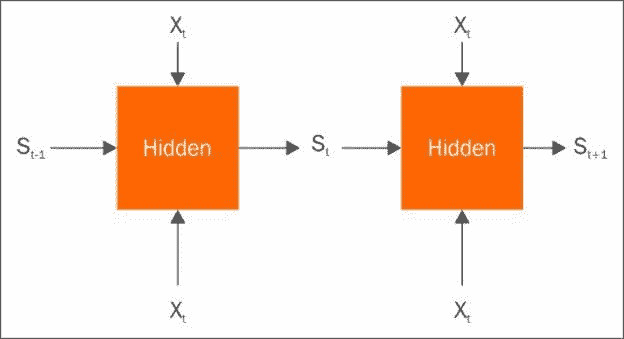
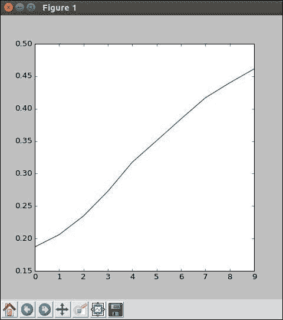

# 探索递归神经网络

> 原文：[`www.kdnuggets.com/2017/12/exploring-recurrent-neural-networks.html`](https://www.kdnuggets.com/2017/12/exploring-recurrent-neural-networks.html)

 评论

**由 Packtpub 提供。**

**在本教程中，选自** [**《Theano 深度学习实战》**](https://www.packtpub.com/big-data-and-business-intelligence/hands-deep-learning-tensorflow?utm_source=kdnuggets&utm_medium=referral&utm_campaign=outreach) **由 Dan Van Boxel 编写，我们将探索递归神经网络。我们将从基础知识开始，然后通过一个激励性的天气建模问题来研究 RNNs。我们还将在 TensorFlow 中实现并训练一个 RNN。**



在一个典型的模型中，你有一些 X 输入特征和一些 Y 输出你想要预测。我们通常认为不同的训练样本是独立的观测值。因此，数据点一的特征不应该影响数据点二的预测。但如果我们的数据点是相关的呢？最常见的例子是每个数据点，**Xt**，表示在时间**t**收集的特征。自然地，我们可以假设时间 t 和 t+1 的特征对时间 t+1 的预测都很重要。换句话说，历史是重要的。

现在，在建模时，你可以简单地包含两倍的输入特征，将前一个时间步骤的特征添加到当前特征中，并计算两倍的输入权重。但是，如果你要花费所有精力来构建一个神经网络来计算变换特征，那么最好在当前时间步骤网络中使用来自前一个时间步骤的中间特征。

RNNs 正是如此。考虑你的输入，**Xt**，如往常一样，但添加一些状态，**St-1**，来自前一个时间步骤，作为额外特征。现在你可以像往常一样计算权重来预测**Yt**，并生成一个新的内部状态，**St**，以便在下一个时间步骤中使用。对于第一个时间步骤，通常使用默认或零初始状态。经典的 RNNs 就是这么简单，但今天文献中有更先进的结构，如门控递归单元和长短期记忆电路。这些超出了本教程的范围，但遵循相同的原则，并通常适用于相同类型的问题。

### 权重建模

你可能会想，我们如何计算所有这些对前一时间步骤的依赖权重。计算梯度确实涉及回溯时间计算，但不用担心，TensorFlow 处理繁琐的部分，让我们可以进行建模：

```py

# read in data
filename = 'weather.npz'
data = np.load(filename)
daily = data['daily']
weekly = data['weekly']

num_weeks = len(weekly)
dates = np.array([datetime.datetime.strptime(str(int(d)),
        '%Y%m%d') for d in weekly[:,0]])

```

要使用 RNNs，我们需要一个具有时间组件的数据建模问题。

字体分类问题在这里并不适用。所以，让我们来看一些天气数据。**weather.npz** 文件是来自美国某城市几十年的天气站数据的集合。**daily** 数组包含了每一天的测量数据。数据有六列，从日期开始。接下来是降水量，测量当天的降雨量（单位为英寸）。之后是两列关于雪的数据——第一列是地面上当前的积雪量，第二列是当天的降雪量，单位仍然是英寸。最后，我们还有一些温度信息，包括每日的最高温度和最低温度，单位为华氏度。

我们将使用的 **weekly** 数组是每日信息的每周总结。我们会使用中间的日期来表示一周，然后，我们会汇总该周的所有降雨量。然而，对于雪，我们将对地上的雪进行平均，因为将某一天的雪加到第二天仍然在地上的雪上是没有意义的。不过，降雪量我们会按周总和计算，就像雨一样。最后，我们将分别计算一周的最高温度和最低温度的平均值。现在你已经掌握了数据集，我们该怎么做呢？一个有趣的基于时间的建模问题是尝试预测某一周的季节，利用其天气信息和前几周的历史。

在北半球，在美国，6 月至 8 月的月份较暖，而 12 月至 2 月的月份则较冷，中间有过渡期。春季通常较为多雨，冬季则常常包括降雪。虽然一周的天气可能变化多端，但一段时间的天气历史应能提供一些预测能力。

### 理解 RNN

首先，让我们从压缩的 NumPy 数组中读取数据。`weather.npz` 文件恰好也包括每日数据，如果你想探索你自己的模型的话；`np.load` 会将两个数组读入一个字典，并将 weekly 设置为我们关注的数据；`num_weeks` 自然是我们拥有的数据点数量，在这里，有几几十年的信息：

```py

num_weeks = len(weekly)

```

为了格式化这些周，我们使用一个 Python `datetime.datetime` 对象来读取以年、月、日格式存储的字符串：

```py

dates = np.array([datetime.datetime.strptime(str(int(d)),
        '%Y%m%d') for d in weekly[:,0]])

```

我们可以利用每周的日期来分配其季节。对于这个模型，因为我们关注的是天气数据，我们使用气象季节而非常见的天文季节。幸运的是，这可以通过 Python 函数轻松实现。提取 `datetime` 对象中的月份，我们可以直接计算出这个季节。春季，季节零，是 3 月至 5 月，夏季是 6 月至 8 月，秋季是 9 月至 11 月，最后冬季是 12 月至 2 月。以下是一个简单的函数，它只是评估月份并实现这一点：

```py

def assign_season(date):
  ''' Assign season based on meteorological season.
      Spring - from Mar 1 to May 31
      Summer - from Jun 1 to Aug 31
      Autumn - from Sep 1 to Nov 30
      Winter - from Dec 1 to Feb 28 (Feb 29 in a leap year)
  '''
  month = date.month
  # spring = 0
  if 3 <= month < 6:
     season = 0
  # summer = 1
  elif 6 <= month < 9:
    season = 1
  # autumn = 2
  elif 9 <= month < 12:
    season = 2
  # winter = 3
  elif month == 12 or month < 3:
    season = 3
  return season

```

请注意我们有四个季节和五个输入变量，并且，假设我们有 11 个历史状态值：

```py

# There are 4 seasons
num_classes = 4

# and 5 variables
num_inputs = 5

# And a state of 11 numbers
state_size = 11

```

现在你准备计算标签了：

```py

labels = np.zeros([num_weeks,num_classes])

# read and convert to one-hot

for i,d in enumerate(dates):

labels[i,assign_season(d)] = 1

```

我们直接以独热格式进行此操作，通过创建一个全零数组，并在分配季节的位置放置一个 1。

很酷！你刚刚用几个命令总结了几十年的时间。

由于这些输入特征测量的是非常不同的事物，即降雨、雪和温度，并且量纲也不同，我们应当注意将它们统一到相同的尺度。在下面的代码中，我们获取输入特征，当然跳过日期列，并减去平均值以将所有特征中心化到零：

```py

# extract and scale training data

train = weekly[:,1:]

train = train - np.average(train,axis=0)

train = train / train.std(axis=0)

```

然后，我们通过除以标准差来缩放每个特征。这考虑到温度范围大约从 0 到 100，而降雨量仅在 0 到 10 之间变化。数据准备做得很好！虽然这不是总是有趣，但它是机器学习和 TensorFlow 的关键部分。

现在让我们跳到 TensorFlow 模型中：

```py

# These will be inputs

x = tf.placeholder("float", [None, num_inputs])

# TF likes a funky input to RNN

x_ = tf.reshape(x, [1, num_weeks, num_inputs])

```

我们像往常一样使用占位符变量输入数据，但你会看到整个数据集被重新塑造成一个大张量。这是因为我们技术上拥有一个长而连续的观察序列。`y_` 变量只是我们的输出：

```py

y_ = tf.placeholder("float", [None,num_classes])

```

我们将为每个季节的每周计算一个概率。

`cell` 变量是递归神经网络的关键：

```py

cell = tf.nn.rnn_cell.BasicRNNCell(state_size)

```

这告诉 TensorFlow 当前时间步如何依赖于之前的时间步。在这种情况下，我们将使用一个基本的 RNN 单元。因此，我们每次只回顾一周。假设它有 11 个状态值。你可以随意尝试更多的异国情调的单元和不同的状态大小。

为了利用这个单元，我们将使用 `tf.nn.dynamic_rnn`：

```py

outputs, states = tf.nn.dynamic_rnn(cell,x_,

dtype=tf.nn.dtypes.float32, initial_state=None)

```

这智能地处理了递归，而不是简单地将所有时间步展开为一个巨大的计算图。由于我们在一个序列中有数千个观察值，这对于获得合理的速度至关重要。单元之后，我们指定输入 `x_`，然后设置 `dtype` 使用 32 位浮点数存储小数，然后是空的 `initial_state`。我们使用这些输出构建一个简单的模型。从这一点开始，模型几乎和你从任何神经网络中预期的一样：

我们将 RNN 单元的输出、一些权重相乘，并加上一个偏置，以获得每周每个类别的得分：

```py

W1 = tf.Variable(tf.truncated_normal([state_size,num_classes],
        stddev=1./math.sqrt(num_inputs)))

b1 = tf.Variable(tf.constant(0.1,shape=[num_classes]))

# reshape the output for traditional usage
h1 = tf.reshape(outputs,[-1,state_size])

```

我们的分类交叉熵损失函数和训练优化器对你来说应该非常熟悉：

```py

# Climb on cross-entropy
cross_entropy = tf.reduce_mean(tf.nn.softmax_cross_entropy_with_logits(y + 1e-50, y_))

# How we train
train_step = tf.train.GradientDescentOptimizer(0.01).minimize(cross_entropy)

# Define accuracy
correct_prediction = tf.equal(tf.argmax(y,1),tf.argmax(y_,1))
accuracy=tf.reduce_mean(tf.cast(correct_prediction, "float"))

```

很棒的 TensorFlow 模型设置！要训练这个模型，我们将使用一个熟悉的循环：

```py

# Actually train
epochs = 100
train_acc = np.zeros(epochs//10)

for i in tqdm(range(epochs), ascii=True):
    if i % 10 == 0:

   # Record summary data, and the accuracy
     # Check accuracy on train set 
     A = accuracy.eval(feed_dict={x: train, y_: labels})
     train_acc[i//10] = A

   train_step.run(feed_dict={x: train, y_: labels})

```

由于这是一个虚拟问题，我们不必过于担心模型的准确性。这里的目标只是查看 RNN 的工作原理。你可以看到它的运行方式就像任何 TensorFlow 模型一样：



如果你查看准确率，你会发现它做得很好；远远超过 25% 的随机猜测，但仍然有很多需要学习的地方。

**我们希望您喜欢这段摘录自** [**动手深度学习与 TensorFlow**](https://www.packtpub.com/big-data-and-business-intelligence/hands-deep-learning-tensorflow?utm_source=kdnuggets&utm_medium=referral&utm_campaign=outreach)**。如果您想了解更多，请访问 packtpub.com。**

**相关：**

+   [**使用递归神经网络（LSTM）进行时间序列预测的指南**](https://www.kdnuggets.com/2017/10/guide-time-series-prediction-recurrent-neural-networks-lstms.html)

+   [**深入了解递归网络：序列到词袋模型**](https://www.kdnuggets.com/2017/08/deeper-recurrent-networks-sequence-bag-words-model.html)

+   [**掌握 Keras 深度学习的 7 个步骤**](https://www.kdnuggets.com/2017/10/seven-steps-deep-learning-keras.html)

* * *

## 我们的三大课程推荐

 1\. [Google 网络安全证书](https://www.kdnuggets.com/google-cybersecurity) - 快速进入网络安全职业轨道。

 2\. [Google 数据分析专业证书](https://www.kdnuggets.com/google-data-analytics) - 提升您的数据分析技能

 3\. [Google IT 支持专业证书](https://www.kdnuggets.com/google-itsupport) - 支持您的组织的 IT

* * *

### 更多相关主题

+   [探索神经网络](https://www.kdnuggets.com/exploring-neural-networks)

+   [在使用神经网络之前尝试的 10 件简单事](https://www.kdnuggets.com/2021/12/10-simple-things-try-neural-networks.html)

+   [用 PyTorch 可解释的神经网络](https://www.kdnuggets.com/2022/01/interpretable-neural-networks-pytorch.html)

+   [深度神经网络并未引领我们走向 AGI](https://www.kdnuggets.com/2021/12/deep-neural-networks-not-toward-agi.html)

+   [最先进的深度学习可解释预测和现在预测](https://www.kdnuggets.com/2021/12/sota-explainable-forecasting-and-nowcasting.html)

+   [卷积神经网络（CNNs）的图像分类](https://www.kdnuggets.com/2022/05/image-classification-convolutional-neural-networks-cnns.html)
