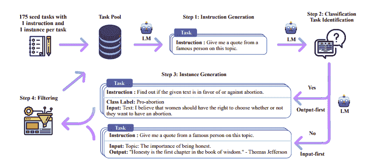
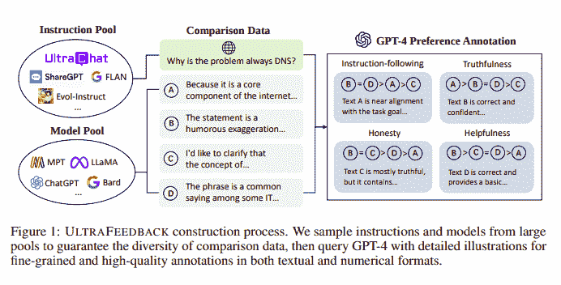
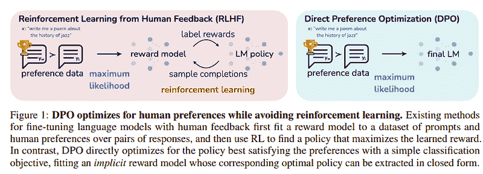
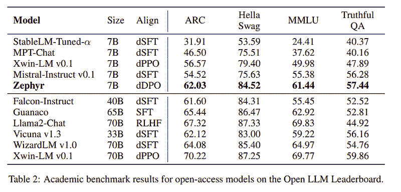

# 探索 Zephyr 7B：最新大型语言模型的全面指南

> 原文：[`www.kdnuggets.com/exploring-the-zephyr-7b-a-comprehensive-guide-to-the-latest-large-language-model`](https://www.kdnuggets.com/exploring-the-zephyr-7b-a-comprehensive-guide-to-the-latest-large-language-model)


图片由 [Google DeepMind](https://www.pexels.com/photo/an-artist-s-illustration-of-artificial-intelligence-ai-this-image-represents-how-ai-powered-tools-can-support-us-and-save-time-it-was-created-by-martina-stiftinger-as-part-of-the-visua-18069239/) 提供

2023 年是大型语言模型和开源的年份。许多初创公司和公司开源了他们的模型和权重，以对抗像 ChatGPT 和 Claude 这样的专有 LLM。2023 年的一些重要公司和模型（开源）包括：

+   Meta (LLama, LLamav2)

+   TII（Falcon 7B, 40B, 180B）

+   Mistral（Mistral 7B, Mixtral8x7B）

* * *

## 我们的三大课程推荐

 1\. [Google Cybersecurity Certificate](https://www.kdnuggets.com/google-cybersecurity) - 快速进入网络安全职业生涯。

 2\. [Google Data Analytics Professional Certificate](https://www.kdnuggets.com/google-data-analytics) - 提升您的数据分析技能

 3\. [Google IT Support Professional Certificate](https://www.kdnuggets.com/google-itsupport) - 支持您的组织的 IT

* * *

然而，7B 模型相对容易且便宜部署，但无法与 70B 等更大模型媲美。最强的开源竞争者是 Mistral 7B，它会超越许多更大的模型。


来自 [Mistral.ai](https://mistral.ai/news/announcing-mistral-7b/) 的 Mistral-7B 比较

然而，这些小模型对自然提示的响应仍然不佳，需要良好的提示工程。

# 介绍

Zephyr 7B 是由 HuggingFace H4（Helpful, Honest, Harmless, Huggy）团队创建的模型，其主要目标是创建一个对齐用户意图的小型语言模型，并超越甚至更大规模的模型。

Zephyr 是 Mistral-7B 的对齐版本，主要通过蒸馏技术创建，并在学术和对话基准测试中与 70B 模型相当。

Zephyr-7B 性能比较 | 来源：[Zephyr 论文](https://arxiv.org/abs/2310.16944)

## 主要特性

Zephyr 卓越表现的原因在于 H4 团队使用的这四项关键技术。

1.  Self-Instruct 数据创建与 DSFT（蒸馏监督微调）

1.  反馈收集

1.  DSFT 模型的 DDPO（精炼直接偏好优化）

****自我指导数据创建与 DSFT****

传统上，**监督微调（SFT）**是在大型语言模型上通过高质量的指令完成对进行的。这些数据的构建成本高昂，并且需要人工监督（Chung et al., 2022；Sanh et al., 2021）。

这里一个有趣的方法是使用教师模型（已训练的大型语言模型）来生成指令和响应。这种精炼技术首次用于 Alpaca（Taori et al., 2023），证明了小模型可以通过**精炼监督微调**超越更大的模型。



自我指导管道 | 来源：[自我指导论文](https://arxiv.org/abs/2212.10560)

H4 团队使用 Zephyr 构建了高质量的监督（指令，完成）数据集，这些数据集用于进行 DSFT。（在生成的指令/完成上训练模型是一种精炼形式，称为 DSFT：精炼监督微调。）

****反馈收集****

大型语言模型通常通过**来自人类反馈的强化学习（RLHF）**进行对齐。Zephyr 则使用来自更优教师模型（如 GPT-4）的反馈来对齐模型的兴趣，采用了 Ultra Feedback 的方法。



UltraFeedback 构建过程 | 来源：[UltraFeedback 论文](https://arxiv.org/abs/2310.01377)

它的工作原理是，每个来自 SFT 的监督提示会传递给 4 个模型（Claude、LLama、Falcon 等），每个模型对单一提示的响应都通过 GPT-4 进行评分。现在我们有一个数据集，其中包括输入（x）、最高评分的完成（yw）以及一个随机提示，表示为低评分的完成（yl），即我们有一个三元组（x, yw, yl）。

****偏好优化****

最后一阶段的目标是最大化模型对 yw（最高评分的完成）相对于 yl（低评分的完成）的偏好。这是通过**DPO**（**直接偏好优化**）来完成的。使用 DPO 比使用纯 RLHF 更简单，直观上它比 RLHF 表现更好。在这种情况下，该方法被称为**dDPO**，因为它使用了由教师模型生成的精炼数据集。

 [Zephyr 论文](https://arxiv.org/abs/2310.16944)

整体算法看起来大致如下：


这些步骤可以转化为以下几个步骤：

1.  计算 dSFT 模型 (仅前向) 中 (x, yw) 和 (x, yl) 的概率。

1.  计算 dDPO 模型中 (x, yw) 和 (x, yl) 的概率。

1.  计算公式 1 并反向传播以进行更新。重复

# 训练细节

Zephyr 使用的基础模型是 Mistral-7B，该模型在发布时是最先进的开源模型。他们使用了 [TRL](https://github.com/huggingface/trl) 库进行微调和对齐。为了优化和加速训练并充分利用 GPU，使用了 Deep-Speed Zero 3 和 Flash-Attention 2。模型使用 AdamW 优化器进行训练，并未使用权重衰减。所有实验都在 16 个 A100 上运行，使用 bfloat16 精度，通常需要 2-4 小时完成。有关 Zephyr 训练过程的详细信息，请参阅 [原始论文](https://arxiv.org/pdf/2310.16944.pdf)。

# 结果

Zephyr 团队结合了训练大型语言模型的最佳技术，并且凭借仅 7B 参数的模型达到了 40B 模型的性能，并且在聊天模型中达到了 70B 的水平。

Zephyr 与其他 LLM 的比较 | 来源：[Zephyr 论文](https://arxiv.org/abs/2310.16944)

Zephyr 与其他 LLM 的比较 | 来源：[Zephyr 论文](https://arxiv.org/abs/2310.16944)

# 使用

Zephyr 模型在 Hugging Face 上公开提供，可以像使用其他语言模型一样使用。

```py
import torch
from transformers import pipeline

pipe = pipeline("text-generation",
                model="HuggingFaceH4/zephyr-7b-alpha",  # can also use the beta model
                torch_dtype=torch.bfloat16,
                device_map="auto")

# We use the tokenizer's chat template to format each message - see https://huggingface.co/docs/transformers/main/en/chat_templating
messages = [
   {
       "role": "system",
       "content": "You are a friendly chatbot who always responds in the style of a pirate",
   },
   {"role": "user", "content": "How many helicopters can a human eat in one sitting?"},
]
prompt = pipe.tokenizer.apply_chat_template(messages, tokenize=False, add_generation_prompt=True)
outputs = pipe(prompt, max_new_tokens=256, do_sample=True, temperature=0.7, top_k=50, top_p=0.95)
print(outputs[0]["generated_text"])
```

输出：

```py
<|system|>
You are a friendly chatbot who always responds in the style of a pirate.
<|user|>
How many helicopters can a human eat in one sitting?
<|assistant|>
Ah, me hearty matey! But yer question be a puzzler! A human cannot eat a helicopter in one sitting, as helicopters are not edible. They be made of metal, plastic, and other materials, not food! 
```

# 结论

Zephyr-7B 是一个小型模型，展示了从大型语言模型蒸馏到小型模型的力量。结果模型 ZEPHYR-7B 基于 MISTRAL-7B，设定了 7B 参数聊天模型的新最先进水平，甚至在 MT-Bench 上超越了 LLAMA2-CHAT-70B。

## 参考文献

1.  Zephyr: 直接蒸馏的 LM 对齐 ([`arxiv.org/abs/2310.16944`](https://arxiv.org/abs/2310.16944))

1.  HuggingFace Zephyr 博客 ([`huggingface.co/blog/Isamu136/understanding-zephyr`](https://huggingface.co/blog/Isamu136/understanding-zephyr))

1.  Self Instruct: [`arxiv.org/abs/2212.10560`](https://arxiv.org/abs/2212.10560)

1.  UltraFeedback: [`arxiv.org/abs/2310.01377`](https://arxiv.org/abs/2310.01377)

**[](https://twitter.com/AhmadMustafaAn1)**[Ahmad Anis](https://twitter.com/AhmadMustafaAn1)**** 是一位充满热情的机器学习工程师和研究员，目前在 [redbuffer.ai](https://redbuffer.ai/) 工作。除了日常工作外，Ahmad 积极参与机器学习社区。他担任 Cohere for AI 的地区负责人，该组织致力于开放科学，并且是 AWS 社区建设者。Ahmad 还活跃于 Stackoverflow，拥有 2300+ 点。他对许多著名的开源项目做出了贡献，包括 OpenAI 的 Shap-E。

### 更多相关主题

+   [探索谷歌最新的 AI 工具：初学者指南](https://www.kdnuggets.com/exploring-googles-latest-ai-tools-a-beginners-guide)

+   [掌握大型语言模型的全面资源列表](https://www.kdnuggets.com/a-comprehensive-list-of-resources-to-master-large-language-models)

+   [探索 AI/DL 的最新趋势：从元宇宙到量子计算](https://www.kdnuggets.com/2023/07/exploring-latest-trends-aidl-metaverse-quantum-computing.html)

+   [终极开源大型语言模型生态系统](https://www.kdnuggets.com/2023/05/ultimate-opensource-large-language-model-ecosystem.html)

+   [掌握大型语言模型微调的 7 个步骤](https://www.kdnuggets.com/7-steps-to-mastering-large-language-model-fine-tuning)

+   [NExT-GPT 介绍：任意到任意的多模态大型语言模型](https://www.kdnuggets.com/introduction-to-nextgpt-anytoany-multimodal-large-language-model)
