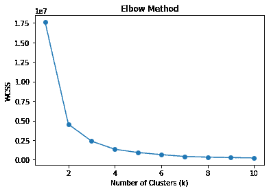
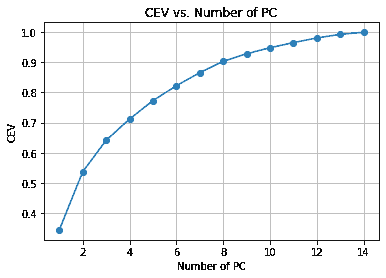

# 探索无监督学习指标

> 原文：[`www.kdnuggets.com/2023/04/exploring-unsupervised-learning-metrics.html`](https://www.kdnuggets.com/2023/04/exploring-unsupervised-learning-metrics.html)


图片由 [rawpixel](https://www.freepik.com/free-vector/global-communication-background-business-network-vector-design_19585255.htm#query=clustering&position=2&from_view=search&track=sph) 提供，来源于 [Freepik](https://www.freepik.com/)

无监督学习是机器学习的一个分支，其中模型从可用数据中学习模式，而不是提供实际标签。我们让算法自己得出答案。

* * *

## 我们的前三个课程推荐

 1\. [Google 网络安全证书](https://www.kdnuggets.com/google-cybersecurity) - 快速进入网络安全职业生涯。

 2\. [Google 数据分析专业证书](https://www.kdnuggets.com/google-data-analytics) - 提升你的数据分析能力

 3\. [Google IT 支持专业证书](https://www.kdnuggets.com/google-itsupport) - 支持你的组织 IT 工作

* * *

在无监督学习中，有两种主要技术：聚类和降维。聚类技术使用算法学习模式以分割数据。而降维技术则试图减少特征数量，同时尽可能保留实际信息。

一个用于聚类的示例算法是 K-Means，用于降维的算法是 PCA。这些是无监督学习中使用最多的算法。然而，我们很少讨论评估无监督学习的指标。尽管它很有用，我们仍然需要评估结果以了解输出是否准确。

本文将讨论用于评估无监督机器学习算法的指标，并分为两个部分：聚类算法指标和降维指标。让我们深入了解。

# 聚类算法指标

我们不会详细讨论聚类算法，因为这不是本文的重点。相反，我们将重点关注用于评估的指标示例以及如何评估结果。

本文将使用 [Kaggle 的葡萄酒数据集](https://www.kaggle.com/datasets/harrywang/wine-dataset-for-clustering) 作为数据集示例。首先读取数据，然后使用 K-Means 算法对数据进行分段。

```py
import pandas as pd
from sklearn.cluster import KMeans
df = pd.read_csv('wine-clustering.csv')

kmeans = KMeans(n_clusters=4, random_state=0)
kmeans.fit(df)
```

我将集群数量初始化为 4，这意味着我们将数据分成 4 个集群。这是正确的集群数量吗？还是有更合适的集群数量？通常，我们可以使用称为**肘部法则**的技术来找到适当的集群数量。让我在下面展示代码。

```py
wcss = []
for k in range(1, 11):
    kmeans = KMeans(n_clusters=k, random_state=0)
    kmeans.fit(df)
    wcss.append(kmeans.inertia_)

# Plot the elbow method
plt.plot(range(1, 11), wcss, marker='o')
plt.xlabel('Number of Clusters (k)')
plt.ylabel('WCSS')
plt.title('Elbow Method')
plt.show()
```



在肘部法中，我们使用 WCSS 或簇内平方和来计算数据点与各自簇的质心之间的平方距离之和，针对不同的 k（簇）。最佳的 k 值预计是 WCSS 减少最多的值，或者上图中的肘部，即 2。

但是，我们可以扩展肘部法来使用其他指标来找到最佳的 k 值。如何让算法自动找到簇的数量而不依赖于质心呢？是的，我们也可以使用类似的指标来评估它们。

作为备注，我们可以假设一个簇的质心是数据均值，即使我们没有使用 K-Means 算法。因此，任何不依赖于质心的算法在进行数据分割时，仍然可以使用依赖于质心的任何指标进行评估。

## 轮廓系数

轮廓系数是一种聚类技术，用于衡量簇内数据与其他簇数据的相似性。轮廓系数是一个从 -1 到 1 的数值表示。值为 1 表示每个簇与其他簇完全不同，而值为 -1 表示所有数据都被分配到了错误的簇中。值为 0 表示数据中没有有意义的簇。

我们可以使用以下代码来计算轮廓系数。

```py
# Calculate Silhouette Coefficient
from sklearn.metrics import silhouette_score

sil_coeff = silhouette_score(df.drop("labels", axis=1), df["labels"])
print("Silhouette Coefficient:", round(sil_coeff, 3))
```

轮廓系数：0.562

我们可以看到，以上的分割具有正的轮廓系数，这意味着各个簇之间有一定的分离度，尽管仍然会发生一些重叠。

## Calinski-Harabasz 指数

Calinski-Harabasz 指数或方差比准则是一个用于评估簇质量的指标，通过测量簇间离散度与簇内离散度的比率来评估。基本上，我们测量了簇之间的数据平方距离总和与簇内部的数据距离的差异。

Calinski-Harabasz 指数的分数越高越好，这意味着簇之间的分离度越好。然而，分数没有上限，这意味着这个指标更适合用于评估不同的 k 值，而不是直接解释结果。

让我们使用 Python 代码来计算 Calinski-Harabasz 指数分数。

```py
# Calculate Calinski-Harabasz Index
from sklearn.metrics import calinski_harabasz_score

ch_index = calinski_harabasz_score(df.drop('labels', axis=1), df['labels'])
print("Calinski-Harabasz Index:", round(ch_index, 3))
```

Calinski-Harabasz 指数：708.087

对 Calinski-Harabasz 指数的另一个考虑是该指数对簇的数量非常敏感。更多的簇可能会导致更高的分数。因此，最好将其他指标与 Calinski-Harabasz 指数一起使用，以验证结果。

## Davies-Bouldin 指数

Davies-Bouldin 指数是一种聚类评估指标，通过计算每个簇与其最相似簇之间的平均相似性来测量。这个比率计算簇内距离与簇间距离的比值。这意味着簇之间越远且分散越少，会导致更好的分数。

与之前的指标相比，戴维斯-鲍尔丁指数旨在尽可能降低得分。得分越低，每个聚类的分离度越高。让我们使用 Python 示例来计算这个得分。

```py
# Calculate Davies-Bouldin Index
from sklearn.metrics import davies_bouldin_score

dbi = davies_bouldin_score(df.drop('labels', axis=1), df['labels'])
print("Davies-Bouldin Index:", round(dbi, 3))
```

戴维斯-鲍尔丁指数：0.544

我们不能仅凭上述得分来判断其好坏，因为类似于之前的指标，我们仍然需要使用各种指标来支持结果评估。

# 降维指标

与聚类不同，降维的目标是减少特征数量，同时尽可能保留原始信息。因此，许多降维评估指标都关注信息保留。让我们使用 PCA 来减少维度，并看看这些指标的效果。

```py
from sklearn.decomposition import PCA
from sklearn.preprocessing import StandardScaler

#Scaled the data
scaler = StandardScaler()
df_scaled = scaler.fit_transform(df)

pca = PCA()
pca.fit(df_scaled)
```

在上述示例中，我们对数据进行了主成分分析（PCA），但尚未减少特征的数量。相反，我们希望使用**累计解释方差**来评估降维和方差之间的权衡。这是一个常见的降维指标，用于查看在每次减少特征时信息的保留情况。

```py
#Calculate Cumulative Explained Variance
cev = np.cumsum(pca.explained_variance_ratio_)

plt.plot(range(1, len(cev) + 1), cev, marker='o')
plt.xlabel('Number of PC')
plt.ylabel('CEV')
plt.title('CEV vs. Number of PC')
plt.grid()
```



从上述图表中，我们可以看到保留的主成分数量与解释方差的关系。作为经验法则，我们通常选择保留约 90-95%的主成分进行降维，因此如果遵循上述图表，大约 14 个特征会减少到 8 个。

让我们查看其他指标以验证我们的降维效果。

## 可信度

可信度是对降维技术质量的衡量指标。这个指标衡量的是降维后数据的最近邻保持了多少原始数据的特征。

基本上，这个指标试图查看降维技术在保持原始数据的局部结构方面做得如何。

可信度指标范围从 0 到 1，其中值越接近 1，表示在降维数据点附近的邻居在原始维度中也大多接近。

让我们使用 Python 代码计算可信度指标。

```py
from sklearn.manifold import trustworthiness

# Calculate Trustworthiness. Tweak the number of neighbors depends on the dataset size.
tw = trustworthiness(df_scaled, df_pca, n_neighbors=5)
print("Trustworthiness:", round(tw, 3))
```

可信度：0.87

## 萨蒙映射

萨蒙映射是一种非线性降维技术，旨在在降维过程中保留高维度的成对距离。其目标是使用萨蒙应力函数来计算原始数据和降维空间之间的成对距离。

萨蒙应力函数的得分越低越好，因为它表示成对保留情况越好。让我们尝试使用 Python 代码示例。

首先，我们需要安装一个额外的萨蒙映射包。

```py
pip install sammon-mapping
```

然后我们将使用以下代码计算萨蒙的应力。

```py
# Calculate Sammon's Stress
from sammon import sammon

pca_res, sammon_st = sammon.sammon(np.array(df))

print("Sammon's Stress:", round(sammon_st, 5))
```

萨蒙应力：1e-05

结果显示了一个较低的萨蒙得分，这意味着数据的保留情况良好。

# 结论

无监督学习是机器学习的一个分支，它尝试从数据中学习模式。与监督学习相比，输出评估可能不会有太多讨论。本文中，我们尝试学习一些无监督学习指标，包括：

1.  簇内平方和

1.  轮廓系数

1.  Calinski-Harabasz 指数

1.  Davies-Bouldin 指数

1.  累积解释方差

1.  可信度

1.  Sammon 映射

**[Cornellius Yudha Wijaya](https://www.linkedin.com/in/cornellius-yudha-wijaya/)** 是一位数据科学助理经理和数据撰稿人。在全职工作于 Allianz Indonesia 的同时，他喜欢通过社交媒体和写作媒体分享 Python 和数据技巧。

### 相关主题更多内容

+   [无监督分离表示学习在类别不平衡数据集中的应用](https://www.kdnuggets.com/2023/01/unsupervised-disentangled-representation-learning-class-imbalanced-dataset-elastic-infogan.html)

+   [使用 scikit-learn 进行聚类：无监督学习教程](https://www.kdnuggets.com/2023/05/clustering-scikitlearn-tutorial-unsupervised-learning.html)

+   [揭示无监督学习](https://www.kdnuggets.com/unveiling-unsupervised-learning)

+   [无监督学习实践：K 均值聚类](https://www.kdnuggets.com/handson-with-unsupervised-learning-kmeans-clustering)

+   [机器学习评估指标：理论与概述](https://www.kdnuggets.com/machine-learning-evaluation-metrics-theory-and-overview)

+   [分类问题的更多性能评估指标](https://www.kdnuggets.com/2020/04/performance-evaluation-metrics-classification.html)
