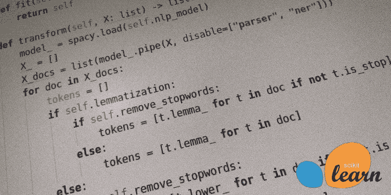

# 如何扩展 scikit-learn 并为你的机器学习工作流程带来理智

> 原文：[`www.kdnuggets.com/2019/10/extend-scikit-learn-bring-sanity-machine-learning-workflow.html`](https://www.kdnuggets.com/2019/10/extend-scikit-learn-bring-sanity-machine-learning-workflow.html)

评论

**由 [Déborah Mesquita](https://www.deborahmesquita.com/)，数据科学家**

我们通常听到（并且说）机器学习只是统计学的商业名称。这可能是真的，但如果我们使用计算机构建模型，那么机器学习实际上包括统计学 *和* **软件工程**。

> ### 想要做出伟大的产品：像你这样的优秀工程师一样做机器学习，而不是像你不具备的伟大机器学习专家一样 - 《机器学习规则：ML 工程的最佳实践》 [1]

统计学和软件工程的结合给软件工程领域带来了新的挑战。微软研究人员指出，在 ML 领域开发应用程序与先前的软件应用领域有根本的不同 [2]。

当你不在大公司工作或刚刚入门这个领域时，学习和应用软件工程最佳实践是困难的，因为找到这些信息并不容易。幸运的是，开源项目可以是一个很好的知识来源，并帮助我们解决从比我们有更多经验的人那里学习的需求。我最喜欢的 ML 库之一（也是知识来源）是 **Scikit-learn**。

这个项目在提供易用接口的同时也提供了稳固的实现，是进入 ML 领域的绝佳起点，也是行业中使用的工具。使用 scikit-learn 工具，甚至阅读维护者在 Github 上的问题讨论中的回答，是学习的好方法。Scikit 拥有来自行业和学术界的大量贡献者，因此这些人所做的贡献其知识会被“嵌入”到库中。scikit-learn 项目的一个经验法则是用户代码不应绑定于 scikit-learn —— 这是一个库，而不是一个框架 [3]。这使得扩展 scikit 功能以适应我们的需求变得容易。

今天我们将学习如何构建一个自定义转换器，并学习如何使用它来构建管道。这样，我们的代码变得易于维护和重用，这是软件工程最佳实践的两个方面。

### scikit-learn API

如果你对 scikit-learn 熟悉，你可能知道如何使用估算器和转换器等对象，但把它们的定义正式化是有益的，这样我们可以在其基础上进行构建。基本 API 包含三个接口（一个类可以实现多个接口）：

+   估算器 - 基础对象，实现 fit() 方法

+   预测器 - 进行预测的接口，实现 predict() 方法

+   transformer - 数据转换接口，实现了 transform() 方法

Scikit-learn 提供了许多开箱即用的转换器和预测器，但我们经常需要以不同的方式转换数据。使用转换器接口构建自定义转换器使我们的代码更具可维护性，我们还可以将新的转换器与其他 scikit 对象（如 Pipeline 和 RandomSearchCV 或 GridSearchCV）一起使用。我们来看看如何做到这一点。所有代码可以在[这里](https://github.com/dmesquita/extending-scikit)找到。

### 构建自定义转换器

有两种类型的转换器：无状态转换器和有状态转换器。无状态转换器*独立对待样本*，而有状态转换器*依赖于之前的数据*。如果我们需要有状态的转换器，则在 fit() 方法中保存状态。无状态和有状态转换器都应返回自身。

大多数自定义转换器的示例使用 numpy 数组，所以我们尝试一些不同的，构建一个使用 spaCy 模型的转换器。我们的目标是创建一个文档分类模型。我们想知道词形还原和去除停用词是否能提高模型的性能。RandomSearchCV 和 GridSearchCV 非常适合用来实验不同的参数是否能提高模型性能。

当我们创建一个继承自 BaseEstimator 类的转换器类时，我们会自动获得 get*parameters() 和 set*parameters() 方法，这使得我们可以在搜索中使用新的转换器以找到最佳参数值。但为此我们需要遵循一些规则 [4]：

+   **init**() 接受的关键字参数的名称应**对应**实例上的属性。

+   所有参数都应该具有**敏感的默认值**，这样用户可以简单地调用 EstimatorName() 实例化一个估计器。

+   验证应在*参数被使用的地方*进行；这意味着**init**()上不应有任何逻辑（即使是输入验证也不行）。

我们需要的参数是 spaCy 语言模型、词形还原和去除停用词。

### 使用 scikit-learn 管道

在机器学习中，许多任务可以表示为**数据的序列或组合转换** [3]。管道提供了我们预处理步骤的清晰概览，将一系列估计器转化为一个单一的估计器。使用管道也是确保在训练、交叉验证或做出预测时始终执行完全相同步骤的一种方式。

管道的每个步骤都应实现 transform() 方法。为了创建模型，我们将使用新的转换器、TfidfVectorizer 和 RandomForestClassifier。这些步骤将转化为管道步骤。这些步骤被定义为元组，其中第一个元素是步骤的名称，第二个元素是估计器对象本身。

这样，我们可以使用管道对象来调用 fit()和 predict()方法，例如 text*pipeline.fit(train, labels)*和 text*clf.predict(data)*。我们可以使用管道最后一步实现的所有方法，因此我们还可以调用 text*clf.predict_proba(data)*来获取 RandomForestClassifier 的概率得分。

### 使用 GridSearchCV 寻找最佳参数

使用 GridSearchCV，我们可以在可能值的网格上进行详尽的最佳参数搜索（RandomizedSearchCV 是非详尽的替代方案）。为此，我们定义一个参数字典，其中键应该是**name_of_pipeline_step*__*parameter_name**，值应该是我们想尝试的参数值的列表。

RandomizedSearchCV 也是一个估算器，因此我们可以使用创建 RandomizedSearchCV 对象时使用的估算器的所有方法（scikit API 确实非常一致）。

### 主要内容

机器学习面临着软件工程领域不熟悉的挑战。构建实验是我们工作流程的一个重要部分，而使用凌乱的代码通常不会有好的结果。当我们扩展 scikit-learn 并使用这些组件来编写实验时，我们使得维护代码库的任务变得更容易，为我们日常工作带来理智。

**参考文献**

[1] [`developers.google.com/machine-learning/guides/rules-of-ml`](https://developers.google.com/machine-learning/guides/rules-of-ml)

[2] [`www.microsoft.com/en-us/research/uploads/prod/2019/03/amershi-icse-2019*Software*Engineering*for*Machine_Learning.pdf`](https://www.microsoft.com/en-us/research/uploads/prod/2019/03/amershi-icse-2019_Software_Engineering_for_Machine_Learning.pdf)

[3] [`arxiv.org/pdf/1309.0238.pdf`](https://arxiv.org/pdf/1309.0238.pdf)

[4] [`scikit-learn.org/stable/developers/contributing.html#apis-of-scikit-learn-objects`](https://scikit-learn.org/stable/developers/contributing.html#apis-of-scikit-learn-objects)

**简介：[Déborah Mesquita](https://www.deborahmesquita.com/)** ([linkedin.com/in/deborahmesquita](http://linkedin.com/in/deborahmesquita))是一个热爱写作的数据科学家。她喜欢认为自己是一个多才多艺的数据科学家，但事实是她还需要学习很多统计学知识。

**相关内容：**

+   将 sklearn 训练速度提高 100 倍

+   使用 Optimus 进行数据科学，第一部分：简介

+   使用 d6tflow 构建可扩展深度学习管道的 5 步指南

* * *

## 我们的三大课程推荐

 1\. [谷歌网络安全证书](https://www.kdnuggets.com/google-cybersecurity) - 快速进入网络安全职业的捷径。

 2\. [Google 数据分析专业证书](https://www.kdnuggets.com/google-data-analytics) - 提升你的数据分析能力

 3\. [Google IT 支持专业证书](https://www.kdnuggets.com/google-itsupport) - 支持你的组织的 IT

* * *

### 了解更多相关话题

+   [Web LLM: 将 LLM 聊天机器人带到浏览器](https://www.kdnuggets.com/2023/05/webllm-bring-llm-chatbots-browser.html)

+   [通过 Scikit-learn 管道简化你的机器学习工作流程](https://www.kdnuggets.com/streamline-your-machine-learning-workflow-with-scikit-learn-pipelines)

+   [7 个 GPT 助力提升你的数据科学工作流程](https://www.kdnuggets.com/7-gpts-to-help-improve-your-data-science-workflow)

+   [轻松将 LLM 集成到你的 Scikit-learn 工作流程中，使用 Scikit-LLM](https://www.kdnuggets.com/easily-integrate-llms-into-your-scikit-learn-workflow-with-scikit-llm)

+   [5 门 Google MLOps 课程，提升你的 ML 工作流程](https://www.kdnuggets.com/5-mlops-courses-from-google-to-level-up-your-ml-workflow)

+   [RAPIDS cuDF 加速你的下一个数据科学工作流程](https://www.kdnuggets.com/2023/04/rapids-cudf-speed-next-data-science-workflow.html)
