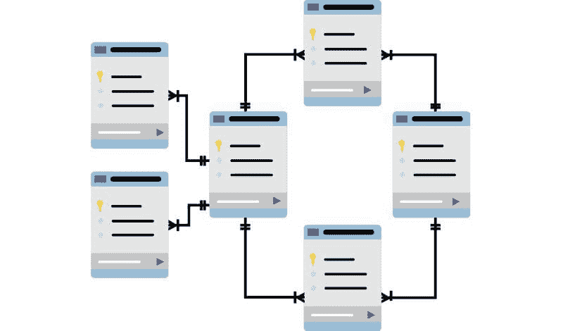

# 一步一步做：生成真实的合成客户数据集

> 原文：[`www.kdnuggets.com/2022/01/fake-realistic-synthetic-customer-datasets-projects.html`](https://www.kdnuggets.com/2022/01/fake-realistic-synthetic-customer-datasets-projects.html)



图片由 [mcmurryjulie 在 Pixabay](https://pixabay.com/users/mcmurryjulie-2375405/) 提供

能够在项目中创建和使用合成数据已经成为数据科学家的必备技能。

* * *

## 我们的前三大课程推荐

 1\. [Google 网络安全证书](https://www.kdnuggets.com/google-cybersecurity) - 快速进入网络安全职业轨道。

 2\. [Google 数据分析专业证书](https://www.kdnuggets.com/google-data-analytics) - 提升你的数据分析能力

 3\. [Google IT 支持专业证书](https://www.kdnuggets.com/google-itsupport) - 支持你的组织在 IT 方面

* * *

我之前[写过](https://www.kdnuggets.com/2021/11/easy-synthetic-data-python-faker.html)关于使用 Python 库**Faker**来创建自己的合成数据集。为了避免重复那篇文章的内容，让我们将此视为生成合成数据系列的第二篇。这次，让我们生成一些虚假的客户订单数据。

如果你对 Faker 一无所知，不知道它是如何使用的或可以做什么，我建议你首先查看之前的文章。

# 计划

计划是合成一组缩小版的表，这些表将在实际业务场景的客户订单系统中使用。

除了购买项目之外，我们还要考虑这种情况下需要什么。

+   **客户** - 不出意外的是，如果你要建立一个跟踪客户订单的系统，你需要客户。

+   **信用卡** - 客户需要支付账单，在我们简化的场景中，他们只能通过信用卡支付。

+   **订单** - 一个订单将包括一个客户、一笔费用和一个信用卡用于支付。

这是我们需要的数据，所以这就是我们要生成的数据。在完成这一过程后，你可能会发现使其更稳健、更详细、更贴近现实的方法，你应该能够自行完成。

# 导入和辅助函数

让我们开始吧。首先，进行导入。

```py
from faker import Faker
import faker.providers.credit_card
import pandas as pd

import random
from random import randint
```

接下来，让我们编写几个稍后会用到的辅助函数。

```py
def random_n_digits(n):
    range_start = 10**(n-1)
    range_end = (10**n)-1
    return randint(range_start, range_end)

def unique_rand(rands, n):
    new_int = random_n_digits(n)
    if new_int not in rands:
        rands.append(new_int)
    else:
        unique_rand(rands, n)
    return new_int, rands

def generate_cost():
    cost = ''
    digits = randint(1, 4)
    cost += str(random_n_digits(digits))
    cost += '.' + str(random_n_digits(2))
    return cost
```

第一个函数，**`random_n_digits`**，将用于生成长度为 `n` 的随机整数。参考 [这个 StackOverflow 答案](https://stackoverflow.com/questions/2673385/how-to-generate-a-random-number-with-a-specific-amount-of-digits)，请参见下面的示例：

```py
def random_n_digits(n):
    range_start = 10**(n-1)
    range_end = (10**n)-1
    return randint(range_start, range_end)

print(random_n_digits(3))
print(random_n_digits(5))
print(random_n_digits(10))
```

```py
745
98435
7629340561
```

这将对诸如客户和订单编号等标识符非常有用。

接下来的函数，**`unique_rand()`**，将用于确保生成的标识符在我们的系统中是唯一的。它简单地接受一个整数列表和一个表示新整数长度的整数，使用前面的函数创建一个这个长度的新整数，将这个新整数与唯一列表进行比较，如果这个新整数也唯一，它就会被添加到列表中。

最终函数的实用性通过其名称`**generate_cost()**`来体现。要生成一个费用，该函数随机生成一个介于 1 到 4 之间的整数，这将成为我们生成的费用的美元位数的字符串长度。然后使用 random_n_digits() 生成该长度的整数。之后，重复这个过程生成一个 2 位整数，这将成为费用的小数部分，位于小数点的右侧。将这两个部分组合在一起并返回。

现在让我们继续伪造吧。


不用担心，连 Elaine 都在伪造。

# 创建客户

这样，我们来生成客户。我们的 10,000 位客户将包括以下属性：

+   客户 ID (`cust_id`) - 使用上述辅助函数生成

+   客户姓名 (`name`) - 使用 Faker 生成；`use_weighting=True` 表示尝试使生成值的频率匹配真实世界的频率（“Lisa”将比“Braelynn”更频繁地生成）；locales 表示生成名字的来源

+   客户地址 (`address`) - 使用 Faker 生成

+   客户电话号码 (`phone_number`) - 使用 Faker 生成

+   客户出生日期 (`dob`) - 使用 Faker 生成

+   客户备注文本字段 (`note`) - 使用 Faker 生成

代码还会将生成的唯一客户 ID (`cust_ids`) 作为列表存储，以便将新生成的 ID 与现有的进行比较，确保唯一性。之后，将用于存储客户数据的字典传递到新的 Pandas DataFrame 中，最终存储到 CSV 文件中。

```py
fake = Faker(['en_US', 'en_UK', 'it_IT', 'de_DE', 'fr_FR'], use_weighting=True)

customers = {}
cust_ids = []

for i in range(0, 10000):
    customers[i]={}
    customers[i]['cust_id'], cust_ids = unique_rand(cust_ids, 8)
    customers[i]['name'] = fake.name()
    customers[i]['address'] = fake.address().replace('\n', ', ')
    customers[i]['phone_number'] = fake.phone_number()
    customers[i]['dob'] = fake.date()
    customers[i]['note'] = fake.text().replace('\n', ' ')

customer_df = pd.DataFrame(customers).T
print(customer_df)

customer_df.to_csv('customer_data.csv', index=False)
```

```py
       cust_id                 name  \
0     52287029            Jay Brown   
1     85688731    Frédérique Martel   
2     95499535      Georges Leclerc   
3     28715621  Christian Carpenter   
4     94472217       Lorraine Watts   
...        ...                  ...   
9995  70168635       Léon Couturier   
9996  10483280       Vincent Nelson   
9997  41868059           Gert Klapp   
9998  28049517    Simonetta Garrone   
9999  26781527      Alessio Camanni   

                                                address       phone_number  \
0     Flat 9, Hart islands, East Elliotchester, DY6N...       0117 4960802   
1             boulevard Chevalier, 93506 BourgeoisBourg  625.665.4731x5846   
2                    43 Poole way, Taylorstad, KW45 0FT         0780881522   
3     Rotonda Olivetti 99, Sandro salentino, 48332 L...      (00960) 04254   
4              Jolanda-Seifert-Allee 113, 91518 Koblenz    +39 353 5623602   
...                                                 ...                ...   
9995  Strada Molesini 3 Appartamento 32, Ariasso ven...   +44(0)1214960433   
9996                         Trubring 86, 28785 Ansbach  +33 5 61 32 08 79   
9997  Strada Casarin 01 Piano 8, Settimo Giovanni ne...    +39 695 7780253   
9998        Marga-Trubin-Straße 2/4, 13495 Feuchtwangen     (07310) 491854   
9999  avenue Susanne Berthelot, 70292 Poirier-sur-Ra...       0114 4960083   

             dob                                               note  
0     2004-08-20  Interroger dormir but remercier atteindre juge...  
1     2009-07-08  Semblable tout désert dominer lutte. Quart mêm...  
2     2021-04-17  Occaecati occaecati temporibus a asperiores di...  
3     1999-05-03  Rem itaque maxime dolor eum omnis. Eligendi qu...  
4     1997-06-02  Doloremque ut illo sunt. Modi non autem conseq...  
...          ...                                                ...  
9995  1981-06-06  Language state white receive soon. Usually tru...  
9996  2020-01-03  Similique quasi eos pariatur consequatur liber...  
9997  2018-10-13  Voluptatum exercitationem omnis rem. Beatae al...  
9998  1983-02-09  Treat vote poor church area discuss carry argu...  
9999  1987-02-06  Go remember center toward real food section. S...  

[10000 rows x 6 columns]
```

# 创建信用卡

客户需要一种支付订单的方法，因此我们给他们所有人都配备信用卡。

实际上，为了简化，我们将生成信用卡而不分配给任何特定客户。相反，我们将仅仅将客户和卡片匹配用于订单。你可以稍加创新，修改此方法将卡片分配给客户，并确保订单使用正确的卡片支付。我将把这留给有兴趣的读者作为练习。

下面你将发现唯一的信用卡号码是使用与唯一客户 ID 相同的辅助函数和基本方法生成的。信用卡号码人为地较短，但你可以按需增加长度。其余数据使用 Faker 生成。数据随后被输入到 Pandas DataFrame 中，并保存为 CSV 文件以备后用。

```py
credit_cards = {}
cc_ids = []

for i in range(0, 10000):
    credit_cards[i]={}
    credit_cards[i]['cc_id'], cc_ids = unique_rand(cc_ids, 5)
    credit_cards[i]['type'] = fake.credit_card_provider()
    credit_cards[i]['number'] = fake.credit_card_number()
    credit_cards[i]['ccv'] = fake.credit_card_security_code()
    credit_cards[i]['expire'] = fake.credit_card_expire()

credit_cards_df = pd.DataFrame(credit_cards).T
print(credit_cards_df)

credit_cards_df.to_csv('credit_card_data.csv', index=False)
```

```py
      cc_id           type            number  ccv expire
0     33257   JCB 16 digit   213177754612892  121  11/24
1     86707  VISA 16 digit  6573538482942722  042  11/31
2     96668  VISA 16 digit  4780281393619055  671  01/23
3     73749  VISA 16 digit  3520725757002891  319  04/28
4     26342  VISA 13 digit    30141856563149  495  10/29
...     ...            ...               ...  ...    ...
9995  14141  VISA 13 digit     4617204802844  640  04/27
9996  35599        Maestro      639006455203  384  12/21
9997  46479  VISA 16 digit      503885514391  587  08/24
9998  78536  VISA 19 digit     4789890563459  057  07/22
9999  84649     Mastercard  3590096870674031  874  04/31

[10000 rows x 5 columns]
```

# 创建订单

现在我们来赚点钱吧。

订单将以与之前的客户 ID 和信用卡号码相同的方式保持唯一。我们将随机链接一个客户和一个信用卡到一个订单中，并使用之前介绍的第三个辅助函数生成一个随机费用。

在已成为常见管道的过程中，我们创建了一个字典的 Pandas DataFrame，并将数据保存为 CSV 文件。

```py
orders = {}
order_ids = []

for i in range(0, 1000):
    orders[i]={}
    orders[i]['order_id'], order_ids = unique_rand(order_ids, 10)
    orders[i]['cust_id'] = random.choice(cust_ids)
    orders[i]['cc_id'] = random.choice(cc_ids)
    orders[i]['cost'] = generate_cost()

orders_df = pd.DataFrame(orders).T
print(orders_df)

orders_df.to_csv('orders.csv', index=False)
```

```py
       order_id   cust_id  cc_id     cost
0    9526379779  21484387  95840  6471.85
1    6999189530  90073074  75578     5.31
2    6124881941  84882923  13358   962.21
3    7476579071  91911770  22301    60.82
4    4102308607  60614412  28339  8086.96
..          ...       ...    ...      ...
995  2021016579  42107923  24863  4165.62
996  9279206414  49397693  45436     1.27
997  3378899620  40173623  96470    32.64
998  2222207181  73076539  40697  9701.29
999  1040242247  17749465  66052     9.63

[1000 rows x 4 columns]
```

结果是你应该拥有三个 CSV 文件，这些文件构成了对实际业务流程的真实世界模拟。

现在你打算怎么处理这些合成数据？发挥你的创造力。你*可以*做一些研究，学习一些新技术或概念，或者进行一个项目。一些更具体的想法包括：使用 Python 将这些数据创建成 SQL 数据库，然后练习你的 SQL 技能；执行一个数据探索项目；以有趣的方式可视化一些合成数据；看看你能想出什么样的数据预处理方法，例如将客户姓名拆分为名和姓，验证每个客户是否有信用卡，确保小孩无法进行购买。

记住：继续伪装下去。

**[Matthew Mayo](https://www.linkedin.com/in/mattmayo13/)** （[**@mattmayo13**](https://twitter.com/mattmayo13)）是一名数据科学家，并且是 KDnuggets 的主编，这是一个开创性的在线数据科学和机器学习资源。他的兴趣包括自然语言处理、算法设计与优化、无监督学习、神经网络以及机器学习的自动化方法。Matthew 拥有计算机科学硕士学位和数据挖掘研究生文凭。他可以通过 editor1 at kdnuggets[dot]com 与他联系。

### 更多相关话题

+   [使用稳定扩散生成超现实面孔的 3 种方法](https://www.kdnuggets.com/3-ways-to-generate-hyper-realistic-faces-using-stable-diffusion)

+   [你需要合成数据的 5 个理由](https://www.kdnuggets.com/2023/02/5-reasons-need-synthetic-data.html)

+   [检测假数据科学家的 20 个问题（含答案）：ChatGPT…](https://www.kdnuggets.com/2023/01/20-questions-detect-fake-data-scientists-chatgpt-1.html)

+   [检测假数据科学家的 20 个问题（含答案）：ChatGPT…](https://www.kdnuggets.com/2023/02/20-questions-detect-fake-data-scientists-chatgpt-2.html)

+   [如何利用合成数据克服机器学习模型训练中的数据短缺](https://www.kdnuggets.com/2022/03/synthetic-data-overcome-data-shortages-machine-learning-model-training.html)

+   [如何生成合成表格数据集](https://www.kdnuggets.com/2022/03/generate-tabular-synthetic-dataset.html)
