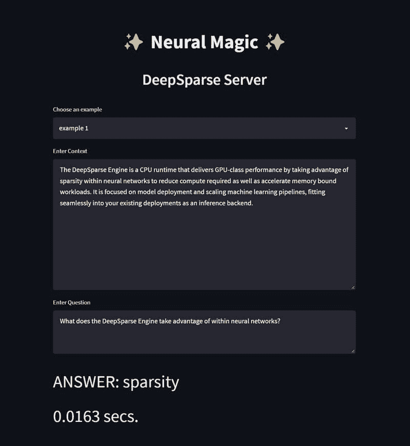
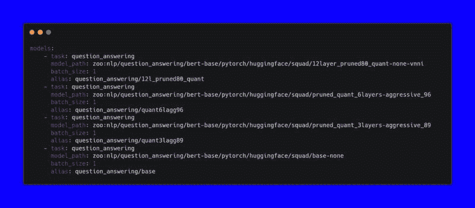
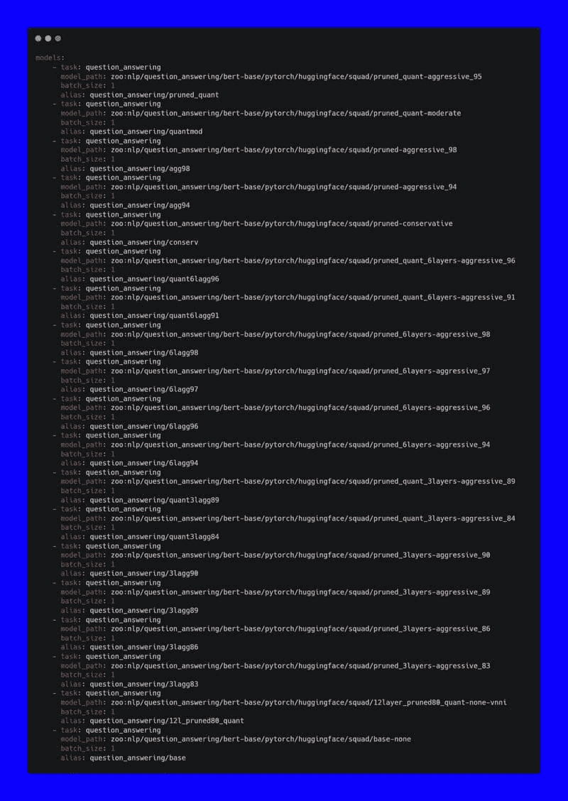
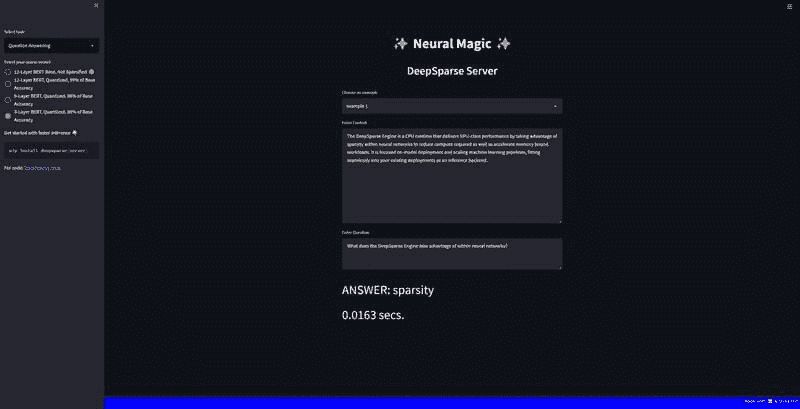

# **BERT**在稀疏性下能有多快？

> 原文：[`www.kdnuggets.com/2022/04/fast-bert-go-sparsity.html`](https://www.kdnuggets.com/2022/04/fast-bert-go-sparsity.html)

# 这里有一个小秘密

如果你想分析 19 个稀疏 BERT 模型的推理速度，你只需一个 YAML 文件和 16GB 的 RAM 即可。剧透警告：

… 它们在 CPU 上运行。

… 而且它们超级快！



Neural Magic 最新的[**DeepSparse**](https://github.com/neuralmagic/deepsparse)库中的功能是 DeepSparse Server！本文的目的是展示如何无缝服务多达 19 个稀疏 BERT 模型，以及稀疏性对模型性能的影响。简要背景，稀疏化是指在训练好的深度学习模型中去除冗余信息，从而得到一个更快、更小的模型。对于本次演示，我们将使用各种 BERT 模型并加载它们进行推理，以展示准确性与速度之间的权衡。

DeepSparse Server 建立在我们的 DeepSparse Engine 和流行的 FastAPI 网络框架之上，允许任何人在 CPU 上以 GPU 级别的速度部署稀疏模型！通过 DeepSparse Engine，我们可以集成到流行的深度学习库中（如 Hugging Face、Ultralytics），使你能够使用 ONNX 部署稀疏模型。

如前所述，运行模型所需的所有配置只需要一个 YAML 文件和少量内存（多亏了稀疏性）。要快速开始服务四个在问答任务上训练的 BERT 模型，这就是配置 YAML 文件的样子：



config.yaml

如果你想大规模加载所有 19 个 Neural Magic 稀疏 BERT 模型：配置文件将是这样的??：



为了方便使用，我们在 Streamlit 上构建了一个演示，以便任何人都可以演示服务器和用于 NLP 问答任务的模型。为了同时测试 19 个模型，该应用程序在 Google Cloud Platform 上的虚拟机上进行了测试。

为了让你了解我在测试中使用的计算方法，这里是一些详细信息：

```py
Specs:
  - Cloud Vendor: Google Cloud Platform
  - Instance:     c2-standard-4
  - CPU Type:     Intel Cascade Lake
  - Num of vCPUs: four
  - RAM:          16GB
```

*请记住，在相同的计算约束下，裸金属机器实际上会表现得更快。然而，由于模型已经非常快，我觉得通过虚拟化展示它们的速度是可以的。*

我们不仅强烈鼓励你在虚拟机上运行相同的测试来基准测试性能，还因为你需要足够的 RAM 来加载所有 19 个 BERT，否则你会遇到这个??：

如果你希望在本地机器上快速启动而无需担心内存不足的问题，你应该尝试只加载几个模型到内存中。以下代码将演示如何使用 4 个模型来完成这个操作（尽管大多数稀疏模型非常轻便，你也可以根据需要添加更多）。

# 使用 SparseServer.UI 入门

我们将应用程序分成了独立的服务器和客户端目录。服务器目录包含用于加载模型的 YAML 文件，而客户端目录则包含 Streamlit 应用的逻辑：

```py
~sparseserver-ui/
         |__client/
            |__app.py
            |__pipelineclient.py
            |__samples.py
            |__settings.py     
         |__server/
            |__big-config.yaml
            |__config.yaml
         |__requirements.txt
         |__README.md
```

## 1\. 克隆 DeepSparse 仓库：

```py
>>> git clone [`github.com/neuralmagic/deepsparse.git`](https://github.com/neuralmagic/deepsparse.git)
```

## 2\. 安装 DeepSparse 服务器和 Streamlit：

```py
>>> cd deepsparse/examples/sparseserver-ui>>> pip install -r requirements.txt
```

在运行服务器之前，你可以在我们的启动 CLI 命令中配置`host`和`port`参数。如果你选择使用默认设置，它将会在`localhost`上运行服务器，并使用端口`5543`。有关 CLI 参数的更多信息，请运行：

```py
>>> deepsparse.server --help
```

## 3\. 运行 DeepSparse 服务器：

好的！现在是时候服务`config.yaml`中定义的所有模型了。这个 YAML 文件将从 Neural Magic 的[SparseZoo](https://sparsezoo.neuralmagic.com/?domain=nlp&sub_domain=question_answering&page=1)下载四个模型??。

```py
>>> deepsparse.server --config_file server/config.yaml
```

下载模型并且服务器运行后，打开第二个终端来测试客户端。

*如果你在第一次运行服务器时修改了*`host`*和*`port`*配置，请在*pipelineclient.py*模块中也相应调整这些变量。*

## 4\. 运行 Streamlit 客户端：

```py
>>> streamlit run client/app.py --browser.serverAddress="localhost"
```

就这样！点击终端中的 URL，你就可以开始与演示进行交互了。你可以从列表中选择示例，或者添加你自己的上下文和问题。



未来，我们将扩展 NLP 任务的范围，不仅仅局限于问答，以便你能在稀疏性上获得更广泛的性能。

完整代码：查看[SparseServer.UI](https://github.com/neuralmagic/deepsparse/tree/main/examples/sparseserver-ui)…

…并且不要忘记给 DeepSparse 仓库一个 GitHub ⭐！

**[Ricky Costa](https://www.linkedin.com/in/ricky-costa-nlp/)** 专注于[Neural Magic](https://neuralmagic.com/)的用户界面。

[原文](https://pub.towardsai.net/sparse-transformers-a-demo-58b6b1ebf3e4)。经许可转载。

* * *

## 我们的三大推荐课程

 1\. [谷歌网络安全证书](https://www.kdnuggets.com/google-cybersecurity) - 快速开启网络安全职业生涯。

 2\. [谷歌数据分析专业证书](https://www.kdnuggets.com/google-data-analytics) - 提升你的数据分析技能

 3\. [谷歌 IT 支持专业证书](https://www.kdnuggets.com/google-itsupport) - 支持你的组织进行 IT 管理

* * *

### 更多相关内容

+   [使用 HuggingFace 对 BERT 进行推文分类的微调](https://www.kdnuggets.com/2022/01/finetuning-bert-tweets-classification-ft-hugging-face.html)

+   [使用 BERT 对长文本进行分类](https://www.kdnuggets.com/2022/02/classifying-long-text-documents-bert.html)

+   [8 篇改变了 NLP 领域的创新性 BERT 知识蒸馏论文](https://www.kdnuggets.com/2022/09/eight-innovative-bert-knowledge-distillation-papers-changed-nlp-landscape.html)

+   [比较自然语言处理技术：RNN、Transformers、BERT](https://www.kdnuggets.com/comparing-natural-language-processing-techniques-rnns-transformers-bert)

+   [使用 BERT 进行抽取式总结](https://www.kdnuggets.com/extractive-summarization-with-llm-using-bert)

+   [如何使用 Hugging Face Transformers 对 BERT 进行情感分析的微调](https://www.kdnuggets.com/how-to-fine-tune-bert-sentiment-analysis-hugging-face-transformers)
