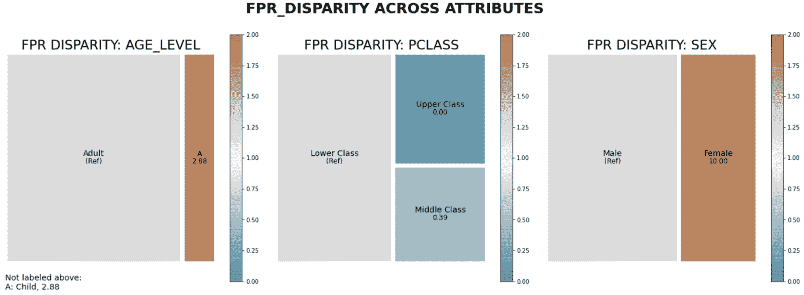

# 快速有效地审计机器学习的公平性

> 原文：[`www.kdnuggets.com/2023/01/fast-effective-way-audit-ml-fairness.html`](https://www.kdnuggets.com/2023/01/fast-effective-way-audit-ml-fairness.html)

Ruth Bader Ginsburg 对我们法院中潜在偏见难以揭示的看法 (1)

# 介绍

* * *

## 我们的前三大课程推荐

 1\. [谷歌网络安全证书](https://www.kdnuggets.com/google-cybersecurity) - 快速进入网络安全职业的快车道。

 2\. [谷歌数据分析专业证书](https://www.kdnuggets.com/google-data-analytics) - 提升您的数据分析技能

 3\. [谷歌 IT 支持专业证书](https://www.kdnuggets.com/google-itsupport) - 支持您的组织进行 IT 工作

* * *

恶名昭彰的 RBG 说得对。在我们的法律系统中，很难触及潜在的偏见。然而，与最高法院不同，我们数据科学家拥有新的开源工具包，可以轻松审计我们的机器学习模型的偏见和公平性。如果 Waylan Jennings 和 Willie Nelson 今天能重新来过，我想他们著名的二重唱可能会是这样：

> ♪妈妈们，不要让你们的孩子长大后成为最高法院法官♪
> 
> ♪让他们成为分析师和数据科学家之类的人吧♪
> 
> ♪没有 Python 库能使法律更公平♪
> 
> ♪所以成为数据科学家比在外面做法官要容易♪ (2)

[Aequitas](http://www.datasciencepublicpolicy.org/our-work/tools-guides/aequitas/) 公平性和偏见工具包（3）是这些 Python 库的一个例子。我决定使用最受欢迎的数据集之一对其进行测试。你可能已经对 [泰坦尼克号](https://www.kaggle.com/code/alexisbcook/titanic-tutorial) 数据很熟悉，这些数据用于 Kaggle 初学者教程。这个挑战是预测泰坦尼克号乘客的生存情况。我使用这些数据构建了一个简单的随机森林分类器模型，并将其输入到 Aequitas 工具包中。

仅仅添加了九行额外代码后，我准备查看我的初始模型对儿童是否公平。我对结果感到震惊。**我的初始模型讨厌儿童。** 它在预测成年人会生存时相当准确。但在预测儿童会生存时错误的可能性是成人的 2.9 倍。在数据科学的统计术语中，儿童的假阳性率是成人的 2.9 倍。这是一个显著的公平性差距。更糟的是，**我的初始模型在预测生存时还对女性和低社会经济阶层的乘客不利**。

文章概要

你知道你的机器学习模型是否公平吗？如果不知道，你应该了解！本文将演示如何使用开源工具包 Aequitas 轻松审计任何监督学习模型的公平性。我们还将讨论改进模型公平性这一更具挑战性的任务。

本项目使用 Python 编码，并在 Google Colaboratory 上进行。完整的代码库可以在我的[Titanic-Fairness](https://github.com/FauxGrit/Titanic-Fairness.git) GitHub 页面上找到。以下是高级别的工作流程：

分析工作流程

# 步骤 1：格式化输入数据

让我们从最后开始。一旦模型构建工作完成，我们就需要将输入数据框格式化为 Aequitas 工具包所需的格式。输入数据框必须包含标记为‘score’和‘label_value’的列，以及至少一个用于衡量公平性的属性。下面是我们格式化后随机森林模型的输入表格。

初步泰坦尼克生存机器学习模型格式化为 Aequitas 输入数据

我们模型的‘score’列中的预测是二元的，表示生存（1）或未生存（0）。‘score’值也可以是介于 0 和 1 之间的概率，如逻辑回归模型。在这种情况下，必须定义阈值，如[配置](https://dssg.github.io/aequitas/config.html)文档中所述。

我们使用原始数据集中的‘age’来创建一个分类属性，将每个乘客分为‘Adult’或‘Child’。Aequitas 也接受连续数据。如果我们提供‘age’作为连续变量（如原始数据集中所示），则 Aequitas 会自动根据四分位数将其转换为四个类别。

# 步骤 2：定义模型公平性

定义公平性是困难的。公平性和偏见的度量标准有很多种。此外，视角通常取决于其来源的子群体。我们如何决定关注什么？Aequitas 团队提供了一个[公平性决策树](http://www.datasciencepublicpolicy.org/wp-content/uploads/2021/04/Fairness-Full-Tree.png)可以帮助解决这个问题。它围绕理解相关干预措施的辅助性或惩罚性影响建立。Fairlearn 是另一个工具包。Fairlearn 文档提供了执行[公平性评估](https://fairlearn.org/main/user_guide/assessment/index.html)的优秀框架。

公平性依赖于用例的具体情况。因此，我们需要为 Kaggle Titanic 数据集定义一个虚构的用例。为此，请暂时脱离现实，回到过去，设想在 1873 年大西洋号、1909 年共和国号和 1912 年泰坦尼克号沉没之后，白星航运公司咨询了我们。我们需要建立一个模型来预测在未来海上发生重大灾难时的生存情况。我们将为每个潜在乘客提供预测，[HMHS Britannic](https://en.wikipedia.org/wiki/HMHS_Britannic)是公司的第三艘也是最后一艘奥林匹克级蒸汽船。

1914 年的大西洋明信片（4）

思考我们虚构的案例示例，当我们错误预测某个潜在乘客的生存情况时，我们的模型是惩罚性的。如果大西洋号在海上发生事故，他们可能会过度自信。这种模型错误是一种假阳性。

现在让我们考虑乘客的人口统计数据。我们的数据集包括性别、年龄和社会经济等级的标签。我们将评估每个组的公平性。但首先以儿童作为我们的主要公平性目标。

现在我们需要将我们的目标转化为与 Aequitas 兼容的术语。我们可以将模型公平性目标定义为最小化儿童与成人（参考组）之间的假阳性率（fpr）差异。差异仅仅是儿童假阳性率与参考组的比例。我们还将定义一个政策容忍度，即不同组之间的差异不超过 30%。

# 第 3 步：使用 Aequitas 工具包

最终我们回到起点。要开始审计，我们需要安装 Aequitas，导入必要的库，并初始化 Aequitas 类。以下是执行这些操作的 Python 代码：

安装 Aequitas 并初始化

Group( )类用于保存每个子组的混淆矩阵计算和相关指标，例如每个子组的假阳性计数、真阳性计数、组大小等。而 Bias( )类用于保存组间差异计算，例如儿童的假阳性率与参考组（成人）的假阳性率的比例。

接下来，我们指定要审计‘Age_Level’属性，并使用‘Adult’作为参考组。这是一个 Python 字典，可能包含多个条目。

指定‘Age_Level’作为评估公平性的属性

要指定的最后两项是我们希望可视化的指标和我们对差异的容忍度。我们对假阳性率（fpr）感兴趣。容忍度作为可视化中的参考值使用。

指定公平性指标和容忍度

现在我们使用先前格式化的输入数据框（dfAequitas）调用 get_crosstabs()方法，并将属性列设置为我们定义的 attributes_to_audit 列表。第二行使用 get_disparity_predefined_groups()方法创建我们的偏见数据框（bdf）。第三行使用 Aequitas 图（ap）绘制差异指标。

Aequitas 差异可视化与光标悬停

立刻我们看到儿童子组的指标在红色区域，超出了我们 30%的差异容忍度。只需六行代码进行设置/配置，再加三行代码创建图表，我们就能清晰地看到我们的模型如何与公平性目标对比。点击该组会显示测试数据中有 36 名儿童的假阳性率（fpr）为 17%。这比参考组高 2.88 倍。参考组的弹出窗口显示 187 名成人的假阳性率为 6%。

# 步骤 4：减轻模型偏见

改善模型公平性可能比识别模型偏见更具挑战性。但关于这一主题的严肃研究正在不断增加。以下是一个表格，改编自 Aequitas 文档，总结了如何改善模型公平性。

改编自 Aequitas 文档（5,6）

在改进输入数据时，一个常见的错误是认为如果模型没有年龄、种族、性别或其他人口统计数据，它就不会有偏见。这是一种谬论。‘***无知中没有公平***。一个人口统计盲模型仍然可能歧视。’（7）在移除模型中的敏感属性时，不要忽视其影响。这将使审计公平性的能力受到限制，并可能加重偏见。

有一些工具包可以帮助减轻机器学习模型中的偏见。两个最著名的工具包是 IBM 的[AI Fairness 360](https://www.ibm.com/blogs/research/2018/09/ai-fairness-360/)和微软的[Fairlearn](https://fairlearn.org/)。这些都是健壮且文档齐全的开源工具包。在使用时，要注意模型性能的权衡。

对于我们的示例，我们将通过在模型选择中使用公平性指标来缓解偏见。因此，我们在寻求公平性的过程中构建了几个分类模型。下表总结了每个候选模型的指标。请记住，我们的初始模型是随机森林分类模型。

儿童与成年人分类模型公平性指标

这是满足我们公平性目标的 30%阈值 XGBoost 模型的 Aequitas 图。

30%阈值的 XGBoost 模型满足了我们的公平性目标

成功了吗？这一组儿童已经脱离了红色阴影区域。但这真的是最好的模型吗？让我们比较两个 XGBoost 模型。这些模型都预测从 0 到 100%的生存连续概率。然后使用阈值将概率转换为生存的 1 或不生存的 0。默认值是 50%。当我们将阈值降低到 30%时，模型预测更多乘客将幸存。例如，一个生存概率为 35%的乘客符合新的阈值，预测结果现在为‘生存’。这也会产生更多的假阳性错误。在我们的测试数据中，将阈值移到 30%会在包含成年人较大的参考组中增加 13 个假阳性，在儿童组中仅增加 1 个假阳性。这使得它们接近平衡。

因此，30%的 XGBoost 模型以不太理想的方式达到了我们的公平性目标。我们没有提高受保护组的模型表现，而是降低了参考组的表现，以实现容忍范围内的平衡。这并不是一个理想的解决方案，但它代表了现实世界用例中的困难权衡。

# 附加部分 - 更多 Aequitas 可视化示例

差异容忍度图只是内置 Aequitas 可视化的一个示例。本节将演示其他选项。以下所有数据都与我们的初始随机森林模型相关。生成每个示例的代码也包含在我的 [Titanic-Fairness](https://github.com/FauxGrit/Titanic-Fairness.git) GitHub 页面上。

第一个示例是所有属性的假阳性率差异的树图。

所有属性假阳性率差异的树图

每个组的相对大小由面积提供。颜色越深，差异越大。棕色表示假阳性率高于参考组，青色表示低于参考组。参考组自动选择为最大的人口组。因此，上述图表从左到右的解释为：

+   儿童的假阳性率远高于成年人，

+   上层乘客的假阳性率远低于下层乘客，以及

+   女性的假阳性率远高于男性。

更简洁地说，树状图表明我们的初始模型对儿童、低收入乘客和女性不公平。下一个图显示了类似的信息，但以更传统的柱状图形式展示。然而，在这个例子中，我们看到的是绝对假阳性率，而不是与参考组的差异（或比例）。

跨所有属性的假阳性率绝对值柱状图

这个柱状图指出了一个大问题，即女性的假阳性率为 42%。我们可以为以下任何指标生成类似的柱状图：

+   预测正组率差异 (pprev)，

+   预测正率差异 (ppr)，

+   假发现率 (fdr)，

+   假漏率 (for)，

+   假阳性率 (fpr)，以及

+   假阴性率 (fnr)。

最后，还有一些方法可以打印图表中使用的原始数据。下面是初始随机森林模型中每组的基本计数示例。

按组别的混淆矩阵原始计数表

如上所述，有 3 名儿童被错误预测为生还者，共有 18 名被预测生还者。3 除以 18 得到 17%的假阳性率。下表提供了这些指标的百分比。在下表中，请注意儿童的假阳性率为 17%，这是预期的。

按组别的混淆矩阵百分比表示表

儿童的假阳性率与成人的比率为 2.88，计算方法是将 0.167 除以 0.0579。这是儿童相对于参考组的差异。Aequitas 提供了一种直接打印所有差异值的方法。

按组别的混淆矩阵原始计数表

# 结论

公平性在机器学习中的重要性在公共政策或信用决策领域中是不言而喻的。即使不从事这些领域，将公平性审计纳入基础机器学习工作流程也是有意义的。例如，了解你的模型是否对你的最大、最盈利或最长时间的客户不利可能是有用的。公平性审计很容易进行，并将提供你模型表现过度或不足的领域的见解。

最后的建议：公平审计也应纳入尽职调查工作中。如果收购一家拥有机器学习模型的公司，则执行公平审计。所需的只是包含这些模型预测和属性标签的测试数据。这有助于理解模型可能对特定群体产生歧视的风险，这可能导致法律问题或声誉损害。

## 参考

1.  Waylon Jennings & Willie Nelson 的原歌词恶搞

1.  Britannic 明信片图像来自公共领域网站 wikimedia，最初由 Frederic Logghe 在 ibiblio.org 上发布。链接: [`commons.wikimedia.org/wiki/File:Britannic_postcard.jpg`](https://commons.wikimedia.org/wiki/File:Britannic_postcard.jpg)

1.  Pedro Saleiro, Benedict Kuester, Loren Hinkson, Jesse London, Abby Stevens, Ari Anisfeld, Kit T. Rodolfa, Rayid Ghani，‘Aequitas：一个偏见和公平性审计工具包’ 链接: [`arxiv.org/abs/1811.05577`](https://arxiv.org/abs/1811.05577)

1.  Britannic 明信片图像来自公共领域网站 wikimedia，最初由 Frederic Logghe 在 ibiblio.org 上发布。链接: [`commons.wikimedia.org/wiki/File:Britannic_postcard.jpg`](https://commons.wikimedia.org/wiki/File:Britannic_postcard.jpg)

1.  Muhammad Bilal Zafar, Isabel Valera, Manuel Gomez Rodriguez, Krishna P. Gummadi，‘公平性约束：公平分类的机制’ 链接: [`proceedings.mlr.press/v54/zafar17a/zafar17a.pdf`](http://proceedings.mlr.press/v54/zafar17a/zafar17a.pdf)

1.  Hardt, Moritz 和 Price, Eric 以及 Srebro, Nathan，‘监督学习中的机会平等’ 链接: [`arxiv.org/abs/1610.02413`](https://arxiv.org/abs/1610.02413)

1.  Rayid Ghani, Kit T Rodolfa, Pedro Saleiro，‘处理 AI/ML/数据科学系统中的偏见和公平性’ 幻灯片 65。链接: [`dssg.github.io/aequitas/examples/compas_demo.html#Putting-Aequitas-to-the-task`](https://dssg.github.io/aequitas/examples/compas_demo.html#Putting-Aequitas-to-the-task)

**[Matt Semrad](https://www.linkedin.com/in/mattsemrad)** 是一位拥有 20 多年经验的分析领导者，专注于在高速增长的技术公司中建立组织能力。

### 更多相关话题

+   [关于值得信赖的图神经网络的全面调查：…](https://www.kdnuggets.com/2022/05/comprehensive-survey-trustworthy-graph-neural-networks-privacy-robustness-fairness-explainability.html)

+   [机器学习项目的简单快速数据流](https://www.kdnuggets.com/2022/11/simple-fast-data-streaming-machine-learning-projects.html)

+   [BERT 在稀疏性下能多快？](https://www.kdnuggets.com/2022/04/fast-bert-go-sparsity.html)

+   [通过快速克里金法 (FKR) 加速机器学习](https://www.kdnuggets.com/2022/06/vmc-speed-machine-learning-fast-kriging.html)

+   [如何让 Python 代码运行得飞快](https://www.kdnuggets.com/2021/06/make-python-code-run-incredibly-fast.html)

+   [提升你的 Python 技能，使用《数据科学快速 Python》！](https://www.kdnuggets.com/2022/06/manning-step-python-game-fast-python-data-science.html)
