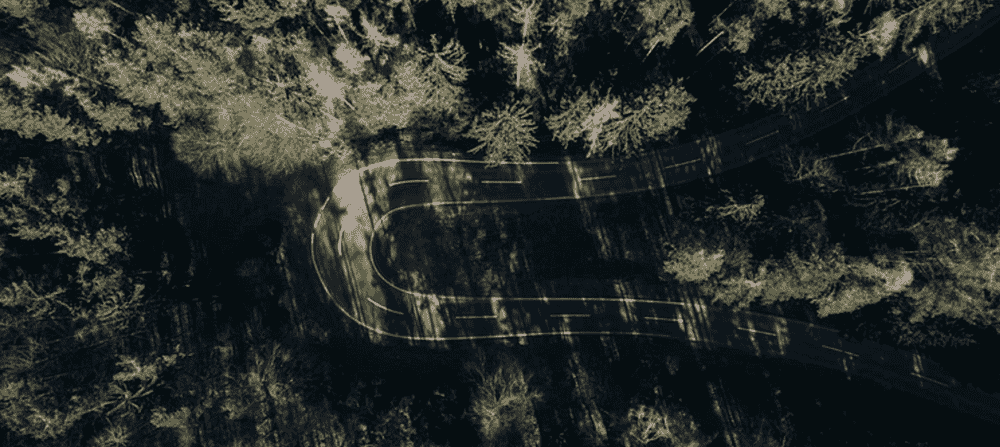
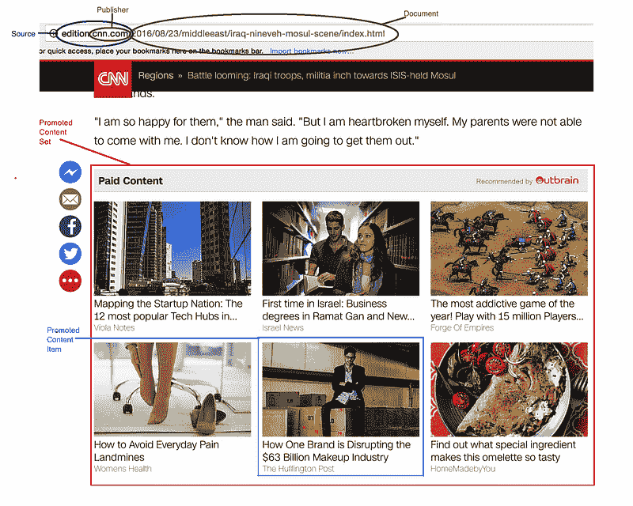
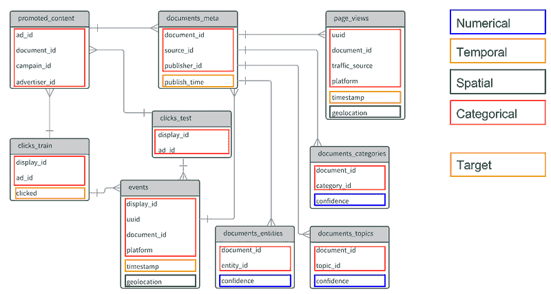

# 特征工程如何帮助你在 Kaggle 竞赛中表现出色 – 第一部分

> 原文：[`www.kdnuggets.com/2017/06/feature-engineering-help-kaggle-competition-1.html`](https://www.kdnuggets.com/2017/06/feature-engineering-help-kaggle-competition-1.html)

**作者：Gabriel Moreira, CI&T.**

现在是 2017 年 1 月 18 日午夜，[Outbrain 点击预测机器学习竞赛](https://www.kaggle.com/c/outbrain-click-prediction)刚刚结束。这是三个月半的加班工作。当我滚动浏览排行榜页面时，我发现我的名字排在第 19 位，这在近 1000 名参赛者中位于前 2%。对于我决定认真投入的第一场 Kaggle 竞赛来说，这已经很不错了！

我能够取得好成绩的原因之一是因为 Google Cloud Platform (GCP) 让我的工作变得更轻松，让我可以专注于数据。现在，我将带你走过我的旅程！

### 挑战

Kaggle 竞赛由 [Outbrain](http://www.outbrain.com/) 赞助，Outbrain 每月在数千个网站上提供 2500 亿条个性化推荐，将相关内容与读者匹配。在这场竞赛中，“Kagglers” 被挑战预测用户点击的广告和其他形式的赞助内容。

Outbrain 维护着一个出版商和广告商的网络。例如，在下图中，付费内容（广告）展示在 CNN（出版商）的新闻页面上。

来自 [Outbrain 点击预测竞赛](https://www.kaggle.com/c/outbrain-click-prediction/data)。

在这场竞赛中，参赛者被要求根据预测的点击可能性准确排名推荐内容。CTR（点击率）预测对于电子商务和广告等行业非常相关，因为用户转化的微小改进可能会带来显著的利润增长，同时提供更好的用户体验。

### 数据集和基础设施

其中一个竞赛挑战是处理庞大的数据集：20 亿页面浏览量和大约 1700 万条点击记录，来自 7 亿唯一用户，涉及 560 个网站。数据集中包含了从 2016 年 6 月 14 日到 2016 年 6 月 28 日期间，在多个出版网站上观察到的用户页面浏览量和点击量样本。

考虑到这是一个大型关系数据库，有些表格无法“在内存中”加载，[Apache Spark](http://spark.apache.org/) 非常适合数据探索和快速分布式预处理。[Google Cloud Platform (GCP)](https://cloud.google.com/) 提供了我所需的主要存储和分布式处理组件。

使用 [Google Cloud Dataproc](https://cloud.google.com/dataproc/) 管理服务部署 Spark 集群非常容易。我发现一个由 1 个主节点和 8 个 “n1-highmem-4” 实例类型（约 4 个 CPU 核心和 16 GB RAM）组成的集群能够在大约一个小时内处理所有竞赛数据，包括连接大表、转换特征和存储向量。

我的主要开发环境是 Jupyter notebooks，这是一个非常高效的 Python 接口。[这个 GCP 教程](https://cloud.google.com/dataproc/docs/tutorials/jupyter-notebook)描述了如何在 Dataproc 主节点中轻松设置 Jupyter，使 PySpark 库可供使用。

Dataproc Spark 集群使用 [Google Cloud Storage](https://cloud.google.com/storage/)（GCS）作为分布式文件系统，而不是默认的 HDFS。作为一种托管存储，它使得在实例之间传输和存储大型文件变得简单。Spark 作业可以直接从 GCS 使用数据进行分布式处理。

我还使用了一些机器学习框架（FTRL、FFM、GBM 等），这些框架在并行化计算上工作——而不是分布式计算——需要大量的 CPU 核心和 RAM 以处理大数据集。在 [Google Compute Engine (GCE)](https://cloud.google.com/compute/) 上部署的 ‘n1-highmem-32’ 实例（32 个 CPU 和 256 GB RAM）使得在不到一个小时内运行作业成为可能。由于它们的处理非常 I/O 密集，我为实例附加了一个 SSD 硬盘，以避免瓶颈。

在 [这篇文章系列的第二部分](https://medium.com/unstructured/how-feature-engineering-can-help-you-do-well-in-a-kaggle-competition-part-ii-3645d92282b8) 中，我将更多地讨论这些机器学习模型。

### 第一个方法

[竞赛评估指标](https://www.kaggle.com/c/outbrain-click-prediction/details/evaluation)是 MAP@12（12 的平均精度均值），它衡量广告排名的质量。换句话说，这个指标评估模型是否对实际点击的广告进行了良好的排名。

常识认为广告的平均受欢迎程度可能是新点击的一个良好预测因素。因此，主要的思路是按照广告的点击率（*#clicks / #views*）对用户展示的广告进行排序。

在以下的 Python 代码片段中，我展示了如何使用 PySpark 基于训练集（click_trains.csv）计算广告点击率（CTR）。这个 CSV 文件包含超过 8700 万行，并存储在 GCS 上。完整的脚本在一个有 8 个工作节点的 Dataproc Spark 集群中运行时间不到 30 秒。

将训练数据（click_train.csv）加载到 Spark DataFrame 中并获取行数。获取不同广告的数量。

在下一个代码片段中，我定义了一个新的 DataFrame，通过 ad_id 分组并聚合点击数的总和和观看数的计数。CTR 的处理是通过一个名为 *ctr_udf* 的 UDF（用户定义函数）完成的。代码片段的输出是一个包含 10 个 ad_ids 及其各自 #clicks、#views 和 CTR 的样本表格。

计算广告的平均 CTR。

为了提高 CTR 的置信度，我们可以只考虑浏览次数超过五次的广告。使用*collectAsMap()*操作，将分布式集合转换为内存中的查找字典，其中键是 ad_id，值是相应的平均 CTR。

这是大多数竞争者提交的基线，即使没有任何机器学习算法，也能给你 MAP@12 的**0.637**。作为参考，官方基线竞赛基于按广告 ID 排名（类似随机方法），MAP@12 为**0.485**。因此，这种初步方法在点击预测中实际上做得很好。

### 数据分析

像往常一样，在应用任何机器学习技术之前，分析数据并制定关于哪些特征和算法对于解决问题有用的假设是非常重要的。我实现了一个 EDA（探索性数据分析），使用 PySpark 揭示了最大的 数据集（page_views.csv ~ 100 GB）。

我的[EDA Kernel](https://www.kaggle.com/gspmoreira/outbrain-click-prediction/unveiling-page-views-csv-with-pyspark)，展示了如何使用 Python、Spark SQL 和 Jupyter notebooks 在 Dataproc 中分析竞争中最大的 数据集，已与其他竞争者分享，并成为第二个最受投票的贡献（金牌）。根据我的 Kernel [评论](https://www.kaggle.com/gspmoreira/outbrain-click-prediction/unveiling-page-views-csv-with-pyspark)，看来许多 Kagglers 正在考虑尝试 Google Dataproc 和 Spark 用于机器学习竞赛。

我的分析帮助我弄清楚了如何从数据集中提取价值，通过将其与训练数据和测试数据（events.csv）结合。例如，在下图所示的累积图中，我们可以看到 65%的用户只有一次页面浏览，77%的用户最多有两次浏览，89%的用户最多有五次浏览。

用户最多拥有 N 次页面浏览的累积百分比。

这是一个典型的“冷启动”场景，我们对大多数用户几乎一无所知，需要预测他们会点击哪些推荐内容。

一般来说，传统的推荐系统技术如协同过滤和基于内容的过滤在这种情况下会失败。因此，我的策略是采用能够利用用户事件和推荐的赞助内容的上下文信息的机器学习算法。

### 特征工程

特征工程指的是选择或创建适用于机器学习模型的正确特征的关键步骤。通常，根据数据的复杂性，这可能占总工作量的 80%。

在下图中，我展示了竞争的原始数据模型，按数据类型对特征进行着色。

Outbrain 点击预测大型关系型数据库。

所有的分类字段最初都被表示为整数。根据机器学习算法的不同，作为序数值表示的 id 可能会让模型认为某个类别比另一个类别更重要。例如，如果阿根廷的 id 是 1，巴西的 id 是 2，算法可能会推断出巴西的代表性是阿根廷的两倍。为了解决这个问题，常用的方法是像[独热编码](https://en.wikipedia.org/wiki/One-hot)（OHE）这样的技术，其中每个分类字段都被转换为一个稀疏向量。在稀疏向量中，所有位置的值均为零，只有对应于 id 值的位置有非零值。

另一种处理具有大量唯一值的分类特征的流行技术是[特征哈希](https://en.wikipedia.org/wiki/Feature_hashing)，它使用哈希函数将类别映射到固定长度的向量。与 OHE 相比，这种方法提供了更低的稀疏度和更高的压缩率，并且对新出现和稀有的分类值（例如之前未见过的用户代理）处理得很好。它也可能在将多个特征映射到相同的向量位置时导致一些冲突，但机器学习算法通常足够健壮，能够处理这些冲突。我在我的方法中使用了这两种技术。

我还对数值标量特征使用了‘[分箱](https://en.wikipedia.org/wiki/Data_binning)’。一些特征非常嘈杂，我们最好通过这种转换减少次要观测误差或差异的影响。例如，我将事件‘小时’分箱为早晨、中午、下午、晚上等，因为我的假设是，如果在上午 10 点或 11 点观察，用户行为不会有太大不同。

对于长尾分布的变量，比如*user_views_count*，大多数用户只有一个页面浏览记录，而很少有高浏览量的用户。应用诸如 log(1 + #views)这样的转换对平滑分布是有用的。一个有 1,000 次页面浏览的用户可能与一个有 500 次浏览的用户差异不大，他们在这个上下文中都是相似的离群点。

[标准化和归一化](http://sebastianraschka.com/Articles/2014_about_feature_scaling.html)对于大多数使用优化技术如梯度下降的机器学习算法也很重要。一般来说，只有基于决策树的模型能够处理不同尺度和方差的原始数值特征。

我使用的主要特征工程技术的更详细介绍可以在这份[幻灯片](https://www.slideshare.net/gabrielspmoreira/feature-engineering-getting-most-out-of-data-for-predictive-models)中找到。

根据我从 EDA 中获得的见解和假设，我成功地为我的机器学习模型创建和转换了特征，除了原始的[竞赛数据](https://www.kaggle.com/c/outbrain-click-prediction/data)中提供的特征。以下是其中的一些特征。

***用户画像***

+   **user_has_already_viewed_doc -** 对于推荐给用户的每一条内容，验证用户是否之前已经访问过该页面。

+   **user_views_count -** 热衷阅读的用户与其他用户行为有何不同？让我们添加这个特征，让机器学习模型来猜测。

+   **user_views_categories, user_views_topics, user_views_entities -** 基于用户之前查看过的文档的类别、主题和实体的用户画像向量（按置信度和 TF-IDF 加权），用于在基于内容的过滤方法中建模用户偏好。

+   **user_avg_views_of_distinct_docs -** 比率*(#user_distinct_docs_views / #user_views)*，表示用户重新阅读之前访问过的页面的频率。

***广告与文档***

+   **doc_ad_days_since_published, doc_event_days_since_published -** 自广告文档在特定用户访问中发布以来经过的天数。一般假设是新内容对用户更相关。但是，如果你在阅读一篇旧文章，你可能对其他旧文章感兴趣。

+   **doc_avg_views_by_distinct_users_cf -** 广告文档被不同用户的平均页面浏览次数。这是一个人们通常会返回的网页吗？

+   **ad_views_count, doc_views_count -** 一个文档或广告有多受欢迎？

***事件***

+   **event_local_hour (binned), event_weekend** — 事件时间戳为 UTC-4，因此我处理了事件地理位置以获取时区并调整用户的本地时间。时间段被分为早晨、下午、正午、傍晚、夜晚。还包含了一个指示是否为周末的标志。假设时间会影响用户阅读的内容类型。

+   **event_country, event_country_state -** 字段*event_geolocation*被解析以提取用户在页面访问中的国家和州。

+   **ad_id, doc_event_id, doc_ad_id, ad_advertiser, …** — 所有原始类别字段都进行了独热编码以供模型使用，生成了大约 126,000 个特征。

***平均点击率***

+   **avg_ctr_ad_id, avg_ctr_publisher_id, avg_ctr_advertiser_id, avg_ctr_campain_id, avg_ctr_entity_id_country … -** 给定某些类别组合和 CTR 置信度的平均点击率*(#clicks / #views)*（详细信息请参见[Part II](https://medium.com/unstructured/how-feature-engineering-can-help-you-do-well-in-a-kaggle-competition-part-ii-3645d92282b8)帖子）。例如：P(click | category01, category02)。

***基于内容的相似性***

这些特征使用了[TF-IDF](https://en.wikipedia.org/wiki/Tf%E2%80%93idf)技术来构建用户和着陆页面的画像向量，分别建模用户偏好和上下文。使用[余弦相似度](https://en.wikipedia.org/wiki/Cosine_similarity)来比较画像与候选广告文档的相似性，这是一种非常流行的信息检索方法，基于两个向量之间的角度，忽略其大小。

+   **user_doc_ad_sim_categories, user_doc_ad_sim_topics, user_doc_ad_sim_entities -** 用户画像与广告文档画像向量（TF-IDF）之间的余弦相似度。

+   **doc_event_doc_ad_sim_categories, doc_event_doc_ad_sim_topics, doc_event_doc_ad_sim_entities -** 事件文档（着陆页上下文）与广告文档概况向量（TF-IDF）之间的余弦相似度。

我们基于一些关于影响用户点击赞助内容决策的假设生成了特征。现在数据已准备好用于一些机器学习模型！

### 下一步…

在[第二部分](https://medium.com/unstructured/how-feature-engineering-can-help-you-do-well-in-a-kaggle-competition-part-ii-3645d92282b8)的系列文章中，我将介绍交叉验证策略、实施的机器学习模型以及‘集成’技术，帮助你在比赛排行榜中冲刺到前 2%。

请继续关注！

**个人简介：[加布里埃尔·莫雷拉](https://about.me/gspmoreira)** 是一位热衷于用数据解决问题的科学家。他是 Instituto Tecnológico de Aeronáutica - ITA 的博士生，研究推荐系统和深度学习。目前，他是 [CI&T 的首席数据科学家](https://medium.com/unstructured)，领导团队利用机器学习解决客户在大规模和非结构化数据中的挑战性问题。

[原文](https://medium.com/unstructured/how-feature-engineering-can-help-you-do-well-in-a-kaggle-competition-part-i-9cc9a883514d)。已获授权转载。

**相关：**

+   如何在你的第一次 Kaggle 比赛中排名前 10%

+   在深度学习中，架构工程是新的特征工程

+   机器学习速成课程：第一部分

* * *

## 我们的前三个课程推荐

 1\. [谷歌网络安全证书](https://www.kdnuggets.com/google-cybersecurity) - 快速进入网络安全职业轨道。

 2\. [谷歌数据分析专业证书](https://www.kdnuggets.com/google-data-analytics) - 提升你的数据分析能力

 3\. [谷歌 IT 支持专业证书](https://www.kdnuggets.com/google-itsupport) - 支持组织的 IT

* * *

### 更多相关内容

+   [特征存储峰会 2022：关于特征工程的免费会议](https://www.kdnuggets.com/2022/10/hopsworks-feature-store-summit-2022-free-conference-feature-engineering.html)

+   [数据科学项目，帮助你解决实际问题](https://www.kdnuggets.com/2022/11/data-science-projects-help-solve-real-world-problems.html)

+   [5 种稀有的数据科学技能，帮助你获得就业机会](https://www.kdnuggets.com/5-rare-data-science-skills-that-can-help-you-get-employed)

+   [生成型 AI 如何帮助你改进数据可视化图表](https://www.kdnuggets.com/how-generative-ai-can-help-you-improve-your-data-visualization-charts)

+   [免费 Python 资源助你成为专家](https://www.kdnuggets.com/free-python-resources-that-can-help-you-become-a-pro)

+   [等级系统如何帮助预测 AI 成本](https://www.kdnuggets.com/2022/03/level-system-help-forecast-ai-costs.html)
