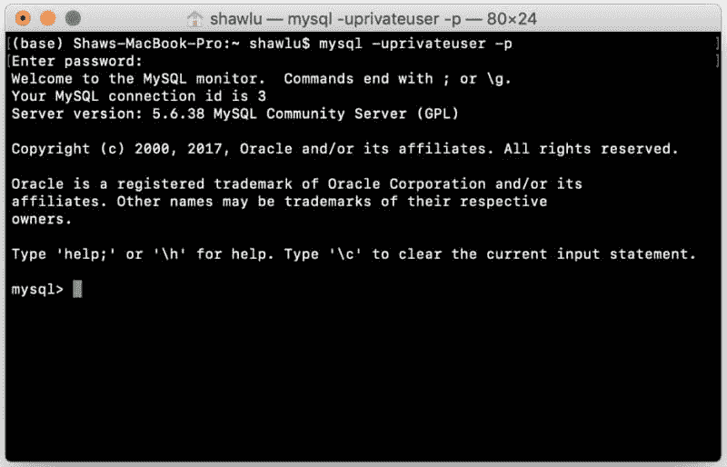
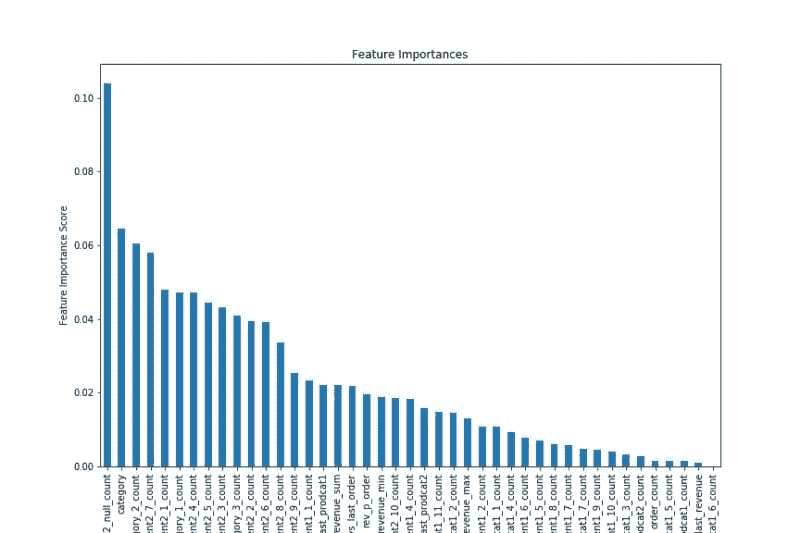

# SQL 和 Python 中的特征工程：一种混合方法

> 原文：[`www.kdnuggets.com/2020/07/feature-engineering-sql-python-hybrid-approach.html`](https://www.kdnuggets.com/2020/07/feature-engineering-sql-python-hybrid-approach.html)

评论

**由 [Shaw Lu](https://www.linkedin.com/in/shawlu95/)，Coupang 的数据科学家**


我很早就学会了 SQL，对 Pandas 真实模拟 SQL 的方式感到非常好奇。传统上，SQL 主要用于分析师，他们将数据处理成有信息的报告，而 Python 则用于数据科学家，他们利用数据构建（并过拟合）模型。虽然这两者在功能上几乎等价，但我认为两者都是数据科学家高效工作的关键。从我使用 Pandas 的经验来看，我注意到以下几点：

+   在探索不同特征时，我最终会得到许多 CSV 文件。

+   当我在一个大型数据框上进行汇总时，Jupyter 内核会直接崩溃。

+   我在内核中有多个名称混乱（且很长）的数据框。

+   我的特征工程代码看起来很丑，而且分散在许多单元格中。

* * *

## 我们的前 3 名课程推荐

 1\. [Google 网络安全证书](https://www.kdnuggets.com/google-cybersecurity) - 快速进入网络安全职业生涯。

 2\. [Google 数据分析专业证书](https://www.kdnuggets.com/google-data-analytics) - 提升你的数据分析技能

 3\. [Google IT 支持专业证书](https://www.kdnuggets.com/google-itsupport) - 支持你的组织 IT

* * *

当我开始直接在 SQL 中进行 [特征工程](https://www.kdnuggets.com/2018/12/feature-engineering-explained.html) 时，这些问题自然得到了解决。因此，在这篇文章中，我将通过处理家庭作业挑战数据集分享一些我最喜欢的技巧。如果你对 SQL 有一点了解，现在是时候好好利用它了。

### 安装 MySQL

首先，你需要一个 SQL 服务器。我在这篇文章中使用的是 MySQL。你可以通过安装本地桌面服务器，如 MAMP、WAMP 或 XAMPP 来获取 MySQL 服务器。网上有许多教程，值得一试。

在设置服务器后，请确保准备好三个项目：用户名、密码、端口号。通过终端输入以下命令进行登录（这里我们使用用户名“root”，密码 1234567）。

```py
mysql -uroot -p1234567
```



然后在 MySQL 控制台中创建一个名为“Shutterfly”的数据库（你可以根据需要命名）。这两个表将被加载到这个数据库中。

```py
create database Shutterfly;
```

### 安装 sqlalchemy

你需要 Pandas 和 sqlalchemy 来在 Python 中使用 SQL。我敢打赌你已经有 Pandas 了。然后通过激活你想要的环境来启动 Jupyter notebook，并输入：

```py
pip install sqlalchemy
```

sqlalchemy 模块还需要*MySQLdb*和*mysqlclient*模块。根据你的操作系统，这些可以使用不同的[命令](https://stackoverflow.com/questions/454854/no-module-named-mysqldb)进行安装。

### 将数据集加载到 MySQL 服务器

在这个示例中，我们将从两个[CSV 文件](https://github.com/shawlu95/Data-Science-Toolbox/tree/master/case_study/shutterfly/data)中加载数据，并直接在 MySQL 中进行特征工程。为了加载数据集，我们需要使用用户名、密码、端口号和数据库名称实例化一个**engine**对象。将创建两个表：*Online* 和 *Order*。每个表上都会创建一个自然索引。

在 MySQL 控制台中，你可以验证表是否已创建。

### 拆分数据集

这可能看起来有些违背直觉，因为我们还没有构建任何特征。但实际上这是非常简洁的，因为我们需要做的就是按**索引拆分数据集**。根据设计，我还包含了我们尝试预测的标签（事件 2）。在加载特征时，我们只需将索引与特征表连接起来即可。

在 MySQL 控制台中，你可以验证训练集和测试集是否已创建。

### 特征工程

这是一个繁重的工作。我直接在 Sublime Text 中编写 SQL 代码，并通过将代码粘贴到 MySQL 控制台中来调试。由于该数据集是事件日志，我们必须避免将未来的信息泄漏到每个数据点中。你可以想象，每个特征都需要在历史数据中进行聚合！

连接表是最慢的操作，因此我们希望从每次连接中获得尽可能多的特征。在这个数据集中，我实现了四种类型的连接，生成了四组特征。具体细节并不重要，但你可以在[这里](https://github.com/shawlu95/Shutterfly-Take-Home-Challenge/tree/master/features)找到我所有的 SQL 片段。每个片段创建一个表。**索引被保留，并且必须与训练集和测试集中的响应变量正确匹配。**每个片段的结构如下：

要生成特征表，打开一个新的终端，导航到包含 SQL 文件的文件夹，并输入以下命令和密码。第一个片段创建了一些必要的索引，以加速连接操作。接下来的四个片段创建了四个特征表。没有索引，连接操作将花费很长时间。有了索引，连接操作大约需要 20 分钟（在本地机器上还不错）。

```py
mysql < add_index.sql -uroot -p1234567
mysql < feature_group_1.sql -uroot -p1234567
mysql < feature_group_2.sql -uroot -p1234567
mysql < feature_group_3.sql -uroot -p1234567
mysql < feature_group_4.sql -uroot -p1234567
```

现在你应该在数据库中拥有以下表。请注意，衍生特征与原始事件日志分开存储，这有助于防止混淆和灾难。

### 加载特征

在这里，我写了一个从 MySQL 服务器提取数据的实用程序函数。

+   该函数以表名“trn_set”（训练集）或“tst_set”（测试集）作为输入，如果你只想获取数据的子集，还可以选择*limit*子句。

+   唯一列以及大部分缺失值的列被删除。

+   日期列被映射为月份，以帮助捕捉季节性效应。

+   注意特征表如何依次连接。这实际上是高效的，因为我们总是按一对一的映射连接索引。

最后，让我们看看 5 个训练示例及其特征。

现在你有了一个定义良好的数据集和特征集。你可以调整每个特征的规模和缺失值，以适应你模型的需求。

对于基于树的方法，这些方法对特征缩放不变，我们可以直接应用模型，简单地专注于调整参数！查看一个普通的梯度提升机示例[这里](https://github.com/shawlu95/Data-Science-Toolbox/blob/master/case_study/shutterfly/gbm_benchmark_2.ipynb)。



很高兴看到所有有用的特性都已被工程化，除了*类别*特性。我们的努力得到了回报！另外，event2 中最具预测性的特征是观察到的 null 值数量。这是一个说明性的案例**我们不能用中位数或平均值替换 null 值**，因为它们的缺失与响应变量相关联！

### 总结

正如你所见，我们没有中间的 CSV 文件，我们的笔记本中的命名空间非常干净，而且我们的特征工程代码减少到了几个简单的 SQL 语句。在以下两种情况下，SQL 方法的效率更高：

+   如果你的数据集部署在云端，你可能可以运行分布式查询。大多数 SQL 服务器今天支持分布式查询。在 Pandas 中，你需要一个叫做*Dask DataFrame*的扩展。

+   如果你能实时获取数据，你可以创建 SQL **视图**而不是表格。这样，每次在 Python 中提取数据时，**你的数据将始终是最新的**。

这种方法的一个基本限制是你必须能够在 Python 中直接连接到你的 SQL 服务器。如果这不可能，你可能需要将查询结果下载为 CSV 文件并在 Python 中加载它。

我希望你觉得这篇文章有帮助。尽管我没有提倡某种方法优于另一种，但了解每种方法的优点和限制是必要的，并且在我们的工具箱中准备好这两种方法。这样我们就可以在约束条件下应用最有效的方法。

**个人简介：[Shaw Lu](https://www.linkedin.com/in/shawlu95/)** 是 Coupang 的数据科学家。他是一位工程学毕业生，寻求利用数据科学来指导业务管理、供应链优化、增长营销和运营研究。Toward Data Science 的官方作者。

[原文](https://towardsdatascience.com/feature-engineering-in-sql-and-python-a-hybrid-approach-b52347cd2de4)。经允许转载。

**相关：**

+   4 个高级特征工程和预处理技巧

+   以艰难的方式学习 SQL

+   掌握中级机器学习的 7 个步骤——2019 版

### 更多相关话题

+   [每个数据科学家都应了解的三大 R 库（即使你使用 Python）](https://www.kdnuggets.com/2021/12/three-r-libraries-every-data-scientist-know-even-python.html)

+   [是什么让 Python 成为初创公司理想的编程语言](https://www.kdnuggets.com/2021/12/makes-python-ideal-programming-language-startups.html)

+   [停止学习数据科学以寻找目的，寻找目的以…](https://www.kdnuggets.com/2021/12/stop-learning-data-science-find-purpose.html)

+   [一项 90 亿美元的人工智能失败，经过审视](https://www.kdnuggets.com/2021/12/9b-ai-failure-examined.html)

+   [学习数据科学统计的顶级资源](https://www.kdnuggets.com/2021/12/springboard-top-resources-learn-data-science-statistics.html)

+   [成功的数据科学家具备的 5 个特征](https://www.kdnuggets.com/2021/12/5-characteristics-successful-data-scientist.html)
