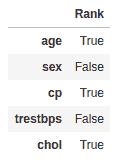
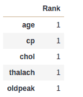
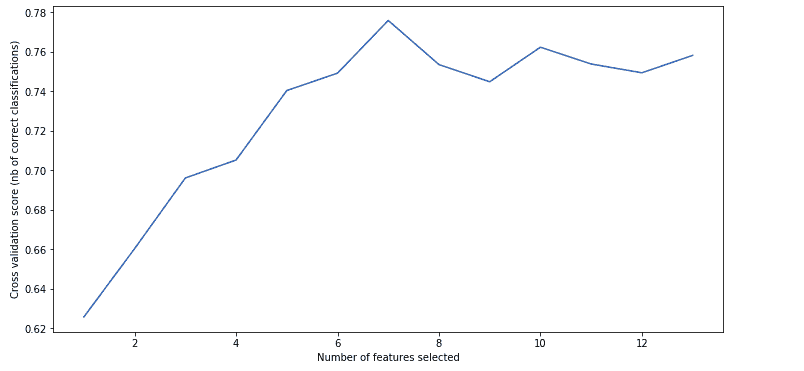

# 使用 Scikit-Learn 进行特征排名和递归特征消除

> 原文：[`www.kdnuggets.com/2020/10/feature-ranking-recursive-feature-elimination-scikit-learn.html`](https://www.kdnuggets.com/2020/10/feature-ranking-recursive-feature-elimination-scikit-learn.html)

评论

[照片由 Element5 Digital 提供，来源于 Unsplash](https://unsplash.com/photos/LTyDj7u_TU4)

* * *

## 我们的前三大课程推荐

 1\. [谷歌网络安全证书](https://www.kdnuggets.com/google-cybersecurity) - 快速进入网络安全职业生涯。

 2\. [谷歌数据分析专业证书](https://www.kdnuggets.com/google-data-analytics) - 提升您的数据分析技能

 3\. [谷歌 IT 支持专业证书](https://www.kdnuggets.com/google-itsupport) - 支持您组织的 IT 部门

* * *

[特征选择](https://heartbeat.fritz.ai/search?q=feature%20selection)是任何机器学习应用中的重要任务。当数据包含许多特征时，这一点尤为重要。最佳特征数量也会提高模型的准确性。通过特征重要性或特征排名可以获得最重要的特征和最佳特征数量。在本文中，我们将探讨特征排名。

### 递归特征消除

递归特征消除所需的第一个项目是估计器；例如，线性模型或决策树模型。

这些模型具有线性模型的系数和决策树模型中的特征重要性。在选择最佳特征数量时，估计器经过训练，特征通过系数或特征重要性被选中。最不重要的特征会被移除。这个过程会递归重复，直到获得最佳特征数量。

### 在 Sklearn 中的应用

Scikit-learn 使得通过 `sklearn.feature_selection.**RFE**` 类实现递归特征消除成为可能。该类接受以下参数：

+   `estimator` — 一个机器学习估计器，可以通过 `coef_` 或 `feature_importances_` 属性提供特征重要性。

+   `n_features_to_select` — 要选择的特征数量。如果未指定，则选择 `half`。

+   `step` — 一个整数，表示每次迭代中要移除的特征数量，或介于 0 和 1 之间的数字，表示每次迭代中要移除的特征百分比。

一旦拟合完成，可以获得以下属性：

+   `ranking_` — 特征的排名。

+   `n_features_` — 已选择的特征数量。

+   `support_` — 一个数组，指示特征是否被选中。

### 应用

如前所述，我们需要使用一个提供`feature_importance_s`属性或`coeff_`属性的估算器。让我们通过一个快速示例来演示。数据集中有 13 个特征——我们将致力于获取最佳特征数量。

```py
import pandas as pddf = pd.read_csv(‘heart.csv’)df.head()
```


让我们获取`X`和`y`特征。

```py
X = df.drop([‘target’],axis=1)
y = df[‘target’]
```

我们将其拆分为测试集和训练集，以准备建模：

```py
from sklearn.model_selection import train_test_split
X_train, X_test, y_train, y_test = train_test_split(X, y,random_state=0)
```

让我们先做几个导入：

+   `Pipeline` — 因为我们将进行一些交叉验证。为了避免数据泄露，这是一种最佳实践。

+   `RepeatedStratifiedKFold` — 用于重复分层交叉验证。

+   `cross_val_score` — 用于评估交叉验证中的得分。

+   `GradientBoostingClassifier` — 我们将使用的估算器。

+   `numpy` — 以便我们可以计算得分的均值。

```py
from sklearn.pipeline import Pipeline
from sklearn.model_selection import RepeatedStratifiedKFold
from sklearn.model_selection import cross_val_score
from sklearn.feature_selection import RFE
import numpy as np
from sklearn.ensemble import GradientBoostingClassifier
```

第一步是创建一个`RFE`类的实例，并指定估算器和您希望选择的特征数量。在这个例子中，我们选择 6 个特征：

```py
rfe = RFE(estimator=GradientBoostingClassifier(), n_features_to_select=6)
```

接下来，我们创建一个我们希望使用的模型实例：

```py
model = GradientBoostingClassifier()
```

我们将使用`Pipeline`来转换数据。在`Pipeline`中，我们指定`rfe`作为特征选择步骤，并指定在下一步骤中将使用的模型。

然后我们指定一个`RepeatedStratifiedKFold`，它有 10 个拆分和 5 次重复。分层 K 折确保每个折叠中每个类的样本数量得到良好平衡。`RepeatedStratifiedKFold`将分层 K 折重复指定次数，每次重复时随机化不同。

```py
pipe = Pipeline([(‘Feature Selection’, rfe), (‘Model’, model)])
cv = RepeatedStratifiedKFold(n_splits=10, n_repeats=5, random_state=36851234)
n_scores = cross_val_score(pipe, X_train, y_train, scoring=’accuracy’, cv=cv, n_jobs=-1)
np.mean(n_scores)
```

下一步是将这个管道拟合到数据集中。

```py
pipe.fit(X_train, y_train)
```

完成这些步骤后，我们可以检查支持度和排名。支持度表示特征是否被选择。

```py
rfe.support_
array([ True, False,  True, False,  True, False, False,  True, False,True, False,  True,  True])
```

我们可以将其放入数据框中，并检查结果。

```py
pd.DataFrame(rfe.support_,index=X.columns,columns=[‘Rank’])
```



我们还可以检查相对排名。

```py
rf_df = pd.DataFrame(rfe.ranking_,index=X.columns,columns=[‘Rank’]).sort_values(by=’Rank’,ascending=True)rf_df.head()
```



### 自动特征选择

如果我们能够自动选择特征，而不是手动配置特征数量，那将非常好。这可以通过递归特征消除和交叉验证来实现。这是通过`sklearn.feature_selection.RFECV`类完成的。该类接受以下参数：

+   `estimator` — 类似于`RFE`类。

+   `min_features_to_select` — 要选择的最小特征数量。

+   `cv`— 交叉验证拆分策略。

返回的属性包括：

+   `n_features_` — 通过交叉验证选择的最佳特征数量。

+   `support_` — 包含特征选择信息的数组。

+   `ranking_` — 特征的排名。

+   `grid_scores_` — 从交叉验证中获得的分数。

第一步是导入类并创建其实例。

```py
from sklearn.feature_selection import RFECVrfecv = RFECV(estimator=GradientBoostingClassifier())
```

下一步是指定管道和 cv。在这个管道中，我们使用刚创建的`rfecv`。

```py
pipeline = Pipeline([(‘Feature Selection’, rfecv), (‘Model’, model)])
cv = RepeatedStratifiedKFold(n_splits=10, n_repeats=5, random_state=36851234)
n_scores = cross_val_score(pipeline, X_train, y_train, scoring=’accuracy’, cv=cv, n_jobs=-1)
np.mean(n_scores)
```

让我们拟合管道，然后获取最佳特征数量。

```py
pipeline.fit(X_train,y_train)
```

最优特征数量可以通过`n_features_`属性获得。

```py
print(“Optimal number of features : %d” % rfecv.n_features_)Optimal number of features : 7
```

排名和支持可以像上次一样获得。

```py
rfecv.support_rfecv_df = pd.DataFrame(rfecv.ranking_,index=X.columns,columns=[‘Rank’]).sort_values(by=’Rank’,ascending=True)
rfecv_df.head()
```

利用`grid_scores_`我们可以绘制显示交叉验证得分的图表。

```py
import matplotlib.pyplot as plt
plt.figure(figsize=(12,6))
plt.xlabel(“Number of features selected”)
plt.ylabel(“Cross validation score (nb of correct classifications)”)
plt.plot(range(1, len(rfecv.grid_scores_) + 1), rfecv.grid_scores_)
plt.show()
```



特征数量与准确率的图示

### 最后的思考

在回归问题中应用这一过程是相同的。只需确保使用回归指标而不是准确率。希望这篇文章能为你选择机器学习问题的最优特征数量提供一些见解。

[**mwitiderrick/Feature-Ranking-with-Recursive-Feature-Elimination**](https://github.com/mwitiderrick/Feature-Ranking-with-Recursive-Feature-Elimination)

特征排名与递归特征消除 - mwitiderrick/Feature-Ranking-with-Recursive-Feature-Elimination

**简介: [Derrick Mwiti](https://derrickmwiti.com/)** 是一名数据分析师、作家和导师。他致力于在每项任务中交付优异的成果，并且是 Lapid Leaders Africa 的导师。

[原文](https://heartbeat.fritz.ai/feature-ranking-with-recursive-feature-elimination-3e22db639208)。经许可转载。

**相关：**

+   我如何将机器学习模型的准确率从 80%持续提升到 90%以上

+   LightGBM：一种高效的梯度提升决策树

+   使用 CatBoost 的快速梯度提升

### 更多相关主题

+   [2022 年特征商店峰会：免费的特征工程会议](https://www.kdnuggets.com/2022/10/hopsworks-feature-store-summit-2022-free-conference-feature-engineering.html)

+   [特征选择：科学与艺术的交汇点](https://www.kdnuggets.com/2021/12/feature-selection-science-meets-art.html)

+   [机器学习中的替代特征选择方法](https://www.kdnuggets.com/2021/12/alternative-feature-selection-methods-machine-learning.html)

+   [构建可处理的多变量特征工程管道](https://www.kdnuggets.com/2022/03/building-tractable-feature-engineering-pipeline-multivariate-time-series.html)

+   [实时 AI 和机器学习的特征商店](https://www.kdnuggets.com/2022/03/feature-stores-realtime-ai-machine-learning.html)

+   [机器学习模型的高级特征选择技术](https://www.kdnuggets.com/2023/06/advanced-feature-selection-techniques-machine-learning-models.html)
