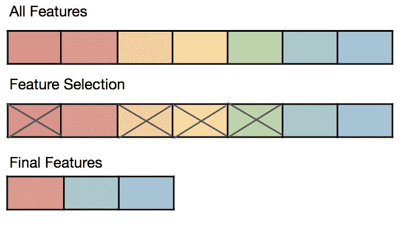
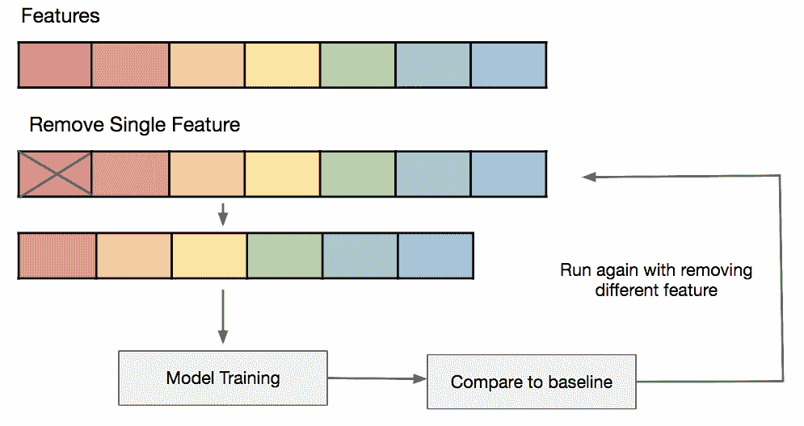
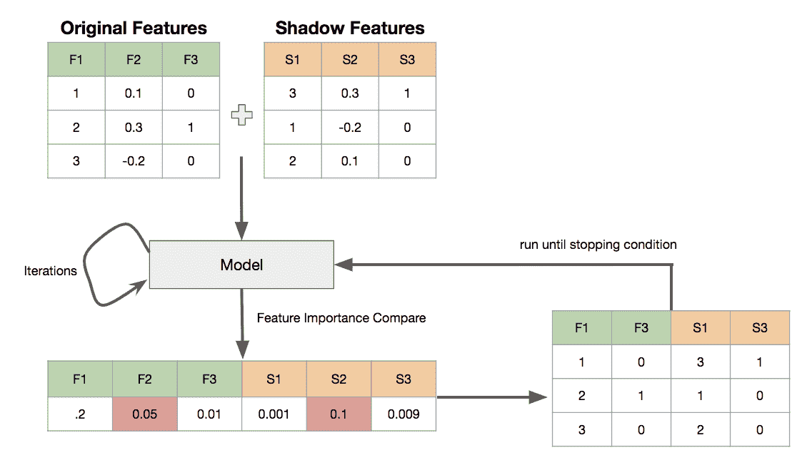

# 特征选择：超越特征重要性？

> 原文：[`www.kdnuggets.com/2019/10/feature-selection-beyond-feature-importance.html`](https://www.kdnuggets.com/2019/10/feature-selection-beyond-feature-importance.html)

评论

**由 [Dor Amir](https://www.linkedin.com/in/dor-amir-07a35155/)，数据科学经理，[Guesty](https://www.guesty.com/)**

在机器学习中，特征选择是选择对预测最有用的特征的过程。虽然听起来简单，但它是创建新机器学习模型中最复杂的问题之一。

在这篇文章中，我将与你分享一些在我最近主持的项目中研究过的方法，项目在 [Fiverr](https://www.fiverr.com/)。

你将了解到我尝试的基本方法以及更复杂的方法，这种方法取得了最佳结果——去除了超过 60%的特征，同时保持准确性并为我们的模型实现了更高的稳定性。我还会分享我们对这一算法的改进。

### 为什么特征选择如此重要？

如果你构建了一个机器学习模型，你会知道识别哪些特征重要、哪些只是噪声是多么困难。

去除噪声特征将有助于节省内存、降低计算成本并提高模型的准确性。

此外，通过去除特征，你将有助于避免模型的过拟合。

有时候，你有一个在业务上有意义的特征，但这并不意味着这个特征会帮助你的预测。

你需要记住，特征在一个算法中（比如决策树）可能是有用的，而在另一个算法中（如回归模型）可能会被低估——并不是所有特征都是一样的 :)

无关或部分相关的特征可能会对模型性能产生负面影响。特征选择和数据清洗应该是设计模型的第一步，也是最重要的一步。

### 特征选择方法：

尽管有很多特征选择技术，如向后消除法、套索回归。在这篇文章中，我将分享我发现的三种最有用的特征选择方法，每种方法都有其优点。

### “All But X”

“All But X”这个名字是在 Fiverr 给这个技术起的。这个技术简单但有用。

1.  你在迭代中运行训练和评估

1.  在每次迭代中，你去除一个特征。

    如果你有大量的特征，你可以去除一“组”特征——在 Fiverr，我们通常将特征聚合在不同的时间段，比如 30 天点击、60 天点击等。这是一组特征。

1.  检查你的评估指标与基线的对比。

这种技术的目标是查看一组特征中的哪些不影响评估，或者是否甚至去除这些特征可以改善评估。

*“所有 X”图表显示完整流程——在运行所有迭代后，我们进行比较以检查哪个特征没有影响模型的准确性。*

这个方法的问题在于，通过一次移除一个特征，你无法得到特征间相互作用的效果（非线性效果）。也许特征 X 和特征 Y 的组合在制造噪音，而不仅仅是特征 X。

### 特征重要性 + 随机特征

我们尝试的另一种方法是使用大多数机器学习模型 API 提供的特征重要性。

我们所做的，不仅仅是从特征重要性中取前 N 个特征。我们向数据中添加了 3 个随机特征：

1.  二元随机特征（0 或 1）

1.  0 到 1 之间均匀分布的随机特征

1.  整数随机特征

在特征重要性列表中，我们仅保留那些比随机特征重要的特征。

重要的是使用不同分布的随机特征，因为每种分布可能会有不同的效果。

在决策树中，模型“更偏爱”连续特征（因为分裂的原因），所以这些特征通常会位于层级的较高位置。这就是为什么你需要将每个特征与其等量分布的随机特征进行比较的原因。

### Boruta

[Boruta](http://feature%20selection%20with%20the%20boruta%20package%20-%20journal%20of%20...%20%20https//www.jstatsoft.org%20%E2%80%BA%20article%20%E2%80%BA%20view) 是一种特征排名和选择算法，开发于华沙大学。这个算法基于随机森林，但也可以用于 XGBoost 和其他树算法。

在 Fiverr，我对 XGBoost 排序和分类模型使用了这个算法，并进行了一些改进，我会简要说明。

这个算法是我上面提到的两种方法的结合。

1.  为数据集中的每个特征创建一个“影子”特征，具有相同的特征值，但仅在行之间进行洗牌。

1.  在循环中运行，直到满足其中一个停止条件：

    2.1\. 我们不再移除任何特征。

    2.2\. 我们移除了足够的特征——我们可以说我们要移除 60%的特征。

    2.3\. 我们运行了 N 次迭代——我们限制了迭代次数以避免陷入无限循环。

1.  运行 X 次迭代——我们使用了 5 次，以消除模型的随机性。

    3.1\. 用常规特征和影子特征训练模型。

    3.2\. 保存每个特征的平均特征重要性分数。

    3.3 移除所有比其影子特征低的特征。

Boruta 伪代码

*Boruta 流程图，从创建影子特征——训练——比较——移除特征并重新开始。*

### Boruta 2.0

这是本文的最佳部分，我们对 Boruta 的改进。

我们用“简化版”的原始模型运行了 Boruta。通过取样数据和更少的树（我们使用了 XGBoost），我们提高了原始 Boruta 的运行时间，而不降低准确性。

另一个改进是，我们使用之前提到的随机特征运行了算法。这是一个好的合理性检查或停止条件，以确保我们已经从数据集中移除了所有随机特征。

尽管有了改善，我们没有看到模型准确性的变化，但我们观察到了运行时间的改善。通过移除一些特征，我们将特征数量从 200 多个减少到了不到 70 个。我们还观察到了模型在树的数量和不同训练阶段的稳定性。

我们还观察到了训练集和验证集之间的损失距离有所改善。

改进和 Boruta 的优点在于，你正在运行自己的模型。在这种情况下，发现的问题特征对你的模型有问题，而不是其他算法。

### 总结

在这篇文章中，你看到了 3 种不同的特征选择技术以及如何构建有效的预测模型。你看到了我们对 Boruta 的实现、运行时间的改善以及添加随机特征以帮助进行合理性检查。

通过这些改进，我们的模型运行速度大大提高，稳定性增强，准确性保持在原有水平，同时特征数量仅为原来的 35%。

选择最适合你的技术。请记住，特征选择可以帮助提高准确性、稳定性和运行时间，并避免过拟合。更重要的是，特征减少后调试和解释性变得更容易。

**简介： [Dor Amir](https://www.linkedin.com/in/dor-amir-07a35155/)** 是 [Guesty](https://www.guesty.com/) 的数据科学经理。

[原文](https://medium.com/fiverr-engineering/feature-selection-beyond-feature-importance-9b97e5a842f)。经许可转载。

**相关：**

+   特征提取指南

+   Python 中的随机搜索特征选择

+   揭开黑箱：如何利用可解释的机器学习

* * *

## 我们的三大课程推荐

 1\. [Google 网络安全证书](https://www.kdnuggets.com/google-cybersecurity) - 快速进入网络安全职业生涯。

 2\. [Google 数据分析专业证书](https://www.kdnuggets.com/google-data-analytics) - 提升你的数据分析技能

 3\. [Google IT 支持专业证书](https://www.kdnuggets.com/google-itsupport) - 支持你的组织进行 IT 工作

* * *

### 更多相关话题

+   [超越猜测：利用贝叶斯统计进行有效的…](https://www.kdnuggets.com/beyond-guesswork-leveraging-bayesian-statistics-for-effective-article-title-selection)

+   [特征选择：科学与艺术的交汇](https://www.kdnuggets.com/2021/12/feature-selection-science-meets-art.html)

+   [机器学习中的替代特征选择方法](https://www.kdnuggets.com/2021/12/alternative-feature-selection-methods-machine-learning.html)

+   [机器学习模型的高级特征选择技术](https://www.kdnuggets.com/2023/06/advanced-feature-selection-techniques-machine-learning-models.html)

+   [庆祝对数据隐私重要性的认识](https://www.kdnuggets.com/2022/01/celebrating-awareness-importance-data-privacy.html)

+   [机器学习不像你的大脑 第六部分：精确突触权重的重要性](https://www.kdnuggets.com/2022/08/machine-learning-like-brain-part-6-importance-precise-synapse-weights-ability-set-quickly.html)
