# 用 AI 对抗新冠病毒：通过深度学习和计算机视觉改进检测

> 原文：[`www.kdnuggets.com/2020/04/fighting-coronavirus-ai-improving-testing-deep-learning-computer-vision.html`](https://www.kdnuggets.com/2020/04/fighting-coronavirus-ai-improving-testing-deep-learning-computer-vision.html)

评论

**由 [Ayoosh Kathuria](https://www.linkedin.com/in/ayoosh-kathuria-44a319132/)，印度拉杰普拉斯科技学院，德里**

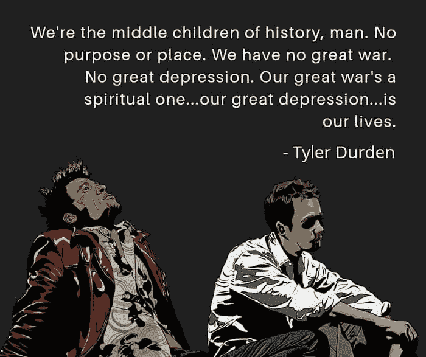

* * *

## 我们的三大课程推荐

 1\. [Google 网络安全证书](https://www.kdnuggets.com/google-cybersecurity) - 快速进入网络安全职业生涯。

 2\. [Google 数据分析专业证书](https://www.kdnuggets.com/google-data-analytics) - 提升你的数据分析技能

 3\. [Google IT 支持专业证书](https://www.kdnuggets.com/google-itsupport) - 支持你所在组织的 IT

* * *

上述引述来自于《搏击俱乐部》这本书，该书也被改编成了一部由布拉德·皮特、爱德华·诺顿和海伦娜·伯翰·卡特主演的电影。我在 1996 年书出版时才一岁。主角泰勒·德顿谈到，当代一代人正面临危机，因为他们没有经历过一种具有划时代意义的事件，将他们的生活分为“之前”和“之后”。在某种程度上，对于像我这样的千禧一代也是如此，直到新冠病毒大流行袭来。

现在我必须澄清。并不是说过去几十年中没有经济崩溃（例如津巴布韦、委内瑞拉）。我也不否认世界的某些地方经历了毁灭性的疫情（SARS、埃博拉等）。但几乎所有这些疫情都局限于某些地区，其他地区可以提供援助。新冠病毒对整个世界造成的破坏——无论是过度负担的医疗系统、数百万人被封锁、儿童缺课，还是经济遭受重大打击——都在很大程度上是前所未有的。

这里有一个由约翰霍普金斯大学提供的实时仪表盘，跟踪全球的病例。在文章发布时，全球病例已经接近 900,000 例。

尽管泰勒·德顿倡导一种业余搏击俱乐部，让人们互殴以应对存在主义的愤怒，但 AI 和数据科学的进步让我们中的许多人处于帮助人类击败新冠病毒的前沿。当然，后者选项更好，因为前者与社交距离的概念不太相符。

### 这个系列讲了什么？

与我之前做过的系列（包括 [ GauGAN](https://blog.paperspace.com/nvidia-gaugan-introduction/)、 [从零实现 YOLO](https://blog.paperspace.com/how-to-implement-a-yolo-object-detector-in-pytorch/)、 [边界框的数据增强](https://blog.paperspace.com/data-augmentation-for-bounding-boxes/)，等）不同的是，这个系列的发展更加开放。关于 AI 如何用于应对冠状病毒的研究仍在进行中。目前，公共领域中的 COVID-19 医学数据（例如患者的 CT 扫描）少得可怜。当然，医学数据由于隐私问题可能需要时间才能公开。

尽管如此，我们看到一些领域出现了关于如何利用 AI 应对冠状病毒的研究。这些包括：

1.  使用基于计算机视觉的深度学习作为工具，帮助诊断患者的肺部 CT 扫描中的 COVID-19。

1.  尝试使用基于深度学习的蛋白质折叠解决方案来开发治疗方法。

1.  使用自然语言处理从大量关于 COVID-19 的文献中提取有意义的见解。

1.  使用计算机视觉辅助的监控来观察人群，并例如执行社交距离措施。

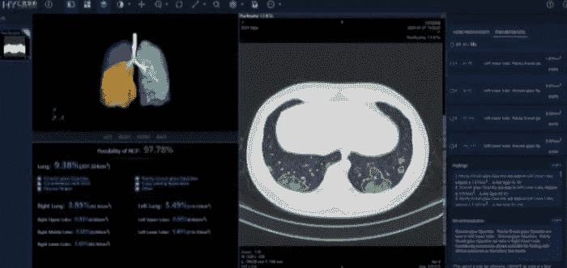

医学影像一直是计算机视觉研究中的热门话题。

这个系列的想法是探索这些研究领域，并且如果可能的话，提供一些示例，以便在数据可用时你可以开始朝着解决方案努力。

本文中我们将涵盖的内容

在这篇文章中，我将讨论：

1.  测试在应对疫情中的重要性。

1.  当前检测工具面临的挑战。

1.  几篇新论文概述了如何利用深度学习从 CT 扫描中诊断 COVID-19。

1.  如何解读深度学习诊断系统的结果及一些注意事项。

### 首先，免责声明……

在进一步讨论之前，让我说一下我不是医学或放射学专业人员。我的经验在于机器学习、深度学习和计算机科学。我写的内容来自于我对医学影像的有限研究，如果我写错了什么，而你恰好是专业人士，请在下方评论区告诉我，以便我可以纠正。

### 测试。测试。测试。

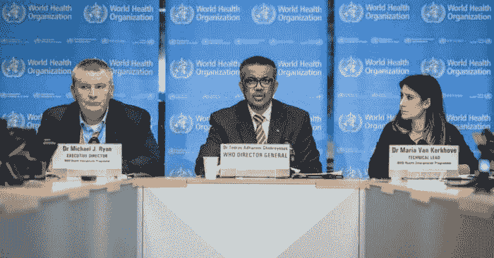

这些是来自世界卫生组织（WHO）的人。在他们的一次新闻发布会上，中间的那位说他对各国的首要建议是“*测试，测试，测试*”尽可能多地检测人员，并且如果可能的话，检测每一个有症状的人，不论其旅行或接触历史。

说到冠状病毒，检测变得非常重要，因为你可能在 5 到 14 天内不会出现症状（这称为潜伏期）。在这段时间里，如果你没有隔离自己，你会将病毒传播给你接触到的人。

### RT-PCR 检测

目前用于检测 COVID-19 患者的金标准是*逆转录聚合酶链反应测试*，或称 RT-PCR。这涉及从一个人的鼻子或喉咙中取样，然后送到机器中检查是否存在病毒。然而，RT-PCR 方法也有其缺陷。

+   这些棉签样本需要被送到 RT-PCR 机器所在的检测中心。如果时间过长，病毒可能会死亡，感染者的样本可能会变为阴性。

+   它们很昂贵。

+   已观察到 RT-PCR 测试的敏感性较低，即假阴性的可能性较高。这就是为什么政府通常会做多次测试以确认结果。

+   它们也会产生很多假阳性。这是个问题，因为你可能会不必要地给健康系统带来负担，接纳那些实际上并没有病毒的人。

如果你仍然不相信，取样可能需要将棉签插入你的鼻子深处，感觉像是触碰到了大脑。人们就是这样描述的。不是开玩笑的。

如果这还不能激励你想出更好的检测方法，那么没有什么能做到这一点了。

### CT 扫描

对武汉医院收集的数据的研究显示，在感染者中，CT 扫描在 COVID-19 诊断中的敏感性远高于 RT-PCR。根据在*Radiology*上发表的对 1014 名 COVID-19 患者进行的[t 这项研究](https://pubs.rsna.org/doi/10.1148/radiol.2020200642)，RT-PCR 只能检测到 601/1014（59%）的阳性，而 CT 扫描则检测到 888/1014（88%）的阳性。

> “结果显示，601 名患者（59%）的 RT-PCR 结果为阳性，而 888 名患者（88%）的胸部 CT 扫描结果为阳性。基于 RT-PCR 结果，胸部 CT 在提示 COVID-19 方面的敏感性为 97%。在 RT-PCR 结果为阴性的患者中，75%（413 名患者中的 308 名）胸部 CT 检查结果为阳性。其中，48%被认为是高度可能的病例，33%为可能的病例。通过分析连续的 RT-PCR 测试和 CT 扫描，从初始阴性到阳性 RT-PCR 结果的间隔为 4 到 8 天。”

[这项研究](https://pubs.rsna.org/doi/10.1148/radiol.2020200432)报告称，CT 扫描的敏感性约为 97%，而 RT-PCR 的敏感性约为 71%。

根据这些发现，我们有理由相信，使用 CT 扫描进行诊断可能会有益。然而，即使有了 CT 扫描，你仍然需要一位合格的放射科医生来确认 COVID-19 的存在。不幸的是，放射科医生数量有限，特别是当病例激增时，他们可能会非常忙碌。

### COVID-19 的特征

这是一名健康患者的 CT 扫描图像。

一些肺结节是正常的

现在我们考虑一个因 COVID-19 引起的肺炎患者的 CT 扫描。

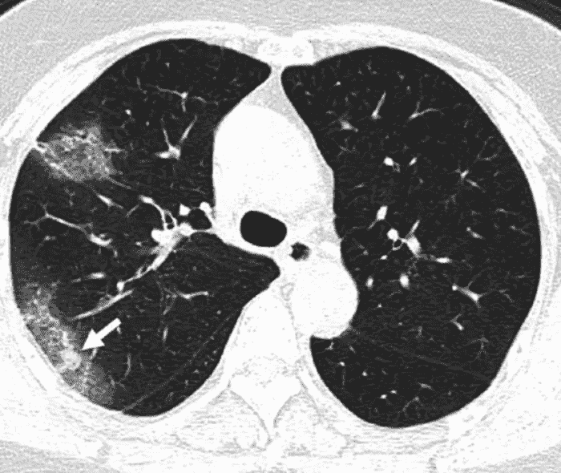

注意左侧箭头标记的“玻璃样”密度。我们可以看到左肺的周边有几个这样的密度。

通常，肺炎会导致肺部液体积聚，表现为肺部的密度。有关应用深度学习诊断 COVID-19 的 CT 扫描文献确实指出了与其他类型肺炎相比，COVID-19 肺部 CT 扫描中发现的一些独特特征，这些特征源于不同的原因。

一篇题为*[深度学习系统筛查冠状病毒病 2019 肺炎](https://arxiv.org/pdf/2002.09334.pdf)*的论文列出了三种这样的特征：

> “…玻璃样外观，沿胸膜分布明显，并且通常一个病例中有多个独立的感染灶。”

1.  第一个意思是肺部的密度看起来像玻璃样。

1.  第二个意思是这些密度大多数出现在肺部边缘。

1.  第三个意思是我们可以有多个这样的密度簇。

在上面的肺部 CT 扫描图像中可以观察到这三种特征。

如果你想了解更多关于 COVID-19 患者 CT 扫描特征的信息，[这里有一篇精彩的文章](https://www.businessinsider.in/science/news/china-is-diagnosing-coronavirus-patients-by-looking-for-ground-glass-in-their-lungs-take-a-look-at-the-ct-scans-/articleshow/74126644.cms)。

### 使用深度学习检测冠状病毒

近年来，计算机视觉在医学成像领域用于诊断各种疾病的应用激增。例如，斯坦福大学的[CheXNet](https://stanfordmlgroup.github.io/projects/chexnet/)用于诊断肺部 X 光片中的肺炎，从视网膜图像预测心血管风险因素，以及皮肤癌分类。

类似地，最近发表了一些研究论文，这些论文基本上采用 CT 扫描并试图预测该人是否感染了 COVID-19。要保持最新信息，你可以随时查阅 Google Scholar。

### CT 扫描数据

CT 扫描（或计算机断层扫描）是通过一台扫描器围绕你的身体进行，创建你器官的三维模型。这是一个 CT 扫描仪工作原理的演示。

因此，你的数据在这种情况下将会是...

1.  三维体积，需要使用三维卷积网络。

1.  多个横截面切片，可以使用二维神经网络。

### 提取感兴趣区域（ROI）

所有这些方法都涉及一定的数据预处理，以从 CT 扫描中提取*感兴趣区域*作为第一步。一旦这些 ROIs 被提取，它们就会被送到深度神经网络中，以将病例分类为 COVID-19 或其他类别，如细菌性肺炎、病毒性肺炎、无感染等（“其他”类别在不同论文中有所不同）。

这是来自论文*[深度学习系统筛查新冠肺炎](https://arxiv.org/pdf/2002.09334.pdf)*的一个例子，它处理 CT 扫描的 2-D 切片。

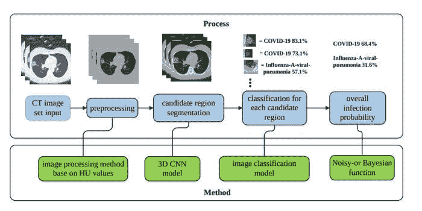

第三张图中围绕弥漫性不透明度的小边界框是 RoI 的一个例子。

论文首先使用图像预处理方法对肺部进行分割。然后使用基于 VNET20 的分割模型 VNET-IR-RPN17 提取感兴趣区域。该模型本身是为了从肺结核中提取 ROI 而训练的，但发现它对 COVID-19 的使用案例也效果很好。

然后每个 RoI 被送入分类模型，我们得到类别概率。可能会有一个或多个 RoI，给出多个概率。这些概率然后通过一种称为*Noisy-or-Bayesian*的函数结合起来。更多细节可以在上面链接的论文中找到。

论文还利用了一个事实，即新冠病毒的透明度通常出现在肺部边缘，这一信息在后期阶段作为输入传递给网络。关于如何准确计算这个距离的细节可以在论文中找到。

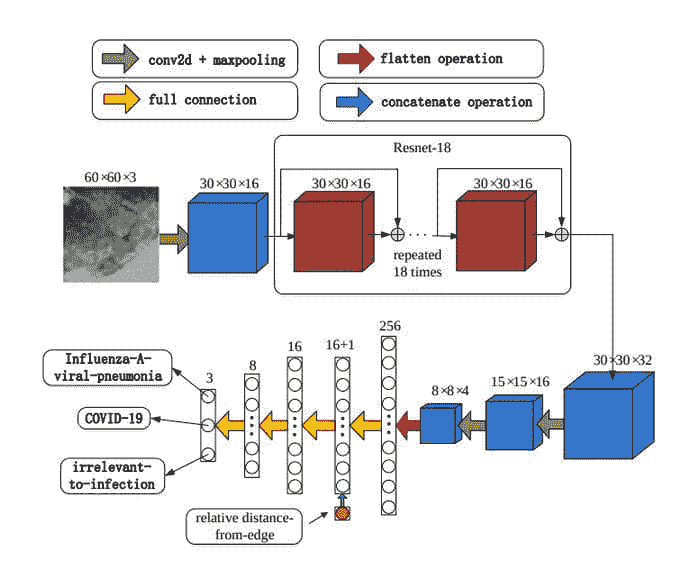

分类网络的架构。

网络架构受到 ResNet 的启发，在最终分类层上使用局部注意力。

**[深度学习系统筛查新冠肺炎](https://arxiv.org/abs/2002.09334v1)**

### 使用 3-D 信息

在另一篇题为*[新冠病毒（COVID-19）大流行的快速 AI 开发周期：使用深度学习 CT 图像分析进行自动检测和患者监测的初步结果](https://arxiv.org/abs/2003.05037)*的论文中，作者使用了[3-D U-Net 架构](https://arxiv.org/abs/1606.06650)来从扫描中提取肺部（与 VNET20 模型的功能相同）。

然后这些*肺部裁剪图*被神经网络分类。整个肺部被传递到分类网络，与之前的工作不同，之前的工作是在分类前从肺部提取了 ROI。作者接着使用[Grad-CAM](https://arxiv.org/abs/1610.02391)技术创建肺部的“热图”。

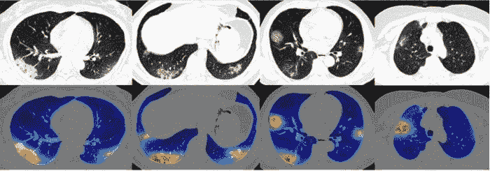

红色区域显示了与 COVID-19 最强相关的肺部区域，而蓝色区域显示了不重要的区域。

为了分类每个患者，使用了 CT 扫描的多个切片。每个切片用于计算类别概率。如果大多数切片的最高类别概率为 COVID-19，则患者被分类为 COVID-19 *阳性*。（换句话说，每个切片都算作一次投票）。

除了分类二维肺部切片外，作者还使用了一种现成的软件，[RADLogics](http://radlogics.com/)，它检测三维肺部体积中的结节和小阴影。然后，将软件的补丁和早期阶段的热图结合起来，创建三维可视化。

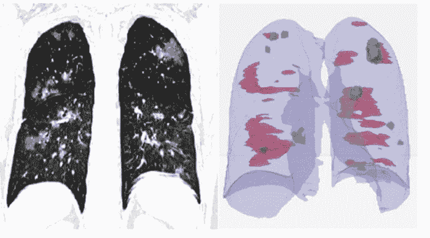

红色的补丁对应于分类系统挑选的点，而绿色的点是软件挑选的点。

补丁的体积随后用于创建一个“Corona Score”。

**[冠状病毒（COVID-19）大流行的快速 AI 开发周期：使用深度学习 CT 图像分析的自动检测和患者监测的初步结果](https://arxiv.org/abs/2003.05037v3)**

### CovNet

在最近由北美放射学学会发布的一篇论文中，*[人工智能在胸部 CT 中区分 COVID-19 和社区获得性肺炎](https://pubs.rsna.org/doi/pdf/10.1148/radiol.2020200905)*，提出了一种称为 CovNet 的架构，旨在处理同一 CT 扫描的多个二维切片。

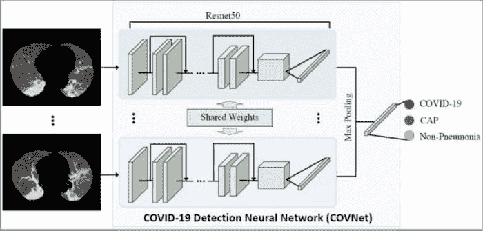

特征向量是从每个切片中提取的。然后，这些多个特征向量被最大池化以获得一个单一的特征向量。这个特征向量随后被输入到全连接层，以将病例分类为 COVID-19、社区获得性肺炎或非肺炎。

### 结果评估

在评估任何冠状病毒诊断方法的结果时，仅仅有准确率是不够的。这是因为我们测试的所有人中，只有少数人会感染病毒。世界上几乎没有国家的阳性率超过 20%（阳性病例占所有测试的比例）。在这种情况下，假设我们开发了一个只将所有结果都标记为阴性的解决方案。从准确率的角度来看，该解决方案的准确率仍然是 80%，尽管它是一个完全无用的分类器。

因此，我们需要关注其他指标，如：

**敏感性**，或真正阳性率。这是实际阳性样本数与总阳性样本数的比例，简单来说，就是我们正确分类为阳性的冠状病毒感染患者的数量。敏感性过低意味着有许多感染病毒的人被我们的算法分类为阴性。这是一个特别令人担忧的缺陷，因为它可能导致许多感染者回家并传播病毒。

**特异性**，即真正负例率。这是指真正负例与负样本总数的比例，简而言之，就是我们正确分类为负的非感染者的数量。特异性过低意味着我们会错误地告诉许多没有病毒的人他们实际上有病毒。虽然这不如低敏感性那样令人担忧，但如果系统中的假阳性过多，可能会给健康系统带来不必要的压力。

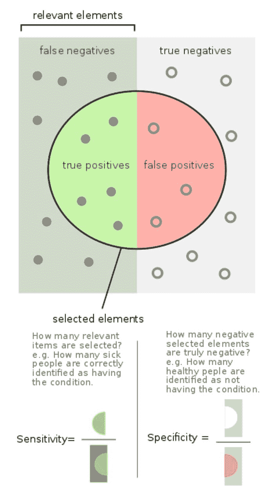

人们还使用**精确度**（我们诊断为阳性的所有患者中，实际上有多少人患有该疾病；这对于衡量我们测试的资源性很有用）和**F1 得分**（结合了精确度和敏感性）等指标。

**ROC 曲线下面积** 是衡量我们的分类器分离两个类别能力的指标。通常所有情况都由分类器给出一个概率，然后我们使用阈值来确定结果。理想情况下，我们希望所有正例的分数远高于阈值，而负例的分数远低于阈值。为什么？因为如果一个例子接近阈值，很难对预测充满信心。

例如，假设我们使用 0.5 的阈值。假设分类器为一个案例分配了 0.9 的概率。我们可以自信地说这个案例是阳性。然而，考虑另一个案例为 0.52。我们不能以相同的信心说这个例子是阳性。可以想象，如果输入略有变化，我们可能会得到 0.48 的分数，而我们会将这个例子称为阴性。

**AUROC** 是敏感性与假阳性率（1 - 特异性）之间的图形。它仅能计算二分类问题，因此当我们有**n**个类别时，我们必须制作**n**个"单一类别"对"所有其他类别"的 AUC 曲线。

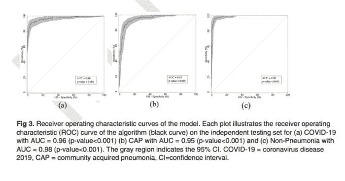

论文中的 1 对全体 AOC 曲线 *[人工智能区分 COVID-19 与社区获得性肺炎在胸部 CT 上的表现](https://pubs.rsna.org/doi/pdf/10.1148/radiol.2020200905)*

ROC 曲线下面积的范围从 0 到 1，其中 1 表示完美的分类器，0.5（表示曲线跟随直线 y=x）表示一个与抛硬币（随机机会）一样好的分类器。低于 0.5 的面积意味着你的分类器更差，错误预测的频率更高。

如果你想深入了解为什么 AUROC 有效，这里有一个不错的资源：

[**理解 AUC - ROC 曲线**](https://towardsdatascience.com/understanding-auc-roc-curve-68b2303cc9c5)

### 但有一个警告...

在结束本文之前，我想指出一些我们在将深度学习工具应用于医学用例时面临的挑战。

关于 COVID-19，在这篇文章中我们主要讨论了如何通过 CT 扫描*检测*该疾病。但说实话，你不能仅通过 CT 扫描真正*检测*到肺炎。这是因为肺炎是一种所谓的“临床诊断”。放射科医生不仅仅通过查看 CT 扫描来判断患者是否感染了 COVID-19。他们还可能查看血液检查、临床历史、附加症状等来得出结论。这是因为不同原因引起的肺炎在 CT 扫描中可能会呈现出截然不同的特征。当一篇论文报告 CT 扫描比 RT-PCR 具有更好的敏感性时，这实际上意味着医生结合 CT 扫描与其他症状和特征来诊断患者的一种方法。

虽然这并不影响使用深度学习来诊断 COVID-19 的有效性，但当 CheXNet 发布时，我们必须警惕那些花哨的头条新闻。

> 放射科医生是否应该担心他们的工作？最新消息：我们现在可以比放射科医生更好地从胸部 X 光片中诊断肺炎。[`t.co/CjqbzSqwTx`](https://t.co/CjqbzSqwTx)
> 
> — Andrew Ng (@AndrewYNg) [2017 年 11 月 15 日](https://twitter.com/AndrewYNg/status/930938692310482944?ref_src=twsrc%5Etfw)

不，放射科医生并不会消失。然而，这些深度学习工具将会在面对大量病例时（如在冠状病毒爆发期间）以及时间至关重要时，缓解他们的工作负担。

### 结论

这部分内容就到这里了。在下一部分，我们将创建一个分类器来识别肺部 X 光片是否为 COVID-19 或其他感染。目前还没有针对 COVID-19 的开放源代码 CT 扫描数据集，因此我们暂时将使用 X 光扫描。（我们在上述讨论的论文中使用的数据尚未公开）。

**个人简介：[Ayoosh Kathuria](https://www.linkedin.com/in/ayoosh-kathuria-44a319132/)** 是德里印德拉普拉斯信息技术学院的研究助理。

[原文](https://blog.paperspace.com/fighting-corona-virus-with-ai-medical-imaging-testing/)。经授权转载。

**相关：**

+   数据科学家最好的免费流行病学课程

+   确保你的 AI/机器学习系统在 COVID-19 期间存活的 4 个步骤

+   数据科学如何用于理解 COVID-19

### 更多相关话题

+   [利用 AI 对抗 AI：深度伪造应用的欺诈监测](https://www.kdnuggets.com/2023/05/fighting-ai-ai-fraud-monitoring-deepfake-applications.html)

+   [关于数据管理及其重要性的 6 件事…](https://www.kdnuggets.com/2022/05/6-things-need-know-data-management-matters-computer-vision.html)

+   [计算机视觉中的 TensorFlow - 轻松实现迁移学习](https://www.kdnuggets.com/2022/01/tensorflow-computer-vision-transfer-learning-made-easy.html)

+   [KDnuggets 新闻 2022 年 3 月 9 日：在 5 分钟内构建一个机器学习 Web 应用程序…](https://www.kdnuggets.com/2022/n10.html)

+   [假设检验与 A/B 测试](https://www.kdnuggets.com/hypothesis-testing-and-ab-testing)

+   [探索计算机视觉的世界：介绍 MLM 最新…](https://www.kdnuggets.com/2024/01/mlm-discover-the-world-of-computer-vision-ebook)
