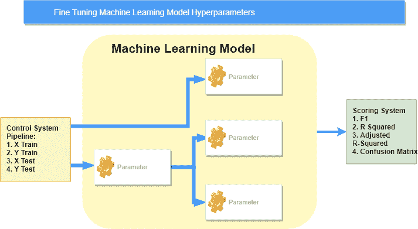
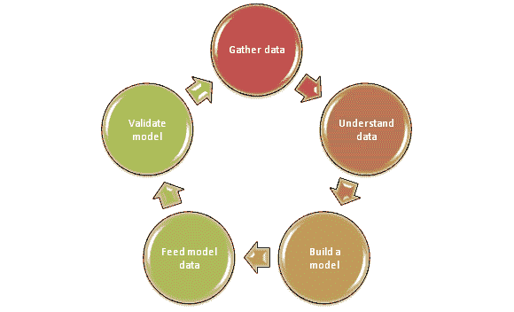

# 如何微调机器学习模型以提高预测准确性

> 原文：[`www.kdnuggets.com/2019/01/fine-tune-machine-learning-models-forecasting.html`](https://www.kdnuggets.com/2019/01/fine-tune-machine-learning-models-forecasting.html)

评论

微调机器学习预测模型是提高预测结果准确性的关键步骤。最近，我写了许多文章，解释了机器学习的工作原理以及如何丰富和分解特征集，以提高机器学习模型的准确性。

这篇文章详细介绍了：

1.  使用评分指标检索模型性能的估计

1.  查找和诊断机器学习算法的常见问题

1.  微调机器学习模型的参数

*请阅读 FinTechExplained*

[免责声明](https://medium.com/p/87dba77241c7?source=your_stories_page---------------------------).*

### **步骤 1：了解什么是微调机器学习模型**

> *有时，我们需要探索模型参数如何提高我们机器学习模型的预测准确性。*
> 
> *微调机器学习模型是一项复杂的技术任务。它可能变成一项耗时的工作。在这篇文章中，我将介绍一些我们可以遵循的方法，以在更短的时间内获得准确的结果。*

我经常被问到，当特征稳定且特征集被分解时，可以使用哪些技术来调整预测模型。**一旦尝试了所有方法，我们应该寻求微调我们的机器学习模型。**

> *调整机器学习模型就像旋转电视开关和旋钮，直到你获得更清晰的信号*

该图表说明了参数如何相互依赖。



+   X 训练数据——自变量的训练数据，也称为特征

+   X 测试数据——自变量的测试数据

+   Y 训练数据——依赖变量的训练数据

+   Y 测试数据——依赖变量的测试数据

*例如，如果你根据温度和湿度预测瀑布的水量，那么水量表示为 Y（依赖变量），温度和湿度为 X（自变量或特征）。X 的训练数据称为 X 训练数据，你可以用来训练你的模型。*

#### 超参数是可以作为模型输入参数的模型参数。

### 步骤 2：了解基础知识

在微调你的预测模型之前，了解机器学习的基本概念非常重要。

如果你是机器学习的新手，请看看这篇文章：

[8 分钟了解机器学习](https://medium.com/fintechexplained/introduction-to-machine-learning-4b2d7c57613b)

改进我们输入模型的数据通常比微调模型参数更容易。如果你想提高预测模型的准确性，请首先丰富特征集中的数据。

> *如果你输入的数据质量差，那么模型将产生差的结果。*

请查看这篇文章，突出常见的技术，以丰富特征：

[处理数据以提高机器学习模型准确性](https://medium.com/fintechexplained/processing-data-to-improve-machine-learning-models-accuracy-de17c655dc8e)

如果你不确定你的模型是否是问题的最适合模型，可以查看这篇文章。它评审了大多数常见的机器学习模型算法：

[机器学习算法比较](https://medium.com/fintechexplained/machine-learning-algorithm-comparison-f14ce372b855)

### 第 3 步：找到你的评分指标

最重要的前提是决定你将用来评分预测模型准确性的指标。

这些评分指标可能包括 R 平方、调整后的 R 平方、混淆矩阵、F1、召回率、方差等。

阅读这篇文章以了解每个数据科学家应该知道的最重要的数学测量。这些测量以易于理解的方式解释：

[每个数据科学家必须知道的数学测量](https://medium.com/fintechexplained/must-know-mathematical-measures-for-data-scientist-15bfc4f7f39c)

```py
from sklearn.metrics contains a large number of scoring metrics
```

### 第 4 步：获取准确的预测评分

一旦你准备好了训练集，丰富了其特征，缩放了数据，分解了特征集，决定了评分指标并在训练数据上训练了你的模型，你就应该在未见过的数据上测试模型的准确性。未见过的数据被称为“测试数据”。

> *你可以利用交叉验证来评估模型在未见数据上的表现。这被称为模型的泛化误差。*

#### 交叉验证

有两种常见的交叉验证方法

**留出交叉验证**

> *在同一数据集上训练模型并评分准确性并不是明智的机器学习实践。用不同模型参数值在未见测试集上测试模型是一种更优的方法。*

将数据集划分为三部分是一种良好的实践：

1.  训练集

1.  验证集

1.  测试集

*在训练集（60%的数据）上训练模型，然后在验证集（20%的数据）上进行模型选择（调整参数），一旦准备好，就在测试集（20%的数据）上测试模型。*

> *根据机器学习模型的需求和数据的可用性来创建训练、验证和测试数据集的比例。*

**K 折交叉验证**

K 折交叉验证比使用留出交叉验证机制更优。其工作方式是将数据划分为 k 个折（部分）。k-1 个折用于训练模型，最后一个折用于测试模型。

这个机制会重复 k 次。此外，每次都可以使用一些性能指标来评估和评分性能。然后报告性能指标的平均值。StratifiedKFold 保留了类别比例。

> *选择 8–12 个折叠*

```py
from sklearn.cross_validation import cross_val_score 
scores = cross_val_score(estimator=pipe_lr, X=X_train, y=Y_train, cv=12, n_jobs=)
mean_scores = scores.mean()

```

`n_jobs` 参数控制用于执行交叉验证的 CPU 数量。

### 第 5 步：使用验证曲线诊断最佳参数值

一旦确定了准确的预测评分，找出模型所需的所有参数。然后你可以使用验证曲线来探索这些参数值如何提高预测模型的准确性。

> *在调整参数之前，我们需要诊断并找出模型是否存在欠拟合或过拟合问题。*

参数数量较多的模型往往容易过拟合。我们可以使用验证曲线来解决机器学习中的过拟合和欠拟合问题。

> *这些参数也称为超参数*


**照片来源：[Dominik Scythe](https://unsplash.com/@drscythe?utm_source=medium&utm_medium=referral) 在 [Unsplash](https://unsplash.com/?utm_source=medium&utm_medium=referral)**

验证曲线用于传递一系列模型参数值。它逐一更改模型参数的值，然后可以将准确性值绘制在模型参数值上，以评估模型的准确性。

例如，如果你的模型接受名为“树木数量”的参数，那么你可以通过传入 10 个不同的参数值来测试模型。你可以使用验证曲线报告每个参数值上的准确性以评估准确性。最后取返回最高准确性的分数，这样就能在可接受的时间内得到所需的结果。

Sci-kit learn 提供了验证曲线模块：

```py
from sklearn.learning_curve import validation_curve
number_of_trees= [1,2,3,4,5,6,7,99,1000]
train_scores, test_scores = validation_curve(estimator=, … X=X_train,y=Y_train, param_range=number_of_trees, …)

```

### 第 6 步：使用网格搜索优化超参数组合

一旦我们获得了各个模型参数的最佳值，就可以使用网格搜索来获得模型的超参数值组合，从而使我们得到最高的准确性。

网格搜索会评估所有可能的参数值组合。

网格搜索是全面的，并使用穷举法来评估最准确的值。因此，它是计算密集型的任务。

使用 sci-kit learn 的 GridSearchCV 执行网格搜索

```py
from sklearn.grid_search import GridSearchCV

```

### 第 7 步：持续调整参数以进一步提高准确性

关键在于一旦有更多数据可用，就要始终增强训练集。

始终在模型未见过的更丰富的测试数据上测试你的预测模型。



始终确保为任务选择正确的模型和参数值。

一旦数据可用，就应尽快提供更多数据，并持续测试模型的准确性，以便进一步优化性能和准确性。

**总结**

本文探讨了如何：

1.  使用评分指标来检索模型性能的估计值

1.  查找并诊断机器学习算法中的常见问题

1.  微调机器学习模型的参数，以进一步提高准确性

希望这对你有帮助。

[原文](https://medium.com/fintechexplained/how-to-fine-tune-your-machine-learning-models-to-improve-forecasting-accuracy-e18e67e58898)。已获许可转载。

**资源：**

+   [在线和基于网络的：分析、数据挖掘、数据科学、机器学习教育](https://www.kdnuggets.com/education/online.html)

+   [分析、数据科学、数据挖掘和机器学习的软件](https://www.kdnuggets.com/software/index.html)

**相关：**

+   [使用 Python 进行时间序列分析和预测的端到端项目](https://www.kdnuggets.com/2018/09/end-to-end-project-time-series-analysis-forecasting-python.html)

+   [数据科学预测未来](https://www.kdnuggets.com/2018/06/data-science-predicting-future.html)

+   [利用机器学习进行销售预测](https://www.kdnuggets.com/2017/05/springml-sales-forecasting-using-machine-learning.html)

* * *

## 我们的前三大课程推荐

 1\. [谷歌网络安全证书](https://www.kdnuggets.com/google-cybersecurity) - 快速进入网络安全职业生涯。

 2\. [谷歌数据分析专业证书](https://www.kdnuggets.com/google-data-analytics) - 提升你的数据分析技能

 3\. [谷歌 IT 支持专业证书](https://www.kdnuggets.com/google-itsupport) - 支持你的组织 IT

* * *

### 更多相关主题

+   [如何微调 ChatGPT 3.5 Turbo](https://www.kdnuggets.com/how-to-finetune-chatgpt-35-turbo)

+   [如何使用 Hugging Face AutoTrain 微调 LLMs](https://www.kdnuggets.com/how-to-use-hugging-face-autotrain-to-finetune-llms)

+   [如何使用 Hugging Face Transformers 微调 BERT 以进行情感分析](https://www.kdnuggets.com/how-to-fine-tune-bert-sentiment-analysis-hugging-face-transformers)

+   [天高任鸟飞：了解 JetBlue 如何利用 Monte Carlo 和 Snowflake…](https://www.kdnuggets.com/2022/12/monte-carlo-jetblue-snowflake-build-trust-improve-model-accuracy.html)

+   [提高机器学习模型的 7 种方法](https://www.kdnuggets.com/7-ways-to-improve-your-machine-learning-models)

+   [理解分类指标：评估模型的指南](https://www.kdnuggets.com/understanding-classification-metrics-your-guide-to-assessing-model-accuracy)
