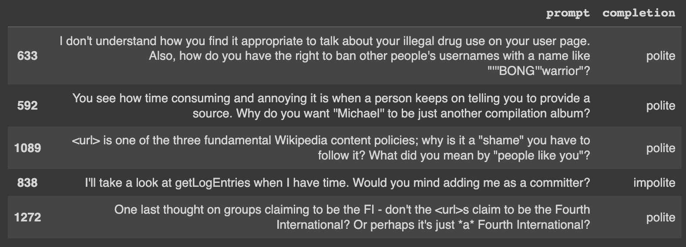

# 微调 OpenAI 语言模型使用噪声标签数据

> 原文：[`www.kdnuggets.com/2023/04/finetuning-openai-language-models-noisily-labeled-data.html`](https://www.kdnuggets.com/2023/04/finetuning-openai-language-models-noisily-labeled-data.html)

**作者：Chris Mauck, Jonas Mueller**

本文展示了数据中心 AI 工具如何改进微调的大型语言模型（LLM；也称为 *基础* 模型）。这些工具优化数据集本身，而不是改变模型架构/超参数 — 在改进的数据集上运行完全相同的微调代码可以将测试集性能提升 37%，这是在此处研究的礼貌分类任务中实现的。我们通过相同的数据中心 AI 过程，在通过 OpenAI API 进行微调的三种最先进的 LLM 模型中获得了类似的准确度提升：Davinci、Ada 和 Curie。这些模型是支撑 GPT-3/ChatGPT 的基础 LLM 的变体。

* * *

## 我们的前三大课程推荐

 1\. [谷歌网络安全证书](https://www.kdnuggets.com/google-cybersecurity) - 快速进入网络安全职业道路。

 2\. [谷歌数据分析专业证书](https://www.kdnuggets.com/google-data-analytics) - 提升你的数据分析技能

 3\. [谷歌 IT 支持专业证书](https://www.kdnuggets.com/google-itsupport) - 支持你的组织 IT

* * *

上图展示了针对文本的三类礼貌分类测试准确度，这些测试是使用相同的 LLM 微调代码（通过 OpenAI API 适配 Davinci）在三种不同数据集上运行的结果：（1）由人工注释员标记的原始数据集，（2）该数据集的自动筛选版本，我们通过自信学习移除了自动估计为标记错误的样本，（3）原始数据的清理版本，我们手动修正了被估计为标记错误的样本（而不是过滤这些样本）。

## 背景


标记数据推动了企业中的 AI/ML，但现实世界的数据集[已被发现](https://go.cloudfactory.com/hubfs/02-Contents/3-Reports/Crowd-vs-Managed-Team-Hivemind-Study.pdf)含有 7-50%的标注错误。标注不完美的文本数据阻碍了机器学习模型在意图识别、实体识别和序列生成等任务中的训练（和评估）。虽然预训练的 LLM 拥有大量的世界知识，但其性能受到噪声训练数据的负面影响（[正如 OpenAI 所指出的](https://arxiv.org/abs/2005.14165)）。在这里，我们展示了数据中心技术，以减轻标签噪声的影响，而无需更改与模型架构、超参数或训练相关的任何代码。因此，这些数据质量改进技术即使对于未来的高级 LLM 如 GPT-10 也应适用。

# 为什么微调？

LLM 在对互联网上的大部分文本进行预训练后，获得了强大的生成和区分能力。然而，确保 LLM 在特定业务用例中产生可靠输出通常需要在标记了所需输出的实际领域数据上进行额外训练。这种领域特定的训练被称为*微调* LLM，可以通过[OpenAI 提供的 API](https://platform.openai.com/docs/guides/fine-tuning)进行。数据标注过程中的不完美不可避免地在这种领域特定的训练数据中引入标签错误，这对 LLM 的适当微调和评估构成了挑战。

# 为什么数据中心的人工智能？

以下是[OpenAI 的引用](https://openai.com/research/dall-e-2-pre-training-mitigations)关于他们训练最先进 AI 系统策略的内容：

> "*由于训练数据塑造了任何学习模型的能力，数据过滤是限制不良模型能力的强大工具。*"
> 
> "*我们优先过滤掉所有不良数据，而不是保留所有良好数据。这是因为我们可以在以后用更多的数据来微调我们的模型以教授它新知识，但让模型忘记它已经学到的东西要困难得多。*"

显然，数据集质量是一个至关重要的考虑因素。一些组织如 OpenAI 手动处理数据中的问题，以生成最好的模型，但这需要大量的工作！数据中心人工智能是一门新兴的算法科学，旨在检测数据问题，因此你可以通过自动化更轻松地系统性改进你的数据集。

在这些实验中，我们的 LLM 是 OpenAI 的 Davinci 模型，这是他们最强大的 GPT-3 模型，ChatGPT 基于此模型。

# 概述

在这里，我们考虑了[斯坦福礼貌数据集](https://convokit.cornell.edu/documentation/wiki_politeness.html)的一个三类变体，其中的文本短语被标记为：*不礼貌*、*中性*或*礼貌*。这些标签由人工评分员标注，其中一些标签的质量自然较低。


本文介绍以下步骤：

+   使用原始数据通过 OpenAI API 微调不同的最先进 LLM：Davinci、Ada 和 Curie。

+   在具有高质量标签的测试集上建立每个微调模型的基线准确率（通过共识和多位人工标注者对每个测试样本的高一致性确定）。

+   使用 Confident Learning 算法自动识别数百个标签错误的样本。

+   从数据集中删除自动标记的标签问题数据，然后在自动筛选的数据集上微调完全相同的 LLM。**这个简单的步骤将 Davinci 模型预测的错误减少 8%!**

+   引入一种**无代码**解决方案，以高效修正数据集中标签错误，然后在修正后的数据集上微调完全相同的 LLM。**这将 Davinci 模型预测的错误减少 37%!**

通过这些相同的过程，Ada 和 Curie 模型也取得了类似的改进——在所有情况下，模型和微调代码都没有改变！

这里有一个[notebook](https://colab.research.google.com/github/cmauck10/notebooks/blob/master/LLM_with_noisy_labels.ipynb)，你可以运行它以重现本文中演示的结果，并理解实现每一步的代码。

# 礼貌数据集

你可以在这里下载训练集和测试集：[train](https://s.cleanlab.ai/stanford-politeness/fine-tuning/train.csv) [test](https://s.cleanlab.ai/stanford-politeness/fine-tuning/test.csv)

我们的训练数据集有 1916 个样本，每个样本由一个人工标注者标记，因此其中一些可能不可靠。测试数据集有 480 个样本，每个样本由五位标注者标记，我们使用他们的共识标签作为对真实礼貌的高质量近似（将测试准确率与这些共识标签进行比较）。为了确保公平比较，该测试数据集在实验过程中保持不变（所有标签清理/数据集修改仅在训练集中进行）。我们将这些 CSV 文件重新格式化为 OpenAI 微调 API 所需的 jsonl 文件类型。

# 微调并评估 LLM

这是我们如何微调 Davinci LLM 以进行 3 类分类并评估其测试准确率的代码示例：

```py
!openai api fine_tunes.create -t "train_prepared.jsonl" -v "test_prepared.jsonl" --compute_classification_metrics --classification_n_classes 3 -m davinci 
--suffix "baseline"

>>> Created fine-tune: ft-9800F2gcVNzyMdTLKcMqAtJ5
```

一旦任务完成，我们查询 fine_tunes.results 端点，以查看在原始训练数据集上微调该 LLM 时所达到的测试准确率。

```py
!openai api fine_tunes.results -i ft-9800F2gcVNzyMdTLKcMqAtJ5 > baseline.csv

df = pd.read_csv('baseline.csv')
baseline_acc = df.iloc[-1]['classification/accuracy']

>>> Fine-tuning Accuracy: 0.6312500238418579
```

我们的基线 Davinci LLM 在使用可能有噪声标签的原始训练数据进行微调时，测试准确率为 63%。即使是最先进的 LLM，如 Davinci 模型，对于这个分类任务的表现也平平，是因为数据标签存在噪声吗？

# 自动查找标签问题

[Confident Learning](https://arxiv.org/abs/1911.00068) 是一种最近开发的算法套件，用于估计分类数据集中哪些数据被错误标记。这些算法需要**样本外**预测的类别概率，并应用一种新颖的校准形式，以确定何时信任模型而不是数据中的给定标签。

为了获得这些预测概率，我们：

1.  使用 OpenAI API 从 Davinci 模型中计算所有训练样本的嵌入。你可以[在这里](https://cleanlab-public.s3.amazonaws.com/Datasets/stanford-politeness/LLM-blog/train_embed_davinci.npy)下载嵌入。

1.  在原始数据的嵌入和标签上拟合一个逻辑回归模型。我们使用 10 倍交叉验证，这使我们能够为训练数据集中的每个样本生成样本外预测的类别概率。

```py
# Get embeddings from OpenAI.
from openai.embeddings_utils import get_embedding

embedding_model = "text-similarity-davinci-001"
train["embedding"] = train.prompt.apply(lambda x: get_embedding(x, engine=embedding_model))
embeddings = train["embedding"].values

# Get out-of-sample predicted class probabilities via cross-validation.
from sklearn.linear_model import LogisticRegression

model = LogisticRegression()
labels = train["completion"].values
pred_probs = cross_val_predict(estimator=model, X=embeddings, y=labels, 		                   cv=10, method="predict_proba")
```

[cleanlab](https://github.com/cleanlab/cleanlab) 包提供了 Confident Learning 的开源 Python 实现。只需一行代码，我们就可以使用模型预测概率运行 Confident Learning，以估计训练数据集中哪些样本存在标签问题。

```py
from cleanlab.filter import find_label_issues

# Get indices of examples estimated to have label issues:
issue_idx = find_label_issues(labels, pred_probs,
            return_indices_ranked_by='self_confidence')  # sort indices by likelihood of label error 
```

让我们查看一下数据集中自动识别的一些标签问题。这是一个明显错误标记的例子：

+   短语：*我有时间时会查看 getLogEntries。你介意把我加为提交者吗？*

+   标签：*不礼貌*

像这样的标签错误可能是我们看到模型结果不佳的原因。



说明：自动识别的一些主要错误。

**注意：** **find_label_issues** **能够仅根据样本外** **pred_probs** **确定哪些给定的** **标签** **可能是错误的。**

# 过滤标签问题并微调更强健的 LLM

现在我们有了潜在错误标记样本的索引（通过自动技术识别），让我们从训练数据集中移除这 471 个样本。在过滤后的数据集上微调完全相同的 Davinci LLM 实现了 66% 的测试准确率（在我们原始的 Davinci LLM 达到 63% 准确率的同一测试数据上）。我们**通过使用** **更少** **但** **更高质量** **的训练数据将模型的错误率降低了 8%**！

```py
# Remove data flagged with potential label error. 
train_cl = train.drop(issue_idx).reset_index(drop=True)
format_data(train_cl, "train_cl.jsonl")

# Train a more robust classifier with less erroneous data.
!openai api fine_tunes.create -t "train_cl_prepared.jsonl" -v "test_prepared.jsonl" --compute_classification_metrics --classification_n_classes 3 -m davinci --suffix "dropped"

# Evaluate model on test data.
!openai api fine_tunes.results -i ft-InhTRQGu11gIDlVJUt0LYbEx > autofiltered.csv
df = pd.read_csv('autofiltered.csv')
dropped_acc = df.iloc[-1]['classification/accuracy']

>>> 0.6604166626930237
```

# 修正标签错误

与其通过过滤自动修正自动检测到的标签问题，更聪明（但更复杂）的方法是手动修正标签问题。这同时移除一个噪声数据点并添加一个准确的数据点，但手动进行这些修正是繁琐的。我们使用 [Cleanlab Studio](https://cleanlab.ai/studio/) 这一企业数据修正界面来手动完成此操作。

在用更合适的标签替换了我们发现的坏标签后，我们在手动修正的数据集上对完全相同的 Davinci LLM 进行了微调。得到的模型在相同的测试数据集上达到了 **77%** 的准确率，这比我们原始版本的模型减少了 **37% 的错误**。

```py
# Load in and format data with the manually fixed labels.
train_studio = pd.read_csv('train_corrected.csv')
format_data(train_studio, "train_corrected.jsonl")

# Train a more robust classifier with the fixed data.
!openai api fine_tunes.create -t "train_corrected_prepared.jsonl" -v "test_prepared.jsonl" 
--compute_classification_metrics --classification_n_classes 3 -m davinci --suffix "corrected"

# Evaluate model on test data.
!openai api fine_tunes.results -i ft-MQbaduYd8UGD2EWBmfpoQpkQ > corrected .csv
df = pd.read_csv('corrected.csv')
corrected_acc = df.iloc[-1]['classification/accuracy']
>>> 0.7729166746139526
```

**注意：在整个过程中，我们从未更改任何与模型架构/超参数、训练或数据预处理相关的代码！** 所有改进严格来源于提高训练数据的质量，这为模型方面的额外优化留下了空间。

# 评估其他 LLM

我们对 OpenAI 提供的另外两个最近的 LLM 模型 Ada 和 Curie 进行了相同的实验。得到的改进结果看起来与 Davinci 模型取得的类似。


# 结论

数据中心的 AI 是处理噪声数据的强大范式，通过 AI/自动化技术而不是繁琐的手动工作。现在有工具可以帮助你高效地发现和修复数据及标签问题，从而改进任何机器学习模型（不仅仅是 LLM），适用于大多数类型的数据（不仅仅是文本，还有图像、音频、表格数据等）。这些工具*利用*任何机器学习模型来诊断/修复数据中的问题，然后改进数据*以*适用于其他机器学习模型。这些工具将随着未来机器学习模型如 GPT-10 的进步而持续适用，并且在与更准确的模型一起使用时，将更好地识别问题！

实践数据中心 AI 以通过 AI/自动化系统地优化数据。这使你可以利用你独特的领域知识，而不是修复一般数据问题，如标签错误。

**[Chris Mauck](https://www.linkedin.com/in/chris-mauck/)** 是 Cleanlab 的数据科学家。

### 更多相关话题

+   [RAG 与微调：哪个是提升您的 LLM 应用程序的最佳工具？](https://www.kdnuggets.com/rag-vs-finetuning-which-is-the-best-tool-to-boost-your-llm-application)

+   [使用 OpenAI 构建 AI 产品：CoRise 的免费课程](https://www.kdnuggets.com/2023/07/corise-building-ai-products-openai-free-course-corise.html)

+   [OpenAI 介绍 Superalignment](https://www.kdnuggets.com/2023/08/introducing-superalignment-openai.html)

+   [使用 OpenAI GPT 模型的最佳实践](https://www.kdnuggets.com/2023/08/best-practices-openai-gpt-model.html)

+   [OpenAI API 初学者指南：您的易于遵循的入门指南](https://www.kdnuggets.com/openai-api-for-beginners-your-easy-to-follow-starter-guide)

+   [使用 Python 探索 OpenAI API](https://www.kdnuggets.com/exploring-the-openai-api-with-python)
