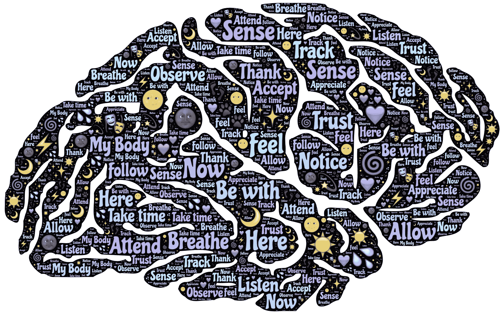

# 数据科学中的五种认知偏差（以及如何避免它们）

> 原文：[`www.kdnuggets.com/2020/06/five-cognitive-biases-data-science.html`](https://www.kdnuggets.com/2020/06/five-cognitive-biases-data-science.html)

评论

*重新训练你的思维。图片由 [John Hain](https://pixabay.com/users/johnhain-352999/?utm_source=link-attribution&utm_medium=referral&utm_campaign=image&utm_content=1000062) 提供，来源于 [Pixabay](https://pixabay.com/?utm_source=link-attribution&utm_medium=referral&utm_campaign=image&utm_content=1000062)。*

* * *

## 我们的前三大课程推荐

 1\. [谷歌网络安全证书](https://www.kdnuggets.com/google-cybersecurity) - 快速进入网络安全职业生涯。

 2\. [谷歌数据分析专业证书](https://www.kdnuggets.com/google-data-analytics) - 提升你的数据分析技能

 3\. [谷歌 IT 支持专业证书](https://www.kdnuggets.com/google-itsupport) - 支持你组织的 IT

* * *

最近，我在阅读 Rolf Dobell 的*《清晰思考的艺术》*时，开始以全新的方式思考认知偏差。我意识到某些认知偏差是多么根深蒂固。实际上，我们经常没有意识到我们的思维受到这些偏差的影响。对数据科学家来说，这些偏差确实会改变我们处理数据的方式和日常决策，通常并非有利。

> *数据科学尽管我们处理的所有事实看似客观，但其过程却出奇地主观。*

作为数据科学家，我们的工作是解读事实。然而，在进行这种分析时，我们必须做出主观的决策。因此，即使我们处理的是硬数据和事实，数据科学也具有强烈的解释成分。

因此，我们数据科学家需要非常小心，因为所有人都容易受到认知偏差的影响。我们也不例外。事实上，我见过许多数据科学家基于先入为主的信念、有限的数据或不理性的偏好做出决策的情况。

***在这篇文章中，我想指出五种最常见的认知偏差类型。*** 我还提供了一些建议，帮助数据科学家避免这些偏差，并做出更好的、更加理性的决策。

### 1\. 幸存者偏差

*[来源](https://xkcd.com/1827/)。*

在第二次世界大战期间，非营利研究组织海军分析中心的研究人员面临一个问题。他们需要加强战斗机在最薄弱部位的防护。为了实现这一目标，他们转向数据。他们检查了每一架从战斗任务中归来的飞机，并记录了子弹击中飞机的位置。基于这些信息，他们建议在这些具体的部位加强飞机的防护。

***你认为这种方法有问题吗？***

问题当然在于，他们只看了返回的飞机，而没有看未返回的飞机。当然，被击落的飞机的数据几乎肯定会对确定飞机在哪里可能发生致命损伤更有用，因为那些飞机遭受了灾难性的损坏。

研究团队受到了幸存者偏差的影响：他们仅仅查看了可用的数据，而没有分析更大的情况。这是一种选择性偏差，我们根据一些任意的标准隐式地筛选数据，然后试图理解它，而没有意识到或承认我们正在处理的是不完整的数据。

让我们思考一下这如何适用于我们的数据科学工作。假设你开始处理一个数据集。你已经创建了特征，并在建模任务中达到了不错的准确度。但也许你应该问自己，这是否是你能达到的最佳结果。你是否尝试过寻找更多的数据？也许将天气预报数据添加到你在 ARIMA 模型中使用的常规销售变量中，可以帮助你更好地预测销售。或者，也许一些关于节假日的特征可以告诉你的模型，为什么你的买家在感恩节或圣诞节期间会有特定的行为。

***克服建议：*** 一种减轻这种偏见的方法是以严谨、科学的方式思考手头的问题，然后头脑风暴寻找任何可以帮助解决问题的数据（而不是仅仅从数据开始）。这些方法看起来可能类似，但第二种方法会限制你的视野，因为你不知道你的工作中缺少什么。通过使用第一种方法，你会知道哪些数据你没有获得，最终会把这些因素考虑进你的结论中。

### 2\. 沉没成本谬误

*来源：[Pixabay](https://pixabay.com/photos/down-the-drain-money-waste-sink-4708734/)。*

我们都曾见过沉没成本谬误的实际情况，无论是因为已经付钱而坚持看那部糟糕的电影，还是因为已经读了一半而完成那本糟糕的书。每个人都有过这种情况，他们为了挽回已经投入的时间而浪费了更多的时间。

沉没成本，也称为**回顾成本**，是指已经发生的成本，通过任何额外的行动都无法回收。沉没成本谬误指的是人们倾向于根据已投入的成本做决策，这种倾向会导致更多的投资，但不会带来任何回报。

> *有时候，尽管很困难，最好的办法就是放手。*

这在数据科学项目中经常发生。一个项目可能运行超过两年而没有结果，但研究人员继续进行，因为已经投入了大量的时间、金钱和精力。或者数据科学家可能全心捍卫她的项目，因为她已经投入了很多，但却没有意识到继续投入工作不会从长远来看对她或公司有帮助，最好还是放弃这个项目。

***克服建议：***避免这种认知偏差的一种方法是关注未来的收益和成本，而不是已经丧失的过去成本。你需要养成忽视之前成本信息的习惯，尽管这很困难。当然，对于我们数据科学家来说，完全忽视数据从来都不容易。就我个人而言，我发现一种有条理的方法在这种情况下效果最好。我会拿出纸笔，远离所有干扰，尝试列出完成项目所需的所有额外成本以及未来可能获得的收益。如果任务的成本部分看起来过于显著，那么是时候放手了。

### 3\. 虚假因果关系

*[来源](https://xkcd.com/925/)。*

作为数据科学家，我们总是在寻找模式。这种倾向意味着有时我们甚至会发现不存在的模式。我们的脑子被训练得如此之好，以至于我们甚至会把混乱解释成可以理解的东西。

因为我们的训练让我们去寻找模式，所以记住一个简单的格言至关重要：相关性不代表因果关系。这五个词就像数据科学工具箱中的锤子，没有它你无法完成任何事情。两个变量一起变化并不一定意味着一个变量导致了另一个变量的变化。

这个原则通过大量有趣的例子得到了生动的展示。例如，

+   通过查看消防部门的数据，你会发现，派遣更多的消防员去灭火，最终对财产造成的损害也会更多。因此，你可能会推断更多的消防员造成了更多的损害。

+   在另一个著名的例子中，一位学者在调查 1980 年代纽约市犯罪原因时发现，严重犯罪的数量与街头小贩销售的冰淇淋数量之间存在强烈的相关性。但是，我们应该得出结论说吃冰淇淋会促使人们犯罪吗？既然这毫无意义，我们显然应该怀疑有一个未被观察到的变量同时影响了这两者。在夏天，犯罪率最高，这也是冰淇淋销量最多的时候。冰淇淋销售不会导致犯罪，犯罪也不会增加冰淇淋销售。

在这两种情况下，过于表面地查看数据会导致错误的假设。

***应对建议：***作为数据科学家，我们在展示发现时需要注意这种偏差。通常，变量看似有因果关系，但在仔细检查后可能并非如此。我们还应该特别小心在创建模型变量时避免这种错误。在每一个步骤中，重要的是要问自己，我们的自变量是否只是与因变量相关。

### 4\. 可得性偏差

你是否曾经说过类似“我知道[插入一个泛泛的说法]因为[插入一个单一的例子]”的话。例如，有人可能会说，“你不能通过喝啤酒变胖，因为鲍勃喝了很多啤酒，而他很瘦。”如果你这样说过，那你就受到了可得性偏差的影响。你试图用有限的数据来解释世界。

***人们自然倾向于根据已经获得的信息或经常听到的事情来做决策，而不去考虑可能有用的替代方案。***结果是，我们将自己限制在一个非常具体的信息子集内。

在数据科学领域，这种情况经常发生。数据科学家往往获取和处理那些容易获得的数据，而不是寻找那些更难获取但可能更有用的数据。我们使用那些我们理解且以整洁的包裹形式提供的模型，而不是那些更适合当前问题但更难得到的模型。

***应对建议：***克服数据科学中的可得性偏差的一种方法是拓宽我们的视野。承诺终身学习。阅读。大量阅读。阅读各种内容。然后再多读些。结识新朋友。在工作或在线论坛中与其他数据科学家讨论你的工作。对你可能需要在方法中做出的变更保持开放态度。通过接触新的信息和观点，你可以确保自己更不容易使用不完整的信息。

### 5\. 确认偏差

有句老话说，如果你足够折磨数据，它会承认一切。通过足够的工作，你可以扭曲数据，让它说出你想让它说的话。

我们每个人都有一些信念，这没问题。这是人类的一部分。然而，问题在于当我们让这些信念无意中影响了我们形成假设的方式时。

我们可以在日常生活中看到这种倾向。***我们经常以使新信息与我们自己的信念兼容的方式解读新信息。*** 我们在最符合我们信念的网站上阅读新闻。我们与像我们一样、持有类似观点的人交谈。我们不想得到令人不安的证据，因为那可能会导致我们改变世界观，而这可能是我们害怕做的。

例如，我在项目的成本效益分析阶段看到过确认偏差的实际应用。我看到有人固守确认他们假设的数据，同时忽视所有矛盾的证据。显然，这样做可能会对项目的收益部分产生负面影响。

***克服建议：*** 一种对抗这种偏见的方法是批判性地审视你所有的信念，并尝试找到每一个理论的不安证据。我的意思是积极寻找证据，去那些你通常不会去的地方，和那些你通常不会交谈的人交谈，保持开放的心态。

### 结论

> *在信息过载的时代，我们被如此大量的数据包围，我们的大脑拼命试图从噪音中找出意义。*

有时候，能够根据有限的信息对世界做出一些理解是很有用的。事实上，我们在做大多数决定时并不会多加思考，而是凭直觉行事。我们日常行动的大多数潜在危害都很小。然而，让我们的偏见影响我们的工作可能会使我们陷入不幸的境地。如果我们做出了一个关键的决定并发现其结果是错误的，我们可能会损失金钱或信誉。

了解我们的大脑如何工作将帮助我们避免这些错误。

[原文](https://builtin.com/data-science/cognitive-biases-data-science)。经授权转载。

**相关：**

+   [你并不那么聪明：认知偏差正在确保这一点](https://www.kdnuggets.com/2018/09/practical-cognitive-biases.html)

+   [数据科学家需要了解的 4 个认知偏差关键点](https://www.kdnuggets.com/2016/12/4-cognitive-bias-key-points-data-scientists-need-know.html)

+   [机器公平性：如何评估 AI 系统的公平性并缓解任何观察到的不公平问题](https://www.kdnuggets.com/2020/05/machine-fairness-assess-ai-system-mitigate.html)

### 更多相关主题

+   [数据科学家的认知偏差指南：免费电子书](https://www.kdnuggets.com/2023/05/data-scientist-guide-cognitive-biases-free-ebook.html)

+   [停止学习数据科学以找到目标，并找到目标去…](https://www.kdnuggets.com/2021/12/stop-learning-data-science-find-purpose.html)

+   [学习数据科学统计的最佳资源](https://www.kdnuggets.com/2021/12/springboard-top-resources-learn-data-science-statistics.html)

+   [成功数据科学家的 5 个特征](https://www.kdnuggets.com/2021/12/5-characteristics-successful-data-scientist.html)

+   [每位数据科学家都应了解的三个 R 库（即使你使用 Python）](https://www.kdnuggets.com/2021/12/three-r-libraries-every-data-scientist-know-even-python.html)

+   [一个 $9B 人工智能失败的调查](https://www.kdnuggets.com/2021/12/9b-ai-failure-examined.html)
