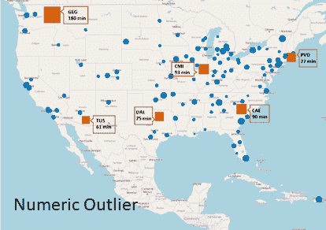
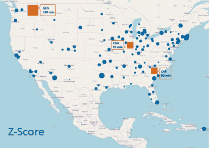
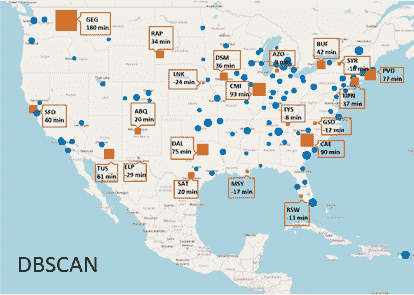

# 四种异常值检测技术

> 原文：[`www.kdnuggets.com/2018/12/four-techniques-outlier-detection.html`](https://www.kdnuggets.com/2018/12/four-techniques-outlier-detection.html)

评论

**作者：Maarit Widmann, Moritz Heine, Rosaria Silipo，[KNIME](http://www.knime.com)的数据科学家**

异常值或离群值在训练机器学习算法或应用统计技术时可能是一个严重的问题。它们通常是测量误差或特殊系统条件的结果，因此不能描述基础系统的常见功能。实际上，最佳实践是在进行进一步分析之前实施异常值去除阶段。

* * *

## 我们的前 3 个课程推荐

 1\. [谷歌网络安全证书](https://www.kdnuggets.com/google-cybersecurity) - 快速进入网络安全职业生涯。

 2\. [谷歌数据分析专业证书](https://www.kdnuggets.com/google-data-analytics) - 提升你的数据分析技能

 3\. [谷歌 IT 支持专业证书](https://www.kdnuggets.com/google-itsupport) - 支持你的组织的 IT 需求

* * *

但等一下！在某些情况下，异常值可以为我们提供关于整个系统的局部异常的信息；因此，异常值检测是一个有价值的过程，因为它们可以提供关于数据集的额外信息。

有许多技术可以检测并选择性地去除数据集中的异常值。在这篇博文中，我们展示了[KNIME Analytics Platform](http://www.knime.com)中四种最常用的 - 传统和新型 - 异常值检测技术的实现。

### 数据集和异常值检测问题

我们用于测试和比较所提议的异常值检测技术的数据集是著名的[航空公司数据集](http://stat-computing.org/dataexpo/2009/the-data.html)。该数据集包括 2007 年至 2012 年间美国国内航班的信息，如起飞时间、到达时间、起始机场、目的地机场、空中时间、起飞延误、到达延误、航班号、船只号、承运人等。这些列中有些可能包含异常值，即离群值。

从原始数据集中，我们提取了 1500 个从芝加哥奥黑尔机场（ORD）出发的航班样本，数据来自 2007 年和 2008 年。

为了展示所选的异常值检测技术的工作原理，我们集中于在机场的平均到达延误时间方面寻找异常值，这些时间是基于所有降落在特定机场的航班计算得出的。我们寻找那些显示出异常平均到达延误时间的机场。

### 四种异常值检测技术

**数值异常值**

这是在一维特征空间中最简单的非参数异常值检测方法。这里，异常值是通过*IQR*（四分位距）来计算的。

计算第一个和第三个[四分位数](https://en.wikipedia.org/wiki/Quartile)（*Q1, Q3*）。然后，异常值是位于四分位距之外的数据点 x[i]。即：


使用四分位数乘数值*k*=1.5，范围限制是箱形图的典型上须和下须。

该技术通过在[KNIME Analytics Platform](http://www.knime.com)中构建的工作流中的 Numeric Outliers 节点实现（图 1）。

**Z-Score**

Z-score 是一种在一维或低维特征空间中的参数化异常值检测方法。

该技术假设数据服从高斯分布。异常值是分布尾部的数据点，因此远离均值。距离的远近取决于为标准化数据点 z[i]设置的阈值 z[thr]，计算公式如下：


其中 x[i]是数据点，μ是所有 x[i]的均值， 是所有 x[i]的标准差。

异常值是一个标准化的数据点，其绝对值大于 z[thr]。即：


常用的 z[thr]值为 2.5、3.0 和 3.5。

该技术通过在 KNIME 工作流中的 Row Filter 节点实现（图 1）。

**DBSCAN**

该技术基于[DBSCAN](https://en.wikipedia.org/wiki/DBSCAN)聚类方法。DBSCAN 是一种在一维或多维特征空间中基于密度的非参数异常值检测方法。

在 DBSCAN 聚类技术中，所有数据点被定义为*核心点*、*边界点*或*噪声点*。

+   ***核心点***是距离ℇ内至少有*MinPts*个邻居的数据点。

+   ***边界点***是*核心点*在距离ℇ内的邻居，但在距离ℇ内的邻居少于*MinPts*。

+   所有其他数据点都是***噪声点****，也被识别为异常值。

异常值检测因此依赖于所需的邻居数*MinPts*、距离ℇ以及选择的距离度量，如欧几里得或曼哈顿距离。

该技术通过图 1 中的 KNIME 工作流中的 DBSCAN 节点实现。

**隔离森林**

这是一种用于大数据集的非参数方法，适用于一维或多维特征空间。

该方法中的一个重要概念是隔离数。

隔离数是隔离一个数据点所需的分裂次数。通过以下步骤确定分裂次数：

+   随机选择一个点“a”进行隔离。

+   随机选择一个数据点“b”，它位于最小值和最大值之间，并且与“a”不同。

+   如果“b”的值低于“a”的值，“b”的值将成为新的下限。

+   如果“b”的值大于“a”的值，“b”的值将成为新的上限。

+   只要在上限和下限之间存在其他数据点，程序就会重复执行。

与隔离非离群点相比，隔离离群点所需的拆分较少，即离群点的隔离数低于非离群点。因此，如果数据点的隔离数低于阈值，则定义为离群点。

阈值是基于数据中估计的离群点百分比定义的，这是该离群点检测算法的起点。

关于隔离森林技术的解释和图片可参考 [`quantdare.com/isolation-forest-algorithm/`](https://quantdare.com/isolation-forest-algorithm/)。

这一技术通过在 Python Script 节点内使用几行 Python 代码在图 1 中的 KNIME 工作流中实现。

```py

from sklearn.ensemble import IsolationForest
import pandas as pd

clf = IsolationForest(max_samples=100, random_state=42)
table = pd.concat([input_table['Mean(ArrDelay)']], axis=1)
clf.fit(table)
output_table = pd.DataFrame(clf.predict(table))

```

Python Script 节点是 [KNIME Python Integration](https://www.knime.com/blog/setting-up-the-knime-python-extension-revisited-for-python-30-and-20) 的一部分，它允许你在 KNIME 工作流中编写/导入 Python 代码。

### 在 KNIME 工作流中的实现

[KNIME Analytics Platform](http://www.knime.org) 是一个开源的数据科学软件，涵盖了从数据摄取和数据混合到数据可视化、从机器学习算法到数据清理、从报告到部署等所有数据需求。它基于图形用户界面进行可视化编程，使其非常直观易用，大大缩短了学习时间。

它设计为支持不同的数据格式、数据类型、数据来源、数据平台，以及外部工具，例如 [R](https://www.r-project.org/) 和 [Python](https://www.python.org/)。它还包括用于分析非结构化数据（如文本、图像或图表）的多个扩展。

KNIME Analytics Platform 中的计算单元是小的彩色块，称为“节点”。将节点一个接一个地组装在管道中，实现了数据处理应用程序。管道称为“工作流”。

考虑到所有这些特性——开源、可视化编程和与其他数据科学工具的集成——我们选择了它来实现本文中描述的四种离群点检测技术。

实现这四种离群点检测技术的最终 KNIME 工作流见图 1。工作流：

1.  在 Read data 元节点内读取数据样本。

1.  在 Preproc 元节点内预处理数据，并计算每个机场的平均到达延误。

1.  在下一个名为“延误密度”的元节点中，它标准化数据，并将标准化的平均到达延误的密度与标准正态分布的密度进行绘制。

1.  使用四种选定的技术检测异常值。

1.  使用 KNIME 与 Open Street Maps 的集成，在 MapViz 元节点中可视化美国的异常机场。


图 1: 实现四种异常检测技术的工作流程：数值异常值、Z-score、DBSCAN、孤立森林。该工作流程可在 KNIME EXAMPLES 服务器上找到，路径为 [02_ETL_Data_Manipulation/01_Filtering/07_Four_Techniques_Outlier_Detection/Four_Techniques_Outlier_Detection](https://www.knime.com/nodeguide/etl-data-manipulation/filtering/four-techniques-outlier-detection/techniques-outlier-detection)。

### 检测到的异常值

在图 2-5 中，您可以看到不同技术检测到的异常机场。

蓝色圆圈代表没有异常行为的机场，而红色方块代表有异常行为的机场。平均到达延迟时间定义了标记的大小。

一些机场被所有技术一致识别为异常值：斯波坎国际机场 (GEG)、伊利诺伊大学威拉德机场 (CMI) 和哥伦比亚大都会机场 (CAE)。斯波坎国际机场 (GEG) 是最大的异常值，其平均到达延迟时间非常长 (180 分钟)。

然而，还有一些其他机场仅被部分技术识别。例如，路易斯·阿姆斯特朗新奥尔良国际机场 (MSY) 仅被孤立森林和 DBSCAN 技术发现。

请注意，对于这个特定的问题，Z-Score 技术识别出最少的异常值，而 DBSCAN 技术识别出最多的异常机场。

只有 DBSCAN 方法 (*MinPts*=3, ℇ=1.5, 距离度量欧氏) 和孤立森林技术 (估计异常值百分比 10%) 能在早到方向上找到异常值。



图 2: 使用数值异常值技术检测的异常机场 

图 3: 使用 z-score 技术检测的异常机场 

图 4: 使用 DBSCAN 技术检测的异常机场 

图 5: 使用孤立森林技术检测的异常机场

### 摘要

在这篇博客文章中，我们描述并实现了四种不同的异常检测技术在一维空间中：2007 年至 2008 年间所有美国机场的平均到达延迟时间，如航空公司数据集中所述。

我们研究的四种技术是数值异常值、Z-Score、DBSCAN 和孤立森林方法。其中一些适用于一维特征空间，有些适用于低维空间，还有一些扩展到高维空间。有些技术需要标准化和检查维度的高斯分布，有些需要距离度量，还有一些需要计算均值和标准差。

有三个机场被所有异常检测技术识别为异常值。然而，只有部分技术（DBSCAN 和 Isolation Forest）能够识别分布左尾中的异常值，即那些平均上航班到达时间早于预定到达时间的机场。

**参考文献**

本博客文章的理论基础来自：

+   Santoyo, Sergio. (2017 年 9 月 12 日). [异常检测技术的简要概述](https://towardsdatascience.com/a--brief-overview-of-outlier-detection-techniques-1e0b2c19e561) [博客文章]。

**相关：**

+   使用标准差在 Python 中去除异常值

+   如何让你的机器学习模型对异常值具有鲁棒性

+   8 个可能毁掉你预测的常见陷阱

### 更多相关内容

+   [功能数据中用于异常检测的密度核深度](https://www.kdnuggets.com/density-kernel-depth-for-outlier-detection-in-functional-data)

+   [数据科学中异常检测技术的初学者指南](https://www.kdnuggets.com/2023/05/beginner-guide-anomaly-detection-techniques-data-science.html)

+   [四周内学习 Python：一条路线图](https://www.kdnuggets.com/2023/02/learning-python-four-weeks-roadmap.html)

+   [掌握数据分析的力量：分析数据的四种方法](https://www.kdnuggets.com/2023/03/master-power-data-analytics-four-approaches-analyzing-data.html)

+   [数据分析：分析数据的四种方法及其有效性…](https://www.kdnuggets.com/2023/04/data-analytics-four-approaches-analyzing-data-effectively.html)

+   [如何使用 Python 进行运动检测](https://www.kdnuggets.com/2022/08/perform-motion-detection-python.html)
