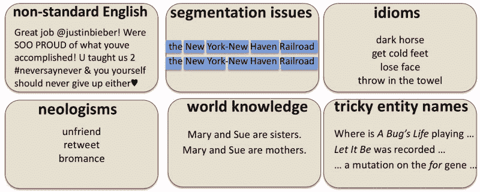
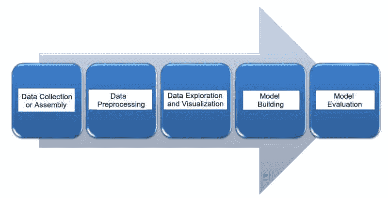

# 接近文本数据科学任务的框架

> 原文：[`www.kdnuggets.com/2017/11/framework-approaching-textual-data-tasks.html`](https://www.kdnuggets.com/2017/11/framework-approaching-textual-data-tasks.html)

今天有大量的文本数据可用，并且每天都会产生大量数据，这些数据从结构化到半结构化再到完全非结构化。我们可以用它做什么？实际上，可以做很多事情；这取决于你的目标，但有两个复杂相关但有所不同的任务类别，可以利用所有这些数据的可用性。

### 文本挖掘还是自然语言处理？

* * *

## 我们的前三个课程推荐

 1\. [谷歌网络安全证书](https://www.kdnuggets.com/google-cybersecurity) - 快速进入网络安全职业生涯。

 2\. [谷歌数据分析专业证书](https://www.kdnuggets.com/google-data-analytics) - 提升你的数据分析技能

 3\. [谷歌 IT 支持专业证书](https://www.kdnuggets.com/google-itsupport) - 支持你的组织进行 IT 管理

* * *

**自然语言处理**（NLP）关注自然人类语言与计算设备之间的互动。NLP 是计算语言学的一个重要方面，也属于计算机科学和人工智能的领域。

**文本挖掘**与自然语言处理（NLP）处于相似的领域，因为它涉及识别文本数据中有趣的、非平凡的模式。

好的，很棒。但真正的*区别是什么*？

首先，这两个概念的确切边界并不明确且未达成一致（见数据挖掘与数据科学），并且在不同程度上相互交织，具体取决于与之讨论这些问题的从业者和研究者。我发现通过*洞察的程度*来区分是最简单的。如果原始文本是*数据*，那么文本挖掘是*信息*，NLP 是*知识*（见下方理解金字塔）。可以说是语法与语义的问题。

理解金字塔：数据、信息、知识。

另一种理解这两个概念之间差异的方法是通过下方的维恩图，它还考虑了其他相关概念，以展示多个密切相关领域和学科之间的关系和重要重叠。

来源：[实践文本挖掘与统计分析：非结构化文本数据应用](https://www.elsevier.com/books/practical-text-mining-and-statistical-analysis-for-non-structured-text-data-applications/miner/978-0-12-386979-1)。

我对这个图表并不*完全*信服——它将*过程*与*工具*混淆了——但它确实有其有限的用途。

关于文本挖掘与自然语言处理之间确切关系的各种解释存在，你可以找到对你更有效的解释。我们并不特别关注**确切**的定义——无论是绝对的还是相对的——而是更注重直观地认识到这些概念之间有某些重叠但仍然各自独立。

我们将继续前进的观点是：尽管自然语言处理和文本挖掘不是同一回事，但它们紧密相关，处理相同的原始数据类型，并且在使用上有一些交集。重要的是，针对这两大领域的任务的数据预处理大致相同。

尽量避免歧义是文本预处理的一个重要部分。我们希望保留预期的含义，同时消除噪音。为此，[需要做以下工作](http://www.stanford.edu/class/cs124/lec/textprocessingboth.pdf)：

+   关于语言的知识

+   关于世界的知识

+   结合知识来源的一种方式

文字还为什么难？

来源：[CS124 斯坦福](https://web.stanford.edu/class/cs124/)。

### 文本数据科学任务框架

我们能否制定一个足够通用的框架来处理文本数据科学任务？事实证明，处理文本与其他非文本处理任务非常相似，因此我们可以借鉴[KDD 流程](https://www.kdnuggets.com/2016/03/data-science-process-rediscovered.html/2)的灵感。

我们可以说这些是通用文本任务的主要步骤，属于文本挖掘或自然语言处理的范畴。

**1 - 数据收集或汇编**

+   获取或构建语料库，这可以是从电子邮件、整个英文维基百科文章集、公司的财务报告、莎士比亚的完整作品，到其他完全不同的内容。

**2 - 数据预处理**

+   在原始文本语料库上执行准备任务，以便进行文本挖掘或自然语言处理任务。

+   数据预处理包含多个步骤，任何步骤可能适用于给定任务，也可能不适用，但通常属于分词、规范化和替代的广泛类别。

**3 - 数据探索与可视化**

+   无论我们的数据是什么——文本还是其他——探索和可视化它是获得洞察的关键步骤。

+   常见任务可能包括可视化词频和分布，生成词云，并执行距离测量。

**4 - 模型构建**

+   这是我们核心的文本挖掘或自然语言处理任务进行的地方（包括训练和测试）。

+   还包括在适用时的特征选择与工程。

+   语言模型：有限状态机，马尔可夫模型，词义的向量空间建模

+   机器学习分类器：朴素贝叶斯，逻辑回归，决策树，支持向量机，神经网络

+   序列模型：隐马尔可夫模型、递归神经网络（RNNs）、长短期记忆神经网络（LSTMs）

**5 - 模型评估**

+   模型的表现是否符合预期？

+   指标会根据文本挖掘或 NLP 任务的类型而有所不同

+   即使在聊天机器人（一个 NLP 任务）或生成模型方面进行创新思考：某种形式的评估也是必要的

一个简单的文本数据任务框架。这些步骤并不完全是线性的，但为了方便起见进行了可视化。

下一次请加入我，我们将定义并进一步探索一个用于文本数据任务的数据预处理框架。

**相关**：

+   自然语言处理关键术语解释

+   5 个免费的资源，帮助你入门自然语言处理的深度学习

+   7 种用于自然语言处理的人工神经网络类型

### 更多相关主题

+   [停止学习数据科学以寻找目的，并寻找目的以……](https://www.kdnuggets.com/2021/12/stop-learning-data-science-find-purpose.html)

+   [数据科学学习统计学的顶级资源](https://www.kdnuggets.com/2021/12/springboard-top-resources-learn-data-science-statistics.html)

+   [成功数据科学家的 5 个特征](https://www.kdnuggets.com/2021/12/5-characteristics-successful-data-scientist.html)

+   [每个数据科学家都应该了解的三种 R 库（即使你使用 Python）](https://www.kdnuggets.com/2021/12/three-r-libraries-every-data-scientist-know-even-python.html)

+   [一个 90 亿美元的人工智能失败，分析](https://www.kdnuggets.com/2021/12/9b-ai-failure-examined.html)

+   [是什么让 Python 成为初创企业的理想编程语言](https://www.kdnuggets.com/2021/12/makes-python-ideal-programming-language-startups.html)
