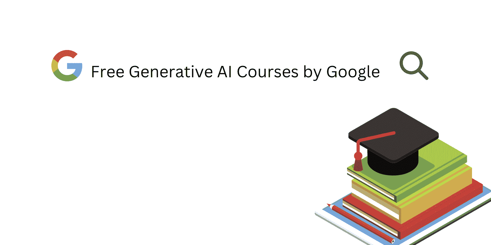

# Google 提供的免费生成式人工智能课程

> 原文：[`www.kdnuggets.com/2023/07/free-generative-ai-courses-google.html`](https://www.kdnuggets.com/2023/07/free-generative-ai-courses-google.html)

作者图片

在我们深入探讨免费课程之前，让我简要介绍一下生成式人工智能的定义。生成式人工智能可以根据用户的提示生成文本、图像或其他形式的媒体。它可以生成新的内容，替代重复的任务，处理定制的数据等。例如，PandasAI 最近发布了——一个将生成式人工智能能力集成到 Pandas 中的生成式人工智能 Python 库，以简化数据分析。

* * *

## 我们的前三大课程推荐

 1\. [Google 网络安全证书](https://www.kdnuggets.com/google-cybersecurity) - 快速进入网络安全职业生涯。

 2\. [Google 数据分析专业证书](https://www.kdnuggets.com/google-data-analytics) - 提升你的数据分析技能

 3\. [Google IT 支持专业证书](https://www.kdnuggets.com/google-itsupport) - 支持你的组织的 IT 需求

* * *

就像 PandasAI 一样，我们预计会看到更多生成式人工智能工具和软件的发布，并将其集成到我们的日常生活中，使过程更加简单和顺畅。

现在我们来谈谈 Google 提供的关于生成式人工智能的免费课程。

# Google 的生成式人工智能学习路径

Google 创建了[生成式人工智能学习路径](https://www.cloudskillsboost.google/paths/118)，其中包括围绕生成式人工智能产品和技术的一系列课程。你将学习大型语言模型（LLMs）的基础知识，并能够在 Google Cloud 上创建和部署生成式人工智能解决方案。

学习路径包括以下 10 门课程：

## 1\. 生成式人工智能简介

链接: [生成式人工智能简介](https://www.cloudskillsboost.google/course_templates/536)

这门课程将为你提供生成式人工智能基础知识的概述。如果你对生成式人工智能完全陌生，这将是最好的起点。你还将学习生成式人工智能如何与其他机器学习方法区分开来。

## 2\. 大型语言模型简介

链接: [大型语言模型简介](https://www.cloudskillsboost.google/course_templates/539)

随着 ChatGPT 和 Bard 等聊天机器人兴起，了解大型语言模型（LLMs）是什么，它们是如何构建的，以及它们的使用和提示调整是至关重要的信息。

## 3\. 负责任人工智能简介

链接：[负责任的 AI 介绍](https://www.cloudskillsboost.google/course_templates/554)

最近对负责任的人工智能（AI）引发了一些愤慨。这个课程将介绍如何将负责任的 AI 实施到 Google 的产品中。你将学习 Google 的 7 个 AI 原则，深入了解社会责任、问责制和隐私设计原则。

## 4\. 生成式 AI 基础

链接：[生成式 AI 基础](https://www.cloudskillsboost.google/course_templates/556)

完成前三门课程后，你将会在第四门课程中接受这三门课程的测验。你们中的一些人可能已有背景知识，能很快完成。然而，这对初学者和希望填补知识空白的人来说是有益的。

## 5\. 图像生成简介

链接：[图像生成简介](https://www.cloudskillsboost.google/course_templates/541)

生成式 AI 的重要部分是能够使用稳定扩散生成图像。在这个课程中，你将进一步了解扩散模型，并深入研究机器学习、深度学习和卷积神经网络。

## 6\. 编码器-解码器架构

链接：[编码器-解码器架构](https://www.cloudskillsboost.google/course_templates/543)

了解更多关于用于序列到序列任务的强大机器学习架构——编码器-解码器架构。有了这些，你将能更好地理解机器翻译、文本摘要和问答系统。

这个课程还包括一个实验室演练，你将在其中编写一个简单的编码器-解码器架构的实现，以完成特定任务。

## 7\. 注意机制

链接：[注意机制](https://www.cloudskillsboost.google/course_templates/537)

我听到很多人谈论想要更多地了解这个主题。注意机制是一种技术，允许神经网络集中注意力于输入序列的特定部分。为了在课程中取得成功，你需要对机器学习、深度学习、自然语言处理和/或 Python 编程有良好的理解。

## 8\. 变换器模型和 BERT 模型

链接：[变换器模型和 BERT 模型](https://www.cloudskillsboost.google/course_templates/538)

随着术语的复杂化，此时你需要有更多经验。在课程中，你将学习变换器模型的主要组件以及双向编码器表示模型（BERT）。

比如，你将能够更深入地了解自注意机制，以及它如何用于构建 BERT 模型，还可以了解其他任务如文本分类。

## 9\. 创建图像字幕模型

链接：[创建图像字幕模型](https://www.cloudskillsboost.google/course_templates/542)

这名字已经说明了一切。通过使用深度学习创建图像标注模型，分解图像标注模型的不同组件，如编码器和解码器。然后你将进行模型训练和评估，并创建你自己的图像标注模型，以生成图像的标题。

## 10\. 生成式 AI 工作室介绍

链接: [生成式 AI 工作室介绍](https://www.cloudskillsboost.google/course_templates/552)

最后但同样重要的是生成式 AI 工作室。在本课程中，你将介绍生成式 AI 工作室的演示，这些工作室用于帮助原型设计和定制生成式 AI 模型，以便你可以在应用程序中使用其功能。课程结束时还有一个动手实验和一个测验来测试你的知识。

# 总结

由 Google 提供的这 10 门课程不仅适合初学者，还适合那些希望在职业生涯中转型或学习新知识的机器学习工程师和数据科学家。与其落后，不如保持更新，而 Google 提供了出色的资源来帮助学生、员工和新手达到目标。

**[Nisha Arya](https://www.linkedin.com/in/nisha-arya-ahmed/)** 是一名数据科学家、自由技术作家及 KDnuggets 的社区经理。她特别关注提供数据科学职业建议或教程以及围绕数据科学的理论知识。她还希望探索人工智能如何/能如何促进人类寿命的延续。作为一名热衷学习者，她寻求拓宽技术知识和写作技能，同时帮助指导他人。

### 更多相关内容

+   [谷歌推出的免费生成式 AI 学习路径](https://www.kdnuggets.com/2023/07/free-google-generative-ai-learning-path.html)

+   [5 门免费课程掌握生成式 AI](https://www.kdnuggets.com/5-free-courses-to-master-generative-ai)

+   [25 门免费课程掌握数据科学、数据工程、机器学习…](https://www.kdnuggets.com/25-free-courses-to-master-data-science-data-engineering-machine-learning-mlops-and-generative-ai)

+   [免费亚马逊课程学习生成式 AI：适合所有级别](https://www.kdnuggets.com/free-amazon-courses-to-learn-generative-ai-for-all-levels)

+   [谷歌通过将生成式 AI 添加到 Docs 和 Gmail 来回应 ChatGPT](https://www.kdnuggets.com/2023/03/google-answer-chatgpt-adding-generative-ai-docs-gmail.html)

+   [8 门免费的 Google 课程助你获得高薪职位](https://www.kdnuggets.com/8-free-google-courses-to-land-top-paying-jobs)
