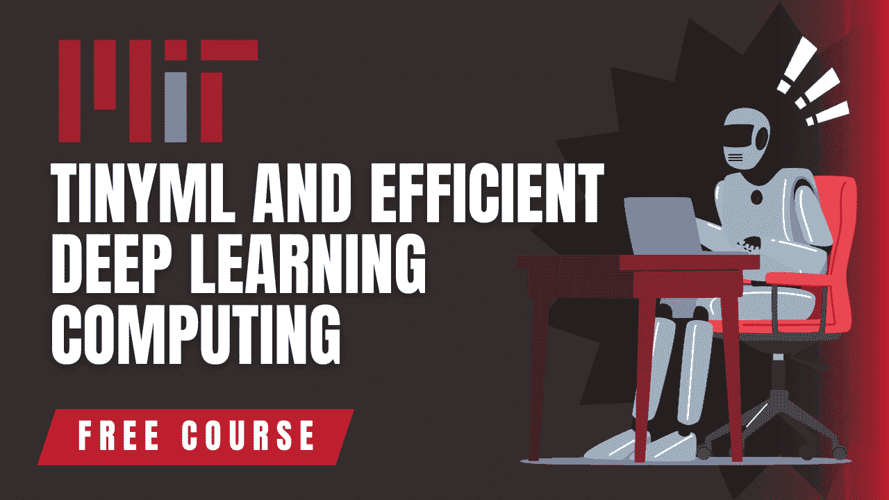

# 免费 MIT 课程：TinyML 和高效深度学习计算

> 原文：[`www.kdnuggets.com/free-mit-course-tinyml-and-efficient-deep-learning-computing`](https://www.kdnuggets.com/free-mit-course-tinyml-and-efficient-deep-learning-computing)

图片由作者提供

# 介绍

* * *

## 我们的三大课程推荐

 1\. [谷歌网络安全证书](https://www.kdnuggets.com/google-cybersecurity) - 快速进入网络安全职业生涯。

 2\. [谷歌数据分析专业证书](https://www.kdnuggets.com/google-data-analytics) - 提升你的数据分析技能

 3\. [谷歌 IT 支持专业证书](https://www.kdnuggets.com/google-itsupport) - 支持你的组织 IT 需求

* * *

在今天的科技时代，我们被令人惊叹的 AI 技术奇迹所包围：语音助手回答我们的疑问，智能摄像头识别面孔，自驾车在道路上行驶。这些就像我们数字时代的超级英雄！然而，使这些技术奇迹在我们日常设备上顺利运行比看起来要困难得多。这些 AI 超级英雄有一个特殊需求：**显著的计算能力** 和 **内存资源**。这就像试图将整个图书馆塞进一个小背包。更糟糕的是，大多数我们的普通设备如手机、智能手表等并没有足够的‘**脑力**’来处理这些 AI 超级英雄。这在 AI 技术的广泛部署中带来了重大问题。

因此，提高这些大型 AI 模型的效率，使其更易获取至关重要。本课程：**"**[**TinyML 和高效深度学习计算**](https://youtube.com/playlist?list=PL80kAHvQbh-pT4lCkDT53zT8DKmhE0idB&si=bM9vsKYkcdATaPuJ)**"** 由 MIT HAN 实验室解决了这一核心障碍。它介绍了优化 AI 模型的方法，确保其在实际场景中的可行性。让我们详细了解一下它提供的内容：

# 课程概览

## 课程结构：

**持续时间：** 2023 年秋季

**时间：** 星期二/星期四 下午 3:35-5:00 东部时间

**讲师：** [宋汉教授](https://hanlab.mit.edu/songhan)

**助教：** [Han Cai](https://hanlab.mit.edu/team/hancai) 和 [Ji Lin](https://hanlab.mit.edu/team/ji-lin)

由于这是一个进行中的课程，你可以通过这个 [链接](https://www.youtube.com/channel/UCcA-9WYwGaUrWiZaEDo84ng/live) 观看直播。

## 课程方法：

**理论基础：** 从深度学习的基础概念开始，逐步深入到高效 AI 计算的复杂方法。

**实践经验：** 通过让学生在其笔记本电脑上部署和使用像 LLaMA 2 这样的语言模型，提供实际经验。

# 课程模块

## 1\. 高效推理

本模块主要集中在提高 AI 推理过程的效率。它深入探讨了如剪枝、稀疏性和量化等技术，旨在加快推理操作并提高资源效率。涵盖的关键主题包括：

+   **剪枝与稀疏性（第一部分和第二部分）：** 探索通过移除不必要的部分来减少模型大小的方法，同时不影响性能。

+   **量化（第一部分和第二部分）：** 使用更少的位数表示数据和模型的技术，节省内存和计算资源。

+   **神经架构搜索（第一部分和第二部分）：** 这些讲座探讨了发现特定任务最佳神经网络架构的自动化技术。它们展示了在 NLP、GAN、点云分析和姿态估计等各个领域的实际应用。

+   **知识蒸馏：** 本次会议专注于知识蒸馏，这是一种训练紧凑模型以模仿较大、更复杂模型行为的过程。旨在将知识从一个模型转移到另一个模型。

+   **MCUNet：微控制器上的 TinyML：** 本讲座介绍了 MCUNet，专注于在微控制器上部署 TinyML 模型，使 AI 能够在低功耗设备上高效运行。讲座内容包括 TinyML 的本质、挑战、创建紧凑的神经网络以及其多种应用。

+   **TinyEngine 和并行处理：** 本部分讨论 TinyEngine，探讨了在受限设备上高效部署和并行处理策略的方法，如循环优化、多线程和内存布局。

## 2\. 领域特定优化

在领域特定优化部分，本课程涵盖了旨在优化特定领域 AI 模型的各种高级主题：

+   **Transformer 和 LLM（第一部分和第二部分）：** 探讨了 Transformer 基础、设计变体，并涉及与 LLM 相关的高效推理算法的高级主题。还探讨了 LLM 的高效推理系统和微调方法。

+   **视觉 Transformer：** 本部分介绍了视觉 Transformer 基础、高效的 ViT 策略和各种加速技术。还探讨了自监督学习方法和多模态大语言模型（LLMs），以增强 AI 在视觉相关任务中的能力。

+   **GAN、视频和点云：** 本讲座专注于通过探讨高效的 GAN 压缩技术（使用 NAS+蒸馏）、动态成本的 AnyCost GAN 和数据高效的 GAN 训练的可微增强来提升生成对抗网络（GAN）。这些方法旨在优化 GAN、视频识别和点云分析模型。

+   **扩散模型：** 本讲座提供了对扩散模型结构、训练、领域特定优化以及快速采样策略的深入见解。

## 3\. 高效训练

高效训练指的是应用方法优化机器学习模型的训练过程。本章节涵盖了以下关键领域：

+   **分布式训练（第一部分和第二部分）：** 探索在多个设备或系统间分布训练的策略。提供了克服带宽和延迟瓶颈、优化内存消耗和实施高效并行化方法的策略，以提高在分布式计算环境中训练大规模机器学习模型的效率。

+   **设备端训练和迁移学习：** 本节主要关注直接在边缘设备上训练模型，处理内存限制，并采用迁移学习方法以高效适应新领域。

+   **高效微调和提示工程：** 本节重点介绍通过高效微调技术（如 BitFit、Adapter 和 Prompt-Tuning）来优化大型语言模型（LLMs）。此外，还强调了提示工程的概念，并说明了如何提升模型的性能和适应性。

## 4. 高级主题

本模块涵盖了量子机器学习这一新兴领域的主题。虽然该部分的详细讲座尚未提供，但计划涉及的主题包括：

+   **量子计算基础**

+   **量子机器学习**

+   **噪声鲁棒量子机器学习**

这些主题将提供对计算中量子原理的基础理解，并探讨这些原理如何应用于增强机器学习方法，同时解决量子系统中噪声带来的挑战。

如果你有兴趣深入了解这门课程，请查看下面的播放列表：

# 总结发言

这门课程收到了极好的反馈，特别是来自 AI 爱好者和专业人士。虽然课程正在进行中，计划于 2023 年 12 月结束，但我强烈推荐加入！如果你正在参加这门课程或有意参加，请分享你的经验。让我们一起聊聊 TinyML，讨论如何在小型设备上让 AI 变得更聪明。你的意见和见解将非常宝贵！

****[Kanwal Mehreen](https://www.linkedin.com/in/kanwal-mehreen1/)**** Kanwal 是一名机器学习工程师和技术作家，对数据科学及 AI 与医学的交汇处充满热情。她共同撰写了电子书《利用 ChatGPT 最大化生产力》。作为 2022 年 APAC 的 Google Generation Scholar，她倡导多样性和学术卓越。她还被认可为 Teradata 技术多样性学者、Mitacs Globalink 研究学者和 Harvard WeCode 学者。Kanwal 是变革的坚定倡导者，她创办了 FEMCodes，以赋能 STEM 领域的女性。

### 更多相关话题

+   [为什么 TinyML 案例越来越受欢迎？](https://www.kdnuggets.com/2022/10/tinyml-cases-becoming-popular.html)

+   [免费 MIT 微积分课程：理解深度学习的关键](https://www.kdnuggets.com/2020/07/free-mit-courses-calculus-key-deep-learning.html)

+   [来自哈佛、斯坦福等大学的免费数据科学课程合集](https://www.kdnuggets.com/a-collection-of-free-data-science-courses-from-harvard-stanford-mit-cornell-and-berkeley)

+   [5 门免费 MIT 课程学习数据科学数学](https://www.kdnuggets.com/5-free-mit-courses-to-learn-math-for-data-science)

+   [8 门免费 MIT 数据科学在线课程](https://www.kdnuggets.com/2022/03/8-free-mit-courses-learn-data-science-online.html)

+   [KDnuggets 新闻，4 月 6 日：8 门免费 MIT 数据科学课程](https://www.kdnuggets.com/2022/n14.html)
