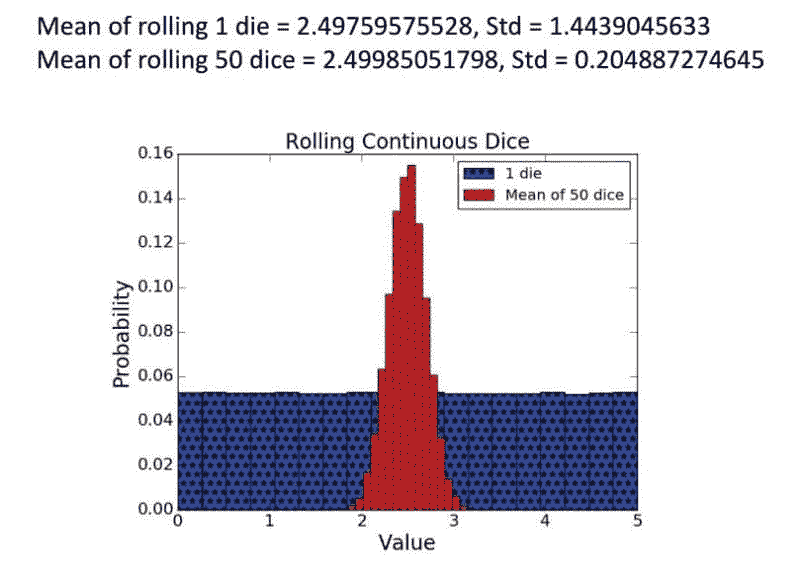

# MIT 免费提供：计算思维与数据科学入门

> 原文：[`www.kdnuggets.com/2020/10/free-mit-intro-computational-thinking-data-science-python.html`](https://www.kdnuggets.com/2020/10/free-mit-intro-computational-thinking-data-science-python.html)

评论

编程是数据科学的重要组成部分，计算机科学的基本概念也是如此。如果我们计划实施计算解决方案来解决数据科学问题，那么编程显然是绝对必要的。为了帮助那些希望建立或巩固这些技能的人，我们最近分享了 MIT 开放课程中的一个很好的免费课程。

在学习了编程基础后，转向计算思维是解决复杂现实世界问题，包括从数据科学角度出发的良好过渡步骤。今天，我们分享**[计算思维与数据科学](https://ocw.mit.edu/courses/electrical-engineering-and-computer-science/6-0002-introduction-to-computational-thinking-and-data-science-fall-2016/index.htm)**，这是 MIT 开放课程提供的另一门顶级课程，任何对学习感兴趣的人都可以免费获得。

* * *

## 我们的前三大课程推荐

 1\. [Google 网络安全证书](https://www.kdnuggets.com/google-cybersecurity) - 快速进入网络安全职业道路。

 2\. [Google 数据分析专业证书](https://www.kdnuggets.com/google-data-analytics) - 提升您的数据分析技能

 3\. [Google IT 支持专业证书](https://www.kdnuggets.com/google-itsupport) - 支持您的组织进行 IT 支持

* * *

课程网站自我描述为：

> [6.0001 计算机科学与 Python 编程入门](https://ocw.mit.edu/courses/electrical-engineering-and-computer-science/6-0001-introduction-to-computer-science-and-programming-in-python-fall-2016)的续集，旨在为几乎没有编程经验的学生提供帮助。课程旨在使学生理解计算在解决问题中的作用，并帮助学生，无论他们的专业是什么，都能对自己编写小程序以实现有用目标的能力充满信心。该课程使用 Python 3.5 编程语言。

2016 年秋季的这门课程由 Eric Grimson、John Guttag 和 Ana Bell 教授。该课程仅使用 Python 作为实现编程语言。

讲座主题如下，取自[教学大纲](https://ocw.mit.edu/courses/electrical-engineering-and-computer-science/6-0002-introduction-to-computational-thinking-and-data-science-fall-2016/lecture-slides-and-files/)：

1.  介绍和优化问题

1.  优化问题

1.  图论模型

1.  随机思维

1.  随机游走

1.  蒙特卡洛模拟

1.  置信区间

1.  抽样与标准误差

1.  理解实验数据

1.  理解实验数据（续）

1.  机器学习介绍

1.  聚类

1.  分类

1.  分类与统计学的罪与罚

1.  统计学的罪与罚及总结

我特别喜欢这门课程似乎分成了几个不同的部分。第一部分（直到第六讲）集中在计算概念上；下一部分（第七到第十讲）则具有统计性质；其余讲座组成了最后一部分关于机器学习的内容，尽管它从未远离统计学，并在最后适当地回到统计学上。

这种结构使学生能够在不混淆的情况下学习这些不同的概念。计算思维与机器学习无关；它有助于将问题分解成更小的问题，并思考解决这些更小问题的最有效方法。这是一项在生活或工作中的任何方面都值得培养的技能。然而——尽管它与机器学习没有内在联系——它确实为从业者提供了必要的洞察，以理解机器学习算法的内部工作原理、使用这些算法解决问题的方案，以及如何迭代和改进这些解决方案，使其更高效、准确和有用。

统计学总是与数据科学问题或其解决方案密切相关。对抽样误差、置信区间的讨论，以及对理解实验数据和统计学习结果潜在误用的关注，在入门数据科学课程中通常得不到应有的重视，这使得《计算思维与数据科学导论》与许多其他课程有所区别。

该课程的开放课程版本包括 [讲义和所需文件](https://ocw.mit.edu/courses/electrical-engineering-and-computer-science/6-0002-introduction-to-computational-thinking-and-data-science-fall-2016/lecture-slides-and-files/)、[问题集](https://ocw.mit.edu/courses/electrical-engineering-and-computer-science/6-0002-introduction-to-computational-thinking-and-data-science-fall-2016/assignments/)、阅读材料（不幸的是，[课程教材](https://www.amazon.ca/dp/0262529629/ref=nosim?linkCode=gs2&tag=miop-20) 并不免费），以及——特别值得注意的—— [讲座视频](https://ocw.mit.edu/courses/electrical-engineering-and-computer-science/6-0002-introduction-to-computational-thinking-and-data-science-fall-2016/lecture-videos/)。从这个意义上说，免费提供的课程可以真正被视为完整的。

这些材料还构成了 [同名 edX 课程](https://www.edx.org/course/introduction-to-computational-thinking-and-data-4) 的基础。如果你对更有结构的学习环境或在课程完成时获得认证证书感兴趣，你可以在那里注册并选择此选项。

与麻省理工学院的 计算机科学与 Python 编程入门课程 配对，这些免费课程为学习编程、计算机科学、Python、计算、统计学和机器学习的基础提供了强有力的开端——这些都是成功的数据科学职业的关键要素。

**相关内容**：

+   麻省理工学院提供的免费计算机科学与 Python 编程入门课程

+   超越肤浅：具有实质性的 数据科学 MOOC 课程

+   亚马逊提供的免费机器学习入门课程

### 更多相关话题

+   [成为伟大数据科学家所需的 5 项关键技能](https://www.kdnuggets.com/2021/12/5-key-skills-needed-become-great-data-scientist.html)

+   [每个初学者数据科学家应掌握的 6 种预测模型](https://www.kdnuggets.com/2021/12/6-predictive-models-every-beginner-data-scientist-master.html)

+   [2021 年最佳 ETL 工具](https://www.kdnuggets.com/2021/12/mozart-best-etl-tools-2021.html)

+   [停止学习数据科学以寻找目的，并找到目的来……](https://www.kdnuggets.com/2021/12/stop-learning-data-science-find-purpose.html)

+   [学习数据科学的统计学顶级资源](https://www.kdnuggets.com/2021/12/springboard-top-resources-learn-data-science-statistics.html)

+   [建立一个稳固的数据团队](https://www.kdnuggets.com/2021/12/build-solid-data-team.html)
