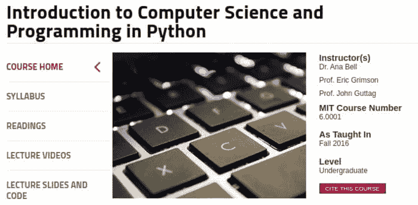

# 免费来自 MIT：Python 计算机科学与编程导论

> 原文：[`www.kdnuggets.com/2020/09/free-mit-intro-computer-science-programming-python.html`](https://www.kdnuggets.com/2020/09/free-mit-intro-computer-science-programming-python.html)

评论

我不必告诉你编程是数据科学的重要方面。

为了解决数据科学问题的计算解决方案，编程显然是绝对必要的。无论你是在可视化数据、进行探索性数据分析、还是实现机器学习模型，无论你是使用现有的代码库和库，还是从头开始编写代码，作为数据科学家编写代码都是必需的。

* * *

## 我们的前三个课程推荐

 1\. [谷歌网络安全证书](https://www.kdnuggets.com/google-cybersecurity) - 快速进入网络安全职业生涯

 2\. [谷歌数据分析专业证书](https://www.kdnuggets.com/google-data-analytics) - 提升你的数据分析技能

 3\. [谷歌 IT 支持专业证书](https://www.kdnuggets.com/google-itsupport) - 支持你的组织的 IT 需求

* * *

但将通过谷歌搜索找到的不同代码片段拼凑在一起不应该是一个有志于数据科学家（或其他任何学习编程的人）的目标。理解计算机科学原理、计算问题解决方法和编程基础，所有这些与具体实现的编程语言无关，应该是任何真正希望*真正*学习如何编程的人的目标。

学习编程和掌握计算机科学概念有很多方法。显然，有些人会比其他方法更适合某些方法。彻底的大学课程，包括讲座、阅读材料、幻灯片和作业，就是一种这样的方式。

通过其[开放课程](https://ocw.mit.edu/index.htm)计划，MIT 提供了[**计算机科学与 Python 编程导论**](https://ocw.mit.edu/courses/electrical-engineering-and-computer-science/6-0001-introduction-to-computer-science-and-programming-in-python-fall-2016/)，这是一种结构化学习计算机科学和编程概念的方法。由 Dr. Ana Bell、Prof. Eric Grimson 和 Prof. John Guttag 授课，这门课程旨在向编程新手传授全面的计算机科学基础。

OCW 网站对课程的描述如下：

> 6.0001《计算机科学与 Python 编程导论》旨在帮助没有或几乎没有编程经验的学生。这门课程旨在让学生理解计算在解决问题中的作用，并帮助学生，不论他们的专业如何，都能够对自己编写小程序以实现有用目标的能力充满信心。该课程使用 Python 3.5 编程语言。

课程主题如下：

1.  什么是计算？

1.  分支和迭代

1.  字符串操作、猜测与检查、近似、二分法

1.  分解、抽象、函数

1.  元组、列表、别名、可变性、克隆

1.  递归、字典

1.  测试、调试、异常、断言

1.  面向对象编程

1.  Python 类和继承

1.  理解程序效率，第一部分

1.  理解程序效率，第二部分

1.  搜索和排序

想直接跳到讲座视频播放列表？你可以 [在 YouTube 上找到它](https://www.youtube.com/playlist?list=PLUl4u3cNGP63WbdFxL8giv4yhgdMGaZNA)。

再次注意，这些概念都是通过 Python 教授的，Python 是数据科学中主导的编程语言之一，也是 [今天广泛使用的最流行的通用编程语言之一](http://pypl.github.io/PYPL.html)。

技术发展迅速。然而，尽管这门课程的版本是在 2016 年 9 月教授的，并使用 Python 3.5，但计算机科学和编程的基础知识要比外界普遍认为的更为稳定，因此不要被这门课程版本已有四年的事实所困扰。它确实仍然非常相关。

课程的配套教材，[《使用 Python 进行计算与编程导论》](https://mitpress.mit.edu/books/introduction-computation-and-programming-using-python-second-edition)，遗憾的是，并非免费。然而，如果你有兴趣跟读，可以在像 Amazon 这样的卖家处以合理价格购买。如果没有，讲座视频、笔记和其他资源仍然提供了丰富的学习体验。

如果你完成了这门课程并寻找下一步，MIT 的 [**计算思维与数据科学导论**](https://ocw.mit.edu/courses/electrical-engineering-and-computer-science/6-0002-introduction-to-computational-thinking-and-data-science-fall-2016/) 是直接的后续课程，也可以在他们的 OCW 平台上免费获取。

学习编程不会出错，而如今学习 Python 也不会出错。如果你对掌握计算机科学和编程的基础感兴趣，这门 MIT 课程可能适合你。

**相关**：

+   免费 MIT 微积分课程：理解深度学习的关键

+   加速计算机视觉：来自亚马逊的免费课程

+   最佳深度学习自然语言处理课程是免费的

### 更多相关话题

+   [是什么让 Python 成为初创公司的理想编程语言](https://www.kdnuggets.com/2021/12/makes-python-ideal-programming-language-startups.html)

+   [成为优秀数据科学家所需的 5 项关键技能](https://www.kdnuggets.com/2021/12/5-key-skills-needed-become-great-data-scientist.html)

+   [每个初学者数据科学家都应该掌握的 6 种预测模型](https://www.kdnuggets.com/2021/12/6-predictive-models-every-beginner-data-scientist-master.html)

+   [2021 年最佳 ETL 工具](https://www.kdnuggets.com/2021/12/mozart-best-etl-tools-2021.html)

+   [停止学习数据科学以寻找目标，并以找到目标来…](https://www.kdnuggets.com/2021/12/stop-learning-data-science-find-purpose.html)

+   [使用管道编写干净的 Python 代码](https://www.kdnuggets.com/2021/12/write-clean-python-code-pipes.html)
