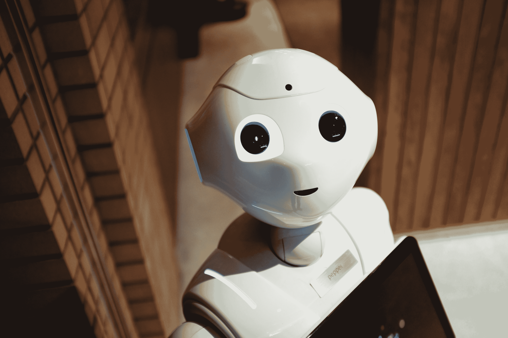
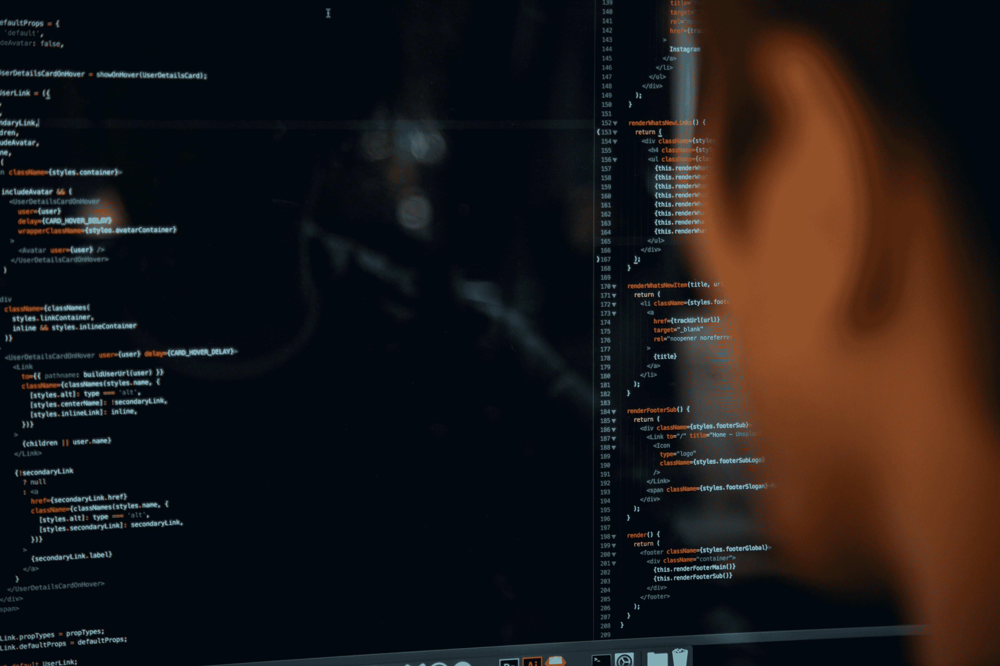

# 机器学习的未来

> 原文：[`www.kdnuggets.com/2020/01/future-machine-learning.html`](https://www.kdnuggets.com/2020/01/future-machine-learning.html)

评论

**由 [Benedict Neo](https://www.linkedin.com/in/benthecoder/)，数据科学爱好者和博主**。

* * *

## 我们的三大课程推荐

 1\. [Google Cybersecurity Certificate](https://www.kdnuggets.com/google-cybersecurity) - 快速进入网络安全职业轨道。

 2\. [Google Data Analytics Professional Certificate](https://www.kdnuggets.com/google-data-analytics) - 提升你的数据分析技能

 3\. [Google IT Support Professional Certificate](https://www.kdnuggets.com/google-itsupport) - 支持你所在组织的 IT 需求

* * *

*照片由 [Arseny Togulev](https://unsplash.com/@tetrakiss?utm_source=medium&utm_medium=referral) 提供，来自 [Unsplash](https://unsplash.com/?utm_source=medium&utm_medium=referral)。*

机器学习是人工智能时代的一个热门话题。计算机视觉和 [自然语言处理](https://en.wikipedia.org/wiki/Natural_language_processing) （NLP）领域正取得无法预料的突破。我们在生活中越来越多地看到它们，如智能手机中的面部识别、语言翻译软件、自驾车等。看似科幻的技术正变为现实，我们距离获得 [通用人工智能](https://en.wikipedia.org/wiki/Artificial_general_intelligence) 只有时间的问题。

在这篇文章中，我将深入探讨 Jeff Dean 的 [主题演讲](https://www.youtube.com/watch?v=ZHoNF28Nj98)，内容涉及计算机视觉和语言模型的进展，以及机器学习如何从模型构建的角度走向未来。

### 计算机视觉

*照片由 [Alex Knight](https://unsplash.com/@agkdesign?utm_source=medium&utm_medium=referral) 提供，来自 [Unsplash](https://unsplash.com/?utm_source=medium&utm_medium=referral)。*

今天，机器学习领域，特别是计算机视觉领域，正经历指数级增长。目前，人类在计算机视觉中的错误率仅为 3%。这意味着计算机在识别和分析图像方面已经比人类更优秀。这真是一个了不起的成就！几十年前，计算机还只是一个房间大小的庞然大物；今天，它们能够以我们从未想过的方式感知周围的世界。

> 从 2011 年的 26%误差到 2016 年的 3%误差，我们取得了巨大的进展。我喜欢这样想，计算机现在拥有了能够工作的“眼睛”。 — Jeff Dean

现在，这项成就——得益于机器学习的进步——不仅仅是计算机迷和 AI 专家的庆祝，它还有实际应用，能挽救生命，让世界变得更美好。在我详细讲解计算机视觉的一个救生应用之前，让我先展示一下计算机视觉的力量。

假设我给你 1 万张狗的照片，并要求你将它们分类到相应的物种中，你能做到吗？你可以做到，但你必须是狗的专家，而且需要几天时间才能完成。但对于一台电脑（配有 GPU）来说，这只需几分钟。这种计算机视觉的惊人能力开启了大量的应用。

**计算机视觉的应用**

Jeff Dean 提供的一个计算机视觉的典型应用是糖尿病视网膜病——这是一种影响眼睛的糖尿病并发症。现在要诊断它，需要进行广泛的眼科检查。在医生稀缺的第三世界国家和农村地区，使用计算机视觉进行诊断的机器学习模型将极具帮助。与所有医学影像领域一样，这种计算机视觉也可以作为领域专家的第二意见，确保他们诊断的可信度。一般来说，计算机视觉在医学领域的目的是复制专家的专业知识，并在最需要的地方部署。

### NLP 和 Transformers

*照片由 [VanveenJF](https://unsplash.com/@vanveenjf?utm_source=medium&utm_medium=referral) 提供，来自[Unsplash](https://unsplash.com/?utm_source=medium&utm_medium=referral)。*

[语言模型](https://en.wikipedia.org/wiki/Language_model) 是帮助机器理解文本并执行各种操作的算法，例如翻译文本。根据 Jeff Dean 的说法，语言模型已经取得了很大进展。

今天，计算机能够以比以前更深层次的方式理解一段文字。尽管它们还达不到像我们人类那样阅读整本书并理解的水平，但理解几段文字的能力对于改进 Google 搜索系统等事物是至关重要的。

[BERT](https://www.google.com/url?sa=t&rct=j&q=&esrc=s&source=web&cd=1&cad=rja&uact=8&ved=2ahUKEwiNtP_sycvmAhUJXSsKHYaKCMMQFjAAegQIBRAB&url=https%3A%2F%2Fwww.blog.google%2Fproducts%2Fsearch%2Fsearch-language-understanding-bert%2F&usg=AOvVaw1wEO5Ovpgy12aTTsalKJd8) 模型是 Google 发布的最新自然语言处理（NLP）模型，已被应用于他们的搜索排名算法中。这有助于提升对以前非常困难的各种查询的搜索结果。换句话说，搜索系统现在可以更好地理解用户的不同搜索，并提供更好、更准确的答案。

> “深度学习和机器学习架构在接下来的几年里将发生很大变化。你已经可以看到这一点，现在在自然语言处理领域，基本上只有 Transformer 网络是主流。” — Yann LeCun

这些[基于 Transformer 的模型](https://towardsdatascience.com/transformers-141e32e69591)在[BLEU 分数](https://en.wikipedia.org/wiki/BLEU)上表现出色，BLEU 分数是衡量翻译质量的指标。因此，利用 Transformer 的机器学习架构，如 BERT，正在变得越来越流行和强大。

### 目前机器学习面临的问题

*照片由 [Charles](https://unsplash.com/@charlesdeluvio?utm_source=medium&utm_medium=referral) 提供，来源于 [Unsplash](https://unsplash.com/?utm_source=medium&utm_medium=referral)。*

在主旨演讲中，Google 高级研究员提到了机器学习开发者今天用来执行各种单元任务的原子模型。他认为这些模型效率低下，计算开销大，而且需要更多的努力才能在这些任务中取得良好的结果。

具体来说，在当前的机器学习领域，专家们发现他们想解决的问题后，会专注于寻找合适的数据集来训练模型并执行特定任务。Dean 认为，这种做法基本上是从零开始——他们用随机浮点数初始化模型的参数，然后尝试从数据集中学习关于任务的所有内容。

为了详细说明这一点，他给出了一个很好的比较：

> *“这就像是当你想学习新东西时，你会忘记所有的教育背景，回到婴儿状态，现在你试图学习有关这个任务的一切。”*

他将这种方法与人们每次想学习新东西时，变成婴儿并更换大脑的过程进行了比较。这种方法不仅计算开销大，而且需要更多的努力才能在这些任务中取得良好的结果。Jeff Dean 提出了一个解决方案。

### 机器学习的圣杯

*照片由 [Marius Masalar](https://unsplash.com/@marius?utm_source=medium&utm_medium=referral) 提供，来源于 [Unsplash](https://unsplash.com/?utm_source=medium&utm_medium=referral)。*

Jeff 认为，机器学习的未来在于一个庞大的模型，一个能够做许多事情的多功能模型。这个超级模型将消除创建特定任务模型的需要，代之以用不同领域的专长训练一个大型模型。想象一下，一个计算机视觉模型不仅能诊断糖尿病视网膜病变，还能分类不同品种的狗，识别你的面孔，并同时用于自动驾驶汽车和无人机。

他还宣称，该模型通过稀疏激活所需的不同部分来操作。大部分时间模型将保持 99%的闲置状态，只在需要时调用相关的专业片段。

**挑战**

Dean 认为这个终极模型是机器学习的一个有前途的方向，工程挑战非常有趣。构建这样的模型将引发许多有趣的计算机系统和机器学习问题，例如可扩展性和模型结构。

提出的问题是：

> *模型将如何学习如何路由最合适的模型各部分？*

要实现这样的突破，需要在机器学习研究和数学领域取得更多进展。

### 精华

计算机视觉和自然语言处理将继续在我们的生活中扮演重要角色。但这种进步也带来了负面影响，例如中国利用面部识别来实施对人民的评级系统（就像《黑镜》中的情节一样）以及虚假新闻的泛滥。我们必须在机器学习中取得进展，同时考虑算法偏见和伦理问题，提醒我们自己是上帝的创造物，而非创造者。

关于终极模型，有很多证据表明我们正一步步接近。例如，迁移学习——一种将模型重用于不同目的的方法，能够以更少的数据获得良好结果，多任务学习——一种在五个或六个相关事物的小规模操作的模型，通常能使事情运作良好。

因此，可以合理地说，通过扩展这些想法——迁移学习和多任务学习——并在其基础上进行开发，实现一个终极模型是切实可行的，这只是时间问题，而非如何实现。

感谢阅读我关于机器学习未来的摘录和对 Jeff Dean 主题演讲的概述。我希望你能一窥机器学习和人工智能的未来。

完整视频请观看 [这里](https://www.youtube.com/watch?v=Kxpdlr6WJSY&feature=youtu.be)。

[原始](https://towardsdatascience.com/the-future-of-machine-learning-ce0a9dc18cb8)。已获许可重新发布。

**相关：**

+   [2020 年十大技术趋势](https://www.kdnuggets.com/2020/01/top-10-technology-trends-2020.html)

+   [2020 年必备的数据科学技能前五名](https://www.kdnuggets.com/2020/01/top-5-data-science-skills-2020.html)

+   [2020 年行业人工智能、分析、机器学习和数据科学预测](https://www.kdnuggets.com/2019/12/predictions-ai-machine-learning-data-science-industry.html)

### 更多相关内容

+   [边界框深度学习：视频注释的未来](https://www.kdnuggets.com/2022/07/bounding-box-deep-learning-future-video-annotation.html)

+   [聊天机器人转型：从失败到未来](https://www.kdnuggets.com/2021/12/chatbot-transformation-failure-future.html)

+   [利用智能分析未来成功的概率…](https://www.kdnuggets.com/2022/02/analyzing-probability-future-success-intelligence-node-attributes-evolution-model.html)

+   [学习现代预测技术以帮助预测未来业务…](https://www.kdnuggets.com/2022/12/sphere-learn-modern-forecasting-techniques-help-predict-future-business-outcomes.html)

+   [2023 AI 指数报告：我们可以期待的 AI 趋势](https://www.kdnuggets.com/2023/06/2023-ai-index-report-ai-trends-expect-future.html)

+   [预测未来事件：AI 和 ML 的能力与局限](https://www.kdnuggets.com/2023/06/forecasting-future-events-capabilities-limitations-ai-ml.html)
