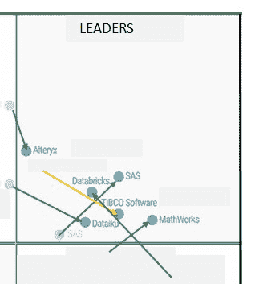
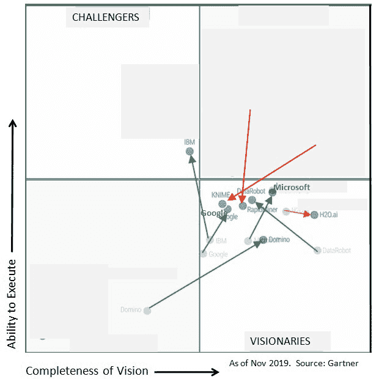

# 2020 年 Gartner 数据科学和机器学习平台魔力象限中的领导者、变化和趋势

> 原文：[`www.kdnuggets.com/2020/02/gartner-mq-2020-data-science-machine-learning.html`](https://www.kdnuggets.com/2020/02/gartner-mq-2020-data-science-machine-learning.html)

评论 Gartner 上周发布了备受期待的[数据科学和机器学习平台（DSML）魔力象限报告](https://www.gartner.com/en/documents/3899464/magic-quadrant-for-data-science-and-machine-learning-pla)，如果你是客户，可以从 Gartner 处获取，或从文中提到的几家公司中获取 - 详见本博客底部的列表。

近年来，MQ 的名称不断变化，但 4 家领导者保持不变。现在名称与 2019 年 MQ 和 2018 年 MQ 报告中的名称保持一致，反映了对 DSML 领域更成熟的理解，但内容，特别是领导者象限，发生了剧烈变化，反映了该领域进展和竞争的加速。

2020 年 MQ 报告重新评估了 16 个供应商（比去年减少了 1 个），像往常一样，基于**愿景**（简写为“vision”）和**执行能力**（简写为“ability”）放置在 4 个象限中。

我们注意到报告仅包含具有商业产品的供应商，没有考虑像 Python 和 R 这样的开源平台，即使这些在数据科学家和机器学习专业人士中非常流行。

**图 1: 截至 2019 年 11 月的数据科学和机器学习平台的 Gartner 魔力象限**。

涵盖的供应商（每个象限中的字母顺序）：

+   领导者（6 家）：Alteryx, Dataiku, Databricks, MathWorks, SAS, TIBCO

+   挑战者（1 家）：IBM

+   远见者（7 家）：DataRobot, Domino, Google, H2O.ai, KNIME, Microsoft, RapidMiner

+   小众玩家（2 家）：Anaconda, Altair（前 DataWatch/Angoss）

与去年相比，2020 年报告中没有新增条目，一家公司被删除：SAP。

我们像以前一样，将最新的魔力象限与其前一年版本进行比较 - 见图 2。

**图 2: 2020 年与 2019 年数据科学和机器学习平台的 Gartner MQ 变化**

绿色箭头表示供应商改善了他们的位置或进入了领导者象限，红色箭头 - 失去位置，黄色箭头 - 侧移。

今年 MQ 中有如此多的变化，以至于很难看到所有箭头，因此我们将上述图表分为两部分：1：领导者，2：挑战者和远见者。

以下是领导者象限中的 6 家供应商，其中两家是去年已在领导者象限中的（SAS 和 TIBCO），还有 4 家新进入的（Alteryx、Dataiku、Databricks 和 MathWorks）- 见图 3。

**图 3：Gartner 数据科学和机器学习平台的领导者**

### 领导者

六个领导者是：（按字母顺序排列）

+   **Alteryx** 基于其强大的公司和产品愿景，特别是在流程自动化以及 Gartner 称之为“增强型 DSML”方面，重新回到了 2018 年的领导者象限（从 2019 年的挑战者回归）。Alteryx 的收入增长继续高于几乎所有其他供应商，并且在国际上也取得了显著扩展。2019 年，Alteryx 完成了两项收购：ClearStory Data 和 Feature Labs。

+   **Databricks** 基于 Apache Spark，提供跨数据科学、机器学习和数据工程的统一数据分析平台。基于其强大的执行力、增长和超过 500 家公司的合作伙伴生态系统，Databricks 移动到领导者象限。Databricks 在实现机器学习的可扩展性方面也是一个领先者。

+   **Dataiku** 的核心产品是 Data Science Studio。基于易用性、愿景、数据治理以及支持多种用户类型（从数据工程师和数据科学家到业务用户及所谓的“公民数据科学家”）的协作能力，它今年从挑战者跃升为领导者。

+   **MathWorks** 的 MATLAB 被考虑用于此 MQ。MathWorks 今年进入了领导者象限，基于其适应性、使用最新技术（如深度学习和强化学习）以及强大的执行能力。MATLAB 是一个全面集成的平台，支持数据准备、模型构建、仿真和部署。

+   **SAS** 拥有许多产品，但此 MQ 评估了 SAS Visual Data Mining 和 Machine Learning。SAS 保持在领导者象限中，自该领域的首个 MQ 以来一直如此。根据 Gartner，SAS 的产品具有高度的企业准备度，并为客户提供了高商业价值。虽然开源替代方案是一个竞争威胁，但 SAS 仍然是一个强有力的竞争者。

+   **TIBCO** 在过去几年通过收购（包括 BI 公司（Jaspersoft 和 Spotfire）和分析/数据科学供应商（Insightful、Statistica 和 Alpine Data））建立了一个强大的平台（TIBCO Data Science）。TIBCO 在领导者象限中保持不变，因为它继续整合其广泛的产品组合。

接下来我们来看挑战者和愿景者中那些没有进入领导者象限但已改善其位置的公司。

**图 4：Gartner 数据科学和机器学习平台的挑战者与愿景者**

### 愿景者

愿景者象限中有 7 家公司：

+   **DataRobot** 数据科学和机器学习平台提供了整个分析过程的自动化，使业务用户和“公民”数据科学家能够完成所需的数据分析。DataRobot 还提供售前和售后支持。该公司最近收购了数据协作平台 Cursor、MLOps 平台 ParallelM 和数据准备平台 Paxata。DataRobot 在收入、用户数量和品牌知名度方面显示出显著增长。

+   **Domino** 提供工业级的强大平台，用于云端或本地的端到端数据科学和机器学习。Domino 可以作为大型独立数据科学团队的企业级数据科学和机器学习平台。Gartner 写道：“Domino 之所以被定位为愿景者，主要是因为其产品进展和路线图，这些都体现了供应商对数据科学和机器学习市场的深刻理解。”

+   **谷歌**一直在积极扩展其 AI/ML 产品，目前以 Google Cloud AI 作为其主要数据科学和机器学习平台。它包括 Cloud AutoML、BigQuery ML 和 TensorFlow。谷歌还拥有自己的 TPU 硬件和庞大的云基础设施。谷歌未被列入领导者，因为其 Cloud AI 平台并非独立产品。

+   **H2O.ai** 提供商业化的 AutoML 产品 H2O Driverless AI，并支持其开源产品 H2O-3（又名“Sparkling Water”）。H2O.ai 提供全球客户支持和一个社区 Slack 频道。H2O 保持了其愿景者的位置。

+   **KNIME** 提供开源的 KNIME Analytics Platform 和商业扩展 KNIME Server，具备包括协作、自动化和部署在内的高级功能。KNIME 由于相对于 Gartner 评估的其他供应商的低可见度和较慢的收入增长，从领导者象限降级为愿景者。

+   **微软**在本次 MQ 中核心产品是 Azure Machine Learning（Azure ML），以及支持产品 Azure ML Studio、Azure Data Factory、Azure HDInsight、Azure Databricks、Power BI 和其他相关组件。微软在愿景者象限中，在愿景和能力方面均有所进步。然而，它的执行能力受到以云优先的策略和一致性问题的限制。

+   **RapidMiner** 提供 RapidMiner Studio 的免费版和商业版，还有 RapidMiner Server，这是一个用于部署和维护模型及协作的企业扩展。RapidMiner 的支持产品包括 RapidMiner 实时评分、RapidMiner Radoop、RapidMiner Auto Model 等。RapidMiner 拥有庞大而活跃的用户社区。今年，RapidMiner 从领导者象限降级为愿景者，主要是由于其相对于本次 MQ 中的其他供应商增长较慢。

### 挑战者

只有一家企业在挑战者象限中：

+   **IBM**在本次 MQ 中主要产品为 Watson Studio，以及包括 Watson Machine Learning、SPSS（Modeler 和 Statistics）、IBM Decision Optimization for Watson Studio 和 IBM Streams 在内的众多支持产品。Gartner 写道

    > “改善其产品捆绑和相应的市场进入策略将进一步巩固 IBM 在改进其产品和跟上来自大型和小型供应商的日益激烈竞争方面的值得称赞的努力。”

### 小众玩家

最后，小众象限中有两家公司：

+   **Anaconda** 在此次 MQ 中评估的产品是 Anaconda Enterprise，这是一个基于交互式笔记本概念的数据科学开发环境。Anaconda 支持一个非常庞大且活跃的开源及企业用户社区。Anaconda 在此 MQ 中仍然是一个小众玩家。它非常适合使用 Python 或 R 的专家数据科学家，并能够利用不断更新的开源功能。然而，Anaconda 平台缺乏自动化，并且在应对不断变化的开源功能时面临复杂性。

+   **Altair**（DataWatch/Angoss）。2018 年 12 月，Altair 完成了对 Datawatch 的收购，而 Datawatch 于 2018 年 1 月收购了 Angoss。该公司主要的数据科学和机器学习产品叫做 Altair Knowledge Works，本次 MQ 中考虑的主要产品是 Knowledge Studio。由于在 2 年内经历了第二次收购，Altair 被视为一个小众玩家，因为这带来了风险和不确定性。

我们还注意到 SAP 在 2020 年 MQ 中被剔除。

你可以从报告中提到的几个供应商处获取 2020 年 Gartner MQ 报告，包括[Alteryx](https://www.alteryx.com/third-party-content/gartner-2020-mq-data-science-machine-learning)，[Dataiku](https://pages.dataiku.com/gartner-2020)，[Databricks](https://databricks.com/p/whitepaper/gartner-magic-quadrant-2020-data-science-machine-learning?utm_source=kdn)，[Domino](https://www.dominodatalab.com/resources/gartner-magic-quadrant-data-science-platforms/)，[RapidMiner](https://rapidminer.com/resource/gartner-magic-quadrant-data-science-platforms/)，和[TIBCO](https://www.tibco.com/resources/analyst-report/gartner-magic-quadrant-data-science-and-machine-learning-platforms)。

另见我们对往年分析的总结

+   [Gartner 2019 数据科学和机器学习平台魔力象限中的赢家、输家和趋势](https://www.kdnuggets.com/2019/02/gartner-2019-mq-data-science-machine-learning-changes.html)

+   Gartner 2018 数据科学和机器学习平台魔力象限中的赢家和输家

+   Gartner 2017 数据科学平台魔力象限：赢家和输家

+   Gartner 2016 高级分析平台魔力象限：赢家和输家

+   Gartner 2015 高级分析平台魔力象限：谁获胜，谁失利。

+   Gartner 2014 年高级分析平台魔力象限

### 更多相关话题

+   [成为一名优秀数据科学家所需的 5 项关键技能](https://www.kdnuggets.com/2021/12/5-key-skills-needed-become-great-data-scientist.html)

+   [每个初学者数据科学家应掌握的 6 种预测模型](https://www.kdnuggets.com/2021/12/6-predictive-models-every-beginner-data-scientist-master.html)

+   [2021 年最佳 ETL 工具](https://www.kdnuggets.com/2021/12/mozart-best-etl-tools-2021.html)

+   [停止学习数据科学以寻找目标，并以目标去…](https://www.kdnuggets.com/2021/12/stop-learning-data-science-find-purpose.html)

+   [学习数据科学统计学的最佳资源](https://www.kdnuggets.com/2021/12/springboard-top-resources-learn-data-science-statistics.html)

+   [建立一个稳固的数据团队](https://www.kdnuggets.com/2021/12/build-solid-data-team.html)
