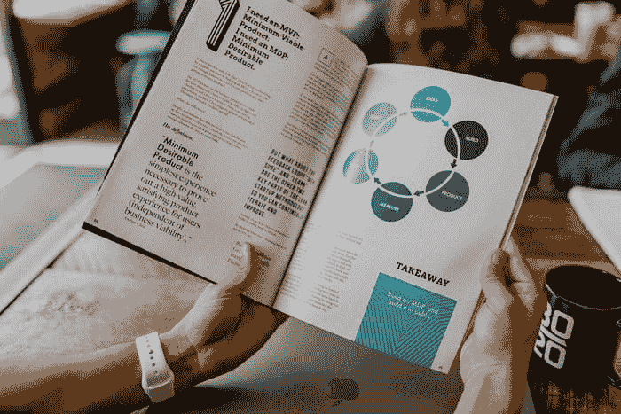
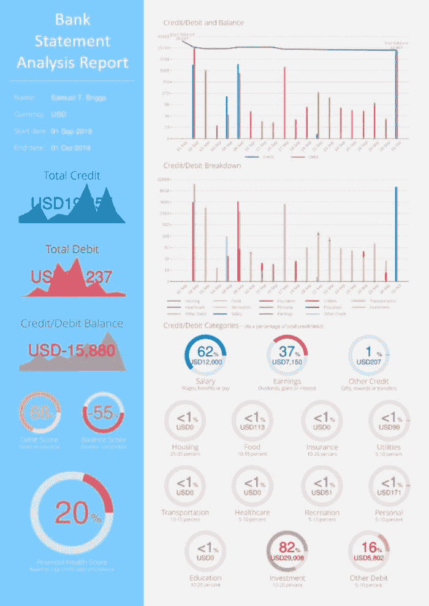

# 如何使用 Python 生成自动化 PDF 文档

> 原文：[`www.kdnuggets.com/2021/06/generate-automated-pdf-documents-python.html`](https://www.kdnuggets.com/2021/06/generate-automated-pdf-documents-python.html)

评论

**作者：[Mohammad Khorasani](http://www.linkedin.com/in/mkhorasani)，数据科学家/工程师混合型人才**



由[Austin Distel](https://unsplash.com/@austindistel?utm_source=medium&utm_medium=referral)拍摄，发布在[Unsplash](https://unsplash.com/?utm_source=medium&utm_medium=referral)。

* * *

## 我们的前三个课程推荐

 1\. [Google 网络安全证书](https://www.kdnuggets.com/google-cybersecurity) - 快速进入网络安全职业生涯。

 2\. [Google 数据分析专业证书](https://www.kdnuggets.com/google-data-analytics) - 提升你的数据分析技能

 3\. [Google IT 支持专业证书](https://www.kdnuggets.com/google-itsupport) - 支持你的组织的信息技术

* * *

上一次你处理 PDF 文档是什么时候？你可能不需要回顾太远就能找到答案。我们在日常生活中处理了大量文档，其中绝大多数确实是 PDF 文档。可以公平地说，这些文档中有很多是繁琐重复的，制定起来令人痛苦。是时候考虑利用 Python 的自动化功能来处理这些繁琐的工作，以便我们可以将宝贵的时间重新分配到生活中更紧迫的任务上。

请注意，不需要具备技术专长，我们要做的事情应该足够简单，足以让我们这些内行外行的人在短时间内完成。阅读本教程后，你将学会如何自动生成包含你自己数据、图表和图片的 PDF 文档，且拥有令人眼前一亮的外观和结构。

具体来说，本教程将自动化以下操作：

+   创建 PDF 文档

+   插入图片

+   插入文本和数字

+   数据可视化

### 创建 PDF 文档

在本教程中，我们将使用[FPDF](https://pyfpdf.readthedocs.io/en/latest/index.html)，这是 Python 中最通用和直观的生成 PDF 的包之一。在继续之前，请启动 Anaconda 提示符或你选择的任何 Python IDE，并安装 FPDF：

```py
pip install FPDF
```

然后导入我们将用来渲染文档的一系列库：

```py
import numpy as np
import pandas as pd
from fpdf import FPDF
import matplotlib as mpl
import matplotlib.pyplot as plt
from matplotlib.ticker import ScalarFormatter
```

随后创建你的 PDF 文档的第一页，并设置字体及其大小和颜色：

```py
pdf = FPDF(orientation = 'P', unit = 'mm', format = 'A4')
pdf.add_page()
pdf.set_font('helvetica', 'bold', 10)
pdf.set_text_color(255, 255, 255)
```

如果你需要使用不同的字体，可以随时更改字体。

### 插入图片

下一步逻辑就是给我们的文档添加背景图像，以设定页面的结构。在这个教程中，我使用了 Microsoft PowerPoint 来渲染背景图像的格式。我简单地使用了文本框和其他视觉元素来创建所需的格式，一旦完成，我通过选择所有元素并按 Ctrl-G 将它们分组。最后，我通过右键点击它们并选择“另存为图片”将分组元素保存为 PNG 图像。


背景图像。图片由作者提供。

正如上面所示，背景图像为我们的页面设定了结构，并为稍后生成的图表、图形、文本和数字留出了空间。用于生成此图像的特定 PowerPoint 文件可以通过点击[这里](https://github.com/mkhorasani/Bank_Scan/blob/master/background.pptx)下载。

随后，将背景图像插入到你的 PDF 文档中，并使用以下方法配置其位置：

```py
pdf.image('C:/Users/.../image.png', x = 0, y = 0, w = 210, h = 297)
```

请注意，你可以通过扩展上述方法来插入任意多的图像。

### 插入文本和数字

添加文本和数字可以通过两种方式完成。我们可以指定要放置文本的确切位置：

```py
pdf.text(x, y, txt)
```

或者，我们可以创建一个单元格，然后在其中放置文本。这种方法更适合对齐或居中变量或动态文本：

```py
pdf.set_xy(x, y)
pdf.cell(w, h, txt, border, align, fill) 
```

请注意，在上述方法中：

+   ‘x’ 和 ‘y’ 指的是页面上指定的位置

+   ‘w’ 和 ‘h’ 指的是我们单元格的尺寸

+   ‘txt’ 是要显示的字符串或数字

+   ‘border’ 指示是否必须在单元格周围绘制线条（0: 不绘制，1: 绘制或 L: 左侧，T: 顶部，R: 右侧，B: 底部）

+   ‘align’ 指示文本的对齐方式（L: 左对齐，C: 居中对齐，R: 右对齐）

+   ‘fill’ 指示单元格背景是否应该被填充（True, False）。

### 数据可视化

在这部分，我们将创建一个条形图，以展示我们的信用、借记和余额值相对于时间的时间序列数据集。为此，我们将使用 Matplotlib 来渲染我们的图形，如下所示：

在上面的代码片段中，信用、借记和余额是具有日期和交易金额值的二维列表。一旦图表生成并保存后，可以使用前面部分显示的方法将其插入到我们的 PDF 文档中。

同样，我们可以使用以下代码片段生成甜甜圈图：

一旦完成，你可以通过生成自动化 PDF 文档来结束，如下所示：

```py
pdf.output('Automated PDF Report.pdf')
```

### 结论

这就是你自己自动生成的 PDF 报告！现在你已经学会了如何创建 PDF 文档，向其中插入文本和图像，并且你还学会了如何生成和嵌入图表和图形。不过，你绝不仅仅局限于这些，事实上，你可以扩展这些技巧，以包含其他视觉元素和多页文档。天空才是真正的极限。



图片由作者提供。

如果你想深入了解 Python 和数据可视化，可以查看以下（附带推广链接）的课程： [**面向每个人的 Python 专项课程**](https://click.linksynergy.com/deeplink?id=hOGDdF2uhHQ&mid=40328&murl=https%3A%2F%2Fwww.coursera.org%2Fspecializations%2Fpython) 和 [**使用 Python 进行数据可视化**](https://click.linksynergy.com/deeplink?id=hOGDdF2uhHQ&mid=40328&murl=https%3A%2F%2Fwww.coursera.org%2Flearn%2Fpython-for-data-visualization)。此外，也欢迎探索更多我的教程 [**这里**](https://khorasani.medium.com/)。

**简介：[穆罕默德·霍拉萨尼](https://www.linkedin.com/in/mkhorasani/)** 是数据科学家和工程师的混合体。后勤学家。直言不讳。现实主义者。逐步抛弃教条。[阅读更多穆罕默德的文章](https://khorasani.medium.com/)。

[原文](https://towardsdatascience.com/how-to-generate-automated-pdf-documents-with-python-4f3bcb6033e6)。经授权转载。

**相关内容：**

+   数据科学家，你需要知道如何编程

+   使用 Python 自动化的 5 个任务

+   如何使 Python 代码运行得非常快

### 更多相关内容

+   [使用管道编写干净的 Python 代码](https://www.kdnuggets.com/2021/12/write-clean-python-code-pipes.html)

+   [建立一个稳固的数据团队](https://www.kdnuggets.com/2021/12/build-solid-data-team.html)

+   [使用 BERT 对长文本进行分类](https://www.kdnuggets.com/2022/02/classifying-long-text-documents-bert.html)

+   [GPT4All 是你的本地 ChatGPT，用于文档处理，并且是免费的！](https://www.kdnuggets.com/2023/06/gpt4all-local-chatgpt-documents-free.html)

+   [使用 tfidfvectorizer 将文本文档转换为 TF-IDF 矩阵](https://www.kdnuggets.com/2022/09/convert-text-documents-tfidf-matrix-tfidfvectorizer.html)

+   [使用 CountVectorizer 将文本文档转换为词频计数](https://www.kdnuggets.com/2022/10/converting-text-documents-token-counts-countvectorizer.html)
