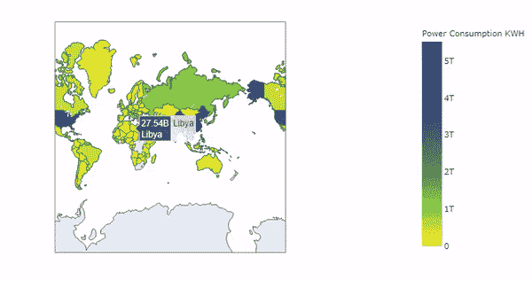
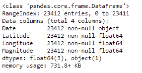

# 使用 Python 进行地理绘图

> 原文：[`www.kdnuggets.com/2020/09/geographical-plots-python.html`](https://www.kdnuggets.com/2020/09/geographical-plots-python.html)

评论

**由 [Ahmad Bin Shafiq](https://medium.com/@ahmadbinshafiq), 机器学习学生**。


* * *

## 我们的前 3 个课程推荐

 1\. [Google 网络安全证书](https://www.kdnuggets.com/google-cybersecurity) - 快速进入网络安全职业生涯。

 2\. [Google 数据分析专业证书](https://www.kdnuggets.com/google-data-analytics) - 提升你的数据分析技能

 3\. [Google IT 支持专业证书](https://www.kdnuggets.com/google-itsupport) - 支持你的组织的 IT

* * *

### Plotly

> *Plotly 是一个用于在 Python 中创建交互式图表和仪表板的著名库。Plotly 还是一个 [公司](https://plot.ly/)，允许我们托管在线和离线的数据可视化。*

在本文中，我们将使用离线的 Plotly 来以不同的地理地图形式可视化数据。

**安装 Plotly**

```py
pip install plotly
pip install cufflinks

```

在命令提示符中运行两个命令来安装 **plotly** 和 **cufflinks** 以及它们在本地机器上的所有包。

**Choropleth 地图**

> *Choropleth 地图是常用的主题地图，通过在预定的地理区域（即国家）上使用不同的阴影模式或符号来表示统计数据。它们擅长利用数据来轻松表示所需测量在一个区域的变化。*

**Choropleth 地图如何工作？**

Choropleth 地图显示被划分的地理区域或地区，这些区域以颜色、阴影或图案的形式展示与数据变量相关的信息。这提供了一种可视化地理区域内值的方式，可以展示所显示位置的变化或模式。

**使用 Python 绘制 Choropleth 地图**

在这里，我们将使用一个 [数据集](https://github.com/ahmadbinshafiq/Geographical-Plotting---Python/blob/master/2014_World_Power_Consumption) ，该数据集包含了 2014 年全球不同国家的电力消费数据。

好的，让我们开始吧。

**导入库**

```py
import plotly.graph_objs as go 
from plotly.offline import init_notebook_mode,iplot,plot
init_notebook_mode(connected=True)

import pandas as pd

```

在这里，*init_notebook_mode(connected=True)* 将 JavaScript 连接到我们的笔记本。

**创建/解释我们的 DataFrame**

```py
df = pd.read_csv('2014_World_Power_Consumption')
df.info()

```


这里我们有 3 列，并且它们都有 219 个非空条目。

```py
df.head()

```


**将数据编译成字典**

```py
data = dict(
        type = 'choropleth',
        colorscale = 'Viridis',
        locations = df['Country'],
        locationmode = "country names",
        z = df['Power Consumption KWH'],
        text = df['Country'],
        colorbar = {'title' : 'Power Consumption KWH'},
      )

```

*type = ’choropleth'*: 定义地图的类型，即此处为 choropleth。

*colorscale = ‘Viridis'*: 显示一个颜色图（*更多颜色刻度，请参见*[*这里*](https://plotly.com/python/builtin-colorscales/)*）。*

*locations = df['Country']*: 添加所有国家的列表。

*locationmode = 'country names’*: 由于我们的数据集中包含国家名称，因此我们将位置模式设置为‘country names’。

*z*: 整数值列表，显示每个状态的功耗。

*text = df['Country']*: 当在地图上悬停每个状态元素时显示文本。在这种情况下，它是国家的名称。

*colorbar = {‘title’ : ‘功耗 KWH’}*: 一个字典，包含有关右侧边栏的信息。这里，colorbar 包含边栏的标题。

```py
layout = dict(title = '2014 Power Consumption KWH',
              geo = dict(projection = {'type':'mercator'})
             )

```

> *layout**—* 一个 Geo 对象，可用于控制绘制数据的基础**地图**的外观。

这是一个嵌套字典，包含有关我们的地图/图表应该如何显示的所有相关信息。

**生成我们的图表/地图**

```py
choromap = go.Figure(data = [data],layout = layout)
iplot(choromap,validate=False)

```



太棒了！我们的“2014 年全球功耗”面积图已经生成。从上图中，我们可以看到每个国家在地图上的每个元素上悬停时显示其名称和功耗（以 kWh 为单位）。数据在某个特定区域越集中，地图上的颜色越深。这里‘中国’的功耗最大，因此其颜色最深。

### 密度图

密度映射只是显示某一特定区域内点或线可能集中位置的一种方式。

**使用 Python 的密度图**

在这里，我们将使用全球 [数据集](https://raw.githubusercontent.com/plotly/datasets/master/earthquakes-23k.csv) ，包含地震及其震级。

好的，我们开始吧。

**导入库**

```py
import plotly.express as px
import pandas as pd

```

**创建/解释我们的数据框**

```py
df = pd.read_csv('https://raw.githubusercontent.com/plotly/datasets/master/earthquakes-23k.csv')
df.info()

```



这里我们有 4 列，所有列都有 23412 个非空条目。

```py
df.head()

```


**绘制我们的数据**

```py
fig = px.density_mapbox(df, lat='Latitude', lon='Longitude', z='Magnitude', radius=10,
                        center=dict(lat=0, lon=180), zoom=0,
                        mapbox_style="stamen-terrain")
fig.show()

```

*lat='Latitude'*: 获取数据框中的纬度列。

*lon='Longitude'*: 获取数据框中的经度列。

*z*: 整数值列表，显示地震的震级。

*radius=10*: 设置每个点的影响半径。

*center=dict(lat=0, lon=180)*: 在字典中设置地图的中心点。

*zoom=0*: 设置地图缩放级别。

*mapbox_style='stamen-terrain'*: 设置基础地图样式。这里，“stamen-terrain”是基础地图样式。

*fig.show()*: 显示地图。

**地图**


太好了！我们的“地震及其震级”密度图已生成，从上图中可以看到它覆盖了所有受到地震影响的区域，并且当我们**悬停**时还显示了每个区域的震级。

使用 plotly 进行地理绘图有时可能会有些挑战，因为数据格式多样，因此请参考这个 [备忘单](https://images.plot.ly/plotly-documentation/images/python_cheat_sheet.pdf) 以获取所有类型的 plotly 绘图语法。

**相关：**

+   [探索地理信息系统的影响](https://www.kdnuggets.com/2020/04/impact-geographic-information-systems.html)

+   [每位数据科学家的前十名数据可视化工具](https://www.kdnuggets.com/2020/05/top-10-data-visualization-tools-every-data-scientist.html)

+   [可视化地理空间数据的七种技术](https://www.kdnuggets.com/2017/10/7-techniques-visualize-geospatial-data.html)

### 更多相关主题

+   [每位数据科学家都应了解的三个 R 库（即使你使用 Python）](https://www.kdnuggets.com/2021/12/three-r-libraries-every-data-scientist-know-even-python.html)

+   [是什么让 Python 成为初创公司的理想编程语言](https://www.kdnuggets.com/2021/12/makes-python-ideal-programming-language-startups.html)

+   [停止学习数据科学以寻找目标，并通过寻找目标来……](https://www.kdnuggets.com/2021/12/stop-learning-data-science-find-purpose.html)

+   [一个 90 亿美元的人工智能失败案例分析](https://www.kdnuggets.com/2021/12/9b-ai-failure-examined.html)

+   [学习数据科学统计的顶级资源](https://www.kdnuggets.com/2021/12/springboard-top-resources-learn-data-science-statistics.html)

+   [成功数据科学家的五个特征](https://www.kdnuggets.com/2021/12/5-characteristics-successful-data-scientist.html)
