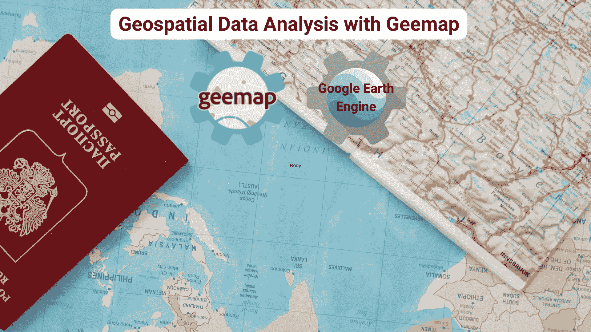
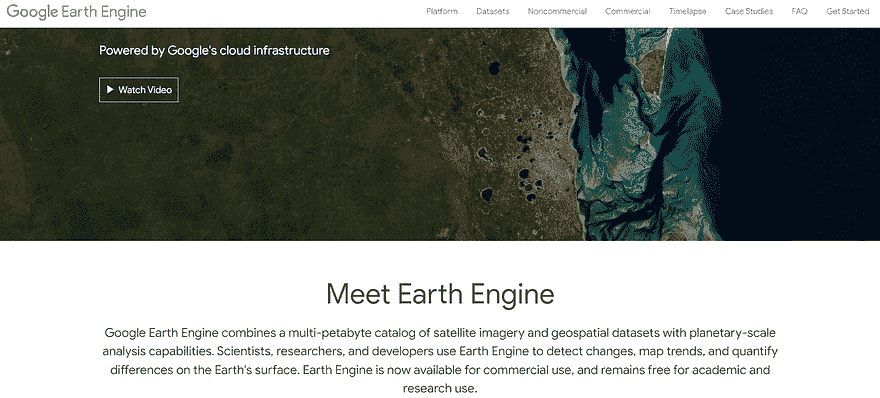
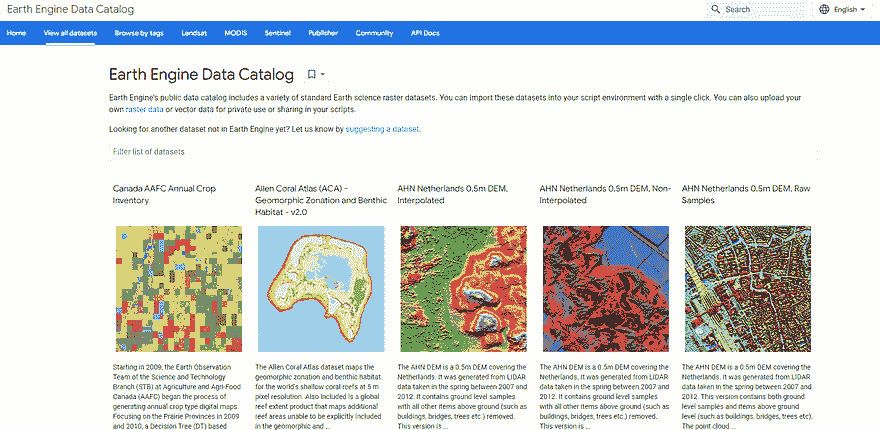
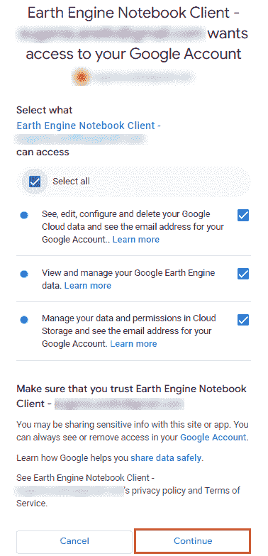
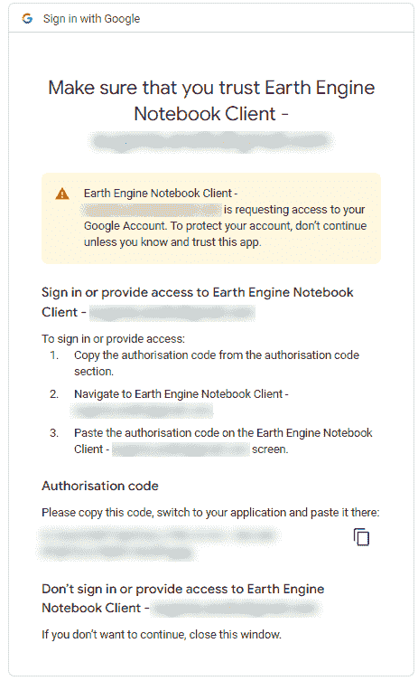
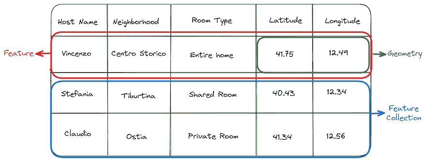
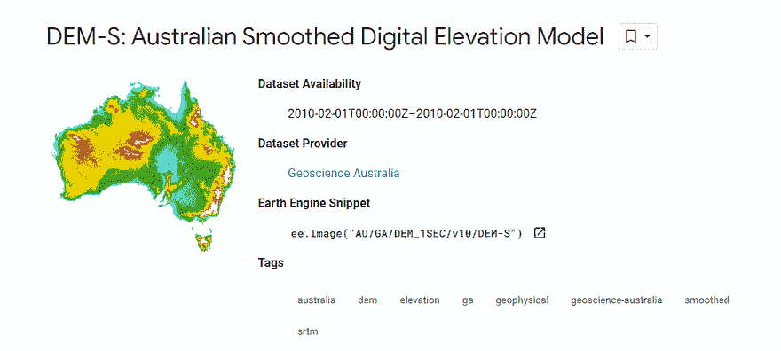
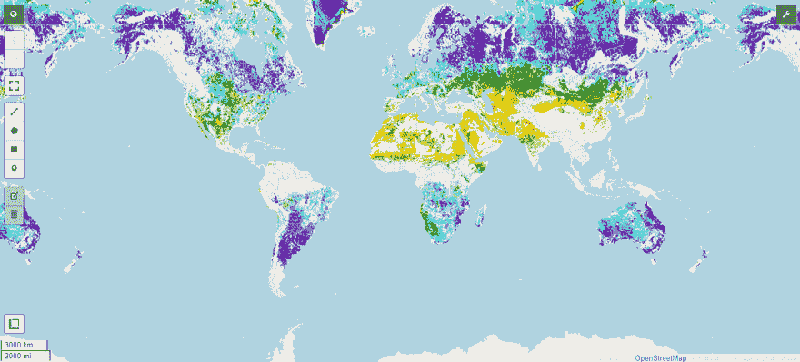

# 使用 Geemap 进行地理空间数据分析

> 原文：[`www.kdnuggets.com/geospatial-data-analysis-with-geemap`](https://www.kdnuggets.com/geospatial-data-analysis-with-geemap)



作者插图

地理空间数据分析是一个处理、可视化和分析一种特殊类型数据的领域，这种数据称为地理空间数据。与普通数据相比，我们的表格数据中增加了一个列，即位置信息，如纬度和经度。

* * *

## 我们的前三大课程推荐

 1\. [谷歌网络安全证书](https://www.kdnuggets.com/google-cybersecurity) - 快速进入网络安全职业轨道。

 2\. [谷歌数据分析专业证书](https://www.kdnuggets.com/google-data-analytics) - 提升你的数据分析技能

 3\. [谷歌 IT 支持专业证书](https://www.kdnuggets.com/google-itsupport) - 支持你的组织的 IT

* * *

数据主要分为两种类型：矢量数据和栅格数据。处理矢量数据时，你仍然拥有一个表格数据集，而栅格数据更类似于图像，例如卫星图像和航拍照片。

在这篇文章中，我将专注于 Google Earth Engine 提供的栅格数据，这是一种提供大量卫星影像数据的云计算平台。这种数据可以通过一个名为 Geemap 的救命 Python 包在你的 Jupyter Notebook 中轻松掌握。让我们开始吧！

## 什么是 Google Earth Engine？



作者截图。Google Earth Engine 的主页。

在开始使用 Python 库之前，我们需要了解 [Google Earth Engine](https://earthengine.google.com/) 的潜力。这个基于云的平台由 Google Cloud 平台提供支持，提供了用于学术、非营利和商业目的的公共和免费地理空间数据集。



作者截图。Earth Engine 数据目录概述。

这个平台的美在于它提供了一个多字节的栅格和矢量数据目录，这些数据存储在 Earth Engine 服务器上。你可以通过这个 [链接](https://developers.google.com/earth-engine/datasets/catalog) 快速概览。此外，它提供了 API 以便于栅格数据集的分析。

## 什么是 Geemap？


作者插图。Geemap 库。

[Geemap](https://geemap.org/) 是一个 Python 库，可以分析和可视化来自 Google Earth Engine 的大量地理空间数据。

在这个包之前，通过 JavaScript 和 Python API 已经可以进行计算请求，但 Python API 功能有限且缺乏文档。

为了填补这个空白，Geemap 被创建出来，允许用户通过少量代码访问 Google Earth Engine 的资源。Geemap 基于 [earthengine-api](https://pypi.org/project/earthengine-api/)、[ipyleaflet](https://github.com/jupyter-widgets/ipyleaflet) 和 [folium](https://python-visualization.github.io/folium/latest/) 构建。

要安装这个库，你只需输入以下命令：

```py
pip install geemap
```

我建议你在 Google Colab 中尝试这个神奇的包，以了解它的全部潜力。查看教授 Dr. Qiusheng Wu 编写的 [这本免费书](https://book.geemap.org/)，以便开始使用 Geemap 和 Google Earth Engine。

## 如何访问 Earth Engine？

首先，我们需要导入两个 Python 库，这些库将在教程中使用：

```py
import ee
import geemap
```

除了 geemap，我们还导入了名为 ee 的 Earth Engine Python 客户端库。

这个 Python 库可用于 Earth Engine 的认证，但通过直接使用 Geemap 库会更快：

```py
m = geemap.Map()
m
```

你需要点击这行代码返回的 URL，这将生成授权码。首先，选择云项目，然后点击“生成令牌”按钮。


作者截图。笔记本认证器。

然后，它会要求你选择账户。如果你正在使用 Google Colab，建议选择相同的账户。


作者截图。选择一个账户。

然后，点击“全选”旁边的复选框，按下“继续”按钮。简而言之，这一步允许笔记本客户端访问 Earth Engine 账户。



作者截图。允许笔记本客户端访问你的 Earth Engine 账户。

在此操作后，将生成认证代码，你可以将其粘贴到笔记本单元格中。



作者截图。复制认证码。

一旦输入验证码，你就可以创建并可视化这个交互式地图：

```py
m = geemap.Map()
m
```


现在，你只是观察 ipyleaflet 上的基础地图，ipyleaflet 是一个 Python 包，能够在 Jupyter Notebook 中可视化交互式地图。

## 创建交互式地图

之前，我们已经看到了如何通过一行代码进行身份验证并可视化交互式地图。现在，我们可以通过指定中心的纬度和经度、缩放级别和高度来定制默认地图。我选择了罗马的坐标作为中心，以便集中关注欧洲地图。

```py
m = geemap.Map(center=[41, 12], zoom=6, height=600)
m
```


如果我们想更改底图，有两种可能的方法。第一种方法是编写并运行以下代码行：

```py
m.add_basemap("ROADMAP")
m
```


另外，你可以通过点击右侧的环形扳手图标手动更改底图。


此外，我们看到 Geemap 提供的底图列表：

```py
basemaps = geemap.basemaps.keys()
for bm in basemaps:
   print(bm)
```

这是输出：

```py
OpenStreetMap
Esri.WorldStreetMap
Esri.WorldImagery
Esri.WorldTopoMap
FWS NWI Wetlands
FWS NWI Wetlands Raster
NLCD 2021 CONUS Land Cover
NLCD 2019 CONUS Land Cover
...
```

如你所见，有一长串底图，大多数是通过 OpenStreetMap、ESRI 和 USGS 提供的。

## 地球引擎数据类型

在展示 Geemap 的全部潜力之前，了解地球引擎中的两种主要数据类型是很重要的。有关更多细节，请查看[Google Earth Engine 文档](https://developers.google.com/earth-engine/guides)。



作者插图。矢量数据类型的示例：几何、特征和特征集合。

在处理矢量数据时，我们主要使用三种数据类型：

+   **几何**存储绘制矢量数据在地图上所需的坐标。地球引擎支持三种主要的几何类型：点、线段和多边形。

+   **特征**本质上是一行，结合了几何和非地理属性。它非常类似于 GeoPandas 的 GeoSeries 类。

+   **FeatureCollection**是一个包含一组特征的表格数据结构。FeatureCollection 和 GeoDataFrame 在概念上几乎是相同的。



作者截图。图像数据类型的示例。它显示了澳大利亚平滑数字高程模型（[DEM-S](https://developers.google.com/earth-engine/datasets/catalog/AU_GA_DEM_1SEC_v10_DEM-S)）

在光栅数据的世界中，我们关注**Image**对象。Google Earth Engine 的图像由一个或多个波段组成，每个波段具有特定名称、估计的最小值和最大值，以及描述。

如果我们有一系列图像或时间序列，**ImageCollection**作为数据类型更为合适。


作者截图。 [Copernicus CORINE 土地覆盖](https://developers.google.com/earth-engine/datasets/catalog/COPERNICUS_CORINE_V20_100m)。

我们可视化了显示欧洲土地覆盖图的卫星影像。该数据集提供了 1986 年到 2018 年的变化。

首先，我们使用 ee.Image 加载图像，然后选择“landcover”波段。最后，通过将加载的数据集添加到地图上作为图层，使用 Map.addLayer 来可视化图像。

```py
Map = geemap.Map()
dataset = ee.Image('COPERNICUS/CORINE/V20/100m/2012')
landCover = dataset.select('landcover')
Map.setCenter(16.436, 39.825, 6)
Map.addLayer(landCover, {}, 'Land Cover')
Map
```


作者截图。

同样，我们可以对加载和可视化显示欧洲土地覆盖地图的卫星影像做相同的操作。该数据集提供了 1986 年至 2018 年间的变化情况。


作者截图。 [甲烷浓度的离线高分辨率影像](https://developers.google.com/earth-engine/datasets/catalog/COPERNICUS_S5P_OFFL_L3_CH4)。

要可视化 Earth Engine 的 ImageCollection，代码行类似，只需注意 ee.ImageCollection 的不同。

```py
Map = geemap.Map()
collection = ee.ImageCollection('COPERNICUS/S5P/OFFL/L3_CH4').select('CH4_column_volume_mixing_ratio_dry_air').filterDate('2019-06-01', '2019-07-16')
band_viz = {
 'min': 1750,
 'max': 1900,
 'palette': ['black', 'blue', 'purple', 'cyan', 'green', 'yellow', 'red']
}

Map.addLayer(collection.mean(), band_viz, 'S5P CH4')
Map.setCenter(0.0, 0.0, 2)
Map
```



作者截图。

很棒！从这张地图中，我们可以观察到甲烷作为温室效应的重要贡献者之一，如何在全球范围内分布。

## 最后的思考

这是一个入门指南，可以帮助你使用 Python 处理 Google Earth Engine 数据。Geemap 是最完整的 Python 库，用于可视化和分析此类数据。

如果你想深入了解这个包，可以查看我下面建议的资源。

代码可以在 [这里](https://github.com/eugeniaring/Medium-Articles/blob/main/Geo/geemap_tutorial.ipynb) 找到。希望你觉得这篇文章有用。祝你有美好的一天！

**有用资源：**

+   [Google Earth Engine](https://earthengine.google.com/)

+   [Geemap 文档](https://geemap.org/)

+   [《Earth Engine 和 Geemap：使用 Python 进行地理空间数据科学》](https://book.geemap.org/)

**[](https://www.linkedin.com/in/eugenia-anello/)**[尤金妮亚·阿内洛](https://www.linkedin.com/in/eugenia-anello/)**** 目前是意大利帕多瓦大学信息工程系的研究员。她的研究项目专注于结合异常检测的持续学习。

### 更多相关话题

+   [5 个用于地理空间数据分析的 Python 包](https://www.kdnuggets.com/2023/08/5-python-packages-geospatial-data-analysis.html)

+   [使用 GeoPandas 在 Python 中利用地理空间数据](https://www.kdnuggets.com/leveraging-geospatial-data-in-python-with-geopandas)

+   [使用 Google Earth 构建 Python 中的地理空间应用程序…](https://www.kdnuggets.com/2022/03/building-geospatial-application-python-google-earth-engine-greppo.html)

+   [掌握 SQL、Python、数据清洗、数据处理和探索性数据分析的指南集合](https://www.kdnuggets.com/collection-of-guides-on-mastering-sql-python-data-cleaning-data-wrangling-and-exploratory-data-analysis)

+   [数据科学家的探索性数据分析必备指南](https://www.kdnuggets.com/2023/06/data-scientist-essential-guide-exploratory-data-analysis.html)

+   [SQL 中的数据清理：如何准备混乱数据进行分析](https://www.kdnuggets.com/data-cleaning-in-sql-how-to-prepare-messy-data-for-analysis)
