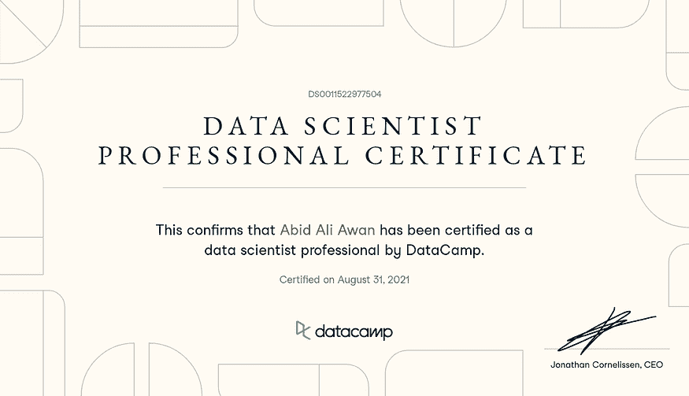
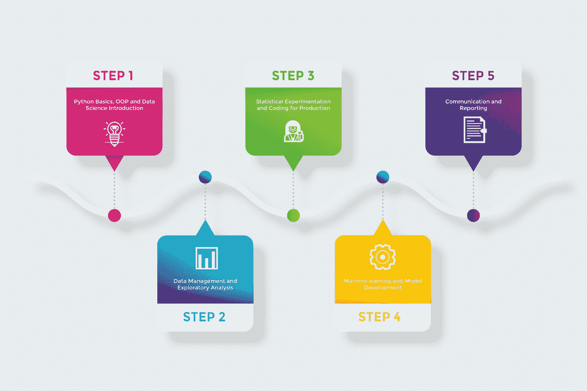

# 如何获得数据科学家的认证

> 原文：[`www.kdnuggets.com/2021/12/get-certified-data-science.html`](https://www.kdnuggets.com/2021/12/get-certified-data-science.html)

comments

*作者提供的图片。*

* * *

## 我们的前三个课程推荐

 1\. [Google 网络安全证书](https://www.kdnuggets.com/google-cybersecurity) - 快速进入网络安全职业生涯。

 2\. [Google 数据分析专业证书](https://www.kdnuggets.com/google-data-analytics) - 提升你的数据分析水平

 3\. [Google IT 支持专业证书](https://www.kdnuggets.com/google-itsupport) - 支持你的组织的 IT 需求

* * *

数据科学领域相比其他软件相关领域仍然较新，目前没有统一的标准来确定成为专业数据科学家需要掌握哪些技能。这时候，[DataCamp](https://app.datacamp.com/certification)认证可以帮助评估你的知识和技能。就像在计算机网络领域，[Cisco](https://www.cisco.com/c/en/us/training-events/training-certifications/certifications.html)认证是黄金标准一样，DataCamp 通过各种挑战来评估个人技能。

在[证书挑战](https://www.datacamp.com/summerchallenge)中，我是一名专业数据科学家，与多个公司合作进行各种项目。起初，我以为对我来说这很简单，但实际上却具有挑战性，我必须全力以赴才能通过所有阶段。认证挑战旨在筛选出 90%的候选人，并仅授予少数具备专业技能的个人。在本指南中，我们将详细学习每一步，并提供通过所有阶段的技巧和窍门。

***在通过所有阶段后，你将收到如下所示的证书，一切都值得。***

*[Abid Ali Awan 的数据科学家专业证书](https://www.datacamp.com/certificate/DS0011522977504)*

### 完成数据科学课程

首先，你需要在注册认证之前掌握所有技能。你需要学习 Python（最常用的语言）或 R（统计学家的语言）。

你还将学习：

1.  **数据管理：** 数据摄取、处理、增强以及处理缺失值。

1.  **探索性分析：** 特征工程、数据分析、可视化和数据洞察。

1.  **统计实验：** 使用各种统计方法解决类似问题。

1.  **机器学习：** 预测模型、机器学习工作流程、优化模型和实验。

1.  **面向生产环境的编码：**可重用代码、单元测试、模块化以及采用行业标准。

1.  **沟通和报告：**在报告或仪表板中展示数据，并向技术和非技术利益相关者传递关键信息。

你可以在 YouTube 上*免费*学习所有这些技能，但我强烈推荐你查看*付费课程*。

*作者提供的图片 | 元素来自于 [freepik](https://www.freepik.com/free-vector/gradient-infographic-set-steps_5348397.htm)。*

我有**Coursera、DataCamp、Udacity**和**Codecademy**的经验，因此只能建议这些课程，但你总是可以寻找更好的在线课程。

+   [数据科学 | Coursera](https://www.coursera.org/specializations/jhu-data-science?ranMID=40328&ranEAID=jU79Zysihs4&ranSiteID=jU79Zysihs4-L6HTrBs_tjQxVA5HJrRlaQ&siteID=jU79Zysihs4-L6HTrBs_tjQxVA5HJrRlaQ&utm_content=10&utm_medium=partners&utm_source=linkshare&utm_campaign=jU79Zysihs4)

+   [职业路径 — DataCamp Learn](https://app.datacamp.com/learn/career-tracks/data-scientist-with-python?version=5)

+   [在线学习成为数据科学家 (udacity.com)](https://www.udacity.com/course/data-scientist-nanodegree--nd025)

+   [数据科学家 | Codecademy](https://www.codecademy.com/learn/paths/data-science)

### 定时评估

在你成功完成了 [数据科学技能路径](https://app.datacamp.com/learn/career-tracks/data-scientist-with-python?version=5) 后，前往 [DataCamp 认证](https://app.datacamp.com/certification) 部分并开始进行定时评估测试。共有三个定时评估测试，每个测试有 15 个问题。每个问题有时间限制，可能因问题复杂性而异，因此请不要在网上寻找答案，因为这会浪费时间，计分将为零。

**这些问题将测试你的技能：**

1.  面向生产环境的编码

1.  统计实验

1.  使用 PostgreSQL 进行探索性分析

如果你考试失败，可以重新参加考试，有时即使你已经通过，也必须达到更高的分数才能进入下一阶段，这在某些情况下可能是第 90 百分位。要成功通过这一阶段，你需要全力以赴。

> ***提示：****如果你得分很低，请回过头检查所有错误答案。如果是愚蠢的错误，就尝试把它写在纸上，但如果你对问题毫无头绪，我建议你观看针对该问题的视频教程。这些问题不会重复，你可能会再次犯同样的错误。*

### 编程挑战

在这个编码挑战中，没有时间限制，你可以完全自由地提出解决方案。目标是测试个人的编码技能和解决数据问题的能力。在我的案例中，我需要清理数据，添加额外的特征，并最终使用统计工具提出解决方案。这个挑战可以在 30 分钟内解决，但如果你卡住了，无法得到正确的结果，可能需要超过 30 分钟。

**提示：**

1.  总是要读两遍问题陈述，并在开始编码之前给自己留出时间。

1.  在编写任何一行代码之前，先制定计划。

1.  不要过度思考。尽可能简单地尝试问题，因为没有技巧性问题。

1.  如果你卡住了，休息一下，出去喝咖啡，甚至在测试期间也可以。

1.  初次尝试未能得到答案也是可以的，因为这并不意味着你不够优秀。

*你可以阅读我关于编码挑战的博客 *[*这里*](https://medium.com/geekculture/what-is-the-cost-of-sanity-for-a-data-scientist-12a5d78f3b4b)* 了解更多关于我的经验。*

### 案例研究

在最终阶段，你必须通过 DataCamp 门户预订 24 小时测试的日期。之后，你将获得有关案例研究的详细信息以及专家如何评判该案例研究的方式。在展示日期前 24 小时，你将收到一封电子邮件，你有整整一天的时间来准备：技术报告和非技术性展示。这很简单明了，但你需要完成所有要求的任务，例如：

+   数据清洗

+   数据分析/可视化

+   机器学习模型

+   实验

+   报告

+   结果

+   非技术性展示

### 技术报告

技术报告通常基于 Jupyter notebook，DataCamp 将提供一个 [工作空间](https://app.datacamp.com/workspace) 供你运行实验和开发技术报告。

成功通过这个阶段：

+   你需要练习数据分析和机器学习项目。

+   你需要熟练使用 Markdown 和 Python 代码。

+   你需要全面掌握各种可视化和机器学习工具。

+   最后，你需要有撰写技术报告的经验。

> ***提示***：尝试保持简单，并在 Jupyter notebook 中使用 Markdown 单元格解释每个部分。添加一些图片和有关问题陈述的背景故事。尝试实验所有机器学习算法，并更多地关注结果的解释。

***大多数候选人在这个阶段失败，然后他们必须等待 4 周才能重新申请。***

### 非技术性展示

对于这一部分，您需要使用 MS PowerPoint 或任何您感到舒适的软件创建演示文稿。请记住，您需要为非技术观众准备这份演示文稿，因此不要再有统计方程或机器学习结果。这是一个 Zoom 演讲，专家将根据各种属性给您评分。如果您花费超过*12 分钟*来覆盖所有主题，将会扣分。尽量复制粘贴可视化内容，减少文字。专注于结果并练习*讲故事*。

> ***提示：**** 计算您的演讲时间，并保持简短。不要添加过多文字。尽量用您的话解释案例研究。专注于关键发现和结果。根据您的发现向利益相关者提供商业解决方案。要自信并清晰地讲话。*

### 职业服务

演讲结束后，您将在四个工作日内收到关于您结果的电子邮件。如果您成功通过所有阶段，您将收到多封关于证书链接和[个性化职业服务](https://app.datacamp.com/certification/career-services)的电子邮件。

职业服务包括：

+   个性化职业咨询会

+   简历反馈

+   在[Skilled](https://www.skilledinc.com/app/home)上进行模拟面试

+   获得[Huntr](https://huntr.co/)的访问权限

+   职业匹配

一切都是值得的，因为职业服务将帮助您在领域中提升，并与顶级公司匹配。我强烈建议候选人完成认证并充分利用个性化职业服务。

### 结论

在这篇博客中，我们涵盖了您获得认证所需的所有部分。首先，您需要通过实践项目或完成数据科学技能路径来获得所需技能。然后，开始在 DataCamp 上进行定时评估。之后，进行代码挑战和案例研究。就是这么简单，但并非所有人都能获得认证，因为候选人经常在课程中跳跃。您需要积累足够的经验和技能才能获得 DataCamp 认证。因此，开始根据我分享的提示工作，迅速启动您的*数据科学家*职业。

*图像由作者提供 | 元素来自[freepik](https://www.freepik.com/free-vector/colorful-infographic-steps-flat-design_4906167.htm#page=1&query=steps&position=46&from_view=search)。*

**相关：**

+   [获得第一个数据科学家职位的 5 个技巧](https://www.kdnuggets.com/2021/11/5-tips-first-data-scientist-job.html)

+   [提升职业生涯的 6 个数据科学证书](https://www.kdnuggets.com/2021/02/6-data-science-certificates.html)

+   [数据科学家虚拟演讲技巧](https://www.kdnuggets.com/2021/11/virtual-presentation-tips-data-scientists.html)

### 更多相关话题

+   [成为优秀数据科学家的 5 项关键技能](https://www.kdnuggets.com/2021/12/5-key-skills-needed-become-great-data-scientist.html)

+   [每个初学者数据科学家都应该掌握的 6 种预测模型](https://www.kdnuggets.com/2021/12/6-predictive-models-every-beginner-data-scientist-master.html)

+   [2021 年最佳 ETL 工具](https://www.kdnuggets.com/2021/12/mozart-best-etl-tools-2021.html)

+   [成功数据科学家的 5 个特征](https://www.kdnuggets.com/2021/12/5-characteristics-successful-data-scientist.html)

+   [每个数据科学家都应该了解的三个 R 库（即使你使用 Python）](https://www.kdnuggets.com/2021/12/three-r-libraries-every-data-scientist-know-even-python.html)

+   [停止学习数据科学以寻找目标，再找到目标来……](https://www.kdnuggets.com/2021/12/stop-learning-data-science-find-purpose.html)
