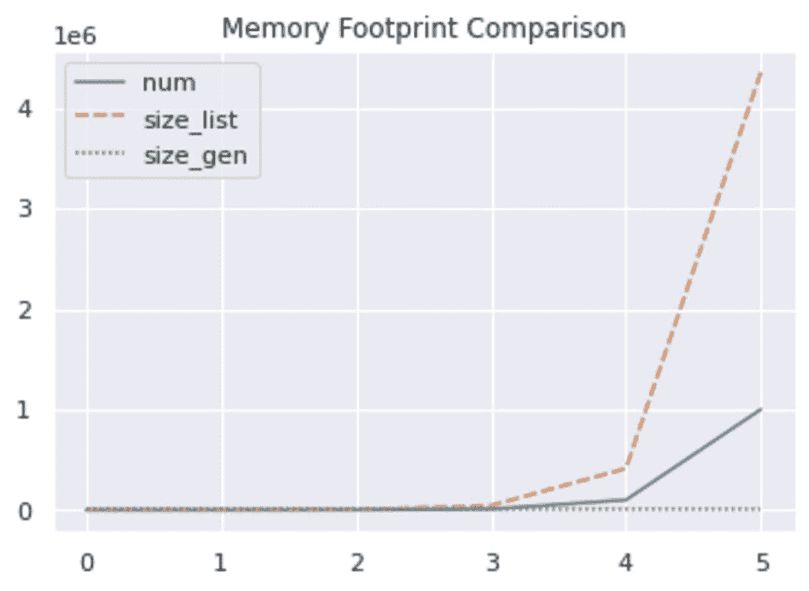

# 入门 Python 生成器

> 原文：[`www.kdnuggets.com/2023/02/getting-started-python-generators.html`](https://www.kdnuggets.com/2023/02/getting-started-python-generators.html)


图片由作者提供

学习如何使用 Python 生成器可以帮助你编写更 Pythonic 和高效的代码。当你需要处理大型序列时，使用生成器尤其有用。

* * *

## 我们的三大课程推荐

 1\. [Google 网络安全证书](https://www.kdnuggets.com/google-cybersecurity) - 快速进入网络安全职业生涯。

 2\. [Google 数据分析专业证书](https://www.kdnuggets.com/google-data-analytics) - 提升你的数据分析技能

 3\. [Google IT 支持专业证书](https://www.kdnuggets.com/google-itsupport) - 支持你的组织的 IT 工作

* * *

在本教程中，你将学习如何通过定义生成器函数和生成器表达式来使用 Python 生成器。然后你将了解到，使用生成器可以是一个内存高效的选择。

# 在 Python 中定义生成器函数

要理解生成器函数与普通 Python 函数的不同，让我们从一个常规的 Python 函数开始，然后将其重写为生成器函数。

请考虑以下函数 `get_cubes()`。它接受一个数字 `num` 作为参数，并返回数字 0、1、2 直到 num -1 的立方列表：

```py
def get_cubes(num):
    cubes = []
    for i in range(num):
        cubes.append(i**3)
    return cubes
```

上述函数通过遍历数字 0、1、2，直到 num -1，并将每个数字的立方添加到 `cubes` 列表中。最后，它返回 `cubes` 列表。

你已经可以看出，这不是创建新列表的推荐 Pythonic 方式。与其使用 for 循环并使用 `append()` 方法，你可以使用一个 [**列表推导式**](https://docs.python.org/3/tutorial/datastructures.html#list-comprehensions) 表达式。

这是使用列表推导式而不是显式的 for 循环和 `append()` 方法的 `get_cubes()` 函数的等效形式：

```py
def get_cubes(num):
    cubes = [i**3 for i in range(num)]
    return cubes
```

接下来，让我们将这个函数重写为生成器函数。下面的代码片段展示了如何将 `get_cubes()` 函数重写为生成器函数 `get_cubes_gen()`：

```py
def get_cubes_gen(num):
    for i in range(num):
        yield i**3
```

从函数定义中，你可以看出以下区别：

+   我们使用 *yield* 关键字，而不是 return 关键字。

+   我们*不*返回一个序列或填充一个可迭代对象，如 Python 列表，以获取序列。

那么生成器函数是如何工作的呢？为了理解，让我们调用上述定义的函数并仔细查看。

## 理解函数调用

让我们调用 `get_cubes()` 和 `get_cubes_gen()` 函数，看看它们在各自函数调用中的区别。

当我们用数字 6 作为参数调用`get_cubes()`函数时，我们得到预期的立方列表。

```py
cubes_gen = get_cubes_gen(6)
print(cubes_gen)
```

```py
Output >> [0, 1, 8, 27, 64, 125]
```

现在用相同的数字 6 作为参数调用生成器函数，看看会发生什么。你可以像调用普通 Python 函数一样调用生成器函数`get_cubes_gen()`。

```py
cubes_gen = get_cubes_gen(6)
print(cubes_gen)
```

如果你打印出`cubes_gen()`的值，你会得到一个生成器对象，而不是包含每个数字立方的整个结果列表。

```py
Output >> <generator object get_cubes_gen at 0x011B6530>
```

**那么你如何访问序列中的元素呢？** 要进行编码，请启动一个 Python REPL 并导入生成器函数。在这里，我将代码放在了*gen_example.py*文件中，因此我从`get_cubes_gen()`模块中导入了`get_cubes_gen()`函数。

```py
>>> from gen_example import get_cubes_gen
>>> cubes_gen = get_cubes_gen(6)
```

你可以用生成器对象作为参数调用`next()`。这样做会返回 0，即序列中的第一个元素。

```py
>>> next(cubes_gen)
0
```

现在当你再次调用`next()`时，你会得到序列中的下一个元素，即 1。

```py
>>> next(cubes_gen)
1
```

要访问序列中的后续元素，你可以继续调用`next()`，如所示：

```py
>>> next(cubes_gen)
8
>>> next(cubes_gen)
27
>>> next(cubes_gen)
64
>>> next(cubes_gen)
125
```

对于`num = 6`，结果序列是数字 0、1、2、3、4 和 5 的立方。现在我们已经到达了 125，5 的立方，当你再次调用 `next()` 时会发生什么？

我们看到**StopIteration**异常被抛出。

```py
>>> next(cubes_gen)
Traceback (most recent call last):
  File "<stdin>", line 1, in <module>
StopIteration</module></stdin>
```

从底层来看，生成器函数会执行直到遇到*yield*语句，控制权会返回到调用点。然而，与正常的 Python 函数不同，生成器函数在*return*语句之后会暂时挂起执行，并保持其状态，这有助于我们通过调用`next()`获取后续元素。

你也可以使用 for 循环遍历生成器对象。当**StopIteration**异常被抛出时，控制会退出循环（这就是 for 循环在底层的工作原理）。

```py
for cube in cubes_gen:
    print(cube)

# Output
0
1
8
27
64
125
```

```py
cubes_gen = (i**3 for i in range(num))
```

# Python 中的生成器表达式

另一种常见的使用生成器的方法是使用**生成器表达式**。这里是`get_cubes_gen()`函数的生成器表达式等效版本：

```py
cubes_gen = (i**3 for i in range(num))
```

上述生成器表达式可能看起来与列表推导类似，只是使用了()代替[]。然而，正如讨论的那样，存在以下关键差异：

+   列表推导表达式生成整个列表并将其存储在内存中。

+   另一方面，生成器表达式按需生成序列的元素。

# Python 生成器与列表：理解性能改进

在上一节的示例函数调用中，我们生成了从零到五的数字的立方序列。对于这样的短小序列，使用生成器可能不会给你带来显著的性能提升。然而，当你处理较长的序列时，生成器无疑是一个节省内存的选择。

要查看实际效果，可以生成一个更广范围内 `num` 值的立方序列：

```py
size_l = []
size_g = []

# run for various values of num
for i in [10, 100, 1000, 10000, 100000, 1000000]:
    cubes_l = [j**3 for j in range(i)]
    cubes_g = (j**3 for j in range(i))
    # get the sizes of static list and generator expression
    size_l.append(sys.getsizeof(cubes_l))
    size_g.append(sys.getsizeof(cubes_g))
```

现在让我们打印出静态列表和生成器对象在内存中的大小（如上面代码片段中`num`变化时）：

```py
print(f"size_l: {size_l}")
print(f"size_g: {size_g}")
```

从输出中我们看到，生成器对象具有恒定的内存占用，而列表的内存随着`num`的增加而增长。这是因为生成器执行*延迟评估*并*按需生成*序列中的后续值。它不会提前计算所有值。

```py
# Output
size_l: [92, 452, 4508, 43808, 412228, 4348728]
size_g: [56, 56, 56, 56, 56, 56]
```

为了更好地了解静态列表和生成器的大小如何随`num`的变化而变化，我们可以绘制`num`的值以及列表和生成器的大小，如下所示：



在上图中，我们看到当`num`增加时，生成器的大小保持不变，而列表的大小则极为庞大。

# 结论

在本教程中，你已经了解了生成器在 Python 中的工作原理。下次你需要处理大型文件或数据集时，可以考虑使用生成器来高效地进行迭代。当你使用生成器时，可以对生成器对象进行迭代，读取一行或一小块，处理或应用所需的变换，而不需要将原始数据集存储在内存中。然而，请记住，你不能将这些值存储在内存中以便以后处理。如果需要，你必须使用列表。

**[Bala Priya C](https://twitter.com/balawc27)** 是一位技术写作人，喜欢创作长篇内容。她的兴趣领域包括数学、编程和数据科学。她通过编写教程、操作指南等形式与开发者社区分享她的学习成果。

### 更多相关内容

+   [用 5 步开始 Python 数据结构](https://www.kdnuggets.com/5-steps-getting-started-python-data-structures)

+   [开始使用 Python 进行数据科学](https://www.kdnuggets.com/getting-started-with-python-for-data-science)

+   [开始使用 PyTest：轻松编写和运行 Python 测试](https://www.kdnuggets.com/getting-started-with-pytest-effortlessly-write-and-run-tests-in-python)

+   [开始使用自动化文本摘要](https://www.kdnuggets.com/2019/11/getting-started-automated-text-summarization.html)

+   [开始清理数据](https://www.kdnuggets.com/2022/01/getting-started-cleaning-data.html)

+   [开始使用 SQL 备忘单](https://www.kdnuggets.com/2022/08/getting-started-sql-cheatsheet.html)
