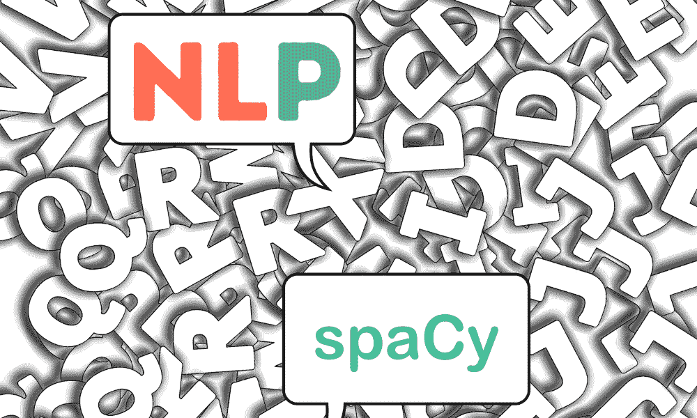
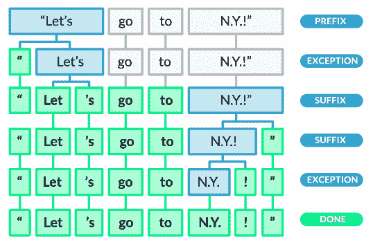

# Getting Started with spaCy for NLP

> 原文：[`www.kdnuggets.com/2022/11/getting-started-spacy-nlp.html`](https://www.kdnuggets.com/2022/11/getting-started-spacy-nlp.html)



Image by Editor

如今，NLP 是人工智能中最具前景的趋势之一，因为它的应用广泛涵盖了医疗、零售和银行等多个行业。由于对快速和可扩展解决方案的需求日益增加，spaCy 成为开发人员的首选 NLP 库之一。NLP 产品旨在理解现有的文本数据。它主要围绕解决诸如‘数据的背景是什么？’，‘它是否存在任何偏见？’，‘单词之间是否存在相似性？’等问题来构建有价值的解决方案。

因此，spaCy 是一个帮助处理此类问题的库，它提供了一系列易于插拔的模块。它是一个开源且适合生产的库，使开发和部署变得顺畅高效。此外，spaCy 的构建并不是以研究为导向，因此它为用户提供了一组有限的功能，而不是多个选项来快速开发。

在这篇博客中，我们将探讨如何从安装开始，了解 spaCy 提供的各种功能。

# Installation

要安装 spaCy，请输入以下命令：

```py
pip install spacy 
```

spaCy 通常需要加载训练好的管道以访问大多数功能。这些管道包含预训练模型，用于执行一些常见任务的预测。这些管道有多种语言和多种尺寸。在这里，我们将安装英文的小型和中型管道。

```py
python -m spacy download en_core_web_sm 
python -m spacy download en_core_web_md 
```

Voila! 你现在已准备好开始使用 spaCy。

# Loading the Pipeline

在这里，我们将加载英文的较小管道版本。

```py
import spacy
nlp = spacy.load("en_core_web_sm") 
```

现在，管道已加载到 nlp 对象中。

接下来，我们将通过示例探索 spaCy 的各种功能。

# Tokenization

Tokenization 是将文本分割成更小的单元称为 tokens 的过程。例如，在一句话中，tokens 是单词，而在一个段落中，tokens 可能是句子。这一步有助于通过使内容易于阅读和处理来理解内容。

我们首先定义一个字符串。

```py
text = "KDNuggets is a wonderful website to learn machine learning with python" 
```

现在我们在 ‘text’ 上调用 ‘nlp’ 对象，并将其存储在 ‘doc’ 对象中。‘doc’ 对象将包含关于文本的所有信息——单词、空格等。

```py
doc = nlp(text)
```

‘doc’ 可以用作迭代器来解析文本。它包含一个 ‘.text’ 方法，可以给出每个 token 的文本，例如：

```py
for token in doc:
	print(token.text)
```

**output:**

```py
KDNuggets
is
a
wonderful
website
to
learn
machine
learning
with
python
```

除了通过空格分割单词外，tokenization 算法还对分割后的文本进行双重检查。



来源：[spaCy documentation](https://spacy.io/usage/spacy-101)

如上图所示，在通过空格拆分单词后，算法检查异常情况。单词‘Let’s’不是其词根形式，因此它被再次拆分为‘Let’和‘s’。标点符号也会被拆分。此外，规则确保不会拆分像‘N.Y.’这样的单词，并将其视为单个标记。

# 停用词

自然语言处理中的一个重要预处理步骤是从文本中去除停用词。停用词基本上是如‘to’、‘with’、‘is’等连接词，它们提供的上下文很少。spaCy 允许通过‘doc’对象的‘is_stop’属性轻松识别停用词。

我们遍历所有标记并应用‘is_stop’方法。

```py
for token in doc:
	if token.is_stop == True:
		print(token)
```

**输出：**

```py
is 
a 
to 
with 
```

# 词形还原

词形还原是自然语言处理管道中的另一个重要预处理步骤。它有助于去除一个单词的不同版本，通过将单词转换为其词根形式，减少意义相同单词的冗余。例如，它将‘is’ -> ‘be’，‘eating’ -> ‘eat’，以及‘N.Y.’ -> ‘n.y.’。使用 spaCy，可以通过‘.lemma_’属性轻松将单词转换为其词根形式。

我们遍历所有标记并应用‘.lemma_’方法。

```py
for token in doc:
	print(token.lemma_)
```

**输出：**

```py
kdnugget 
be 
a 
wonderful 
website 
to 
learn 
machine 
learning 
with 
python
```

# 词性标注

自动词性标注使我们能够通过了解哪些词汇类别主导内容及其反之，从而了解句子结构。这些信息在理解上下文中形成了重要部分。spaCy 允许解析内容并通过‘.pos_’属性对单个标记进行词性标注。

我们遍历所有标记并应用‘.pos_’方法。

```py
for token in doc:
	print(token.text,':',token.pos_)
```

**输出：**

```py
KDNuggets : NOUN
is : AUX
a : DET
wonderful : ADJ
website : NOUN
to : PART
learn : VERB
machine : NOUN
learning : NOUN
with : ADP
python : NOUN
```

# 依存句法分析

每个句子都有一个固有的结构，其中单词之间有相互依赖的关系。依存句法分析可以被认为是一个有向图，其中节点是单词，边是单词之间的关系。它提取一个单词在语法上对另一个单词的意义信息；例如它是主语、助动词还是词根等等。spaCy 具有一个‘.dep_’方法，描述了标记的句法依赖关系。

我们遍历所有标记并应用‘.dep_’方法。

```py
for token in doc:
	print(token.text, '-->', token.dep_) 
```

**输出：**

```py
KDNuggets --> nsubj
is --> ROOT
a --> det
wonderful --> amod
website --> attr
to --> aux
learn --> relcl
machine --> compound
learning --> dobj
with --> prep
python --> pobj
```

# 命名实体识别

所有现实世界中的对象都有一个分配给它们的名称以供识别，并且它们被分组到一个类别中。例如，‘India’、‘U.K.’ 和 ‘U.S.’ 这些术语属于国家类别，而‘Microsoft’、‘Google’ 和 ‘Facebook’ 则属于组织类别。spaCy 已经在管道中训练了可以确定和预测这些命名实体类别的模型。

我们将使用‘.ents’方法访问命名实体。我们将显示实体的文本、起始字符、结束字符和标签。

```py
for ent in doc.ents: 
	print(ent.text, ent.start_char, ent.end_char, ent.label_)
```

**输出：**

```py
KDNuggets 0 9 ORG
```

# 词向量和相似度

在自然语言处理（NLP）中，我们常常希望分析词语、句子或文档的相似性，这可以用于推荐系统或抄袭检测工具等应用。相似度得分通过查找词嵌入之间的距离来计算，即词的向量表示。spaCy 通过中型和大型管道提供了这一功能。较大的管道更为准确，因为它包含了在更多样化数据上训练的模型。然而，我们这里只是为了理解而使用中型管道。

我们首先定义要比较相似性的句子。

```py
nlp = spacy.load("en_core_web_md") 

doc1 = nlp("Summers in India are extremely hot.") 
doc2 = nlp("During summers a lot of regions in India experience severe temperatures.")
doc3 = nlp("People drink lemon juice and wear shorts during summers.")

print("Similarity score of doc1 and doc2:", doc1.similarity(doc2)) 
print("Similarity score of doc1 and doc3:", doc1.similarity(doc3))
```

**输出：**

```py
Similarity score of doc1 and doc2: 0.7808246189842116
Similarity score of doc1 and doc3: 0.6487306770376172 
```

# 基于规则的匹配

基于规则的匹配可以被认为类似于正则表达式，我们可以在文本中指定要查找的特定模式。spaCy 的匹配器模块不仅完成了上述任务，还提供了对文档信息的访问，例如词汇、词性标签、词元、依赖结构等，这使得在多个附加条件下提取词汇成为可能。

在这里，我们首先创建一个匹配器对象来包含所有词汇。接下来，我们将定义要查找的文本模式，并将其作为规则添加到匹配器模块中。最后，我们将对输入句子调用匹配器模块。

```py
from spacy.matcher import Matcher
matcher = Matcher(nlp.vocab)

doc = nlp("cold drinks help to deal with heat in summers")
pattern = [{'TEXT': 'cold'}, {'TEXT': 'drinks'}]

matcher.add('rule_1', [pattern], on_match=None)
matches = matcher(doc) 

for _, start, end in matches:
    matched_segment = doc[start:end]
    print(matched_segment.text)
```

**输出：**

```py
cold drinks
Let's also look at another example wherein we attempt to find the word 'book' but only when it is a 'noun'.
```

```py
from spacy.matcher import Matcher
matcher = Matcher(nlp.vocab)

doc1 = nlp("I am reading the book called Huntington.")
doc2 = nlp("I wish to book a flight ticket to Italy.")

pattern2 = [{'TEXT': 'book', 'POS': 'NOUN'}]

matcher.add('rule_2', [pattern2], on_match=None)

matches = matcher(doc1)
print(doc1[matches[0][1]:matches[0][2]])

matches = matcher(doc2)
print(matches)
```

**输出：**

```py
book
[]
```

在这篇博客中，我们讨论了如何安装和开始使用 spaCy。我们还探索了它提供的各种基本功能，如分词、词形还原、依赖分析、词性标注、命名实体识别等。spaCy 在开发用于生产的 NLP 管道时非常方便。其详细的文档、易用性和多样的功能使其成为 NLP 领域广泛使用的库之一。

**[Yesha Shastri](https://www.linkedin.com/in/yeshashastri/)** 是一位热情的 AI 开发者和作家，目前在蒙特利尔大学攻读机器学习硕士学位。Yesha 对探索负责任的 AI 技术以解决有益于社会的挑战感兴趣，并与社区分享她的学习成果。

* * *

## 我们的三大课程推荐

 1\. [Google 网络安全证书](https://www.kdnuggets.com/google-cybersecurity) - 快速进入网络安全职业生涯。

 2\. [Google 数据分析专业证书](https://www.kdnuggets.com/google-data-analytics) - 提升您的数据分析技能

 3\. [Google IT 支持专业证书](https://www.kdnuggets.com/google-itsupport) - 支持您的组织在 IT 方面

* * *

### 更多相关内容

+   [使用 spaCy 进行自然语言处理](https://www.kdnuggets.com/2023/01/natural-language-processing-spacy.html)

+   [入门自动文本摘要](https://www.kdnuggets.com/2019/11/getting-started-automated-text-summarization.html)

+   [数据清理入门](https://www.kdnuggets.com/2022/01/getting-started-cleaning-data.html)

+   [PyCaret 入门](https://www.kdnuggets.com/2022/11/getting-started-pycaret.html)

+   [PyTorch Lightning 入门](https://www.kdnuggets.com/2022/12/getting-started-pytorch-lightning.html)

+   [使用 Scikit-learn 进行机器学习分类入门](https://www.kdnuggets.com/getting-started-with-scikit-learn-for-classification-in-machine-learning)
