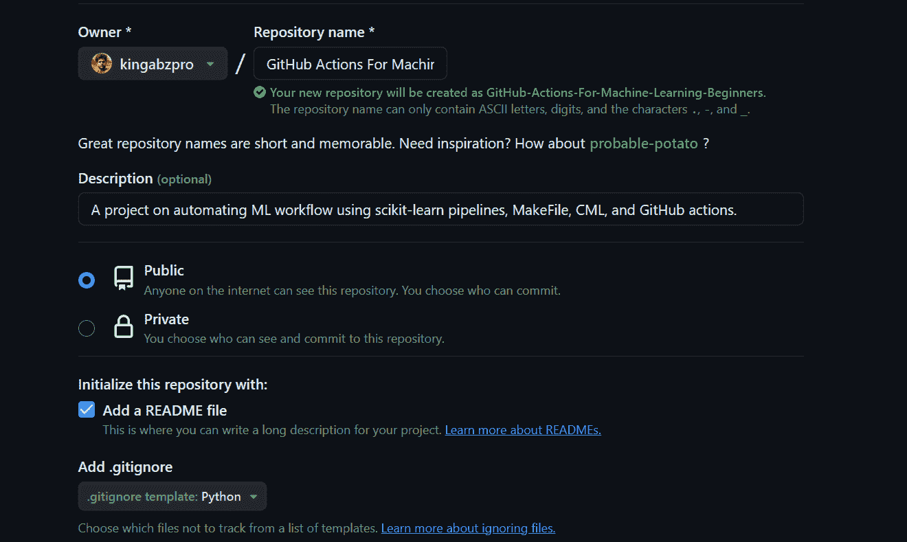
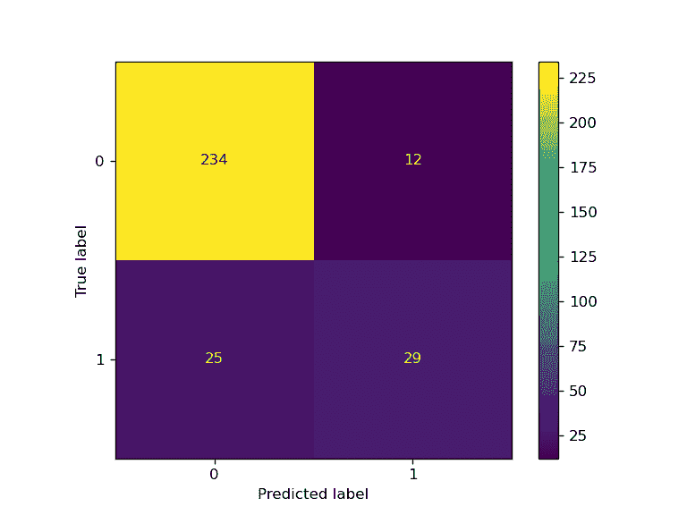
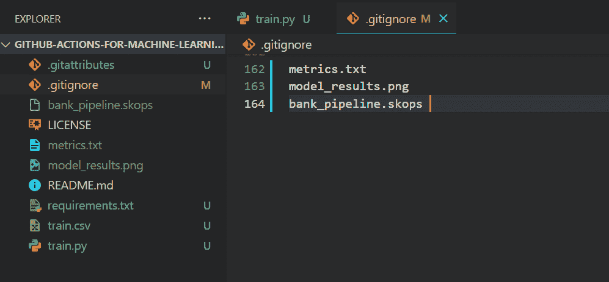
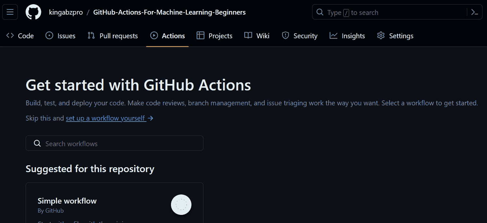
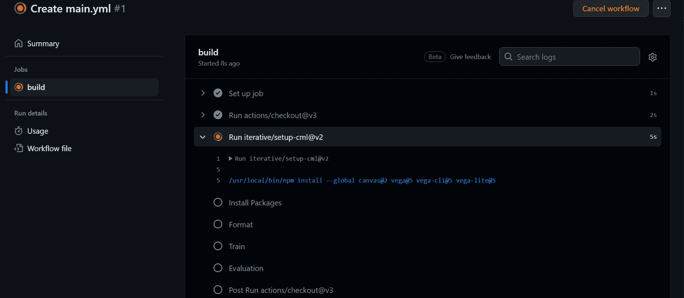
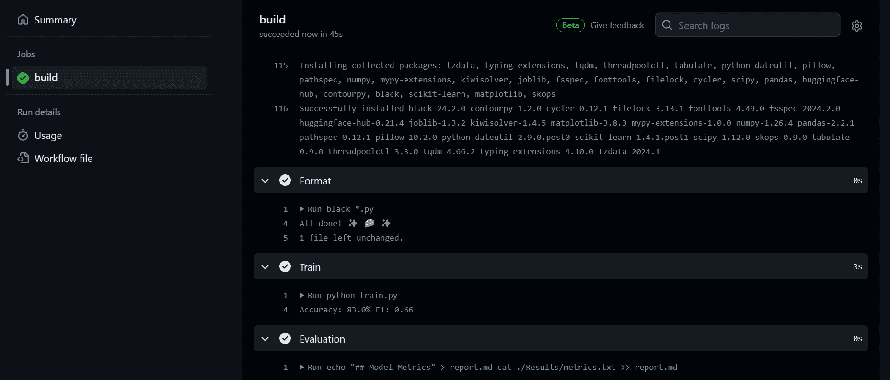
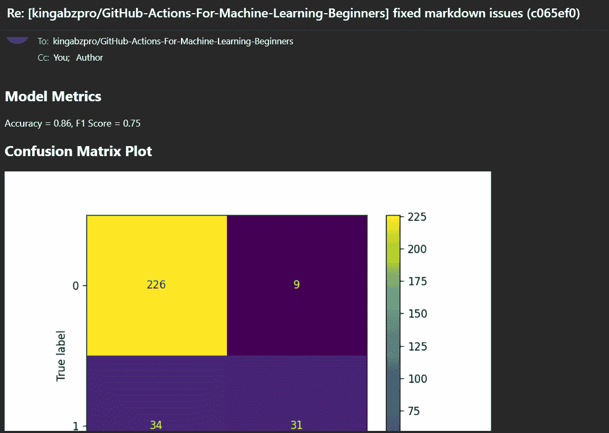

# GitHub Actions 对机器学习初学者

> 原文：[`www.kdnuggets.com/github-actions-for-machine-learning-beginners`](https://www.kdnuggets.com/github-actions-for-machine-learning-beginners)


作者提供的图片

GitHub Actions 是 GitHub 平台上的一项强大功能，允许自动化软件开发工作流，如测试、构建和部署代码。这不仅简化了开发过程，还使其更可靠和高效。

* * *

## 我们的前三大课程推荐

 1\. [Google 网络安全证书](https://www.kdnuggets.com/google-cybersecurity) - 快速进入网络安全职业生涯。

 2\. [Google 数据分析专业证书](https://www.kdnuggets.com/google-data-analytics) - 提升你的数据分析技能

 3\. [Google IT 支持专业证书](https://www.kdnuggets.com/google-itsupport) - 支持你组织的 IT

* * *

在本教程中，我们将探索如何将 GitHub Actions 用于初学者机器学习（ML）项目。从在 GitHub 上设置 ML 项目到创建一个自动化 ML 任务的 GitHub Actions 工作流，我们将涵盖你需要了解的一切。

# 什么是 GitHub Actions？

GitHub Actions 是一个强大的工具，为所有 GitHub 仓库提供免费的持续集成和持续交付（CI/CD）管道。它自动化了整个软件开发工作流程，从创建和测试到部署代码，都在 GitHub 平台内完成。你可以使用它来提高开发和部署效率。

## GitHub Actions 的主要功能

我们现在将学习工作流的关键组件。

### 工作流

工作流是你在 GitHub 仓库中定义的自动化过程。它们由一个或多个作业组成，并可以由 GitHub 事件触发，例如推送、拉取请求、问题创建或工作流。工作流在你仓库的 .github/workflows 目录中的 YML 文件中定义。你可以直接在 GitHub 仓库中编辑并重新运行工作流。

### 工作和步骤

在工作流中，作业定义了一组在同一运行器上执行的步骤。作业中的每个步骤可以运行命令或动作，这些动作是可重用的代码片段，可以执行特定任务，例如格式化代码或训练模型。

### 事件

工作流可以通过各种 GitHub 事件触发，例如推送、拉取请求、分叉、点赞、发布等。你还可以使用 cron 语法安排工作流在特定时间运行。

### 运行器

运行器是执行工作流的虚拟环境/机器。GitHub 提供了带有 Linux、Windows 和 macOS 环境的托管运行器，或者你可以托管自己的运行器，以便对环境有更多的控制。

### 动作

Actions 是可重用的代码单元，你可以在作业中作为步骤使用它们。你可以创建自己的 Actions 或使用 GitHub 社区在 GitHub Marketplace 共享的 Actions。

GitHub Actions 使开发人员能够直接在 GitHub 内部自动化构建、测试和部署工作流程，从而提高生产力并简化开发过程。

在本项目中，我们将使用两个 Actions：

1.  **actions/checkout@v3：** 用于检出你的仓库，以便工作流可以访问文件和数据。

1.  **iterative/setup-cml@v2：** 用于在提交中显示模型指标和混淆矩阵作为消息。

# 使用 GitHub Actions 自动化机器学习工作流程

我们将使用来自 Kaggle 的 [Bank Churn](https://www.kaggle.com/datasets/rangalamahesh/bank-churn?select=train.csv) 数据集来训练和评估一个随机森林分类器。

## 设置

1.  我们将通过提供名称和描述，检查 readme 文件和许可证来创建 GitHub 仓库。 

1.  转到项目目录并克隆仓库。

1.  将目录更改为仓库文件夹。

1.  启动代码编辑器。在我们的例子中，它是 VSCode。

```py
$ git clone https://github.com/kingabzpro/GitHub-Actions-For-Machine-Learning-Beginners.git

$ cd .\GitHub-Actions-For-Machine-Learning-Beginners\

$ code . 
```

1.  请创建一个 `requirements.txt` 文件，并添加运行工作流所需的所有必要包。

```py
pandas
scikit-learn
numpy
matplotlib
skops
black
```

1.  使用链接从 Kaggle 下载 [data](https://www.kaggle.com/datasets/rangalamahesh/bank-churn?select=train.csv) 并将其提取到主文件夹中。

1.  数据集很大，因此我们必须在仓库中安装 GitLFS 并跟踪 train CSV 文件。

```py
$ git lfs install
$ git lfs track train.csv
```

## 训练和评估代码

在本节中，我们将编写训练、评估和保存模型管道的代码。代码来自我之前的教程，用 Scikit-learn 管道简化机器学习工作流程。如果你想了解 Scikit-learn 管道的工作原理，那么你应该阅读它。

1.  创建一个 `train.py` 文件，并复制粘贴以下代码。

1.  代码使用 ColumnTransformer 和 Pipeline 进行数据预处理，以及 Pipeline 进行特征选择和模型训练。

1.  在评估模型性能后，所有指标和混淆矩阵都保存在主文件夹中。这些指标将在稍后由 CML 操作使用。

1.  最终，scikit-learn 最终管道将被保存用于模型推断。

```py
import pandas as pd

from sklearn.compose import ColumnTransformer
from sklearn.ensemble import RandomForestClassifier
from sklearn.model_selection import train_test_split

from sklearn.feature_selection import SelectKBest, chi2
from sklearn.impute import SimpleImputer
from sklearn.pipeline import Pipeline
from sklearn.preprocessing import MinMaxScaler, OrdinalEncoder

from sklearn.metrics import accuracy_score, f1_score
import matplotlib.pyplot as plt
from sklearn.metrics import ConfusionMatrixDisplay, confusion_matrix

import skops.io as sio

# loading the data
bank_df = pd.read_csv("train.csv", index_col="id", nrows=1000)
bank_df = bank_df.drop(["CustomerId", "Surname"], axis=1)
bank_df = bank_df.sample(frac=1)

# Splitting data into training and testing sets
X = bank_df.drop(["Exited"], axis=1)
y = bank_df.Exited

X_train, X_test, y_train, y_test = train_test_split(
    X, y, test_size=0.3, random_state=125
)

# Identify numerical and categorical columns
cat_col = [1, 2]
num_col = [0, 3, 4, 5, 6, 7, 8, 9]

# Transformers for numerical data
numerical_transformer = Pipeline(
    steps=[("imputer", SimpleImputer(strategy="mean")), ("scaler", MinMaxScaler())]
)

# Transformers for categorical data
categorical_transformer = Pipeline(
    steps=[
        ("imputer", SimpleImputer(strategy="most_frequent")),
        ("encoder", OrdinalEncoder()),
    ]
)

# Combine pipelines using ColumnTransformer
preproc_pipe = ColumnTransformer(
    transformers=[
        ("num", numerical_transformer, num_col),
        ("cat", categorical_transformer, cat_col),
    ],
    remainder="passthrough",
)

# Selecting the best features
KBest = SelectKBest(chi2, k="all")

# Random Forest Classifier
model = RandomForestClassifier(n_estimators=100, random_state=125)

# KBest and model pipeline
train_pipe = Pipeline(
    steps=[
        ("KBest", KBest),
        ("RFmodel", model),
    ]
)

# Combining the preprocessing and training pipelines
complete_pipe = Pipeline(
    steps=[
        ("preprocessor", preproc_pipe),
        ("train", train_pipe),
    ]
)

# running the complete pipeline
complete_pipe.fit(X_train, y_train)

## Model Evaluation
predictions = complete_pipe.predict(X_test)
accuracy = accuracy_score(y_test, predictions)
f1 = f1_score(y_test, predictions, average="macro")

print("Accuracy:", str(round(accuracy, 2) * 100) + "%", "F1:", round(f1, 2))

## Confusion Matrix Plot
predictions = complete_pipe.predict(X_test)
cm = confusion_matrix(y_test, predictions, labels=complete_pipe.classes_)
disp = ConfusionMatrixDisplay(confusion_matrix=cm, display_labels=complete_pipe.classes_)
disp.plot()
plt.savefig("model_results.png", dpi=120)

## Write metrics to file
with open("metrics.txt", "w") as outfile:
    outfile.write(f"\nAccuracy = {round(accuracy, 2)}, F1 Score = {round(f1, 2)}\n\n")

# saving the pipeline
sio.dump(complete_pipe, "bank_pipeline.skops")
```

我们得到了一个不错的结果。

```py
$ python train.py
Accuracy: 88.0% F1: 0.77
```



你可以通过阅读 "用 Scikit-learn 管道简化机器学习工作流程" 了解更多关于上述代码的内部工作原理。

我们不希望 Git 推送输出文件，因为它们总是在代码执行结束时生成，因此我们将把它们添加到 .gitignore 文件中。

在终端中输入 `.gitignore` 以启动文件。

```py
$ .gitignore
```

添加以下文件名称。

```py
metrics.txt
model_results.png
bank_pipeline.skops
```

在你的 VSCode 中，它应该是这样的。



现在我们将对更改进行暂存，创建一个提交，并将更改推送到 GitHub 主分支。

```py
git add .
git commit -m "new changes"
git push origin main
```

这是你的 GitHub [仓库](https://github.com/kingabzpro/GitHub-Actions-For-Machine-Learning-Beginners) 应该是什么样子的。


## CML

在开始处理工作流之前，了解 [持续机器学习 (CML)](https://github.com/iterative/setup-cml) 操作的目的很重要。CML 功能在工作流中用于自动生成模型评估报告。这意味着什么呢？当我们将更改推送到 GitHub 时，将自动在提交下生成报告。该报告将包括性能指标和混淆矩阵，我们还将收到一封包含所有这些信息的电子邮件。


## GitHub Actions

现在是主要部分。我们将开发一个用于训练和评估模型的机器学习工作流。每当我们将代码推送到主分支或有人提交拉取请求到主分支时，这个工作流将被激活。

要创建我们的第一个工作流，请导航到 [仓库](https://github.com/kingabzpro/GitHub-Actions-For-Machine-Learning-Beginners/actions/new) 的“Actions”标签，并点击蓝色文本“set up a workflow yourself”。这将创建一个 YML 文件在 .github/workflows 目录中，并提供交互式代码编辑器以添加代码。



将以下代码添加到工作流文件中。在这段代码中，我们：

1.  为我们的工作流命名。

1.  使用 `on` 关键字设置推送和拉取请求的触发器。

1.  为操作提供书面权限，以便 CML 操作可以在提交下创建消息。

1.  使用 Ubuntu Linux 运行器。

1.  使用 `actions/checkout@v3` 操作来访问所有仓库文件，包括数据集。

1.  使用 `iterative/setup-cml@v2` 操作来安装 CML 包。

1.  创建一个运行任务以安装所有 Python 包。

1.  创建一个运行任务以格式化 Python 文件。

1.  创建一个运行任务以训练和评估模型。

1.  创建运行任务，使用 GITHUB_TOKEN 将模型指标和混淆矩阵图移到 report.md 文件中。然后，使用 CML 命令在提交评论下创建报告。

```py
name: ML Workflow
on:
  push:
    branches: [ "main" ]
  pull_request:
    branches: [ "main" ]
  workflow_dispatch:

permissions: write-all

jobs:
  build:
    runs-on: ubuntu-latest
    steps:
      - uses: actions/checkout@v3
        with:
          lfs: true
      - uses: iterative/setup-cml@v2
      - name: Install Packages
        run: pip install --upgrade pip && pip install -r requirements.txt
      - name: Format
        run: black *.py
      - name: Train
        run: python train.py
      - name: Evaluation
        env:
          REPO_TOKEN: ${{ secrets.GITHUB_TOKEN }}
        run: | 
          echo "## Model Metrics" > report.md
          cat metrics.txt >> report.md

          echo '## Confusion Matrix Plot' >> report.md
          echo '' >> report.md

          cml comment create report.md 
```

这就是你的 GitHub 工作流的样子。


提交更改后，工作流将开始按顺序执行命令。



完成工作流后，我们可以通过点击“Actions”标签中的最新工作流，打开构建，并查看每个任务的日志。



我们现在可以在提交消息部分查看模型评估。我们可以通过点击提交链接访问它：[fixed location in workflow · kingabzpro/GitHub-Actions-For-Machine-Learning-Beginners@44c74fa](https://github.com/kingabzpro/GitHub-Actions-For-Machine-Learning-Beginners/commit/44c74fa2073999ebcad7f9e40a8ee5f287df80d3#commitcomment-139632476)


你还会收到来自 GitHub 的电子邮件



代码源可以在我的 GitHub 仓库中找到：[kingabzpro/GitHub-Actions-For-Machine-Learning-Beginners](https://github.com/kingabzpro/GitHub-Actions-For-Machine-Learning-Beginners)。你可以克隆它并自行尝试。

# 最终思考

机器学习操作（MLOps）是一个广阔的领域，需要掌握各种工具和平台，以成功构建和部署生产模型。要开始学习 MLOps，建议参考全面的教程，"[机器学习的 CI/CD 初学者指南](https://www.datacamp.com/tutorial/ci-cd-for-machine-learning)"。它将为你提供一个坚实的基础，以有效实施 MLOps 技术。

在本教程中，我们介绍了什么是 GitHub Actions 以及它们如何用于自动化机器学习工作流。我们还了解了 CML Actions 以及如何编写 YML 格式的脚本来成功运行任务。如果你仍然对从哪里开始感到困惑，我建议你查看一下 你需要的唯一免费课程，成为 MLOps 工程师。

[](https://www.polywork.com/kingabzpro)****[Abid Ali Awan](https://www.polywork.com/kingabzpro)**** ([@1abidaliawan](https://www.linkedin.com/in/1abidaliawan)) 是一位认证的数据科学专业人士，他热衷于构建机器学习模型。目前，他专注于内容创作和撰写关于机器学习和数据科学技术的技术博客。Abid 拥有技术管理硕士学位和电信工程学士学位。他的愿景是使用图神经网络构建一个人工智能产品，帮助那些患有心理疾病的学生。

### 更多相关话题

+   [使用 Jupysql 和 GitHub Actions 安排和运行 ETLs](https://www.kdnuggets.com/2023/05/schedule-run-etls-jupysql-github-actions.html)

+   [掌握机器学习的 10 个 GitHub 仓库](https://www.kdnuggets.com/10-github-repositories-to-master-machine-learning)

+   [从这些 GitHub 仓库学习机器学习](https://www.kdnuggets.com/2023/01/learn-machine-learning-github-repositories.html)

+   [KDnuggets 新闻，12 月 14 日：3 个免费机器学习课程…](https://www.kdnuggets.com/2022/n48.html)

+   [从这些 GitHub 仓库学习数据科学](https://www.kdnuggets.com/2022/12/learn-data-science-github-repositories.html)

+   [从这些 GitHub 仓库学习数据工程](https://www.kdnuggets.com/2023/02/learn-data-engineering-github-repositories.html)
